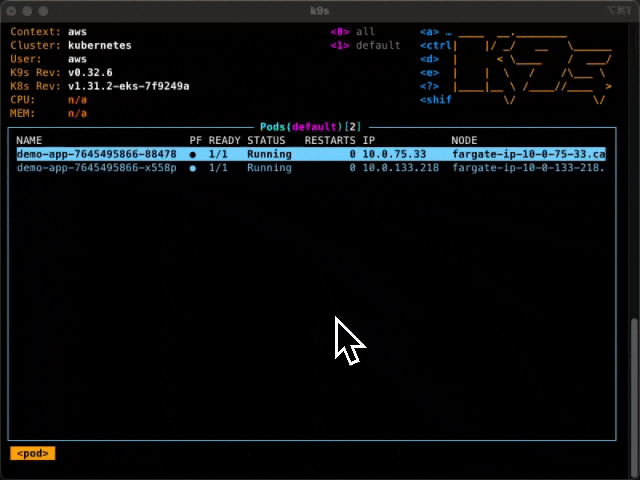
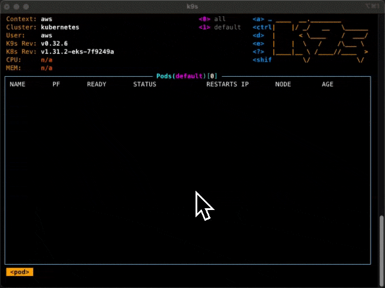
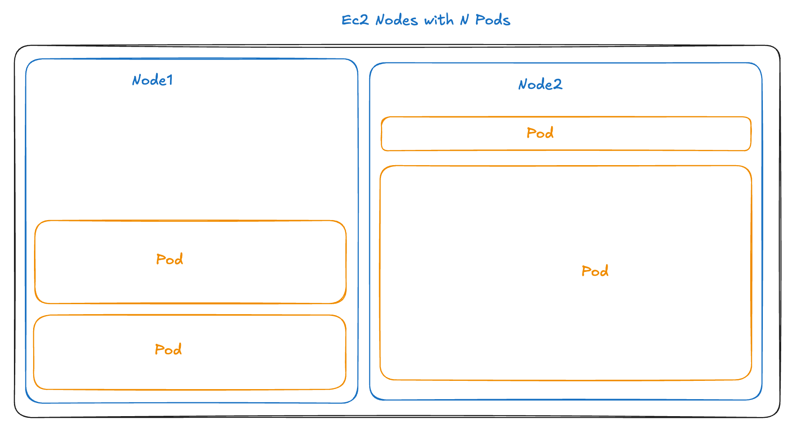
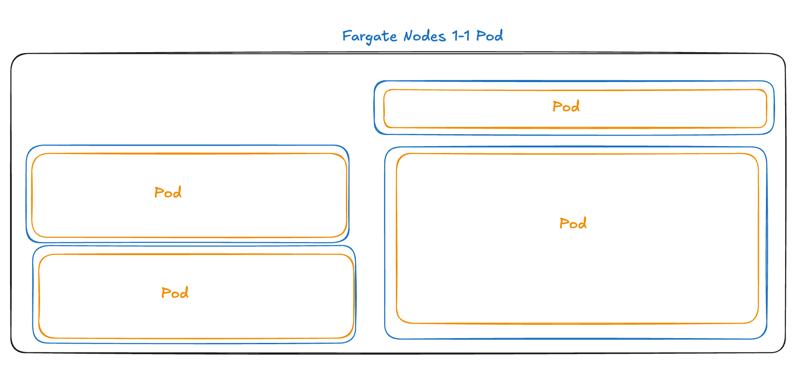

Building an EKS cluster requires choosing how your containers will actually run - either on EC2 instances you manage or through AWS Fargate's pod-by-pod approach. The differences can be pretty dramatic in practice. I'm setting up a demo cluster right now using Pulumi, so let me show you what I mean:

<!--more-->

Here is my Fargate cluster:

```python
import pulumi
import pulumi_awsx as awsx
import pulumi_eks as eks
import pulumi_kubernetes as k8s

# Create VPC with default CIDR
eks_vpc = awsx.ec2.Vpc("eks-vpc",
    enable_dns_hostnames=True)

# Create minimal EKS cluster
eks_cluster = eks.Cluster("eks-cluster",
    vpc_id=eks_vpc.vpc_id,
    private_subnet_ids=eks_vpc.private_subnet_ids,
    fargate=True,  
)

pulumi.export("kubeconfig", eks_cluster.kubeconfig)
```

And when I look in k9s I see this:



You can see that each pod is on its own node. Even the core-dns pods in the system namespace are each on their own nodes. That is a lot of nodes, and it's going to keep growing with my cluster.

If I change my cluster to be backed by EC2 nodes, I get something different.

```diff
eks_cluster = eks.Cluster("eks-cluster",
    vpc_id=eks_vpc.vpc_id,
    private_subnet_ids=eks_vpc.private_subnet_ids,
-   fargate=True,  
+   instance_type="t3.medium",
+   desired_capacity=2,
+   min_size=1,
+   max_size=2,
)
```

Now, there are only two nodes, with the pods distributed among them. Those are my two `t3.medium`s.



So when should you use Fargate, and when EC2 for EKS? Well, it really all relates to what we are seeing here with the number and size of nodes.

Let me explain.

## Bin Packing

Normally, the Kubernetes scheduler has to solve a bin-packing problem—fitting M pods across N nodes based on available resources. This is a straight-up resource optimization problem of balancing CPU, memory, and other resource demands across the cluster.

This can be surprisingly complex in practice. Teams must balance selecting the right instance types for different workload needs while managing multiple node groups. Adding to this complexity are scheduling rules and resource quotas that need careful configuration. Perhaps most challenging is striking the right balance between high resource utilization and maintaining enough headroom for spikes in demand.



With Fargate, AWS sidesteps this challenge by providing a correctly sized bin for each pod. Each Fargate pod runs on its own dynamically provisioned, right-sized mini-environment, where the "bin" (the Fargate instance) is sized to match the pod's requested resources. This means there's no need for Kubernetes to optimize resource usage across a pool of shared nodes, as each pod effectively has its own "container" provided by Fargate that fits it's needs precisely.

In other words, AWS effectively pushes this bin-packing responsibility to itself, so you don't have to worry ( as much ) about it.



{}
While Fargate abstracts away node management, it's important to understand that Fargate pods [still run on EC2 instances](https://justingarrison.com/blog/2024-02-08-fargate-is-not-firecracker/) behind the scenes. And each Fargate pod gets its own ENI (Elastic Network Interface) that can sometimes limit your scaling because pods aren't sharing a network namespace.
{}

## Pros and Cons

So yeah, Fargate abstracts away the complexity of managing nodes and scaling clusters by shifting bin-packing to AWS. With its extensive infrastructure, AWS is arguably better positioned to optimize placements at scale. They can monitor their entire cloud landscape, placing Fargate instances dynamically across available resources. This allows them to potentially leverage underutilized resources in ways that would be challenging or impractical at an individual account's scale.

<div>

| Responsibility | EC2 | Fargate |
|----------------|-----|---------|
| Instance Types | You pick size and provision nodes | AWS provisions per pod request|
| Pod Isolation | You prevent noisy neighbors | AWS isolates each pod |
| Resource Allocation | You find space on nodes | AWS creates dedicated space |

<span style="text-align:center">
    <figcaption>
    <i>Customer vs AWS Responsibility EC2 vs Fargate</i>
    </figcaption>
</span>
</div>

Ideally, this frees you to focus on the services rather than on the underlying infrastructure, but in practice, it's a bit more complex.

Since each pod is treated as a standalone instance, you lose out on the cost efficiencies of co-locating multiple pods on a single node. Even though AWS is "solving" the bin-packing problem globally, to do so, they need to introduce hard barriers, and while noisy neighbors, therefore, aren't a problem, sharing resources is now impossible. In a way, you are throwing away the run time benefit of containers, the shared kernel virtualization, for something more like VMs. And just like VMs, Fargate pods take longer to start than pods on existing EC2 nodes (typically 30-60 seconds vs near-immediate starts).

### A Note on Scaling

Both EC2 and Fargate work with Kubernetes' Horizontal Pod Autoscaling (HPA), which adds or removes pods based on metrics like CPU usage. The difference? With EC2, you need enough nodes available to handle new pods. With Fargate, AWS automatically provisions resources for each new pod - though you'll face that 30-60 second startup delay and potential VPC limits since each pod needs its own network interface.

Feature | Fargate | EC2
--- | --- | ---
Cost | Higher per pod | Lower cost per pod
Scalability | Scales on-demand, isolated resources | Requires manual node scaling
Resource Sharing | Not possible | Efficient resource sharing among pods
Startup Time | 30-60 seconds | Near instant on existing nodes
Use Cases | Burst workloads, isolated pods | Cost-sensitive workloads, Resource sharing workloads

Maybe this will make more sense with an example.

## Workload Example: Static Analysis


Have you ever had to run CPU-intensive batch jobs alongside lighter web services?

In a previous role, when my team and I were tasked with putting our static container image analyzer into production, we went the typical Kubernetes route, throwing it into an EC2-backed K8s cluster. The analyzer was built in Scala, running on the JVM, and was designed to take in work from a Kafka topic. Each analysis ultimately led to the results being sent to a database. We also had scheduled daily rescans of existing images whenever vulnerability lists were updated.

Then, a web app connected to this database and showed all your results. It was stateless and did far less work per request, mainly just answering an HTTP request by talking to a database.

The hard part though is that each analysis job involved uncompressing and analyzing Docker layers from S3 and could use a lot of CPU. Memory needs were around 2 GB per instance, which kept the JVM happy, but long sustained bursts in CPU usage were common, especially during intensive parts of the analysis.

In our K8s setup, the biggest pain point was handling this analysis workload's burstiness and keeping a bunch of stateless web apps up and answering requests. We ran multiple instances of the static analyzer. Still, the analyzer was the worst type of noisy neighbor to other services in the cluster, so we'd end up over-provisioning to ensure we had enough headroom, which led to wasted resources and extra cost. The setup worked, but was not great.

Thinking back, I can see how Fargate could've streamlined things here. With Fargate, each static analyzer instance would run in its own isolated environment, so there'd be no resource contention or need for pre-provisioned node capacity. Each pod would be fully provisioned with the exact CPU and memory needed, and we could do some sort of on-demand scaling to deal with backlogs of analysis work in the Kafka topic.

Fargate on EKS could be a great solution for this type of chunky, resource-heavy macro-services. There are probably other ways to handle this situation, and we worked on decomposing the analysis into smaller chunks, but Fargate might have been a good solution.

But there are lots of situations where Fargate is less of a fit.



## Example: Go Services for E-commerce


Ok, another workload that comes to mind is this one from a friend - He worked on an e-commerce backend with many lightweight Go services, each handling specific tasks—user profiles, catalog browsing, order processing, and notifications. These services were network-heavy, handling gRPC calls and database requests, but they didn't need much CPU or memory per instance.

Fargate wouldn't have made sense here—it would have isolated each pod, preventing resource sharing and driving up costs without real benefit. For lightweight services like these, EC2-backed Kubernetes is perfect, keeping costs low and maximizing resources by sharing nodes across small, efficient services.

So, for lightweight micro-services that can share resources, EC2 nodes with many pods each are probably the way to go.

### Other Fargate Cases

Fargate can excel with long-running event-driven and bursty workloads, where you need compute resources briefly or unpredictably. Think file processing jobs that trigger on uploads, or batch processing that runs sporadically. When jobs are intermittent, Fargate's ability to scale from zero and its isolated resources can outweigh its higher per-pod cost and startup delay. Just ensure your workload can tolerate the 30-60 second cold start.

{}
Fargate has some hard limitations that might rule it out for your use case:

- No DaemonSets
- Maximum of 4 vCPU and 30GB memory per pod
- Storage limitations: Only ephemeral storage up to 20GB per pod, no persistent volumes
- No GPU support

{}

## Fargate vs EC2 Pricing

Ok, EC2 costs less than Fargate on a pure cost-of-compute basis. If my t3.medium ($0.0416/hr) can typically run 6-8 pods reliably, and this works out to under $0.01/hr per pod. Comparable Fargate pods (0.5 vCPU/1GB) cost about $0.025/hr each, so 2.5x.

These calculations can change based on how much headroom you need on EC2 and how many containers you can run on a given EC2 instance. Still, Fargate is just more expensive unless all your containers fit the exact computing sizes offered by Fargate. And don't forget, AWS is likely incurring costs maintaining the warm compute capacity for launching Fargate pods, so it shouldn't be surprising that Fargate is more expensive.

But really, pure compute cost calculations are an insufficient metric for making this decision - you need to factor in your team's operational capacity, scaling patterns, and isolation requirements.

( Also, if Fargate makes sense because of your workload but the cost is a concern, then look into Fargate Spot instances, which can be up to 70% cheaper, but be aware that AWS can terminate them at any point to reclaim capacity. )

## Misconceptions About Fargate


- **Fargate saves you from managing servers**
   With containerized workloads and immutable infrastructure, your EC2 nodes are minimal, standardized, and automatically replaced. You're not logging in, installing packages, or managing configuration - everything runs in containers. When a node needs updates, you replace it entirely.
- **Fargate handles all scaling challenges**
   While it handles node scaling, you still face ENI limits, longer pod startup times (30-60s), and potential networking bottlenecks.
- **It's simpler and more reliable**
  It may be, but it may not be. The complexity shifts to networking, pod configuration, and working within Fargate's constraints. You trade node management for new operational challenges like slower startups and possible networking complexity.

## Managing Container Orchestration with Pulumi

Whether you choose EC2 or Fargate, Pulumi makes it easy to manage in your favorite programming languages. With its rich AWS support and infrastructure as code capabilities, you can define, deploy, and manage your entire Kubernetes infrastructure using familiar tools and practices. Pulumi's [AWS provider](/docs/iac/clouds/aws/) helps you implement the right solution for your needs.

With Pulumi, you get:

- [Complete control over EKS cluster configuration](/docs/iac/clouds/aws/guides/eks/), including node types, scaling policies, and networking setup
- [Built-in support for both EC2 node groups and Fargate profiles](/docs/iac/clouds/kubernetes/guides/worker-nodes/) within the same cluster
- [Infrastructure testing capabilities](/docs/iac/concepts/testing/) to validate your cluster configuration before deployment
- [Automation APIs](/docs/iac/packages-and-automation/automation-api/) for programmatic infrastructure management and custom tooling

Ready to streamline your EKS infrastructure management?



## Why Not Both

I hope my examples point to a pragmatic approach: use EC2 as your foundation for efficient microservices that can share resources, like our Go e-commerce setup. Add Fargate when you need isolation or flexible scaling - like for the static analysis workload. Better yet, combine both approaches in the same cluster, for cost-efficency and isolation where needed.

If you're interested in using Pulumi to manage EKS infra, here's a [practical EKS setup guide](/docs/iac/clouds/aws/guides/eks/) guide to get your started.

Now, back to getting this demo cluster up and working!
