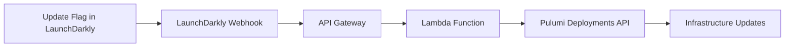
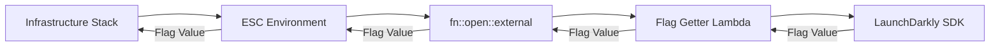

One of Pulumi's foundational benefits is that it allows you to manage your [infrastructure as software](https://www.pulumi.com/what-is/what-is-infrastructure-as-software/) with rich programming languages, verbose testing, and CI/CD patterns that you'd use with your application code. This post will cover applying another classic software development technique to your infrastructure: feature flagging. You can use feature flags to control change rollout, reduce the risk of new releases, and speed up the development of your infrastructure, the same way you do with your applications.

The examples in this post range from simply creating a flag and using it in a Lambda Function to fully integrating with LaunchDarkly to create a verbose flagging system for your infrastructure.

<!--more-->

## Creating flags with Pulumi

{}
Check out the code here: [1 Flag Application With LaunchDarkly](https://github.com/Elisabeth-Team/feature-flagging/tree/main/01-flag-application-launchdarkly).
{}

Defining your flags in your infrastructure as code allows you to configure the flags and their rules with all the other supporting infrastructure for your code as well as encourage flag creation as a best practice in Pulumi Components or Templates.

With Pulumi, you can use [any Terraform provider](https://www.pulumi.com/docs/iac/concepts/resources/providers/#terraform-bridge-providers) to manage your feature flags, whether that's LaunchDarkly, Statsig, Split, Flagsmith, or any other feature flagging tool with Terraform support. This lets you define flags, targeting rules, and the infrastructure they control in a single codebase. The example uses the [LaunchDarkly provider](https://registry.terraform.io/providers/launchdarkly/launchdarkly/latest/docs):

```typescript
const flag = new launchdarkly.FeatureFlag("example-flag", {
  key: "exampleFlag",
  projectKey: "default",
  variationType: "boolean"
}, { provider });
```

The Lambda function receives the SDK key via environment variables and evaluates the flag at runtime, allowing you to toggle behavior without redeploying code.

## Creating infrastructure as code with flagging

{}
Check out the code here: [2 Flaggable Infrastructure](https://github.com/Elisabeth-Team/feature-flagging/tree/main/02-flaggable-infra).
{}

{}
Before deploying this code, you'll want to deploy either 03 (for [ESC Only](https://github.com/Elisabeth-Team/feature-flagging/tree/main/03-esc-with-webhook-for-updating)) or 04 (for [ESC and LaunchDarkly](https://github.com/Elisabeth-Team/feature-flagging/tree/main/04-flag-driven-infrastructure)) so that the environment is created and available.
{}

Once you have flags defined, you can use them to control infrastructure provisioning. Apply the same best practices you would for application feature flags: keep flags focused, remove them when they're no longer needed, and document their purpose. In this example, a boolean flag controls whether internet-facing resources are created:

```typescript
const config = new pulumi.Config();
const flags: Record<string, any> | undefined = config.getObject("flags");
const enableInternetAccess = flags ? flags["enableInternetAccess"] : false;

if (enableInternetAccess) {
  // Create Internet Gateway, public subnet, route table, and routes
}
```

If you want flag or configuration changes to automatically trigger infrastructure updates (as shown in examples 3 and 4), you'll need to configure [deployment settings](https://www.pulumi.com/docs/pulumi-cloud/deployments/reference/#the-deploymentsettings-resource) in your stack. This requires the Pulumi GitHub App installed on your repository and allows webhooks to trigger automated deployments when configuration values change.

## Configuring values with ESC

{}
Check out the code here: [3 ESC Auto-updating](https://github.com/Elisabeth-Team/feature-flagging/tree/main/03-esc-with-webhook-for-updating).
{}

### Ingesting config from ESC

[Pulumi ESC](https://www.pulumi.com/docs/esc/) provides a centralized way to manage configuration and secrets. In this example, flag values are stored directly in an ESC environment rather than in an external feature flagging service. Your infrastructure stack imports this environment and reads flag values at deployment time:

```typescript
const pulumiProv = new pulumiservice.Environment("flaggingEnv", {
  name: "config",
  organization: pulumi.getOrganization(),
  yaml: new pulumi.asset.StringAsset(`values:
  pulumiConfig:
    flags:
      enableInternetAccess: 'true'`),
});
```

This approach keeps all configuration in one place, eliminates dependencies on external services, and works seamlessly with Pulumi's existing stack configuration system. You can update flag values through the Pulumi CLI or Cloud console.

### Automatically triggering deployments with webhooks

{}
There is some risk involved with automatically triggering updates. You can leave out the webhook and deploy manually if that's safer for your team.
{}

To make infrastructure respond to flag changes automatically, you can create a [Pulumi Cloud webhook](https://www.pulumi.com/docs/pulumi-cloud/webhooks/) that triggers on ESC environment updates. The example sets up an AWS Lambda function behind API Gateway that receives webhook events and uses the Pulumi Deployments API to update dependent stacks:

```typescript
const webhook = new pulumiservice.Webhook("escEnvironmentWebhook", {
  organizationName: pulumi.getOrganization(),
  displayName: "ESC Environment Change Webhook",
  payloadUrl: api.apiEndpoint.apply((endpoint) => `${endpoint}/webhook`),
  active: true,
  filters: ["environment_revision_created"],
});
```

When you update a flag value in ESC, the webhook fires, the Lambda identifies which stacks use that environment, and triggers their redeployment. This creates a continuous delivery pipeline for infrastructure configuration changes.

## Ingesting flag values from LaunchDarkly

{}
Check out the code here: [4 LaunchDarkly Auto-updating](https://github.com/Elisabeth-Team/feature-flagging/tree/main/04-flag-driven-infrastructure).
{}

### Ingesting flags from LaunchDarkly using ESC Connect

For teams already using LaunchDarkly for application feature flags or that need an enterprise-level tool, you can integrate LaunchDarkly flags with your infrastructure using [ESC Connect](https://www.pulumi.com/docs/esc/integrations/dynamic-secrets/external/). This approach lets you manage application and infrastructure flags together. The ESC environment uses `fn::open::external` to query a Lambda function that fetches current flag values from LaunchDarkly:

```yaml
values:
  pulumiConfig:
    flags: ${customSecrets.response}
  customSecrets:
    fn::open::external:
      url: ${getterUrl}
      request:
        secretName: ANY_SECRET
      secret: true
```

Your infrastructure code remains unchanged—it still imports the ESC environment and reads flag values the same way as in example 3. The difference is that flag values now come from LaunchDarkly, giving you access to advanced features like targeting rules, percentage rollouts, and flag scheduling.

### Automatically triggering deployments with webhooks

{}
There is some risk involved with automatically triggering updates. You can leave out the webhook and deploy manually if that's safer for your team.
{}

When using an external feature flagging service, you can leverage its webhook capabilities to trigger infrastructure updates. The flow works like this:



When the infrastructure deploys, it retrieves the current flag values through ESC:



The Lambda function is configured as a webhook endpoint in LaunchDarkly:

```typescript
const launchDarklyWebhook = new LaunchDarklyWebhook("myWebhook", {
  pulumiProv: provCreation.pulumiEnv,
  flagKey: launchdarklyFlag.key,
  pulumiTokenSecret,
  lambdaRole,
}, { provider });
```

This creates a full automation loop: change a flag in LaunchDarkly's UI, and your infrastructure automatically updates to reflect the new value. This pattern works with any feature flagging service that supports webhooks.

## ESC Only vs ESC with LaunchDarkly

Both approaches enable automated infrastructure updates based on flag changes, but they suit different use cases:

| Aspect | ESC Only (Example 3) | ESC with LaunchDarkly (Example 4) |
|--------|---------------------|-----------------------------------|
| **Complexity** | Simpler setup with fewer moving parts | More components but unified with application flags |
| **Dependencies** | No external services required | Requires LaunchDarkly subscription |
| **Flag Management** | Edit via Pulumi CLI or Cloud console | Edit via LaunchDarkly UI with full feature set |
| **Advanced Features** | Basic flag storage, versioning, and approvals | Targeting rules, percentage rollouts, experiments, scheduling |
| **Best For** | Teams wanting simple config management | Teams already using LaunchDarkly or needing sophisticated flag controls |
| **Key Benefit** | Centralized Pulumi-native configuration | Unified management of application and infrastructure flags |
| **Example Use Case** | Toggle infrastructure features on/off | Coordinate UI button enablement with AWS SES infrastructure provisioning |

## Conclusion

Feature flagging isn't just for application code—it's a powerful technique for managing infrastructure changes. By treating your infrastructure as software, you can use flags to control rollouts, reduce deployment risk, and coordinate changes across your entire system. Pulumi makes this possible through its support for any Terraform provider, seamless ESC integration, and automated deployment capabilities. Whether you choose the simplicity of ESC-only flag management or integrate with an enterprise feature flagging service like LaunchDarkly, you can build infrastructure that responds dynamically to configuration changes while maintaining the same development practices you use for application code.
