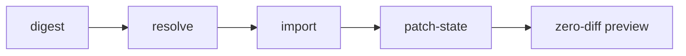

Migrations are hard. Most of what makes the import step of a [Terraform](https://www.terraform.io/)-to-Pulumi migration slow, though, is mechanical: discovering import IDs one resource at a time, extracting secrets safely from state, resolving post-import diffs the program didn't cause. Much of it isn't specific to Pulumi; it follows from how cloud APIs and Terraform providers are designed. We built [`pulumi-tool-import`](https://github.com/pulumi-proserv/pulumi-tool-import), and a set of agent skills that drive it, to automate that work and turn the migration into a repeatable, validated pipeline. One recent customer has used it to migrate more than 4,000 resources on their own.

<!--more-->

## The gaps in the import step

Pulumi already ships a capable [`pulumi import`](/docs/iac/guides/migration/import/) command, and for a handful of resources it's all you need. A real Terraform workspace — hundreds of resources, nested modules, secrets in state, years of drift — runs into gaps that no single command fills:

- **Import IDs must be discovered and composed.** Every resource needs an ID in the format its type expects, and composite IDs must be built from resource attributes: a Lambda permission imports as `FunctionName/StatementId`, and Route53 records and security group rules each have their own schemes. For a 300-resource stack, doing this by hand is slow and error-prone.
- **Terraform state contains plaintext secrets.** Anyone, or any agent, that reads the state file to extract values sees database passwords and API keys in the clear.
- **One bad ID fails the whole import.** `pulumi import` commits the steps that succeeded but aborts at the first failure, so a large import becomes a loop of run, fail, fix one ID, run again.
- **The cloud API doesn't return every field.** Some fields are write-only by AWS design: no AWS API returns an RDS `masterPassword` or an ACM private key, and Lambda's `GetFunction` returns an expiring presigned URL rather than the code itself. Other fields the API does return, but the Terraform provider's Read doesn't populate them in state (Secrets Manager's `secretString`, for example). Freshly imported state therefore shows diffs the program didn't cause.
- **Some resources can't be imported at all.** Association resources like `aws_iam_policy_attachment` and `aws_vpn_gateway_route_propagation` ship from the Terraform provider with no importer defined, and `pulumi import` fails on them with a misleading `resource '<id>' does not exist`.

Bridged providers like `aws` (AWS Classic) add one more layer: the Pulumi resource model is translated from the Terraform provider's schema, so property names, nested shapes, and `MaxItems=1` flattening all differ from what's sitting in the Terraform state you're migrating from.

Most of these gaps originate outside Pulumi. Write-only fields are AWS API security design, missing importers are Terraform provider decisions, and API rate limits apply to any large import regardless of tool. They land on whoever runs the migration, whatever the destination. `pulumi-tool-import` addresses each of them: it's a Pulumi CLI tool plugin whose commands form a pipeline, and it ships with agent skills that orchestrate the pipeline while an agent or a human hand-authors the Pulumi program the migration lands on.

## The pipeline



Each command writes an artifact the next one reads, which makes every step inspectable, repeatable, and resumable. That matters most when an AI agent is driving: the agent can validate its work at each stage rather than running one monolithic migration and checking the result at the end.

### Digest: read state once, safely

`digest tf` analyzes the Terraform configuration and state (from a local file or a TFC-compatible remote backend like Terraform Cloud or Scalr) into a single JSON sidecar: module instances, their input/output interfaces, and every resource with its attributes and import ID.

Two things happen during the digest:

**Secrets never reach the agent.** The digest discovers every attribute the provider schema marks sensitive, redacts it as `"(sensitive)"`, and sets the actual value as an encrypted Pulumi stack config secret via `pulumi config set --secret`, reading the state into memory only. The agent orchestrating the migration works entirely from the redacted digest and never sees a secret value. A standalone `set-secrets` command decouples that step from the digest: it extracts specific values from Terraform state by explicit mapping (config key on one side, Terraform address and attribute on the other), so individual secrets can be set or redone without re-running the whole digest, including values the automatic sensitivity detection didn't flag. The value still never passes through the agent.

**Unimportable resources are detected up front.** Importability isn't recorded in any schema — it's a Go struct field on the provider's resource definition that the schema RPC never returns. Instead, the digest asks the provider directly: it loads the Terraform provider pinned in `.terraform.lock.hcl` and probes `ImportResourceState` once per resource type with a placeholder ID (unconfigured, no credentials, no API calls). Types that answer "doesn't support import" get flagged `nonImportable` in the digest so the rest of the pipeline can route around them.

### Resolve: reproducible import files

The whole point of this migration style is that you hand-author a Pulumi program that reproduces the Terraform code's intent using Pulumi idioms — including Pulumi-style logical resource names. So when `pulumi preview --import-file import.json` generates the import skeleton, its entries carry URNs built from *your program's* names, not Terraform's. `resolve tf` fills in each entry's import ID by matching it to a resource in the digest, by type and name within each mapped module/component pair, and composes composite IDs from the digest's attributes.

The mappings file is the bridge between the two naming schemes: Terraform addresses on the left, your program's logical names on the right.

```yaml
modules:
  # TF module path → Pulumi component instance name
  "module.core_rds": "coreRds"
  "module.console_ui[\"mysvc\"]": "console-ui-mysvc"
resources:
  # TF resource address → Pulumi resource name (only where they differ)
  "module.core_rds.aws_rds_cluster.aurora_cluster": "coreRds-cluster"
```

Because the digest and the mappings file fully determine the output, import file creation is reproducible: rerunning `resolve` after renaming a component or fixing a mapping produces a corrected import file rather than requiring hand edits. Resources flagged `nonImportable` are held out of the import file — where they would be guaranteed failures — and written to a sidecar for later state injection.

### Import: batched, failure-isolating

The `import` command runs the prepared import file in batches (100 resources by default). When a batch doesn't fully land, it re-imports the batch's missing resources one at a time to identify exactly which IDs failed, records them, and carries on. One run surfaces every bad import ID instead of only the first, and because success is determined by reading stack state afterward, a rerun after fixing IDs skips everything already imported. Batching also keeps large imports under cloud API rate limits.

### Patch state: remove post-import diffs

After import, `pulumi preview` should be a no-op — but write-only fields (passwords, tokens), IaC-only defaults, and asset sentinels aren't returned by the cloud API, so they show up as diffs. `patch-state tf` patches the exported stack state using a curated per-resource-type fields file that records which fields the API doesn't return and how to fill them: from the digest's attribute for that resource if present, else from the fields file default. It can also read a stack's secret config so secret fields are patched without decrypting anything into the open.

Lambda function code is a concrete example. `GetFunction` returns a presigned S3 URL that expires in minutes rather than the deployment package itself, so the provider's Read has nothing durable to put in `code`, and every freshly imported function diffs against the program's `FileArchive`. `patch-state` writes the matching asset sentinel into state so the hash comparison agrees, and the diff disappears.

### State injection: the resources that can't be imported

Those `nonImportable` resources from the digest still exist in the cloud, and letting the next `pulumi up` try to create them is not a safe fallback — for association and toggle resources, a create against a pre-existing object fails partway through the deployment. Instead, `patch-state tf --non-importable` injects them directly into state: it takes each resource's URN, parent, provider, and dependencies from a preview of the program you've already written, fills in the ID and outputs from the sidecar, and verifies the result with a second preview — restoring its backup automatically if any injected resource doesn't preview as unchanged.

## The skills: a workflow agents can follow and validate

The tool's commands run standalone, but they're designed to be driven by the agent skills that ship in the repo. The [`pulumi-terraform-workspace-migration`](https://github.com/pulumi-proserv/pulumi-tool-import/blob/main/skills/pulumi-terraform-workspace-migration/SKILL.md) skill turns the pipeline into a full migration workflow with validation gates:

- **Node-by-node, zero-diff gated.** The migration proceeds through modules and resources in dependency order, and each node must reach a zero-diff targeted preview before the next one starts.
- **Every value traces to its source.** The skill maps each Terraform construct to its Pulumi equivalent: `var.foo` to stack config, locals to in-program derivations, `terraform_remote_state` to [ESC](/docs/esc/) environment references. The digest makes violations visible — if the program hardcodes a value the Terraform code computes from variables, the diff surfaces it.
- **When sources of truth disagree, deployed state wins.** Terraform code, Terraform state, and the live cloud drift apart over time. The skill treats the deployed state as the source of truth: manual drift that exists in the cloud but not in the HCL is included in the Pulumi program to preserve it, and each such decision is documented in the migration PR.
- **Modules become components.** A companion skill, `pulumi-terraform-module-to-component`, covers translating each Terraform module into a Pulumi [component](/docs/iac/concepts/components/) that reproduces the module's interface of inputs and outputs rather than transliterating its HCL, including the logical-naming convention that import matching depends on.

The result is a hand-authored, idiomatic Pulumi codebase the team keeps and grows, with the mechanical parts of getting there automated and verified.

A recent Professional Services customer adopted the tool and has since migrated more than 4,000 resources on their own, their team driving the pipeline without Pulumi engineers in the loop.

## Getting started

Install the plugin from GitHub releases and run any command through the Pulumi plugin runner:

```bash
pulumi plugin install tool import \
  --server github://api.github.com/pulumi-proserv/pulumi-tool-import

pulumi plugin run import -- digest tf --help
```

Then point your agent at the [`pulumi-terraform-workspace-migration`](https://github.com/pulumi-proserv/pulumi-tool-import/blob/main/skills/pulumi-terraform-workspace-migration/SKILL.md) skill and let it orchestrate the pipeline. The step-by-step workflow is documented in the [migration guide](/docs/iac/guides/migration/migrating-to-pulumi/terraform-import-tool/), and the [README](https://github.com/pulumi-proserv/pulumi-tool-import#readme) covers every command for manual use.

A note on what this is: `pulumi-tool-import` is a Pulumi CLI tool plugin built and maintained by Pulumi Professional Services, not part of the core Pulumi product. It runs through the plugin runner and uses the [Automation API](/docs/iac/concepts/automation-api/) under the hood, so it requires the Pulumi CLI. It's pre-v1, so pin the version you install and read the changelog before upgrading. If you're planning a larger migration and want help, [Pulumi Professional Services](/proserv/) runs these migrations regularly; this tool is the workflow we use.
