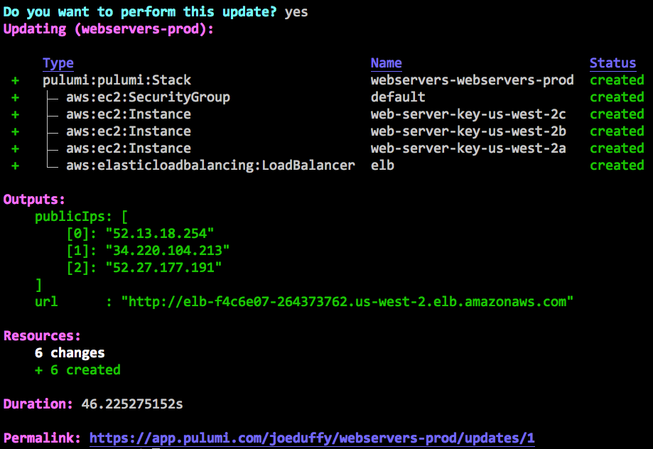

Here at Pulumi, we love programming the cloud using infrastructure as
code. From the project's outset, we've been inspired by technologies
like Terraform, AWS CloudFormation, and Helm, and in fact leverage the
Terraform Providers ecosystem, to support a broad range of clouds,
including AWS, Azure, and Google Cloud. Just recently, we extended this
with first class support for Kubernetes. Pulumi delivers the same
infrastructure as code workflows only using general purpose languages
like JavaScript, TypeScript, Python, and Go, extending robust
infrastructure provisioning with abstraction and reuse, highly
productive tooling, and access to all the other things we already know
and love about programming languages.

In this article, we will convert existing Terraform configuration to
Pulumi TypeScript. By doing so, we'll see how using general purpose
programming languages can help you create simpler, more flexible
infrastructure as code, with greater productivity and less repetition.
The infrastructure we'll be working with describes a load-balanced web
server hosted by an AWS EC2 instance per availability zone with an
option to allow SSH access. Of course, these same benefits would also
accrue were we to target Azure, Google Cloud, or Kubernetes instead.
<!--more-->

## Starting from Terraform Configuration

The Terraform configuration we'll be starting with is below. This
configuration accepts a list of AZs and an optional public key as inputs
and produces a (possibly empty) list of the web servers' public IP
addresses and the URL of the load-balanced web site as outputs. When a
public key is provided, this configuration will enable SSH access to the
virtual machines that serve the web site.

Let's walk the example one step at a time -- feel free to skip ahead if
you're a Terraform expert and just want to see how Pulumi is different.

First, we declare that `availability_zones` and `public_key` are
parameterizable inputs:

```
variable "availability_zones" {}
variable "public_key" {
    default = ""
}
```

And then we look up the latest AWS AMI for Ubuntu Trusty in our current
region. This is what our web server will run when we get around to
provisioning it later:

```
data "aws_ami" "ubuntu" {
     most_recent = true

     filter {
       name   = "name"
       values = ["ubuntu/images/hvm-ssd/ubuntu-trusty-14.04-amd64-server-*"]
     }

     filter {
       name   = "virtualization-type"
       values = ["hvm"]
     }

     owners = ["099720109477"] # Canonical
}
```

Next, we'll create security groups that allow HTTP ingress on port 80
and, if a public key is available, SSH over port 22, in addition to
allowing outbound Internet access. Notice that we are using
the `count` property for the SSH rule to enable it conditionally:

```
resource "aws_security_group" "default" {
    name_prefix = "example_sg"
}

resource "aws_security_group_rule" "allow_http" {
    type = "ingress"
    from_port = 80
    to_port = 80
    protocol = "tcp"
    cidr_blocks = ["0.0.0.0/0"]

    security_group_id = "${aws_security_group.default.id}"
}

resource "aws_security_group_rule" "allow_all_outbound" {
    type = "egress"
    from_port = 0
    to_port = 0
    protocol = "-1"
    cidr_blocks = ["0.0.0.0/0"]

    security_group_id = "${aws_security_group.default.id}"
}

resource "aws_security_group_rule" "allow_ssh" {
     count = "${var.public_key == "" ? 0 : 1}"

     type = "ingress"
     from_port = 22
     to_port = 22
     protocol = "tcp"
     cidr_blocks = ["0.0.0.0/0"]

     security_group_id = "${aws_security_group.default.id}"
}
```

Now let's actually create the web servers. This is where things get a
little awkward in a DSL, because we want to conditionally attach
the `key_name`, based on whether SSH access is enabled. This requires
that we duplicate some configuration for the key and no-key code paths,
in addition to splitting, transforming, and indexing into our list of
AZs:

```
    resource "aws_key_pair" "default" {
      count = "${var.public_key == "" ? 0 : 1}"

      key_name_prefix = "default"
      public_key = "${var.public_key}"
    }

    resource "aws_instance" "web-server-key" {
      count = "${var.public_key == "" ? 0 : length(split(",", var.availability_zones))}"

      ami = "${data.aws_ami.ubuntu.id}"
      instance_type = "t2.micro"

      availability_zone = "${element(split(",", var.availability_zones), count.index)}"
      user_data = "${file("userdata.sh")}"
      security_groups = ["${aws_security_group.default.name}"]

      key_name = "${aws_key_pair.default.0.key_name}"
    }

    resource "aws_instance" "web-server-nokey" {
      count = "${var.public_key == "" ? length(split(",", var.availability_zones)) : 0}"

      ami = "${data.aws_ami.ubuntu.id}"
      instance_type = "t2.micro"

      availability_zone = "${element(split(",", var.availability_zones), count.index)}"
      user_data = "${file("userdata.sh")}"
      security_groups = ["${aws_security_group.default.name}"]
    }
```

After creating the web servers, we will create and attach an ELB, so
that traffic is spread across the AZs. This also requires the same
conditional duplication for key and no-key configurations:

```
resource "aws_elb" "elb" {
    name_prefix = "webelb"

    availability_zones = ["${split(",", var.availability_zones)}"]

    listener {
    instance_port = 80
    instance_protocol = "http"
    lb_port = 80 
    lb_protocol = "http"
    }

    health_check {
    healthy_threshold = 2
    unhealthy_threshold = 2
    timeout = 3
    target = "HTTP:80/"
    interval = 30
    }
}

resource "aws_elb_attachment" "web-server-key" {
    count = "${var.public_key == "" ? 0 : length(split(",", var.availability_zones))}"

    elb = "${aws_elb.elb.id}"
    instance = "${element(aws_instance.web-server-key.*.id, count.index)}"
}

resource "aws_elb_attachment" "web-server-nokey" {
    count = "${var.public_key == "" ? length(split(",", var.availability_zones)) : 0}"

    elb = "${aws_elb.elb.id}"
    instance = "${element(aws_instance.web-server-nokey.*.id, count.index)}"
}
```

Finally, we'll export the public instance IPs for SSH access (if
enabled) and the ELB URL:

```
output "public_ips" {
     value = "${aws_instance.web-server-key.*.public_ip}"
}

output "url" {
     value = "http://${aws_elb.elb.dns_name}"
}
```

And that's it. This program provisions an EC2 VM per AZ in your region
of choice, behind a load balancer, with conditional SSH enablement.The
full code is [available here](https://gist.github.com/pgavlin/c09972d6e04e452250c86d10bd7ccd31#file-main-tf) if
you'd like to see it in one place.

## Migrating to a General Purpose Language

Now let's see how to migrate this program to using a general purpose
language. There are several opportunities to simplify the program --
most immediately apparent, using familiar if statements instead of the
the awkward conditionals that use count variables.

We could just go ahead and convert the program by hand, however
[the `tf2pulumi` tool](https://github.com/pulumi/tf2pulumi) was designed
to take a Terraform HCL program as input and perform the entire
translation automatically for you. This is a great place to get started
-- and from there we can then refactor the resulting program gradually
to leverage languages better. 

The first step is to create a Pulumi project.
[Download Pulumi here](), and then run:

```
$ pulumi new aws-typescript 
    -n webservers -d "Pulumi Web Servers" -g --dir pulumi
```

Run this from wherever your Terraform program resides. This will
initialize and scaffold a minimal Pulumi TypeScript program targeting
AWS in the pulumi subdirectory.

We'll then [install `tf2pulumi`](https://github.com/pulumi/tf2pulumi#building-and-installation),
and run it, to generate the Pulumi TypeScript program:

```
$ tf2pulumi >pulumi/index.ts
```

The full program created by this command can be
[found here](https://gist.github.com/pgavlin/c09972d6e04e452250c86d10bd7ccd31#file-index-generated-ts).
Notice that it looks structurally very similar to the Terraform HCL
program above, except that it's written in TypeScript instead. Even this
rote translation has benefits -- for example, open it in your favorite
editor, and you'll notice you get syntax highlighting, statement
completion, and integrated documentation. But we'll soon see that once
we have this code in our favorite language, we can refactor it to
leverage real programming languages more idiomatically, reducing a lot
of boilerplate.

After the conversion is complete, we can create, configure, and update a
Pulumi stack to create the resources described by the generated Pulumi
program:

```bash
$ cd pulumi
$ npm install
$ pulumi stack init webservers-prod
$ pulumi config set aws:region us-west-2
$ pulumi config set availabilityZones "us-west-2a,us-west-2b,us-west-2c"
$ pulumi up
```

A Pulumi stack is an environment that can be configured and deployed to
independently of all other stacks. Here we've
created `webservers-prod` and set it to deploy into
the `us-west-2a`, `us-west-2b`, and `us-west-2c` availability zones in
AWS's `us-west-2` region. `pulumi up `will then show you a plan and then
let you confirm it to deploy your resources:


After selecting "yes", the update will proceed with interactive status
updates:



## Leveraging Programming Languages

This is great -- we now have a working Pulumi program. Let's now go
about simplifying the generated code so that it is easier to read,
understand, and maintain. We'll only scratch the surface in this post,
as many of the real benefits shine when you go beyond a single program
and use reusable constructs like functions, classes, and packages, to
cut down on copy and paste. But even some of the syntactic
transformations we'll make can provide a real boost to productivity.

First, notice that our package dependencies are just NPM packages. The
full ecosystem of our language's native package manager is available to
us:

```typescript
import * as pulumi from "@pulumi/pulumi";
import * as aws from "@pulumi/aws";
import * as fs from "fs";
```

The first order of business is to place the list of configured
availability zones into a local variable:

    const availabilityZones = config.require("availabilityZones").split(",");

Because Pulumi programs are ordinary programs, we can use variables in
the usual ways. Notice that we've not only defined a variable, but also
split the string, so that we don't need to do it on every usage within
the file, using the standard JavaScript `split` function.

Terraform data sources are represented as function calls in our program.
So, to fetch the Ubuntu AMI, we simply call the `getAmi` function,
passing in the filters as parameters to it:

```typescript
const ubuntuAmi = aws.getAmi({
    filters: [
        { name: "name", values: ["ubuntu/images/hvm-ssd/ubuntu-trusty-14.04-amd64-server-*"] },
        { name: "virtualization-type", values: ["hvm"] },
    ],
    mostRecent: true,
    owners: ["099720109477"], // Canonical
});
```

We already saw how the use of variables can save us from repeating
ourselves over and over again, and again, we can use this to avoid
repeating the 0.0.0.0/0 CIDR block everywhere:

```typescript
const anyCidr = ["0.0.0.0/0"];
const webServerSg = new aws.ec2.SecurityGroup("default", {
    egress: [{ cidrBlocks: anyCidr, fromPort: 0, protocol: "-1", toPort: 0 }],
    ingress: [{ cidrBlocks: anyCidr, fromPort: 80, protocol: "tcp", toPort: 80 }],
});
```

Now we can change how we conditionally create the web server instances.
This is where we'll start to see the big wins, because we can use any of
the familiar programming language control constructs,
including `for` loops, `case` statements, `if` blocks, function calls,
and even higher order list functions like `map` and `filter`.

In order to conditionally create a resource in Terraform, we had to set
its `count` to either `0` or the desired AZ count. However, this affects
any resources that depend on the conditional resource: the dependent
resources either become conditional themselves or require complex
interpolation expressions in order to ensure that the configuration does
not reference any undefined properties. In our original Terraform
configuration, the conditional creation of an AWS Key Pair forces us to
declare our web servers twice: once with the key pair and once without.

```
resource "aws_key_pair" "default" {
    count = "${var.public_key == "" ? 0 : 1}"
…

resource "aws_instance" "web-server-key" {
    count = "${var.public_key == "" ? 0 : length(split(",", var.availability_zones))}"
…

resource "aws_elb_attachment" "web-server-key" {
    count = "${var.public_key == "" ? 0 : length(split(",", var.availability_zones))}"
…

resource "aws_instance" "web-server-nokey" {
    count = "${var.public_key == "" ? length(split(",", var.availability_zones)) : 0}"
…

resource "aws_elb_attachment" "web-server-nokey" {
    count = "${var.public_key == "" ? length(split(",", var.availability_zones)) : 0}"
…
```

This is rather cumbersome. The syntactic transformation performed
by `tf2pulumi` preserved this same structure to ensure the semantics of
translation are identical, but we can now go back and clean it up
considerably.

First, to conditionally allocate an EC2 KeyPair and to open port 22, we
use an `if` statement:

```typescript
let keyName: pulumi.Output<string> | undefined;
if (publicKey) {
    keyName = new aws.ec2.KeyPair("default", { publicKey }).id;
        new aws.ec2.SecurityGroupRule("allow_ssh", {
        type: "ingress",
        cidrBlocks: anyCidr,
        fromPort: 22,
        toPort: 22,
        protocol: "tcp",
        securityGroupId: webServerSg.id,
    });
}
```

The use of conditionals just works and interacts with planning just as
you might expect, so that we always see the result of the conditional
evaluation before we've decided to deploy anything.

Another subtle advantage is that we can just pass
the `webServerSg.id `property -- Pulumi understands the resource DAG,
and the use of this property automatically forms an edge.

Now let's create our web servers. We might use a for loop for this, and
append each one to an array, however it's just as easy to use the
JavaScript `map` function to do this more declaratively:

```typescript
const webServers: aws.ec2.Instance[] = availabilityZones.map(az =>
    new aws.ec2.Instance(`web-server-key-${az}`, {
        ami: ubuntuAmi.then(ami => ami.id),
        associatePublicIpAddress: publicKey !== "",
        availabilityZone: az,
        instanceType: "t2.micro",
        securityGroups: [ webServerSg.name ],
        userData: fs.readFileSync("userdata.sh", "utf-8"),
        keyName: keyName,
    }),
);
```

Interestingly, we've passed `keyName` to the constructor here, even
though it might not have been defined (the JavaScript default value
of `undefined`). Pulumi understands that this means "the absence of a
value", which is how we were able to simplify the web server
provisioning so greatly. We also read in the `userdata.sh` file using
standard JavaScript I/O functionality.

Now that we've simplified our configuration such that the web servers
are declared once, we can simplify their interaction with the load
balancer. We can just create the ELB last and pass it a list of all of
our instances. We can also improve the reliability of configuration by
ensuring that the ELB is associated with each availability zone in which
we've created a web server:

```typescript
const webServerElb = new aws.elasticloadbalancing.LoadBalancer("elb", {
    availabilityZones: webServers.map(instance => instance.availabilityZone),
    instances: webServers.map(instance => instance.id),
    healthCheck: {
        healthyThreshold: 2,
        interval: 30,
        target: "HTTP:80/",
        timeout: 3,
        unhealthyThreshold: 2,
    },
    listeners: [{
        instancePort: 80,
        instanceProtocol: "http",
        lbPort: 80,
        lbProtocol: "http",
    }],
});
```

Finally, the way we express outputs is by using standard JavaScript
module exports:

```typescript
export const publicIps = webServers.map(v => v.publicIp);
export const url = webServerElb.dnsName.apply(hostname => `http://${hostname}`);
```

And that's it. After doing this refactoring, you can simply
run `pulumi up`, and it will show you any diffs compared to your
previous deployment, which you can choose to accept and deploy. The full
code is [available here](https://gist.github.com/pgavlin/c09972d6e04e452250c86d10bd7ccd31#file-index-ts).

## Next Steps

In this post, we've applied general purpose programming languages to
infrastructure as code to achieve more expressive and reusable programs,
simplify our infrastructure's readability and maintainability, and
deliver a heightened level of productivity. Pulumi is
[open source](https://github.com/pulumi/pulumi) and free to use --
give it a try today!
