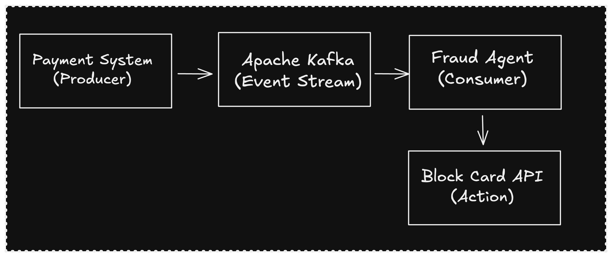
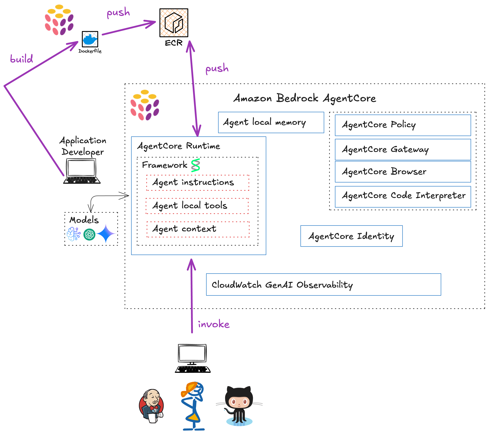

Every developer building AI agents knows the gap between a working prototype and production deployment. Your fraud detection agent works perfectly on your laptop, but how do you deploy it with proper authentication, memory persistence, observability, and guardrails? This post walks through a complete journey from local development to production-ready AI agents using Amazon Bedrock AgentCore, the Strands SDK, and Pulumi.

<!--more-->

{}
**TL;DR**: This post shows how to deploy AI agents from local prototype to production using:

- **Strands SDK** for agent development
- **Amazon Bedrock AgentCore** for managed runtime with Firecracker isolation
- **AgentCore Memory** for short-term and long-term context
- **MCP Gateway** for secure tool integration with OAuth2
- **Pulumi** for infrastructure as code

Complete code: [GitHub](https://github.com/dirien/from-works-on-my-machine-to-production-ready-ai-agents-with-amazon-bedrock-agent-core)
{}

## The Challenge: Bridging the Gap

Building AI agents is getting easier. Tools like the [Strands Agents SDK](https://aws.amazon.com/blogs/opensource/introducing-strands-agents-an-open-source-ai-agents-sdk/) let you create functional agents in just a few lines of code. But production deployment introduces challenges that local development doesn't surface:

- **Stateless to Stateful**: How does your agent remember previous conversations?
- **Single-tenant to Multi-tenant**: How do you isolate different users' data?
- **Implicit Trust to Zero Trust**: How do you authenticate requests and enforce boundaries?
- **Console Logs to Observability**: How do you trace requests across distributed systems?
- **Ad-hoc Tools to Managed Services**: How do you expose tools securely at scale?

The approach is progressive: start simple, add complexity only when needed, and use infrastructure as code to make it reproducible.

## Agents Beyond Chat: Event-Driven AI

When most people think of AI agents, they imagine chatbots: interactive systems responding to user questions. But many production agents never interact with end users directly. Instead, they're triggered by **event streams**: Kafka topics, SQS queues, webhook callbacks, or scheduled jobs.

Our fraud detection agent is a prime example. It doesn't wait for customers to ask questions. It's triggered automatically when the payment processing system detects a new transaction. The "user" is another system, and the "conversation" is a structured event payload.

This event-driven pattern is becoming [the new stack for AI agents](https://thenewstack.io/a2a-mcp-kafka-and-flink-the-new-stack-for-ai-agents/). As Kai Waehner describes in his analysis of [agentic AI with Kafka and Flink](https://www.kai-waehner.de/blog/2025/07/21/building-agentic-ai-with-amazon-bedrock-agentcore-and-data-streaming-using-apache-kafka-and-flink/):

> "Protocols like A2A and MCP are essential for standardizing agent behavior and communication. But without an event-driven substrate like Kafka and a stream-native runtime like Flink, these agents remain stuck in isolated interactions."

The emerging architecture looks like this:



In production, you might use Amazon MSK (Managed Kafka), Amazon SQS, or EventBridge to deliver transaction events to your agent. The agent processes each event autonomously, takes action (blocking cards, creating tickets), and publishes results back to another topic.

## What We're Building: A Fraud Detection Agent

Our demo is a fraud detection agent that:

1. Receives transaction alerts with user ID, amount, merchant, and location
2. Gathers context from tools (user profiles, transaction history)
3. Analyzes for fraud patterns (impossible travel, velocity attacks, amount anomalies)
4. Takes protective action (blocking cards) when fraud is detected

We'll build this progressively:

| Stage | What Changes | Key Additions |
|-------|--------------|---------------|
| **Local Development** | Running on your laptop | Strands SDK, Claude Opus 4.5, mock tools |
| **First Deployment** | Running in AgentCore | Containerized, Firecracker isolation, guardrails |
| **Production-Ready** | Full enterprise features | Memory, MCP Gateway, X-Ray observability |

## Local Development with Strands SDK

The [Strands Agents SDK](https://github.com/strands-agents/sdk-python) is an open-source framework from AWS that takes a model-driven approach to agent development. Instead of hardcoding complex workflows, you let the LLM reason about tool usage autonomously.

Here's our complete local agent in about 30 lines:

```python
# agent.py
from strands import Agent
from strands.models import BedrockModel
from tools import get_user_profile, get_recent_transactions, block_credit_card

# Configure Bedrock model with cross-region inference for Claude Opus 4.5
bedrock_model = BedrockModel(
    model_id="us.anthropic.claude-opus-4-5-20251101-v1:0",
    region_name="us-east-1",
)

# Define the Fraud Detection Agent
fraud_agent = Agent(
    model=bedrock_model,
    tools=[get_user_profile, get_recent_transactions, block_credit_card],
    system_prompt="""
    You are a Senior Fraud Analyst Agent at a financial institution.
    Your mission is to protect customers from fraudulent transactions in real-time.

    When you receive a transaction alert:
    1. Gather context by checking the user's profile and recent transaction history.
    2. Analyze the transaction for fraud indicators:
       - Impossible travel: Can the user physically be at the new location?
       - Unusual amounts: Is this significantly larger than typical spending?
       - High-risk merchants: Electronics stores, gift cards, wire transfers.
       - Geographic anomalies: Transactions far from home location.
    3. Make a decision:
       - If fraud indicators are present, BLOCK the card immediately.
       - If the transaction appears legitimate, allow it to proceed.
    4. Document your reasoning clearly.

    Prioritize customer protection. When in doubt, block the card.
    """,
)
```

Tools are simple Python functions decorated with `@tool`:

```python
from strands import tool

@tool
def get_user_profile(user_id: str) -> dict:
    """Get user profile including home location and account status."""
    return {
        "user_id": user_id,
        "name": "John Doe",
        "home_location": "London, UK",
        "account_status": "active",
    }

@tool
def block_credit_card(user_id: str, reason: str) -> dict:
    """Block a user's credit card and create a fraud ticket."""
    return {
        "status": "blocked",
        "ticket_id": f"FRAUD-{user_id}-001",
        "message": f"Card blocked for user {user_id}: {reason}",
    }
```

### Running the Local Demo

Here's how we simulate an incoming transaction event:

```python
# demo_simulation.py
from agent import fraud_agent

# The "Trigger" Event (Simulated Payload from Kafka/SQS)
new_transaction_event = """
ALERT: New Transaction Attempt
User ID: user_123
Amount: $2000
Merchant: Electronics Store
Location: Tokyo, Japan
Time: 09:15
"""

def run_demo():
    print("--- INCOMING EVENT STREAM ---")
    print(new_transaction_event)
    print("--- AGENT ACTIVATED ---")

    # Run the agent - processes the event autonomously
    result = fraud_agent(new_transaction_event)

    print("--- ANALYSIS COMPLETE ---")

if __name__ == "__main__":
    run_demo()
```

When we run this, the agent autonomously gathers context, analyzes the transaction, and takes action:

```
$ python demo_simulation.py

--- INCOMING EVENT STREAM ---
ALERT: New Transaction Attempt
User ID: user_123
Amount: $2000
Merchant: Electronics Store
Location: Tokyo, Japan
Time: 09:15
-----------------------------------

AGENT ACTIVATED. Analyzing...

Tool #1: get_user_profile
Tool #2: get_recent_transactions

## 🚨 FRAUD ANALYSIS REPORT

**Customer:** John Doe (user_123)

### Analysis:

#### 1. ❌ IMPOSSIBLE TRAVEL DETECTED
- **Last Transaction:** 09:00 in **London, UK**
- **Current Transaction:** 09:15 in **Tokyo, Japan**
- **Time Elapsed:** 15 minutes
- **Distance:** ~9,500 km (5,900 miles)
- **Minimum Flight Time:** ~12 hours

**Verdict:** It is physically impossible for John Doe to travel from London
to Tokyo in 15 minutes. This is a critical fraud indicator.

#### 2. ⚠️ HIGH-RISK MERCHANT
- Electronics stores are frequently targeted for fraud due to high resale value

#### 3. ⚠️ HIGH-VALUE TRANSACTION
- $2,000 at an electronics store represents a substantial purchase

### Decision: 🛑 BLOCK CARD IMMEDIATELY

Tool #3: block_credit_card

## ✅ ACTION COMPLETED

| Action | Status |
|--------|--------|
| Card Blocked | ✅ Confirmed |
| Ticket ID | TICKET-999 |

--- ANALYSIS COMPLETE ---
```

Notice how the agent reasoned about the event using tools and took autonomous action. This works great for development, but it lacks everything needed for production: authentication, persistence, isolation, monitoring, and governance.

## First Deployment with AgentCore Runtime

Our local prototype works, but where do you actually run it? Lambda times out after 15 minutes. ECS and Kubernetes add operational overhead. And AI agents have different requirements than typical microservices: they reason through multi-step workflows, sometimes taking minutes to analyze a complex fraud case. You need something built for this workload.

[Amazon Bedrock AgentCore](https://aws.amazon.com/bedrock/agentcore/) fills this gap. It's a managed runtime specifically designed for AI agents, with support for tasks running up to 8 hours. No timeout workarounds, no cluster management.

The security model is particularly relevant for fraud detection. AgentCore runs each session in a dedicated microVM using AWS Firecracker (the same isolation technology behind Lambda). When your agent processes one customer's transactions, it's completely isolated from other sessions. No shared memory, no cross-tenant contamination.

The deployment model is straightforward: containerize your agent and point AgentCore at the image. It works with Strands, LangGraph, CrewAI, or custom code. The same agent we built locally runs unchanged. We just wrap it in FastAPI and add a Dockerfile.

### Cold Start and Latency

For fraud detection, latency matters. AgentCore's Firecracker microVMs introduce a cold start penalty on the first invocation, typically 2-5 seconds to spin up the container. Subsequent invocations within the same session are fast (sub-second overhead beyond model inference time).

For real-time fraud detection, this cold start is acceptable because:

1. The LLM reasoning itself takes 5-15 seconds for complex analysis
2. Most production deployments use session pooling to keep warm instances available
3. The alternative (always-on containers) trades latency for cost

If sub-second total latency is critical, consider Lambda for simple rule-based checks and reserve AgentCore for complex reasoning that justifies the cold start overhead.

### Containerizing the Agent

First, we wrap our agent in a FastAPI endpoint:

```python
# agent.py (production version)
from fastapi import FastAPI, Request
from strands import Agent
from strands.models import BedrockModel
import os

app = FastAPI()

bedrock_model = BedrockModel(
    model_id="us.anthropic.claude-opus-4-5-20251101-v1:0",
    region_name="us-east-1",
    guardrail_id=os.environ.get("BEDROCK_GUARDRAIL_ID"),
    guardrail_version=os.environ.get("BEDROCK_GUARDRAIL_VERSION"),
    guardrail_trace="enabled",
)

fraud_agent = Agent(
    model=bedrock_model,
    tools=[get_user_profile, get_recent_transactions, block_credit_card],
    system_prompt="...",
)

@app.post("/invocations")
async def invoke(request: Request):
    body = await request.json()
    prompt = body.get("input", {}).get("prompt", "")
    result = fraud_agent(prompt)
    return {"output": {"message": str(result)}}
```

### Adding Guardrails

[Amazon Bedrock Guardrails](https://aws.amazon.com/bedrock/guardrails/) help ensure your agent stays on task. We configure content filters and topic restrictions using Pulumi:

```python
fraud_detection_guardrail = bedrock.Guardrail(
    "fraud-detection-guardrail",
    name="fraud-detection-guardrail",
    description="Ensure agent only handles fraud detection tasks",
    blocked_input_messaging="This request is outside the scope of fraud detection.",
    blocked_outputs_messaging="This response was blocked.",
    content_policy_config=bedrock.GuardrailContentPolicyConfigArgs(
        filters_configs=[
            bedrock.GuardrailContentPolicyConfigFiltersConfigArgs(
                type="SEXUAL", input_strength="HIGH", output_strength="HIGH",
            ),
            bedrock.GuardrailContentPolicyConfigFiltersConfigArgs(
                type="VIOLENCE", input_strength="HIGH", output_strength="HIGH",
            ),
            bedrock.GuardrailContentPolicyConfigFiltersConfigArgs(
                type="PROMPT_ATTACK", input_strength="HIGH", output_strength="NONE",
            ),
            # ... additional filters
        ],
    ),
    topic_policy_config=bedrock.GuardrailTopicPolicyConfigArgs(
        topics_configs=[
            bedrock.GuardrailTopicPolicyConfigTopicsConfigArgs(
                name="entertainment-media",
                type="DENY",
                definition="Questions about movies, TV shows, celebrities...",
                examples=["What is LOTR?", "Tell me about Star Wars"],
            ),
            bedrock.GuardrailTopicPolicyConfigTopicsConfigArgs(
                name="general-assistance",
                type="DENY",
                definition="Requests for coding help, math problems...",
                examples=["Write me a poem", "Help me with Python code"],
            ),
        ],
    ),
)
```

### Deploying with Pulumi

The infrastructure is straightforward: ECR repository, IAM roles, and AgentCore Runtime:

```python
# Create ECR repository
repo = ecr.Repository(
    "strands-agent-repo",
    name="fraud-detection-agent",
    force_delete=True,
)

# Build and push Docker image
image = docker.Image(
    "strands-agent-image",
    image_name=repo.repository_url.apply(lambda url: f"{url}:latest"),
    build=docker.DockerBuildArgs(
        context="../fraud-detection-agent",
        platform="linux/arm64",
    ),
    registry=docker.RegistryArgs(
        server=repo.repository_url,
        username=auth_token.user_name,
        password=auth_token.password,
    ),
)

# Deploy AgentCore Runtime
agent_runtime = bedrock.AgentcoreAgentRuntime(
    "fraud-detection-agent-runtime",
    agent_runtime_name="fraud_detection_agent",
    description="Fraud Detection Agent with Guardrails",
    role_arn=agent_role.arn,
    agent_runtime_artifact=bedrock.AgentcoreAgentRuntimeAgentRuntimeArtifactArgs(
        container_configuration=bedrock.AgentcoreAgentRuntimeAgentRuntimeArtifactContainerConfigurationArgs(
            container_uri=image.image_name,
        ),
    ),
    network_configuration=bedrock.AgentcoreAgentRuntimeNetworkConfigurationArgs(
        network_mode="PUBLIC",
    ),
    environment_variables={
        "BEDROCK_GUARDRAIL_ID": fraud_detection_guardrail.guardrail_id,
        "BEDROCK_GUARDRAIL_VERSION": fraud_detection_guardrail.version,
    },
)
```

### Testing the Basic Deployment

After `pulumi up`, we can invoke the deployed agent via the AWS SDK:

```python
# invoke_agent.py
import boto3
import json

def invoke_agent(agent_runtime_arn: str, prompt: str) -> dict:
    client = boto3.client("bedrock-agentcore", region_name="us-east-1")

    response = client.invoke_agent_runtime(
        agentRuntimeArn=agent_runtime_arn,
        runtimeSessionId="session_abc123...",
        payload=json.dumps({"input": {"prompt": prompt}}),
        qualifier="DEFAULT",
    )

    return json.loads(response["response"].read())
```

Running the same fraud scenario against the deployed agent:

```
$ ./test.sh

Selecting Pulumi stack 'dev'...
Getting agent runtime ARN from Pulumi...
Agent Runtime ARN: arn:aws:bedrock-agentcore:us-east-1:052848974346:runtime/fraud_detection_agent-W7zFZT3Vcn

Invoking agent with fraud detection alert...
========================================
Sending prompt to agent...
Prompt: ALERT: New Transaction Attempt
User ID: user_123
Amount: $2000
Merchant: Electronics Store
Location: Tokyo, Japan
Time: 09:15
--------------------------------------------------
Agent Response:
{
  "output": {
    "message": {
      "role": "assistant",
      "content": [
        {
          "text": "**Analysis:** Impossible travel confirmed. User was in London at 09:00
          and this transaction attempted in Tokyo at 09:15. Physically impossible.
          Combined with high-risk merchant and $2000 amount, this is fraudulent.
          Card blocked (TICKET-999)."
        }
      ]
    },
    "timestamp": "2025-12-15T04:17:48.762738+00:00",
    "model": "fraud-detection-agent"
  }
}
```

The agent now runs in a managed, isolated environment with guardrails. Next, we add memory and external tool integration.

## Production-Ready: Memory and MCP Gateway

Our basic deployment handles individual transactions, but fraud detection in the real world requires context. If a customer's card was blocked five minutes ago, the agent shouldn't try to block it again. If there's a pattern of suspicious activity over the past week, the agent should factor that into its analysis.

This is where [AgentCore Memory](https://docs.aws.amazon.com/bedrock-agentcore/latest/devguide/memory.html) and the [MCP Gateway](https://docs.aws.amazon.com/bedrock-agentcore/latest/devguide/gateway.html) come in.

### AgentCore Memory: Short-term and Long-term

Memory in AgentCore works at two levels. Short-term memory stores raw conversation events within a session. If the agent blocks a card in one message, it remembers this in subsequent messages during the same session.

Long-term memory is more interesting. It uses semantic extraction to persist facts across sessions. The system runs your conversations through a smaller model (we use Claude Haiku) to extract key facts, then stores those facts in a namespace you define. When a new session starts, the agent can query for relevant facts about that user. Even if the customer calls back tomorrow, the agent knows their card was blocked yesterday.

Here's how we configure the memory infrastructure:

```python
# Create AgentCore Memory with 30-day event expiry
fraud_detection_memory = bedrock.AgentcoreMemory(
    "fraud-detection-memory",
    name="fraud_detection_memory",
    description="Memory for fraud detection agent",
    event_expiry_duration=30,  # Events expire after 30 days
    memory_execution_role_arn=memory_execution_role.arn,
)

# Custom semantic extraction for fraud-related facts
FRAUD_EXTRACTION_PROMPT = """
Extract key fraud-related facts from this conversation about the user. Focus on:
1. Credit card status (blocked/active, ticket IDs if blocked)
2. Fraud alerts and patterns detected for this user
3. Transaction history patterns (locations, amounts, frequencies)
4. User profile details relevant to fraud detection
5. Previous fraud investigations and their outcomes

Format as concise facts that can help identify fraud patterns across sessions.
"""

# Create long-term memory strategy
fraud_semantic_strategy = bedrock.AgentcoreMemoryStrategy(
    "fraud-semantic-strategy",
    name="fraud_semantic_extraction",
    memory_id=fraud_detection_memory.id,
    type="CUSTOM",
    namespaces=["/fraud-detection/users/{actorId}"],
    configuration={
        "type": "SEMANTIC_OVERRIDE",
        "extraction": {
            "append_to_prompt": FRAUD_EXTRACTION_PROMPT,
            "model_id": "us.anthropic.claude-3-5-haiku-20241022-v1:0",
        },
        "consolidation": {
            "model_id": "us.anthropic.claude-3-5-haiku-20241022-v1:0",
        },
    },
)
```

The namespace pattern `/fraud-detection/users/{actorId}` ensures each user's facts are isolated. Claude Haiku handles the extraction efficiently, keeping costs low while maintaining accuracy.

{}
Long-term memory extraction is asynchronous. Plan for a 20-40 second delay between storing conversations and having facts available for retrieval. Use short-term memory for immediate needs while long-term memories are being processed.
{}

In the agent code, we integrate memory using Strands hooks:

```python
from bedrock_agentcore.memory import MemoryClient

memory_client = MemoryClient(region_name="us-east-1")

# Retrieve long-term facts before processing
memories = memory_client.retrieve_memories(
    memory_id=memory_id,
    namespace=f"/fraud-detection/users/{actor_id}",
    query=f"fraud detection facts for user {actor_id}"
)

# Store conversation after processing
memory_client.create_event(
    memory_id=memory_id,
    actor_id=actor_id,
    session_id=session_id,
    messages=[
        (user_message, "USER"),
        (assistant_message, "ASSISTANT")
    ]
)
```

### MCP Gateway: Tool Integration at Scale

The tools we've used so far are baked into the agent container. That works for simple cases, but what happens when you have dozens of tools across multiple teams? Or when a tool needs to call an external service that requires its own authentication?

The [Model Context Protocol (MCP)](https://aws.amazon.com/blogs/machine-learning/unlocking-the-power-of-model-context-protocol-mcp-on-aws/) is an open standard for AI systems to communicate with tools. AgentCore Gateway provides a managed MCP endpoint that handles authentication (JWT inbound, OAuth2 outbound) and lets agents discover tools using natural language queries rather than knowing exact tool names.

We deploy an MCP server for risk scoring with three tools:

```python
from mcp.server.fastmcp import FastMCP

mcp = FastMCP("Fraud Risk Scoring Server")

@mcp.tool()
def calculate_risk_score(user_id: str, amount: float, merchant: str, location: str) -> dict:
    """Calculate comprehensive fraud risk score (0-100)."""
    # Risk calculation logic
    return {
        "risk_score": 75,
        "factors": ["amount_anomaly", "high_risk_merchant"],
        "recommendation": "BLOCK"
    }

@mcp.tool()
def get_fraud_indicators(user_id: str) -> dict:
    """Get known fraud indicators for a user."""
    return {
        "indicators": ["velocity_alert", "device_inconsistency"],
        "severity": "HIGH"
    }

@mcp.tool()
def check_merchant_reputation(merchant_name: str) -> dict:
    """Check merchant risk rating and fraud history."""
    return {
        "risk_rating": "HIGH",
        "fraud_reports": 47,
        "chargeback_rate": 0.15
    }
```

The Gateway infrastructure requires careful attention to authentication. We use two separate Cognito user pools to handle the dual authentication flow:

**Inbound authentication (Agent → Gateway):** The agent authenticates to the Gateway using JWT tokens from the first Cognito pool. This ensures only authorized agents can discover and call tools.

```python
# Gateway with MCP protocol and semantic search
agentcore_gateway = bedrock.AgentcoreGateway(
    "fraud-detection-gateway",
    name="fraud-detection-mcp-gateway",
    description="Gateway for fraud detection MCP tools",
    role_arn=gateway_role.arn,
    authorizer_type="CUSTOM_JWT",
    authorizer_configuration={
        "customJwtAuthorizer": {
            "discoveryUrl": gateway_discovery_url,
            "allowedClients": [gateway_app_client.id],
        },
    },
    protocol_type="MCP",
    protocol_configuration={
        "mcp": {
            "supportedVersions": ["2025-03-26"],
            "searchType": "SEMANTIC",
            "instructions": "Gateway for fraud detection risk scoring tools.",
        },
    },
)
```

The `searchType: "SEMANTIC"` configuration enables natural language tool discovery. Instead of the agent needing to know exact tool names, it can query for "tools that check merchant risk" and the Gateway returns relevant matches.

**Outbound authentication (Gateway → MCP Server):** When the Gateway calls the MCP server, it needs its own credentials. The OAuth2 Credential Provider manages this second authentication layer:

```python
# OAuth2 Credential Provider for Gateway -> MCP Server auth
oauth2_credential_provider = bedrock.AgentcoreOauth2CredentialProvider(
    "mcp-runtime-oauth2-provider",
    name="fraud-mcp-runtime-oauth2",
    credential_provider_vendor="CustomOauth2",
    oauth2_provider_config={
        "customOauth2ProviderConfig": {
            "oauthDiscovery": {"discoveryUrl": mcp_runtime_discovery_url},
            "clientId": mcp_runtime_app_client.id,
            "clientSecret": mcp_runtime_app_client.client_secret,
        },
    },
)
```

**Connecting the pieces:** Finally, we create a Gateway Target that links the Gateway to the MCP server endpoint, specifying which credential provider to use for outbound calls:

```python
# Connect Gateway to MCP Server
gateway_target = bedrock.AgentcoreGatewayTarget(
    "mcp-risk-server-target",
    name="mcp-risk-server-target",
    gateway_identifier=agentcore_gateway.gateway_id,
    target_configuration={
        "mcp": {"mcpServer": {"endpoint": mcp_server_endpoint_url}},
    },
    credential_provider_configuration={
        "oauth": {
            "providerArn": oauth2_credential_provider.credential_provider_arn,
            "scopes": [mcp_runtime_scope_string],
        },
    },
)
```

This three-part configuration (Gateway, Credential Provider, Target) separates concerns cleanly: the Gateway handles inbound auth and protocol translation, the Credential Provider manages outbound secrets, and the Target defines routing.

### Observability with X-Ray and OpenTelemetry

Production systems need observability. We configure CloudWatch Logs for application logs and X-Ray for distributed tracing:

```python
# Agent application logs
agent_log_group = cloudwatch.LogGroup(
    "agent-runtime-log-group",
    name=pulumi.Output.concat(
        "/aws/vendedlogs/bedrock-agentcore/", agent_runtime.agent_runtime_id
    ),
    retention_in_days=30,
)

agent_logs_delivery = cloudwatch.LogDelivery(
    "agent-logs-delivery",
    delivery_source_name=agent_logs_delivery_source.name,
    delivery_destination_arn=agent_logs_delivery_destination.arn,
)

# X-Ray traces
agent_traces_delivery_destination = cloudwatch.LogDeliveryDestination(
    "agent-traces-delivery-destination",
    name="fraud-agent-traces-dest",
    delivery_destination_type="XRAY",
)

agent_traces_delivery = cloudwatch.LogDelivery(
    "agent-traces-delivery",
    delivery_source_name=agent_traces_delivery_source.name,
    delivery_destination_arn=agent_traces_delivery_destination.arn,
)
```

In the container, we use [AWS Distro for OpenTelemetry](https://docs.aws.amazon.com/xray/latest/devguide/xray-services-adot.html) for auto-instrumentation:

```dockerfile
CMD ["uv", "run", "opentelemetry-instrument", "uvicorn", "agent:app", "--host", "0.0.0.0", "--port", "8080"]
```

This gives us end-to-end tracing across agent invocations, memory operations, and Gateway calls with zero code changes.

{}
AWS has announced that X-Ray SDKs will be deprecated in favor of OpenTelemetry by February 2027. Using ADOT from the start ensures your observability stack is future-proof.
{}

## Running the Demo

### Deploy the Infrastructure

```bash
cd advanced-bedrock-deployment/infra
uv sync
uv run pulumi up
```

This deploys approximately 40 AWS resources including:

- ECR repositories for agent and MCP server
- AgentCore Memory with semantic extraction strategy
- Two Cognito user pools for authentication
- AgentCore Gateway with MCP protocol
- CloudWatch log groups and X-Ray trace delivery
- IAM roles and policies

### Test Short-term Memory

```bash
./test.sh demo
```

This runs 5 scenarios in the **same session**, demonstrating short-term memory:

```
======================================================================
FRAUD DETECTION DEMO - SHORT-TERM MEMORY (Same Session)
======================================================================

SCENARIO 1: John Doe - Impossible Travel Detection
Expected: FRAUD - impossible travel from London to Tokyo in 15 minutes
Actor ID: user_123
Session ID: session_cf171803eb324a2aa9ac456b3013fe45...
----------------------------------------------------------------------
Agent Response:
{
  "output": {
    "message": {
      "text": "**FRAUD CONFIRMED - CARD BLOCKED**

      | Finding | Details |
      |---------|---------|
      | **User** | John Doe |
      | **Ticket** | TICKET-123-999 |
      | **Fraud Type** | Impossible Travel + Spending Anomaly |

      **Analysis:** Transaction in Tokyo 15 minutes after London purchase
      is physically impossible. The $2,000 amount is 10x the user's typical
      spending range ($50-200). Card blocked immediately."
    },
    "memory_enabled": true,
    "long_term_facts_retrieved": 3
  }
}

======================================================================
SCENARIO 3: John Doe - Follow-up Transaction (Short-term Memory Test)
Expected: FRAUD - card should already be blocked (SHORT-TERM MEMORY)
Actor ID: user_123
Session ID: session_cf171803eb324a2aa9ac456b3013fe45... (SAME SESSION!)
----------------------------------------------------------------------
Agent Response:
{
  "output": {
    "message": {
      "text": "**Card for user_123 (John Doe) is ALREADY BLOCKED
      (Ticket: TICKET-123-999). No further action needed.**

      This appears to be another fraudulent attempt on an already-compromised
      account. The card was previously blocked due to impossible travel fraud.
      The current transaction follows the same pattern: Gift Card Kiosk
      purchases are a common fraud tactic for converting stolen card access
      to untraceable value."
    },
    "memory_enabled": true,
    "long_term_facts_retrieved": 3
  }
}

======================================================================
SHORT-TERM MEMORY DEMO SUMMARY
======================================================================
[OK] John Doe - Impossible Travel Detection
[OK] Jane Smith - Normal Transaction
[OK] John Doe - Follow-up Transaction (Short-term Memory Test)
[OK] Alice Chen - Impossible Travel Detection
[OK] Jane Smith - Second Normal Transaction
```

The agent remembers within the same session that John's card is already blocked, so there's no need to block it twice.

### Test Long-term Memory

```bash
./test.sh longterm-fresh
```

This demonstrates **cross-session** memory with two phases:

```
======================================================================
PHASE 1: INITIAL FRAUD DETECTION
These interactions create long-term memory facts about users.
======================================================================

SCENARIO: John Doe - Initial Fraud (Card Blocked)
Session ID: session_xyz789... (NEW SESSION)
→ Card blocked, fact stored to long-term memory

======================================================================
WAITING FOR LONG-TERM MEMORY EXTRACTION...
The semantic strategy needs time to process conversations into facts.
Waiting 30 seconds...
======================================================================

======================================================================
PHASE 2: NEW SESSIONS - LONG-TERM MEMORY RETRIEVAL
These are COMPLETELY NEW sessions. The agent should remember
fraud-related facts about users from Phase 1.
======================================================================

SCENARIO: John Doe - NEW SESSION (Long-term Memory Test)
Session ID: session_new456... (DIFFERENT SESSION!)
----------------------------------------------------------------------
Agent Response:
{
  "output": {
    "message": "CARD ALREADY BLOCKED. According to my records,
    this user's card was previously blocked due to fraud.
    Ticket FRAUD-user_123-001 exists from a previous investigation.
    The card remains blocked.",
    "memory_enabled": true,
    "long_term_facts_retrieved": 2
  }
}
```

Even in a completely new session, the agent retrieves facts from long-term memory and knows John's card was blocked yesterday.

### Test MCP Gateway

```bash
./test.sh gateway-fresh
```

This runs 6 diverse fraud scenarios using **both local tools and MCP Gateway tools**:

```
======================================================================
LOADING MCP GATEWAY CONFIGURATION...
======================================================================
Gateway URL: https://fraud-detection-mcp-gateway-xxx.gateway.bedrock-agentcore.us-east-1.amazonaws.com/mcp
Token Endpoint: https://fraud-gateway-xxx.auth.us-east-1.amazoncognito.com/oauth2/token
Scope: fraud-detection-gateway/invoke
MCP Gateway configuration loaded successfully!

======================================================================
FRAUD DETECTION DEMO - MCP GATEWAY INTEGRATION
======================================================================
LOCAL TOOLS:
  - get_user_profile: User details and home location
  - get_recent_transactions: Last known transaction
  - block_credit_card: Block card and create ticket

MCP GATEWAY TOOLS (via Risk Scoring Service):
  - calculate_risk_score: Fraud risk score 0-100
  - get_fraud_indicators: Known fraud indicators
  - check_merchant_reputation: Merchant risk rating
======================================================================

SCENARIO 1: HIGH-RISK MERCHANT - Jane at CryptoExchange123
MCP Gateway: ENABLED
----------------------------------------------------------------------
Agent Response:
{
  "output": {
    "message": {
      "text": "**✅ CARD BLOCKED** - Ticket: TICKET-456-999

      **Summary:** Jane Smith's card blocked due to a $5,000 crypto exchange
      transaction that is 10x her typical spend and outside her normal merchant
      categories. Location matched home, but amount and merchant anomalies
      indicate likely fraud or compromised credentials."
    },
    "mcp_gateway_enabled": true,
    "mcp_tools_count": 4
  }
}

======================================================================
SCENARIO 5: COMBINED SIGNALS - Alice's Multi-Factor Fraud
MCP Gateway: ENABLED
----------------------------------------------------------------------
Agent Response:
{
  "output": {
    "message": {
      "text": "## 🚨 FRAUD CONFIRMED - CARD BLOCKED

      **User:** Alice Chen (user_321)
      **Ticket ID:** TICKET-321-999

      **Fraud Indicators Detected:**
      | Factor | Finding |
      |--------|---------|
      | ⛔ Impossible Travel | Singapore (10:00) → Los Angeles (11:30) = 90 min |
      | ⛔ Amount Anomaly | $2,500 vs typical $50-300 (8x+ normal) |
      | ⛔ Merchant Mismatch | Cash advance vs usual food/retail |
      | ⛔ High-Risk Merchant | QuickCashAdvance (cash advance services) |

      **Action Taken:** Card blocked immediately. This transaction exhibits
      classic signs of stolen card credentials being used for rapid cash extraction."
    },
    "mcp_gateway_enabled": true,
    "mcp_tools_count": 4
  }
}

======================================================================
MCP GATEWAY DEMO SUMMARY
======================================================================
[OK] 1. HIGH-RISK MERCHANT - Jane at CryptoExchange123
     Gateway: YES (4 tools)
[OK] 2. VELOCITY ATTACK - Bob's Rapid Transactions
     Gateway: YES (4 tools)
[OK] 3. AMOUNT ANOMALY - Alice's Large Purchase
     Gateway: YES (4 tools)
[OK] 4. KNOWN FRAUD PATTERNS - John's Indicator Check
     Gateway: YES (4 tools)
[OK] 5. COMBINED SIGNALS - Alice's Multi-Factor Fraud
     Gateway: YES (4 tools)
[OK] 6. CLEAN TRANSACTION - Jane's Normal Purchase
     Gateway: YES (4 tools)
```

The MCP Gateway tools provide additional context (merchant reputation, risk scores, fraud indicators) that helps the agent make better decisions.

## Architecture Summary

Here's the complete architecture:



## Key Takeaways

- **Event-driven first**: Production agents are triggered by Kafka, SQS, or webhooks, not chat interfaces
- **Start simple**: Build with Strands SDK locally, add AgentCore complexity only when needed
- **Guardrails early**: Content filtering and topic restrictions prevent prompt injection
- **Memory has two levels**: Short-term (session) and long-term (semantic extraction across sessions)
- **MCP for tools at scale**: Gateway handles auth and discovery; you focus on tool logic
- **Observability required**: X-Ray + CloudWatch are essential for debugging distributed AI
- **IaC for reproducibility**: Pulumi deploys 40+ resources with proper dependencies

## Cost Considerations

When evaluating AgentCore for production, consider these cost factors:

**AgentCore Runtime** is priced per session-second. For fraud detection agents that typically run 10-30 seconds per transaction, this is cost-effective compared to maintaining always-on ECS containers. However, if your agents process thousands of transactions per second, the per-session costs add up. Consider batching or using Lambda for simple, fast agents.

**Model costs** dominate most deployments. Claude Opus 4.5 (used for reasoning) costs significantly more than Claude Haiku (used for memory extraction). We deliberately use Haiku for semantic extraction to keep memory costs low while maintaining accuracy. For high-volume production, consider whether Haiku or even smaller models could handle your primary reasoning.

**Memory and Gateway** have their own pricing tiers. AgentCore Memory charges for storage and retrieval operations. The Gateway adds overhead for OAuth2 token management and routing. For simple agents that don't need cross-session memory or external tools, skip these components entirely.

**Cognito user pools** for authentication have a free tier (50,000 MAU) that covers most development and moderate production workloads. Beyond that, costs scale with active users.

{}
Start with a basic deployment and add Memory/Gateway only when you have a clear need. The infrastructure cost savings of skipping unnecessary components often exceed the engineering cost of adding them later.
{}

## Conclusion

The fraud detection agent in this post grew from 30 lines of local Python to a production deployment with guardrails, dual-layer memory, MCP Gateway integration, and full observability, all defined as infrastructure as code.

The gap between prototype and production doesn't have to be a chasm. AgentCore provides the managed runtime, Pulumi makes it reproducible, and the progressive approach lets you add complexity only when your use case demands it.


