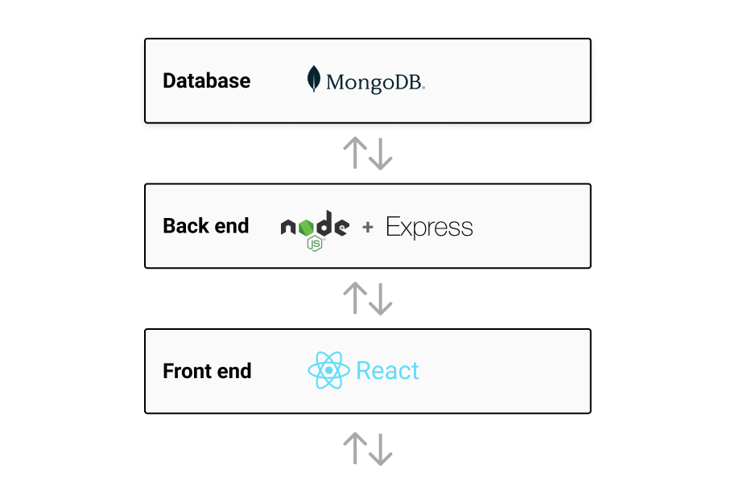
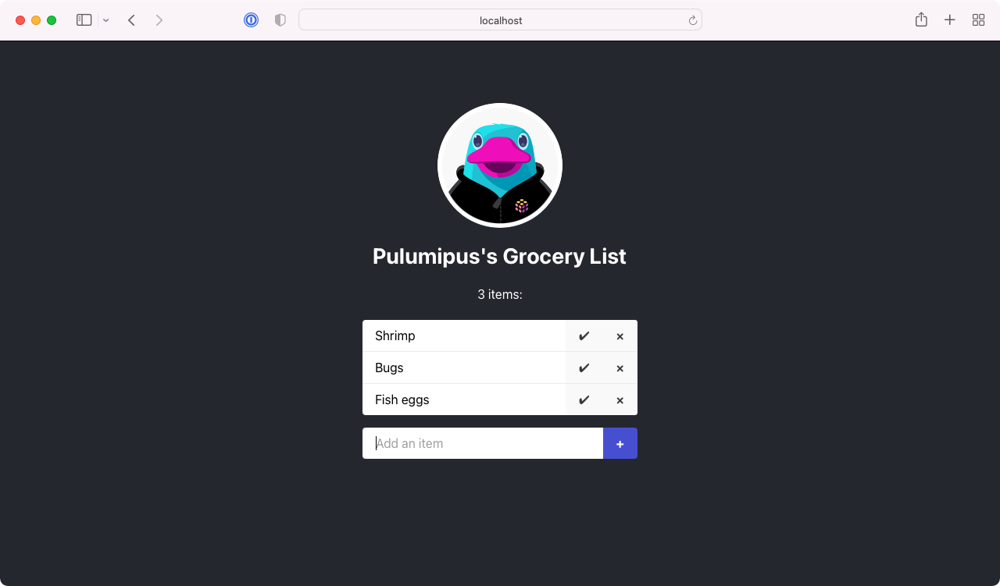
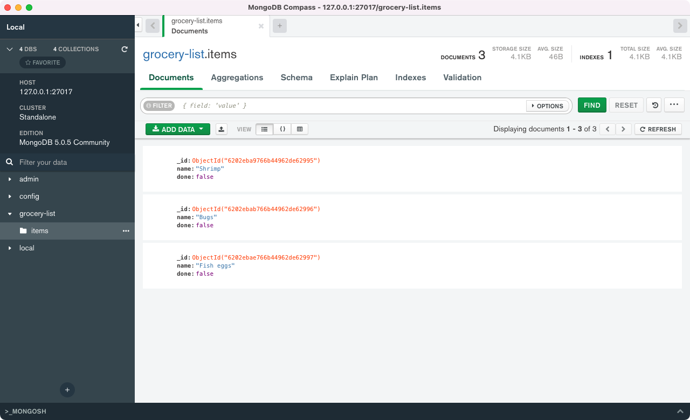
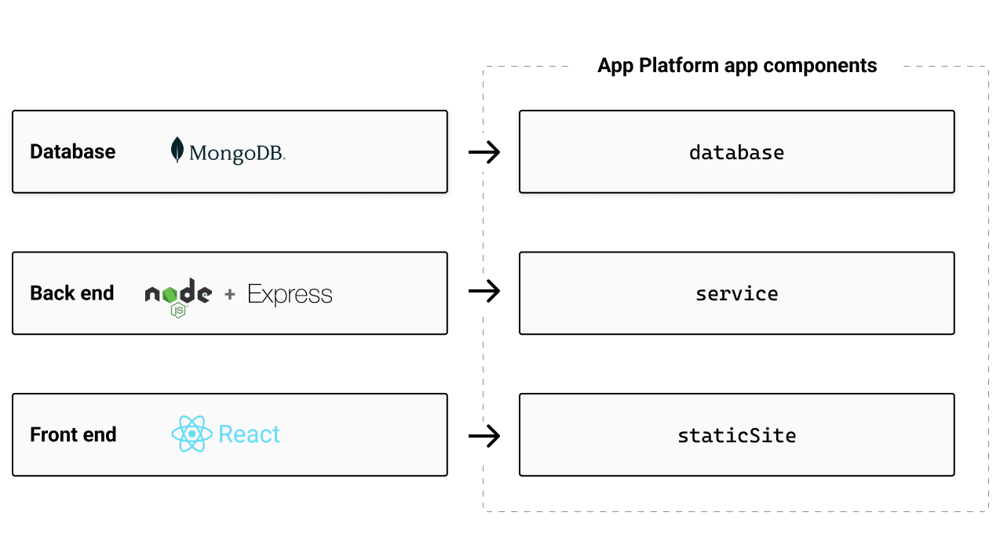
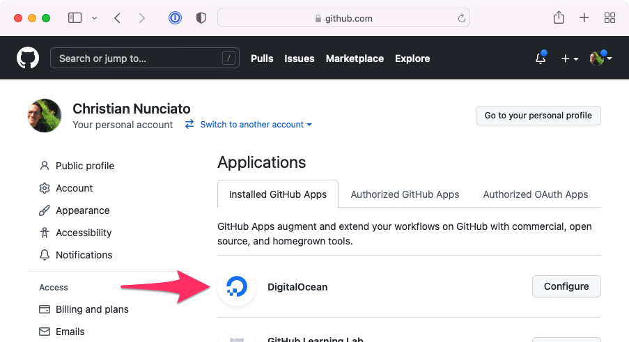
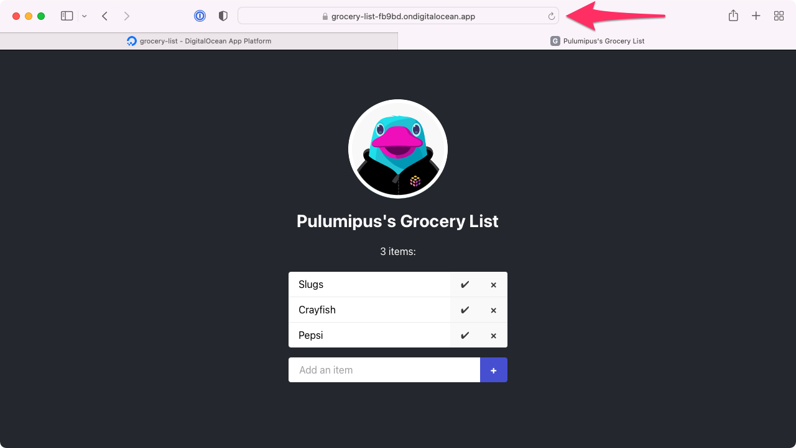
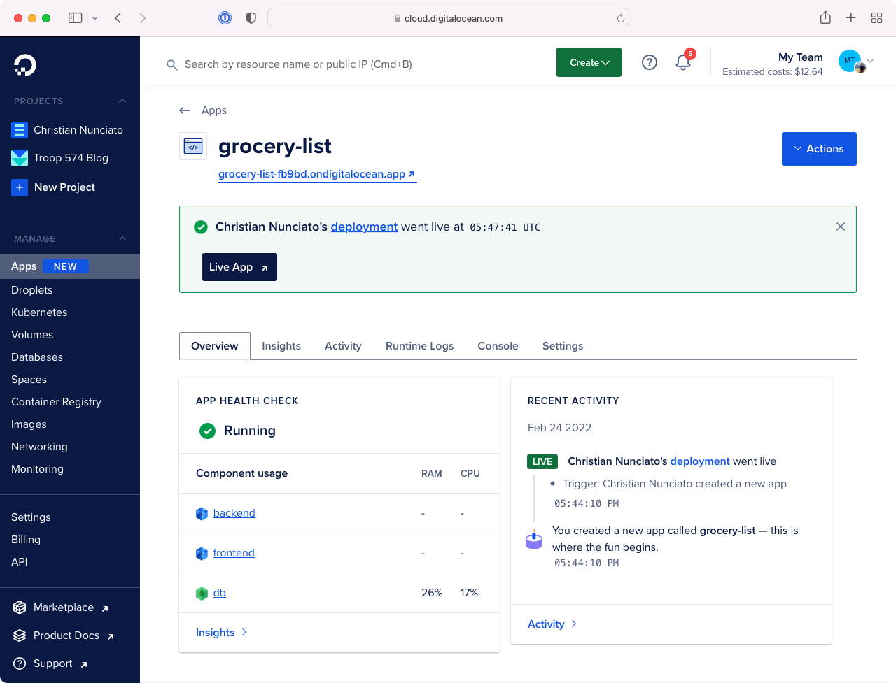
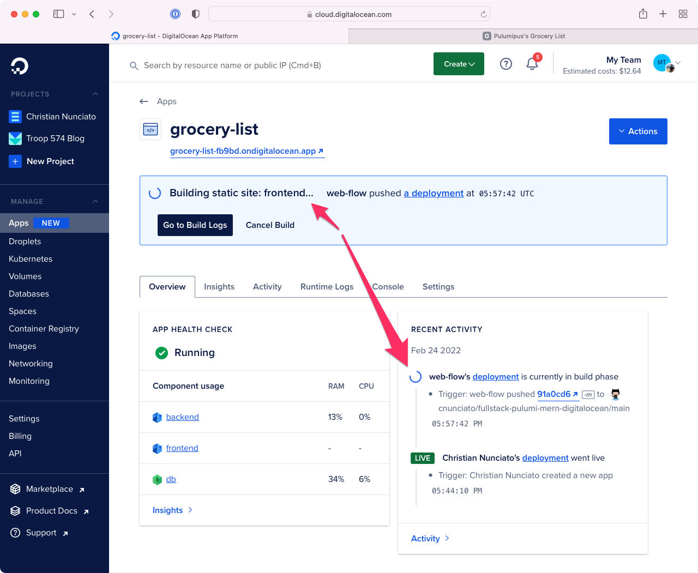

To deploy a MERN stack app on DigitalOcean with Pulumi, you map each tier of the app---React front end, Express API, and MongoDB database---to a [DigitalOcean App Platform](https://www.digitalocean.com/products/app-platform) component, then declare the whole thing as a single Pulumi program in TypeScript or Python. One `pulumi up` provisions a [Managed MongoDB cluster](https://www.digitalocean.com/products/managed-databases-mongodb), wires it to a containerized service via an environment variable, and serves the static front end behind App Platform's load balancer at one URL.

<!--more-->

## TL;DR

- **What you'll build:** A three-tier MERN grocery-list app deployed to DigitalOcean App Platform, plus a Managed MongoDB cluster locked down to the app via a database firewall.
- **What you'll write:** A single Pulumi program (TypeScript or Python) that declares a `staticSite`, a `service`, a `databases` reference, and a `DatabaseCluster`---about 60 lines of code.
- **What you'll need:** A DigitalOcean account and personal access token, the [Pulumi CLI](/docs/get-started/download-install/), [Node.js](https://nodejs.org/), and a GitHub account with the [DigitalOcean GitHub app](https://cloud.digitalocean.com/apps) installed.
- **Why DigitalOcean:** App Platform's component model maps cleanly to MERN's three tiers, builds and deploys on every Git push, and stays inexpensive at the smallest tier. See the [comparison table](#how-does-digitalocean-compare-to-render-railway-and-flyio-for-mern) below.
- **Time to deploy:** ~15 minutes for the first `pulumi up` (the Managed MongoDB cluster takes the longest), then a few seconds per redeploy.

<script type="application/ld+json">
{
  "@context": "https://schema.org",
  "@type": "HowTo",
  "name": "Deploy a MERN stack app on DigitalOcean with Pulumi",
  "description": "Provision a DigitalOcean App Platform app and Managed MongoDB cluster for a MERN-stack web application using a single Pulumi program in TypeScript or Python.",
  "totalTime": "PT15M",
  "tool": [
    { "@type": "HowToTool", "name": "Pulumi CLI" },
    { "@type": "HowToTool", "name": "Node.js" },
    { "@type": "HowToTool", "name": "DigitalOcean account and personal access token" },
    { "@type": "HowToTool", "name": "GitHub account with the DigitalOcean GitHub app installed" }
  ],
  "step": [
    {
      "@type": "HowToStep",
      "position": 1,
      "name": "Fork the template and install prerequisites",
      "text": "Fork or template the pulumi/fullstack-pulumi-mern-digitalocean repository, then install the Pulumi CLI and Node.js. Sign into DigitalOcean and create a personal access token with read-write permissions, and install DigitalOcean's GitHub app on your repository."
    },
    {
      "@type": "HowToStep",
      "position": 2,
      "name": "Create a Pulumi project",
      "text": "Inside the cloned repository, make an infra/ folder and run pulumi new digitalocean-typescript (or digitalocean-python). Set the DIGITALOCEAN_TOKEN environment variable, then set the repo and branch Pulumi config values that point App Platform at your GitHub repository."
    },
    {
      "@type": "HowToStep",
      "position": 3,
      "name": "Declare the Managed MongoDB cluster",
      "text": "In the Pulumi program, create a digitalocean.DatabaseCluster with engine 'mongodb', the smallest size slug, and one node, plus a digitalocean.DatabaseDb named 'grocery-list' that references the cluster."
    },
    {
      "@type": "HowToStep",
      "position": 4,
      "name": "Declare the App Platform spec",
      "text": "Create a digitalocean.App resource whose spec contains a static site for the React front end, a service for the Express API listening on port 8000 at /api, and a databases entry referencing the MongoDB cluster. Wire DATABASE_URL into the service via the cluster's exposed environment variable."
    },
    {
      "@type": "HowToStep",
      "position": 5,
      "name": "Lock the database to the app",
      "text": "Add a digitalocean.DatabaseFirewall whose rule type is 'app' and whose value is the App's id. This rejects all inbound MongoDB traffic except from the App Platform app."
    },
    {
      "@type": "HowToStep",
      "position": 6,
      "name": "Deploy the stack",
      "text": "Export liveUrl as a stack output, then run pulumi up to provision the cluster and app. App Platform fetches the front-end and back-end source from GitHub, builds them, and serves the app at the DigitalOcean-assigned URL. Subsequent commits trigger automatic redeploys."
    }
  ]
}
</script>

## Why deploy MERN on DigitalOcean App Platform?

[MERN-stack apps](https://www.mongodb.com/mern-stack) are three-tier web apps built with [MongoDB](https://www.mongodb.com/), [Express](https://expressjs.com/), [React](https://reactjs.org/), and [Node.js](https://nodejs.org/). One language---JavaScript or TypeScript---powers the front end, the API, and the data layer.



[DigitalOcean App Platform](https://www.digitalocean.com/products/app-platform) is a fully managed PaaS whose component model maps cleanly to those tiers: static sites, services, and databases. App Platform builds the front end as a CDN-served static site, packages the back end as a container, and treats the database as a managed component---all at one URL behind a load balancer, with redeploys triggered by Git pushes.

Pairing App Platform with [Pulumi's DigitalOcean provider](/registry/packages/digitalocean/) lets you describe the whole stack in code: the App Platform spec, the [Managed MongoDB](https://www.digitalocean.com/products/managed-databases-mongodb) cluster, and the firewall rule that locks the database to the app. If you're new to infrastructure as code generally, see [What is infrastructure as code?](/what-is/what-is-infrastructure-as-code/).

## How does DigitalOcean compare to Render, Railway, and Fly.io for MERN?

All four are developer-friendly PaaS options that can host a MERN app. They differ in how they handle the database tier, how they bill, and how mature their infrastructure-as-code story is.

| Capability | DigitalOcean App Platform | Render | Railway | Fly.io |
|---|---|---|---|---|
| Static front end | Yes (CDN-served) | Yes (CDN-served) | Yes | Yes (via static services) |
| Containerized API | Yes | Yes | Yes | Yes (Firecracker VMs) |
| Managed MongoDB | Yes ([Managed Databases](https://www.digitalocean.com/products/managed-databases-mongodb)) | No (Postgres/Redis only; bring your own MongoDB) | No (unmanaged template; Postgres native) | No (bring your own; or run a Mongo machine) |
| Auto-deploy on Git push | Yes | Yes | Yes | Yes (via GitHub Actions) |
| Pulumi provider | [`pulumi/digitalocean`](/registry/packages/digitalocean/) (this guide) | Community | Community | Community |
| Pricing model | Per-component flat tiers | Per-service flat tiers | Usage-based | Usage-based |
| Best fit | Teams that want one provider for app + Managed MongoDB + DNS | Teams already on Postgres | Quick prototypes with templates | Apps that need edge regions or low-level VM control |

For a MERN app specifically, DigitalOcean is the path of least resistance: it's the only one of the four with first-party Managed MongoDB *and* a mature first-party Pulumi provider, so the same `pulumi up` provisions both tiers. Render and Fly.io are strong alternatives if you can swap MongoDB for Postgres or run your own Mongo cluster.

## What do you need to get started? {#setting-up}

The code for this walkthrough is [available as a template repository on GitHub](https://github.com/pulumi/fullstack-pulumi-mern-digitalocean), so if you want to follow along (and you should!), you should grab a copy of your own to work with by forking the repository or creating a new one from the template. Once you've done that, you should also:

* [Clone the repository](https://github.com/pulumi/fullstack-pulumi-mern-digitalocean) to your local machine.
* [Install Pulumi](/docs/get-started/download-install/) and [Node.js](https://nodejs.org/).
* [Sign into DigitalOcean](https://cloud.digitalocean.com/) and obtain a [personal access token](https://cloud.digitalocean.com/account/api/tokens) with read-write permissions.
* Grant DigitalOcean access to your GitHub repository by [visiting the Apps page](https://cloud.digitalocean.com/apps), choosing Create App, and following the steps to install DigitalOcean's GitHub app.
* Optionally, if you'd like to develop the application locally as well, [install and configure MongoDB Community Edition](https://docs.mongodb.com/manual/tutorial/install-mongodb-on-os-x/).

One thing to note: Since we'll be provisioning real DigitalOcean resources, there's a chance you could incur a slight cost for what you use. However, as we'll be using the least expensive plan settings available, and tearing everything down when we're through, that cost shouldn't amount to more than a few pennies or so.

Let's get started.

## What's in the example app?

Once you've cloned your copy of the template repository and navigated to the root, you'll see a couple of files and folders that look something like this:

```bash
├── frontend
├── backend
└── package.json
```

The `frontend` folder contains the React application, and its job is to render the list of groceries and give you something to interact with (to add items, check them off, delete them, and so on). The scaffolding for the app was generated with a tool called [Vite](https://vitejs.dev/), and all of its logic---form fields, click handlers, API calls, etc.---is contained in `src/App.tsx`.

The `backend` folder contains the Express application that defines the REST API. It sets up four API [routes](https://expressjs.com/en/guide/routing.html) to handle the [CRUD](https://en.wikipedia.org/wiki/Create,_read,_update_and_delete) operations you'd expect in an app like this one:

* `GET /api/items` fetches all items from the database and returns them as a JSON array.
* `POST /api/items` accepts a new item and writes it to the database.
* `PUT /api/items/:id` updates an existing item (to toggle its checked/unchecked status).
* `DELETE /api/items/:id` deletes an item from the database.

The back end supports three configurable properties as well, all of which are exposed as optional environment variables:

* `BACKEND_SERVICE_PORT`, which defaults to `8000`
* `BACKEND_ROUTE_PREFIX`, which defaults to `/api`
* `DATABASE_URL`, which defaults to `mongodb://127.0.0.1` for local development

## How do you run the app locally?

You don't have to do this, but if you'd like to, here's how. After [installing MongoDB and starting the service](https://docs.mongodb.com/manual/administration/install-community/) (which should be listening by default on port `27017`), you can install all front-end and back-end dependencies and start the development server:

```bash
$ npm install
$ npm start
```

With the development server running, you can browse to <http://localhost:3000> and see the app:



The front-end and back-end dev servers are set up to compile your TypeScript to JavaScript automatically, and the front-end server is configured to proxy the back-end service (which runs at `http://localhost:8000`) at a root-relative path of `/api`. Proxying the API in this way lets you avoid having to wrestle with [CORS](https://developer.mozilla.org/en-US/docs/Web/HTTP/CORS)-related issues, and as you'll see when we deploy to DigitalOcean later, App Platform conveniently supports the same configuration out of the box.

Try adding a few items and marking them off, just to make sure everything's working as expected. If you've got a MongoDB client installed as well---I generally use [MongoDB Compass](https://www.mongodb.com/products/compass)---you should be able to find the `grocery-list` database and see the `items` collection filling up with delicious foods:



Now let's have a look at how to go about deploying this stuff.

## How do you map MERN tiers to App Platform components?

App Platform apps are comprised of high-level [_components_](https://docs.digitalocean.com/products/app-platform/concepts/): [static sites](https://docs.digitalocean.com/products/app-platform/how-to/manage-static-sites/) cached on DigitalOcean's CDN, [services](https://docs.digitalocean.com/products/app-platform/how-to/manage-services/) packaged as containers, and [database](https://docs.digitalocean.com/products/app-platform/how-to/manage-databases/) references that wire a Managed Database into the app. Each component scales independently, and the front-end and back-end builds run on DigitalOcean in response to Git pushes.

App Platform apps can be configured manually in the web console or programmatically as an [_app spec_](https://docs.digitalocean.com/products/app-platform/reference/app-spec/) submitted over DigitalOcean's [REST API](https://docs.digitalocean.com/reference/api/api-reference/#tag/Apps). We'll go the latter route with Pulumi's [DigitalOcean provider](/registry/packages/digitalocean/), defining a spec comprised of three components:

* A `staticSite` component mapped to the `frontend` folder
* A `service` component mapped to the `backend` folder
* A `database` component mapped to a managed MongoDB cluster (which we'll also configure to be accessible only by the `service` component)



And once deployed, it'll all be available at a single DigitalOcean-provided URL.

Let's begin by creating a new Pulumi project.

## How do you create the Pulumi project?

In the root of the repository, make a new folder called `infra`, change to it, then run `pulumi new` using the `digitalocean` [project template](https://github.com/pulumi/templates):

{}

{}

```bash
$ mkdir infra && cd infra
$ pulumi new digitalocean-typescript
```

{}

{}

```bash
$ mkdir infra && cd infra
$ pulumi new digitalocean-python
```

{}

At the prompts, use the following values:

* For project name, use `grocery-list`
* For description, use `Deploying a MERN-stack app on DigitalOcean`
* For stack name, use `dev`, the default

When the command completes, you'll have a new [Pulumi stack](/docs/concepts/stack/), but you'll still have a few things to configure. For one, the Pulumi DigitalOcean provider needs to be [configured](/registry/packages/digitalocean/installation-configuration/) to communicate with DigitalOcean on your behalf (to provision your app and its various resources). For this, you can use the access token you obtained [earlier](#setting-up) from the DigitalOcean console, and you can apply it by setting a single environment variable:

```bash
$ export DIGITALOCEAN_TOKEN="your-access-token"
```

Also, since one of our goals is to have App Platform deploy automatically on every GitHub commit, you'll need to tell DigitalOcean where to find the source code for your front- and back-end components. You _could_ bake these settings right into the Pulumi program itself, but it'd be better to apply them as stack-specific configuration settings, as that'd let you deploy to different stacks later (say, in CI) based on the branch of the commit. Everyone does this a little differently, so for now, let's configure the currently selected stack (which should be `dev`) to use the default branch of your GitHub repository:

```bash
$ pulumi config set repo "your-github-org/your-github-repo" # e.g., cnunciato/fullstack-pulumi-mern-digitalocean
$ pulumi config set branch "your-main-branch"               # e.g., main
```

With these values in place, you're ready to start writing the program.

{}
App Platform also supports GitLab and other Git-based repositories. See the [App Specification docs](https://docs.digitalocean.com/products/app-platform/reference/app-spec/) for details.
{}

## How do you write the Pulumi program?

In your IDE of choice, open {} and replace the sample code with the following lines to import the Pulumi and DigitalOcean SDKs and the configuration values you just set, and add a line to specify the [DigitalOcean region](https://docs.digitalocean.com/products/platform/availability-matrix/) to deploy into:

{}

{}

```typescript
import * as pulumi from "@pulumi/pulumi";
import * as digitalocean from "@pulumi/digitalocean";

// Our stack-specific configuration.
const config = new pulumi.Config();
const repo = config.require("repo");
const branch = config.require("branch");

// The DigitalOcean region to deploy into.
const region = digitalocean.Region.SFO3;
```

{}

{}

```python
import pulumi
import pulumi_digitalocean as digitalocean

# Our stack-specific configuration.
config = pulumi.Config()
repo = config.require("repo")
branch = config.require("branch")

# The DigitalOcean region to deploy into.
region = digitalocean.Region.SFO3
```

{}

Next, add a few lines to [declare the managed MongoDB cluster](https://docs.digitalocean.com/products/databases/mongodb/how-to/create/). We'll use just one node for now---additional replica nodes can easily be added later by increasing the `nodeCount` value---and go with the least expensive [performance settings](https://www.digitalocean.com/pricing#managed-databases):

{}

{}

```typescript
// ...

// Our MongoDB cluster (currently just one node).
const cluster = new digitalocean.DatabaseCluster("cluster", {
    engine: "mongodb",
    version: "7",
    region,
    size: digitalocean.DatabaseSlug.DB_1VPCU1GB,
    nodeCount: 1,
});

// The database we'll use for our grocery list.
const db = new digitalocean.DatabaseDb("db", {
    name: "grocery-list",
    clusterId: cluster.id,
});
```

{}

{}

```python
# ...

# Our MongoDB cluster (currently just one node).
cluster = digitalocean.DatabaseCluster("cluster", digitalocean.DatabaseClusterArgs(
    engine = "mongodb",
    version = "7",
    region = region,
    size = digitalocean.DatabaseSlug.D_B_1_VPCU1_GB,
    node_count = 1
))

# The database we'll use for our grocery list.
db = digitalocean.DatabaseDb("db", digitalocean.DatabaseDbArgs(
    name = "grocery-list",
    cluster_id = cluster.id
))
```

{}

Now for the App Platform spec itself. Notice the `digitalocean.App` resource takes just one argument, `spec`, which defines all three of the components of the app: static site, service, and database. Both the static site and the service are configured to use the same GitHub repository (the `sourceDir` properties indicate their folders within the repository), and both are configured (via the `deployOnPush` flag) to be rebuilt and redeployed by DigitalOcean on every commit.

The service has a few additional settings that you can use to manage its runtime behavior and deployment topology as well. As in development, we'll configure the service to listen on port 8000 and be available at `/api`---the entire app will ultimately be proxied transparently by an [App Platform load balancer](https://docs.digitalocean.com/glossary/load-balancer/#load-balancers/)---and it'll be powered by just one container instance, again using the least expensive [performance settings](https://docs.digitalocean.com/products/app-platform/):

{}

{}

```typescript
// ...

// The App Platform spec that defines our grocery list.
const app = new digitalocean.App("app", {
    spec: {
        name: "grocery-list",
        region: region,

        // The React front end.
        staticSites: [
            {
                name: "frontend",
                github: {
                    repo,
                    branch,
                    deployOnPush: true,
                },
                sourceDir: "/frontend",
                buildCommand: "npm install && npm run build",
                outputDir: "/dist",
            }
        ],

        // The Express back end.
        services: [
            {
                name: "backend",
                github: {
                    repo,
                    branch,
                    deployOnPush: true,
                },
                sourceDir: "/backend",
                buildCommand: "npm install && npm run build",
                runCommand: "npm start",
                httpPort: 8000,
                routes: [
                    {
                        path: "/api",
                        preservePathPrefix: true,
                    },
                ],
                instanceSizeSlug: "basic-xxs",
                instanceCount: 1,

                // To connect to MongoDB, the service needs a DATABASE_URL, which
                // is conveniently exposed as an environment variable thanks to its
                // membership in this app spec (below).
                envs: [
                    {
                        key: "DATABASE_URL",
                        scope: "RUN_AND_BUILD_TIME",
                        value: "${db.DATABASE_URL}",
                    },
                ],
            },
        ],

        // Include the MongoDB cluster as an integrated App Platform component.
        databases: [
            {
                // The name `db` defines the prefix of the tokens used (above) to
                // read the environment variables exposed by the database cluster.
                name: "db",

                // MongoDB clusters are only available in "production" mode.
                // https://docs.digitalocean.com/products/app-platform/how-to/manage-databases/
                production: true,

                // A reference to the `DatabaseCluster` we declared above.
                clusterName: cluster.name,

                // The engine value must be uppercase, so we transform it with JS.
                engine: cluster.engine.apply(engine => engine.toUpperCase()),
            }
        ]
    },
});
```

{}

{}

```python
# ...

# The App Platform spec that defines our grocery list.
app = digitalocean.App("app", digitalocean.AppArgs(
    spec = digitalocean.AppSpecArgs(
        name = "grocery-list",
        region = region,

        # The React front end.
        static_sites = [
            digitalocean.AppSpecStaticSiteArgs(
                name = "frontend",
                github = digitalocean.AppSpecJobGithubArgs(
                    repo = repo,
                    branch = branch,
                    deploy_on_push = True
                ),
                source_dir = "/frontend",
                build_command = "npm install && npm run build",
                output_dir = "/dist"
            )
        ],

        # The Express back end.
        services = [
            digitalocean.AppSpecServiceArgs(
                name = "backend",
                github = digitalocean.AppSpecJobGithubArgs(
                    repo = repo,
                    branch = branch,
                    deploy_on_push = True
                ),
                source_dir = "/backend",
                build_command = "npm install && npm run build",
                run_command = "npm start",
                http_port = 8000,
                routes = [
                    digitalocean.AppSpecServiceRouteArgs(
                        path = "/api",
                        preserve_path_prefix = True
                    )
                ],
                instance_size_slug = "basic-xxs",
                instance_count = 1,

                # To connect to MongoDB, the service needs a DATABASE_URL, which
                # is conveniently exposed as an environment variable because the
                # database belongs to the app (see below).
                envs = [
                    digitalocean.AppSpecServiceEnvArgs(
                        key = "DATABASE_URL",
                        scope = "RUN_AND_BUILD_TIME",
                        value = "${db.DATABASE_URL}"
                    )
                ]
            )
        ],

        # Include the MongoDB cluster as an integrated App Platform component.
        databases = [
            digitalocean.AppSpecDatabaseArgs(
                # The `db` name defines the prefix of the tokens used (above) to
                # read the environment variables exposed by the database cluster.
                name = "db",

                # MongoDB clusters are only available in "production" mode.
                # https://docs.digitalocean.com/products/app-platform/concepts/database/
                production = True,

                # A reference to the managed cluster we declared above.
                cluster_name = cluster.name,

                # The engine value must be uppercase, so we transform it with Python.
                engine = cluster.engine.apply(lambda engine: engine.upper())
            )
        ]
    ),
))
```

{}

Technically that's all we need to configure the application---but it wouldn't be a bad idea to add one last thing.

By default, managed MongoDB clusters are configured to be publicly accessible---which is great if you need to be able to connect one yourself, but not so great as a strategy for preventing internet miscreants from doing the same. You can fix this by adding a `DatabaseFirewall` resource to declare the app as a [_trusted source_](https://docs.digitalocean.com/products/app-platform/how-to/manage-databases/), thereby rejecting all inbound traffic originating from elsewhere:

{}

{}

```typescript
// ...

// Adding a database firewall setting grants access solely to our app.
const trustedSource = new digitalocean.DatabaseFirewall("trusted-source", {
    clusterId: cluster.id,
    rules: [
        {
            type: "app",
            value: app.id,
        },
    ],
});
```

{}

{}

```python
# ...

# Adding a database firewall setting restricts access solely to our app.
trusted_source = digitalocean.DatabaseFirewall("trusted-source", digitalocean.DatabaseFirewallArgs(
    cluster_id = cluster.id,
    rules = [
        digitalocean.DatabaseFirewallRuleArgs(
            type = "app",
            value = app.id
        )
    ],
))
```

{}

And finally, add one last line to export the app URL, to be generated by DigitalOcean, as a Pulumi [stack output](/docs/concepts/inputs-outputs/):

{}

{}

```typescript
// ...

// The DigitalOcean-assigned URL for our app.
export const { liveUrl } = app;
```

{}

{}

```python
# ...

# The DigitalOcean-assigned URL for our app.
pulumi.export("liveUrl", app.live_url)
```

{}

With that, you're ready to deploy.

## How do you deploy the app?

Quickly, to recap, here's what we've done so far:

* We took a pre-baked MERN app configured to run on `localhost`.
* We mapped the tiers of that app to their corresponding App Platform components.
* We wrote a Pulumi program to codify that mapping as an App Platform spec and a managed MongoDB cluster to go along with it.

When you deploy this app in a moment with [`pulumi up`](/docs/iac/cli/commands/pulumi_up), Pulumi will provision a new MongoDB cluster (which usually takes a few minutes), and then once that's available, DigitalOcean will take our spec and use it to fetch the components of the app from GitHub at the specified branch and build them. From that point forward, any commit you make to that branch will trigger DigitalOcean to fetch, rebuild, and redeploy the app automatically.

Make sure you've installed the DigitalOcean GitHub app as described above---you should see it listed at <https://github.com/settings/installations>:



Now return to the command line and run `pulumi up`:

```bash
$ pulumi up

Previewing update (dev)

View Live: https://app.pulumi.com/cnunciato/grocery-list/dev/previews/605bf32a-95b1-4221-bc35-0e667b30f38a

     Type                                    Name              Plan
 +   pulumi:pulumi:Stack                     grocery-list-dev  create
 +   ├─ digitalocean:index:DatabaseCluster   cluster           create
 +   ├─ digitalocean:index:DatabaseDb        db                create
 +   ├─ digitalocean:index:App               app               create
 +   └─ digitalocean:index:DatabaseFirewall  trusted-source    create

Resources:
    + 5 to create

Do you want to perform this update?
> yes

Updating (dev)

View Live: https://app.pulumi.com/cnunciato/grocery-list/dev/updates/1

     Type                                    Name              Status
     pulumi:pulumi:Stack                     grocery-list-dev
 +   ├─ digitalocean:index:App               app               created
 +   └─ digitalocean:index:DatabaseFirewall  trusted-source    created

Outputs:
  + liveUrl: "https://grocery-list-fb9bd.ondigitalocean.app"

Resources:
    + 2 created
    3 unchanged

Duration: 2m30s
```

Again, it'll probably take a few minutes to get everything spun up for the first time, but when the process completes, you'll have a working app at the URL provided by DigitalOcean, emitted as a Pulumi stack output:

{}

```bash
$ open $(pulumi stack output liveUrl)
```

{}

{}

```bash
$ open $(pulumi stack output live_url)
```

{}



You should also be able to explore your shiny new grocery-list app in the DigitalOcean Console, with all three of its components (and their build-time and runtime logs!) now represented:



Now try making a commit to your repository (any commit will do, but ideally one to the `frontend` or `backend` folder), and watch as the app redeploys automatically:



And finally, try scaling the service by bumping the `instanceCount` from `1` to `2` in the code---or better, if you're up for it, making that value configurable by stack:

{}

{}

```diff
  const config = new pulumi.Config();
  const repo = config.require("repo");
  const branch = config.require("branch");
+ const serviceInstanceCount = config.requireNumber("service_instance_count");
  ...
        services: [
            digitalocean.AppSpecServiceArgs(
                ...
+               instanceCount: serviceInstanceCount,
```

{}

{}

```diff
  config = pulumi.Config()
  repo = config.require("repo")
  branch = config.require("branch")
+ service_instance_count = config.requireNumber("service_instance_count");
  ...
        services: [
            digitalocean.AppSpecServiceArgs(
                ...
+               instance_count: service_instance_count,
```

{}

Set the instance count with `pulumi config`:

```bash
$ pulumi config set service_instance_count 2
```

Then deploy the new app spec with a final `pulumi up`:

```bash
$ pulumi up

Updating (dev)

     Type                       Name              Status      Info
     pulumi:pulumi:Stack        grocery-list-dev
 ~   └─ digitalocean:index:App  app               updated     [diff: ~spec]

Outputs:
    liveUrl: "https://grocery-list-fb9bd.ondigitalocean.app"

Resources:
    ~ 1 updated
    4 unchanged

Duration: 1m27s
```

And when you're finished experimenting, you can tear everything down in just a few seconds with a [`pulumi destroy`](/docs/iac/cli/commands/pulumi_destroy):

```bash
$ pulumi destroy

Destroying (dev)

     Type                                    Name              Status
 -   pulumi:pulumi:Stack                     grocery-list-dev  deleted
 -   ├─ digitalocean:index:DatabaseFirewall  trusted-source    deleted
 -   ├─ digitalocean:index:DatabaseDb        db                deleted
 -   ├─ digitalocean:index:App               app               deleted
 -   └─ digitalocean:index:DatabaseCluster   cluster           deleted

Resources:
    - 5 deleted

Duration: 19s
```

## What can you do next?

Hopefully this gives you a sense of the kinds of things you can do with Pulumi and DigitalOcean---and I encourage you to spend time with the [App Platform docs](https://docs.digitalocean.com/products/app-platform/) to dig a bit deeper into some of these concepts and explore a few others we weren't able to cover. You'll find the [full source for this walkthrough on GitHub](https://github.com/pulumi/fullstack-pulumi-mern-digitalocean), of course, with [`finished` branch](https://github.com/pulumi/fullstack-pulumi-mern-digitalocean/tree/finished) containing the completed Pulumi program for reference.

From here, you might think about:

* Adding a [`digitalocean.DnsRecord`](/registry/packages/digitalocean/api-docs/dnsrecord) to give your app a [custom domain name](https://docs.digitalocean.com/products/networking/dns/).

* Creating a second stack with [`pulumi stack init`](/docs/iac/cli/commands/pulumi_stack_init) and adjusting the program to make the source `branch` configurable---a `production` stack, say, designed to deploy in response to commits to a `release` branch.

* Using Pulumi's [GitHub Action](/docs/iac/packages-and-automation/continuous-delivery/github-actions/) to run previews and updates as part of a pull-request based workflow.

* Codifying secrets and environment variables with [Pulumi ESC](/docs/esc/) so the same program can pull credentials from a shared environment instead of `pulumi config`.

If you're building other full-stack apps with Pulumi, see [Deploying a PERN stack application to AWS](/blog/deploying-a-pern-stack-application-to-aws/) for a Postgres-backed variant, or [Getting started on DigitalOcean with Pulumi](/blog/getting-started-on-digitalocean-with-pulumi/) for a deeper look at the DigitalOcean provider.

Happy coding!

## Changelog

- **2026-04-30:** Restructured for answer-first SEO. Added TL;DR, HowTo schema, and a comparison table of MERN deployment options on DigitalOcean, Render, Railway, and Fly.io. Bumped Managed MongoDB from version 5 to version 7. Re-verified CLI commands and fixed the local MongoDB port (27017).
- **2025-03-24:** Editorial refresh.
- **2022-03-11:** Original publication.
