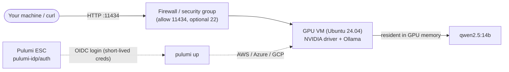

Putting [Ollama](https://ollama.com/) on a cloud GPU is something I keep coming back to. A while ago I wrote up [running open-source LLMs on an AWS EC2 box with Ollama and Pulumi](/blog/run-deepseek-on-aws-ec2-using-pulumi/), and the shape never really changes: a GPU instance, a model server, and a firewall rule in front. Infrastructure as code earned its place by making that kind of setup predictable and repeatable, and AI infrastructure is no exception. A GPU box serving a model is still a VM, a disk, and a firewall rule, and it should be declared like one.

[Thorsten Hans](https://www.linkedin.com/in/thorstenhans/) made exactly that case in his Akamai post, [Fully Automated AI Infrastructures with Terraform and Akamai Cloud](https://developers.akamai.com/blog/fully-automated-ai-infrastructure-with-terraform-and-akamai-cloud), which stands up a single GPU instance on Linode, installs the drivers, runs Ollama, and pulls a model, with no manual steps after `terraform apply`.

I liked the shape of it, so this post ports the same idea to Pulumi and runs it across AWS, Azure, and Google Cloud instead of one. The result is one program shape per cloud: a single `pulumi up` brings up a GPU box that installs its own driver, runs Ollama, and pulls a model with no manual steps, and a single `pulumi destroy` takes it back down. Along the way it drops the two imperative bits the Terraform version leans on: a static access token sitting in an environment variable, and a `null_resource` running a shell loop to wait for the model. The first becomes an OIDC login from a Pulumi ESC environment, so no long-lived key lives anywhere. The second turns out not to be a resource at all.

<!--more-->

## What you are building

Strip away the per-cloud naming and every version of this is the same three things: a GPU virtual machine, a firewall in front of it, and a cloud-init script that turns a bare Ubuntu box into a running inference server. The model serving runs on [Ollama](https://ollama.com/), which exposes an HTTP API on port `11434` and keeps the model resident in GPU memory between requests.



| Component | Port | Description |
|-----------|------|-------------|
| GPU VM | - | Ubuntu 24.04 with an NVIDIA T4-class GPU. Installs the driver and Ollama from cloud-init, then pulls the model. |
| [Ollama](https://ollama.com/) | 11434 | Serves the model over an HTTP API and keeps it in GPU memory between calls. |
| Firewall / security group | - | Allows inbound `11434` (and `22` when you ask for it). Open to the world for a demo; lock the CIDR down for anything real. |
| `pulumi-idp/auth` (ESC) | - | One environment that brokers an OIDC login into AWS, Azure, and GCP. No static keys in code or CI. |

One detail here is worth pausing on, and it explains why the Pulumi version comes out shorter than the Terraform one. The Akamai project ends with a `null_resource` that runs a `curl` loop in `local-exec` to block `terraform apply` until the model finishes downloading. That is not infrastructure but a runtime check wearing a resource costume. Pulumi has a [Command provider](https://www.pulumi.com/registry/packages/command/) that would let you reproduce it line for line, and this post deliberately does not. The program provisions the box, the box pulls the model on its own, and the program prints the endpoint. Whether the model has finished downloading yet is a question you answer with a `curl`, not a question your IaC tool should be holding a deployment open to ask.

## Prerequisites

Before getting started, ensure you have:

- [Pulumi CLI](/docs/iac/download-install/) installed and configured
- A [Pulumi Cloud account](https://app.pulumi.com/signup) (ESC and OIDC live here)
- An account on at least one of [AWS](https://aws.amazon.com/), [Azure](https://azure.microsoft.com/), or [Google Cloud](https://cloud.google.com/), with an OIDC trust set up for Pulumi (covered below)
- Enough GPU quota in your target region for one T4-class instance; a fresh account often starts at zero, which is the most common reason a first deploy fails, so check it before you run `pulumi up`
- Node.js 18+ for the TypeScript program
- `curl` to talk to the inference endpoint once it comes up

{}
This post serves the `qwen2.5:14b` model, the same one the Akamai article uses, because the 4-bit quant fits comfortably on a single 16 GB T4. The model is one config value (`model`), so swap in anything [Ollama supports](https://ollama.com/library); match the GPU to the model's memory footprint, because a model that overflows VRAM still runs but spills onto the CPU and crawls.
{}

## Credentials without the copy-paste

The Terraform version authenticates the only way a single-cloud demo can: you mint a personal access token, export it as `LINODE_TOKEN`, and the provider reads it from the environment. It works, but that token is long-lived, it sits in your shell history and your CI secrets, and you mint one per cloud. Across three clouds that is three static keys to rotate and worry about.

Pulumi [ESC (Environments, Secrets, and Configuration)](/docs/esc/) replaces it all with an OIDC login. The idea: instead of storing a cloud key, you store a *trust relationship*. At deploy time, ESC presents a short-lived OIDC token to AWS, Azure, or Google Cloud, and each one hands back temporary credentials scoped to a role you control. Nothing long-lived is ever written down.

I keep that wiring in one environment, `pulumi-idp/auth`, and every stack imports it. Here is the whole thing:

```yaml
# pulumi-idp/auth: one ESC environment that brokers an OIDC login into all three
# clouds. Every stack imports it. No static cloud key lives here or anywhere else.
values:
  aws:
    login:
      fn::open::aws-login:
        oidc:
          roleArn: arn:aws:iam::123456789012:role/pulumi-esc
          sessionName: pulumi-esc
  azure:
    login:
      fn::open::azure-login:
        clientId: aaaaaaaa-bbbb-cccc-dddd-eeeeeeeeeeee
        tenantId: aaaaaaaa-bbbb-cccc-dddd-eeeeeeeeeeee
        subscriptionId: /subscriptions/00000000-0000-0000-0000-000000000000
        oidc: true
  gcp:
    login:
      fn::open::gcp-login:
        project: 123456789012 # numeric project number, not the project ID
        oidc:
          workloadPoolId: pulumi-esc
          providerId: pulumi-esc
          serviceAccount: pulumi-esc@my-project.iam.gserviceaccount.com
  environmentVariables:
    # AWS: read by the Pulumi AWS provider, the AWS SDKs, and the aws CLI
    AWS_ACCESS_KEY_ID: ${aws.login.accessKeyId}
    AWS_SECRET_ACCESS_KEY: ${aws.login.secretAccessKey}
    AWS_SESSION_TOKEN: ${aws.login.sessionToken}
    # Azure: read by the azure-native provider
    ARM_USE_OIDC: "true"
    ARM_CLIENT_ID: ${azure.login.clientId}
    ARM_TENANT_ID: ${azure.login.tenantId}
    ARM_SUBSCRIPTION_ID: ${azure.login.subscriptionId}
    ARM_OIDC_TOKEN: ${azure.login.oidc.token}
    # Google Cloud: read by the Pulumi Google Cloud provider
    GOOGLE_CLOUD_PROJECT: ${gcp.login.project}
    GOOGLE_OAUTH_ACCESS_TOKEN: ${gcp.login.accessToken}
```

You only need the blocks for the clouds you actually deploy to. Opening this environment makes ESC perform a live OIDC login for each cloud listed, so trim it to the one you use, or keep all three if, like me, you bounce between them.

Each cloud needs a one-time trust setup so this login is allowed at all: an [IAM OIDC identity provider and role on AWS](/docs/esc/providers/login/aws-login/), a [federated credential on an Azure app registration](/docs/esc/providers/login/azure-login/), and a [Workload Identity Pool on Google Cloud](/docs/esc/providers/login/gcp-login/). You do that once; after that, `pulumi-idp/auth` is the only thing any stack references for credentials.

A stack opts into it with one block in its stack config. The AWS stack's `Pulumi.aws.yaml`:

```yaml
# Pulumi.aws.yaml
environment:
  - pulumi-idp/auth
```

That is the entire credential story. No keys in the program, no keys in CI, nothing to rotate. The program below never mentions a secret; it only creates resources, and the ambient credentials from `pulumi-idp/auth` carry the request.

## One cloud-init, three clouds

The part that turns a bare Ubuntu box into an inference server is identical on every cloud, so it lives in one file, `cloud-init.yaml`, that all three programs read. It follows the Akamai cloud-config closely, with a couple of robustness tweaks for a multi-cloud run, and it runs in a deliberate order because the GPU driver needs a reboot before Ollama can see the card:

1. Update packages and install the kernel headers and `ubuntu-drivers`.
1. Install the NVIDIA driver, then reboot so the kernel loads it.
1. On the next boot, a one-shot systemd service installs Ollama, binds it to `0.0.0.0:11434`, and pulls the model.
1. The service disables itself, so it never runs again.

```yaml
#cloud-config
# Zero-touch Ollama GPU box. Cloud-agnostic: no provider metadata, no static creds.
# The Pulumi program substitutes the model name on the `ollama pull` line below
# before this is passed as user-data (AWS/GCP) or custom-data (Azure).

write_files:
  # Make Ollama listen on every interface and never unload the model from VRAM.
  - path: /etc/systemd/system/ollama.service.d/override.conf
    content: |
      [Service]
      Environment="OLLAMA_HOST=0.0.0.0:11434"
      Environment="OLLAMA_KEEP_ALIVE=-1"

  # Runs once on the post-reboot boot, after the GPU driver is loaded.
  - path: /usr/local/bin/ollama-setup.sh
    permissions: '0755'
    content: |
      #!/usr/bin/env bash
      set -euxo pipefail

      # Install Ollama; the installer creates and starts the ollama systemd unit.
      curl -fsSL https://ollama.com/install.sh | sh

      # Pick up the OLLAMA_HOST / OLLAMA_KEEP_ALIVE override written above.
      systemctl daemon-reload
      systemctl enable ollama.service
      systemctl restart ollama.service

      # Wait for the daemon to bind its socket before pulling. This is the box
      # waiting on its OWN local daemon, not an external readiness gate.
      until curl -fsS http://127.0.0.1:11434/api/tags >/dev/null 2>&1; do
        sleep 2
      done

      # Pre-pull the model so the endpoint answers on the very first request.
      ollama pull __MODEL__

      # One-shot: never run again on future boots.
      systemctl disable ollama-setup.service

  - path: /etc/systemd/system/ollama-setup.service
    content: |
      [Unit]
      Description=One-time Ollama install and model pull
      After=network-online.target
      Wants=network-online.target

      [Service]
      Type=oneshot
      ExecStart=/usr/local/bin/ollama-setup.sh
      RemainAfterExit=true
      # The model pull runs for several minutes; without this, systemd's default
      # 90s start timeout kills the service mid-download and the model never lands.
      TimeoutStartSec=0

      [Install]
      WantedBy=multi-user.target

runcmd:
  - apt-get update
  - DEBIAN_FRONTEND=noninteractive apt-get -y upgrade
  # linux-headers-generic also covers the kernel the upgrade above may have pulled
  # in, so DKMS builds the NVIDIA module for the kernel that boots next.
  - DEBIAN_FRONTEND=noninteractive apt-get install -y "linux-headers-$(uname -r)" linux-headers-generic ubuntu-drivers-common
  # --gpgpu selects the headless server driver branch, the right one for a compute
  # GPU like the T4; bare `ubuntu-drivers install` would pull the desktop stack.
  - ubuntu-drivers install --gpgpu
  - systemctl enable ollama-setup.service

power_state:
  mode: reboot
  message: Rebooting to load the NVIDIA driver before Ollama setup
  condition: true
```

The model name is the literal token `__MODEL__`. The Pulumi program reads this file at deploy time and substitutes your `model` config value before handing it to the instance. Two environment settings are doing quiet but important work: `OLLAMA_HOST=0.0.0.0:11434` makes Ollama listen on every interface instead of localhost alone, and `OLLAMA_KEEP_ALIVE=-1` keeps the model pinned in GPU memory so only the first request pays the load cost.

## The programs

Every program has the same five beats: read the config, template the `cloud-init.yaml`, open the inbound ports, launch the GPU instance with that cloud-init as its user data, and export the endpoint. What differs is only the dialect each cloud speaks for "GPU instance" and "firewall rule."

The shared contract keeps the three listings legible side by side: the same `model` and `allowSsh` config keys, the same `cloud-init.yaml`, and the same four exports (`publicIp`, `ollamaEndpoint`, `generateEndpoint`, `tagsEndpoint`). Pick your cloud:



{}

```typescript
import * as pulumi from "@pulumi/pulumi";
import * as aws from "@pulumi/aws";
import * as fs from "fs";

const cfg = new pulumi.Config();
const model = cfg.get("model") ?? "qwen2.5:14b";
const allowSsh = cfg.getBoolean("allowSsh") ?? false;
const region = (cfg.get("region") ?? "us-east-1") as aws.Region;

// Inject the model name into cloud-init at deploy time (a file read, not a shell-out).
const userData = fs.readFileSync("cloud-init.yaml", "utf8").replace(/__MODEL__/g, model);

// Region comes from config; credentials arrive ambiently from pulumi-idp/auth.
const provider = new aws.Provider("aws", { region });

// Most recent Ubuntu 24.04 LTS (amd64, hvm, gp3) published by Canonical.
const ubuntu = aws.ec2.getAmi({
    mostRecent: true,
    owners: ["099720109477"],
    filters: [
        { name: "name", values: ["ubuntu/images/hvm-ssd-gp3/ubuntu-noble-24.04-amd64-server-*"] },
        { name: "virtualization-type", values: ["hvm"] },
    ],
}, { provider });

const ingress: aws.types.input.ec2.SecurityGroupIngress[] = [{
    description: "Ollama HTTP API. NOTE: restrict cidrBlocks to your own range in production.",
    fromPort: 11434,
    toPort: 11434,
    protocol: "tcp",
    cidrBlocks: ["0.0.0.0/0"],
}];

if (allowSsh) {
    ingress.push({
        description: "SSH",
        fromPort: 22,
        toPort: 22,
        protocol: "tcp",
        cidrBlocks: ["0.0.0.0/0"],
    });
}

const sg = new aws.ec2.SecurityGroup("ollama", {
    description: "Ollama inferencing access",
    ingress,
    egress: [{
        description: "Allow all outbound",
        fromPort: 0,
        toPort: 0,
        protocol: "-1",
        cidrBlocks: ["0.0.0.0/0"],
    }],
}, {
    provider,
});

const server = new aws.ec2.Instance("ollama", {
    ami: ubuntu.then(a => a.id),
    instanceType: "g4dn.xlarge", // 1x NVIDIA T4
    vpcSecurityGroupIds: [sg.id],
    associatePublicIpAddress: true,
    userData, // plain text; the AWS provider base64-encodes it for you
    rootBlockDevice: {
        volumeSize: 40,
        volumeType: "gp3",
    },
    tags: { Name: "ollama" },
}, {
    provider,
});

export const publicIp = server.publicIp;
export const ollamaEndpoint = pulumi.interpolate`http://${publicIp}:11434`;
export const generateEndpoint = pulumi.interpolate`http://${publicIp}:11434/api/generate`;
export const tagsEndpoint = pulumi.interpolate`http://${publicIp}:11434/api/tags`;
```

{}

{}

```typescript
import * as pulumi from "@pulumi/pulumi";
import * as gcp from "@pulumi/gcp";
import * as fs from "fs";

const cfg = new pulumi.Config();
const model = cfg.get("model") ?? "qwen2.5:14b";
const allowSsh = cfg.getBoolean("allowSsh") ?? false;
const project = cfg.get("project");
const zone = cfg.get("zone") ?? "us-central1-a";

// Inject the model name into cloud-init at deploy time (a file read, not a shell-out).
const userData = fs.readFileSync("cloud-init.yaml", "utf8").replace(/__MODEL__/g, model);

// Latest Ubuntu 24.04 LTS amd64 image.
const ubuntu = gcp.compute.getImage({
    family: "ubuntu-2404-lts-amd64",
    project: "ubuntu-os-cloud",
});

// Network tag binds the firewall rule to this instance.
const networkTag = "ollama";

const firewall = new gcp.compute.Firewall("ollama-fw", {
    network: "default",
    project: project,
    // Inbound to Ollama from anywhere; restrict this CIDR for production.
    allows: allowSsh
        ? [{ protocol: "tcp", ports: ["11434"] }, { protocol: "tcp", ports: ["22"] }]
        : [{ protocol: "tcp", ports: ["11434"] }],
    sourceRanges: ["0.0.0.0/0"],
    targetTags: [networkTag],
});

const instance = new gcp.compute.Instance("ollama", {
    machineType: "n1-standard-4",
    zone: zone,
    project: project,
    tags: [networkTag],
    bootDisk: {
        initializeParams: {
            image: ubuntu.then(i => i.selfLink),
            size: 40,
        },
    },
    guestAccelerators: [{
        type: "nvidia-tesla-t4",
        count: 1,
    }],
    // GPUs cannot live-migrate, so host maintenance must terminate (and restart) the VM.
    scheduling: {
        onHostMaintenance: "TERMINATE",
        automaticRestart: true,
    },
    networkInterfaces: [{
        network: "default",
        accessConfigs: [{}], // an empty config requests an ephemeral public IP
    }],
    metadata: {
        "user-data": userData, // Ubuntu cloud-init reads this key, not startup-script
    },
}, {
    dependsOn: firewall,
});

export const publicIp = instance.networkInterfaces.apply(nics => nics[0].accessConfigs![0].natIp);
export const ollamaEndpoint = pulumi.interpolate`http://${publicIp}:11434`;
export const generateEndpoint = pulumi.interpolate`http://${publicIp}:11434/api/generate`;
export const tagsEndpoint = pulumi.interpolate`http://${publicIp}:11434/api/tags`;
```

{}

{}

```typescript
import * as pulumi from "@pulumi/pulumi";
import * as resources from "@pulumi/azure-native/resources";
import * as network from "@pulumi/azure-native/network";
import * as compute from "@pulumi/azure-native/compute";
import * as random from "@pulumi/random";
import * as fs from "fs";

const cfg = new pulumi.Config();
const model = cfg.get("model") ?? "qwen2.5:14b";
const allowSsh = cfg.getBoolean("allowSsh") ?? false;
const location = cfg.get("location") ?? "eastus";

// Inject the model name into cloud-init at deploy time (a file read, not a shell-out).
const userData = fs.readFileSync("cloud-init.yaml", "utf8").replace(/__MODEL__/g, model);

const resourceGroup = new resources.ResourceGroup("ollama-rg", {
    location,
});

const vnet = new network.VirtualNetwork("ollama-vnet", {
    resourceGroupName: resourceGroup.name,
    addressSpace: { addressPrefixes: ["10.0.0.0/16"] },
});

const subnet = new network.Subnet("ollama-subnet", {
    resourceGroupName: resourceGroup.name,
    virtualNetworkName: vnet.name,
    addressPrefix: "10.0.1.0/24",
});

// Standard SKU public IPs use static allocation.
const publicIpAddress = new network.PublicIPAddress("ollama-pip", {
    resourceGroupName: resourceGroup.name,
    sku: { name: network.PublicIPAddressSkuName.Standard },
    publicIPAllocationMethod: network.IPAllocationMethod.Static,
});

// Azure permits all outbound by default, so only inbound rules are needed.
const nsg = new network.NetworkSecurityGroup("ollama-nsg", {
    resourceGroupName: resourceGroup.name,
    securityRules: [
        {
            name: "allow-ollama",
            priority: 1000,
            direction: network.SecurityRuleDirection.Inbound,
            access: network.SecurityRuleAccess.Allow,
            protocol: network.SecurityRuleProtocol.Tcp,
            sourcePortRange: "*",
            destinationPortRange: "11434",
            sourceAddressPrefix: "0.0.0.0/0", // prod: restrict to your client CIDR
            destinationAddressPrefix: "*",
        },
        ...(allowSsh ? [{
            name: "allow-ssh",
            priority: 1001,
            direction: network.SecurityRuleDirection.Inbound,
            access: network.SecurityRuleAccess.Allow,
            protocol: network.SecurityRuleProtocol.Tcp,
            sourcePortRange: "*",
            destinationPortRange: "22",
            sourceAddressPrefix: "0.0.0.0/0",
            destinationAddressPrefix: "*",
        }] : []),
    ],
});

const nic = new network.NetworkInterface("ollama-nic", {
    resourceGroupName: resourceGroup.name,
    networkSecurityGroup: { id: nsg.id },
    ipConfigurations: [{
        name: "ipconfig1",
        subnet: { id: subnet.id },
        publicIPAddress: { id: publicIpAddress.id },
        privateIPAllocationMethod: network.IPAllocationMethod.Dynamic,
        primary: true,
    }],
});

// Azure requires an admin credential even though we never log in. Generate one
// instead of hard-coding it; it stays a Pulumi secret and is never exported.
const adminPassword = new random.RandomPassword("ollama-admin-password", {
    length: 24,
    special: true,
    overrideSpecial: "!#$%*",
    minLower: 1,
    minUpper: 1,
    minNumeric: 1,
    minSpecial: 1, // Azure requires 3 of 4 character classes
});

const vm = new compute.VirtualMachine("ollama-vm", {
    resourceGroupName: resourceGroup.name,
    hardwareProfile: { vmSize: "Standard_NC4as_T4_v3" }, // 1x NVIDIA T4
    networkProfile: {
        networkInterfaces: [{ id: nic.id, primary: true }],
    },
    osProfile: {
        computerName: "ollama",
        adminUsername: "azureuser",
        adminPassword: adminPassword.result,
        customData: Buffer.from(userData).toString("base64"), // Azure wants base64
        linuxConfiguration: {
            disablePasswordAuthentication: false,
        },
    },
    storageProfile: {
        imageReference: {
            publisher: "Canonical",
            offer: "ubuntu-24_04-lts",
            sku: "server", // Gen2; NC4as_T4_v3 is a Gen2 size
            version: "latest",
        },
        osDisk: {
            name: "ollama-osdisk",
            createOption: "FromImage",
            diskSizeGB: 40,
            managedDisk: { storageAccountType: "StandardSSD_LRS" },
        },
    },
});

// A Standard/Static public IP is reserved at creation, so its address is known
// once the resource exists; no separate lookup needed.
export const publicIp = publicIpAddress.ipAddress.apply(ip => ip!);
export const ollamaEndpoint = pulumi.interpolate`http://${publicIp}:11434`;
export const generateEndpoint = pulumi.interpolate`http://${publicIp}:11434/api/generate`;
export const tagsEndpoint = pulumi.interpolate`http://${publicIp}:11434/api/tags`;
```

{}



A few per-cloud details are worth calling out, since they are the places the "same program" abstraction leaks:

- **AWS** is the shortest program, because the GPU comes with the instance shape: a `g4dn.xlarge` *is* a T4 box, so there is no separate accelerator to attach. The one thing to do before you deploy is raise the **Running On-Demand G and VT instances** vCPU quota in your region; a fresh account starts at zero, and `pulumi up` fails with `VcpuLimitExceeded` until you do.
- **Google Cloud** attaches the GPU explicitly with `guestAccelerators`, and that brings the rule that trips people up: a GPU instance cannot live-migrate, so `scheduling.onHostMaintenance` must be `"TERMINATE"` or the apply is rejected. The cloud-init also has to ride on the `user-data` metadata key, not `startup-script`, and the empty `accessConfigs: [{}]` is what hands the box a public IP. T4 quota is also zero on a new project.
- **Azure** is the longest listing, because the network is à la carte: the resource group, virtual network, subnet, public IP, security group, and NIC are each their own resource before you reach the VM. One detail surprises people: a Linux VM requires an admin credential even when you never log in, so the program generates a throwaway password with `random.RandomPassword` rather than committing one. The `NC4as_T4_v3` is a compute GPU, so the standard server driver from the cloud-init is correct; the GRID driver is for the visualization NV-series, not this.

The full programs, all three `Pulumi.<cloud>.yaml` files, and the shared `cloud-init.yaml` are in the companion repo:



## Deploying

Create a project, install the provider for your cloud, point the stack at `pulumi-idp/auth`, and deploy. For AWS:

```bash
mkdir ai-inference && cd ai-inference
pulumi new typescript
npm install @pulumi/aws
```

Drop the AWS listing into `index.ts`, put the shared `cloud-init.yaml` next to it, point the stack at the auth environment, and set your region:

```bash
pulumi stack init aws
# add `environment: [pulumi-idp/auth]` to Pulumi.aws.yaml (shown above)
pulumi config set region us-east-1
pulumi config set model qwen2.5:14b
pulumi up
```

The other two clouds are the same flow with a different provider package and a couple of config keys: `npm install @pulumi/gcp` with `pulumi config set project <your-project-id>` and `pulumi config set zone us-central1-a`, or `npm install @pulumi/azure-native @pulumi/random` with `pulumi config set location eastus`.

The slow part is the GPU box: it boots, installs the driver, reboots, installs Ollama, and pulls the model, all without you. Depending on the instance, the region, and the model size, plan on roughly 10 to 15 minutes before the endpoint answers. When `pulumi up` finishes you get the endpoints straight back as stack outputs:

```bash
Outputs:
    generateEndpoint: "http://<public-ip>:11434/api/generate"
    ollamaEndpoint  : "http://<public-ip>:11434"
    publicIp        : "<public-ip>"
    tagsEndpoint    : "http://<public-ip>:11434/api/tags"
```

## Testing the inference server

`pulumi up` returns as soon as the infrastructure exists, which is before the model has finished downloading. This is exactly where Terraform reached for that `null_resource` loop, and where Pulumi hands you a URL instead. To check whether the model is ready, ask Ollama what it has loaded:

```bash
curl -s $(pulumi stack output tagsEndpoint) | grep -q "qwen2.5:14b" && echo "ready" || echo "still pulling"
```

Once it reports ready, send it a prompt. This is the same request the Akamai post makes, pointed at your `generateEndpoint` output:

```bash
curl -s $(pulumi stack output generateEndpoint) -d '{
  "model": "qwen2.5:14b",
  "system": "Answer every question with a three-line poem.",
  "prompt": "Why is the sky blue?",
  "stream": false
}'
```

The first call is slower, because Ollama loads the model into GPU memory before it answers. Every call after that is fast, since `OLLAMA_KEEP_ALIVE=-1` keeps it resident:

```json
{
  "model": "qwen2.5:14b",
  "response": "Sunlight scatters, short waves fly,\nBlue light paints the open sky,\nViolet fades as day drifts by.",
  "done": true
}
```

When you are done, take it all down with one command, so the GPU stops billing:

```bash
pulumi destroy
```

## Cost

A GPU instance is the whole bill, and you pay by the hour whether the model is busy or idle. The numbers below are rough on-demand rates for a single T4-class box left running 24/7; in practice you spin it up, use it, and `pulumi destroy` it, so what you actually pay tracks the hours it stays up.

| Cloud | Instance | GPU | ~Hourly | ~Monthly (24/7) |
|-------|----------|-----|---------|-----------------|
| AWS | `g4dn.xlarge` | 1× T4 (16 GB) | ~$0.53 | ~$384 |
| Azure | `Standard_NC4as_T4_v3` | 1× T4 (16 GB) | ~$0.53 | ~$384 |
| Google Cloud | `n1-standard-4` + 1× T4 | 1× T4 (16 GB) | ~$0.54 | ~$394 |

These are on-demand Linux rates in a cheap US region (`us-east-1`, `eastus`, `us-central1`) as of mid-2026, and the GPU dominates the bill. Spot or preemptible capacity cuts it sharply if your workload tolerates interruption (often 60 to 70 percent off), Google Cloud's sustained-use discount trims an always-on instance on its own, and the 40 GB disk adds only a few dollars a month.

{}
A GPU box left running overnight is the expensive mistake here. Because the whole stack is declarative, the safe habit is cheap: `pulumi destroy` when you stop using it, `pulumi up` when you need it back. The state and config are version-controlled, so standing it up again is one command, not a rebuild.
{}

## Security considerations

The architecture in this post matches the Akamai original on purpose, which means it carries the same caveat: Ollama is exposed over plain HTTP on a port open to the entire internet. That is fine for a demo on a box you tear down the same day. It is not fine for anything that outlives the afternoon, and self-hosted AI endpoints get found fast: scanners like [Shodan](https://www.shodan.io/) enumerate a freshly exposed one within hours, and an open Ollama instance is free compute for whoever finds it first.

The credential side, though, is genuinely better than a static-token setup, and that is the part worth keeping. There is no long-lived cloud key in the program, in your shell, or in CI; every deploy gets short-lived credentials minted through `pulumi-idp/auth` and thrown away when it finishes.

| Concern | Akamai/Terraform demo | This deployment |
|---------|-----------------------|-----------------|
| Cloud credentials | Static PAT in an env var | OIDC login, short-lived, via `pulumi-idp/auth` |
| Inbound exposure | Port 11434 open to `0.0.0.0/0` | Same by default; one config flag scopes the CIDR |
| Transport | Plain HTTP | Plain HTTP (front with TLS for real use) |
| Readiness wait | `null_resource` + `local-exec` shell loop | A runtime `curl`, no resource |

My recommendations for taking this past a demo:

- Scope the inbound rule to your own CIDR instead of `0.0.0.0/0`; the `allowSsh` flag in the program is the pattern to copy for the Ollama port
- Put a reverse proxy with TLS in front of Ollama, or keep the box off the public internet entirely and reach it over a private network or a [Tailscale tailnet](/blog/deploy-a-hermes-agent-with-pulumi/), the way I did for the Hermes agent
- Keep credentials on OIDC through ESC; never fall back to a static key to "just get it working"
- Treat the box as disposable, and `pulumi destroy` it when you are not using it, which shrinks both the bill and the attack window

## What's next?

The program is a foundation, and the interesting work is what you layer on once a model is a `pulumi up` away:

- **Lock it down.** Scope the firewall, add TLS, or move the box behind a private network so the endpoint is not on the public internet at all.
- **Scale the model to the GPU.** `qwen2.5:14b` on a T4 is the entry point. Bigger models want more memory, which means an A10G, an L4, or an A100, and the only change in the program is the instance type and the `model` value.
- **Swap the serving engine.** Ollama is the simplest thing that works. For higher throughput, the same shape holds with [vLLM](https://github.com/vllm-project/vllm) in place of Ollama in the cloud-init.
- **Generate the next one.** [Pulumi Neo](https://www.pulumi.com/product/neo/) can take a target like "a GPU inference box on Azure behind a private endpoint" and produce a first draft of the program, which you then review in a PR like any other change.

## Conclusion

Declaring an AI inference server as code buys you the same thing it buys for any other infrastructure: you can reproduce it on any of the three clouds, version-control it, and tear it down with a single `pulumi destroy`. Porting the Akamai project made the contrast sharp. The credentials moved from a static token to an OIDC login that leaves nothing behind, and the readiness wait disappeared entirely once you stop treating a runtime check as a resource.

That is the line worth carrying to the next thing you deploy. Not every step in a runbook is a resource. A GPU box and a firewall rule are; waiting for a download to finish is not. Draw that line first, and the program gets shorter on its own.

If you run into issues or have questions, drop by the [Pulumi Community Slack](https://slack.pulumi.com/) or [GitHub Discussions](https://github.com/pulumi/pulumi/discussions). New to Pulumi? [Get started here](/docs/get-started/).
