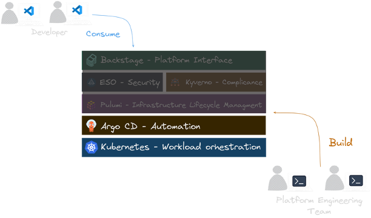
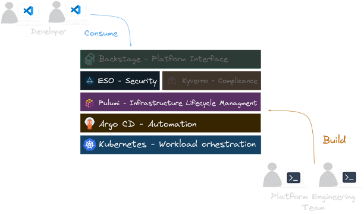

In today's complex digital landscape, organizations are increasingly turning to platform engineering to optimise their
software delivery processes and maximize efficiency. The growing complexity of modern applications, coupled with the
need for rapid, secure, and scalable deployments, has created a pressing demand for robust Internal Developer
Platforms (IDPs).

IDPs are a key component of modern platform engineering strategies. An IDP is a self-service layer that sits on top of
an organization's infrastructure, abstracting away complexity and providing developers with the tools and environments
they need to build, test, and deploy applications efficiently.

Key features of an effective IDP include:

1. Self-service capabilities: Developers can provision resources, environments, and services without relying on ops
   teams.
2. Standardization: IDPs enforce best practices and compliance standards across the organization.
3. Automation: Repetitive tasks are automated, reducing manual errors and freeing up developer time.
4. Observability: Built-in monitoring and logging provide insights into application and infrastructure performance.
5. Integration: IDPs seamlessly integrate with existing tools and workflows in the development lifecycle.

By implementing an IDP, organizations can significantly reduce cognitive load on developers, accelerate time-to-market,
improve security and compliance, and foster a culture of innovation. IDPs act as a force multiplier, allowing
development teams to focus on creating business value while the platform handles the underlying complexity of
cloud-native infrastructure.

`KEBAP`, as a reference architecture, demonstrates how to construct an IDP using best-in-class CNCF technologies,
orchestrated and managed through Pulumi's infrastructure as code capabilities.

Platform engineering addresses these challenges by creating a layer of abstraction between development teams and the
underlying infrastructure. This approach aims to simplify workflows, standardize practices, and empower developers to
focus on creating business value rather than grappling with intricate infrastructure details.

The [Cloud Native Computing Foundation](https://www.cncf.io/) (CNCF) landscape offers a rich ecosystem of tools and
technologies that can be
leveraged to build these platforms. However, the sheer number of options can be overwhelming, making it difficult for
organizations to determine the best combination of tools for their specific needs.

At Pulumi's Customer Experience Team, we've observed that adopting infrastructure as code often serves as a catalyst for
organizations to reassess their entire software delivery process. This reassessment frequently leads to the
implementation of more streamlined, automated, and secure methodologies – the core principles of platform engineering.

To address these challenges and provide guidance, we've created a reference archticture called the `KEBAP` stack.
Demonstrating how various CNCF technologies can
be integrated cohesively using Pulumi to create a robust, scalable internal developer platform.

By leveraging `KEBAP` and the wider CNCF ecosystem, organizations can accelerate their journey towards effective
platform
engineering. This approach not only enhances operational efficiency but also positions teams to readily adopt and
benefit from emerging Cloud Native technologies, ensuring their platforms remain future-proof and aligned with industry
best practices.

## One Reference Architecture: The `KEBAP` Stack

The `KEBAP` stack consists of the following components:

- **K**ubernetes (with Kyverno as a bonus)
- **E**xternal Secrets Operator
- **B**ackstage
- **A**rgo CD
- **P**ulumi

This combination forms a standardized GitOps stack applicable to various infrastructure projects. By implementing the
`KEBAP` stack, we've consistently reduced the time required for teams to establish development and production
environments from months to minutes.

To following along, we are going to use
the [capabilities of platforms](https://tag-app-delivery.cncf.io/whitepapers/platforms/#capabilities-of-platforms)
definition from the CNCF working group on Platforms.


## Let's Break It Down

Let's take a closer look at each component of the `KEBAP` stack and understand how they work together to streamline the
software delivery process.

The five layers of the `KEBAP` stack are designed to address different aspects of the software delivery process:

### Kubernetes


[Kubernetes](https://kubernetes.io/) serves as the central control plane. It provides a well-defined API for managing
containerized workloads and with the help of the Kubernetes Operator pattern, it can be extended to manage custom
resources. In our case we extend
the Kubernetes API with the Pulumi Kubernetes Operator to manage the infrastructure resources in the same way as the
rest of the Kubernetes resources.

Here is an example of how we can use the Pulumi Kubernetes Operator to create a new Kubernetes cluster
in `DigitalOcean`:

```yaml
---
apiVersion: apiextensions.k8s.io/v1
kind: CustomResourceDefinition
metadata:
  annotations:
    controller-gen.kubebuilder.io/version: v0.15.0
  name: programs.pulumi.com
spec:
  group: pulumi.com
  names:
    kind: Program
    listKind: ProgramList
    plural: programs
    singular: program
  scope: Namespaced
  versions:
  - additionalPrinterColumns:
    - jsonPath: .metadata.creationTimestamp
      name: Age
      type: date
    name: v1
    schema:
      openAPIV3Schema:
        description: Program is the schema for the inline YAML program API.
        properties:
          apiVersion:
            description: |-
              APIVersion defines the versioned schema of this representation of an object.
              Servers should convert recognized schemas to the latest internal value, and
              may reject unrecognized values.
              More info: https://git.k8s.io/community/contributors/devel/sig-architecture/api-conventions.md#resources
            type: string
          kind:
            description: |-
              Kind is a string value representing the REST resource this object represents.
              Servers may infer this from the endpoint the client submits requests to.
              Cannot be updated.
              In CamelCase.
              More info: https://git.k8s.io/community/contributors/devel/sig-architecture/api-conventions.md#types-kinds
            type: string
          metadata:
            type: object
          program:
            properties:
              configuration:
                additionalProperties:
                  properties:
                    default:
                      description: default is a value of the appropriate type for
                        the template to use if no value is specified.
                      x-kubernetes-preserve-unknown-fields: true
                    type:
                      description: type is the (required) data type for the parameter.
                      enum:
                      - String
                      - Number
                      - List<Number>
                      - List<String>
                      type: string
                  type: object
                description: |-
                  configuration specifies the Pulumi config inputs to the deployment.
                  Either type or default is required.
                type: object
              outputs:
                additionalProperties:
                  x-kubernetes-preserve-unknown-fields: true
                description: outputs specifies the Pulumi stack outputs of the program
                  and how they are computed from the resources.
                type: object
              resources:
                additionalProperties:
                  properties:
                    get:
                      description: A getter function for the resource. Supplying get
                        is mutually exclusive to properties.
                      properties:
                        id:
                          description: The ID of the resource to import.
                          minLength: 1
                          type: string
                        state:
                          additionalProperties:
                            x-kubernetes-preserve-unknown-fields: true
                          description: |-
                            state contains the known properties (input & output) of the resource. This assists
                            the provider in figuring out the correct resource.
                          type: object
                      required:
                      - id
                      type: object
                    options:
                      description: options contains all resource options supported
                        by Pulumi.
                      properties:
                        additionalSecretOutputs:
                          description: additionalSecretOutputs specifies properties
                            that must be encrypted as secrets.
                          items:
                            type: string
                          type: array
                        aliases:
                          description: |-
                            aliases specifies names that this resource used to have, so that renaming or refactoring
                            doesn’t replace it.
                          items:
                            type: string
                          type: array
                        customTimeouts:
                          description: customTimeouts overrides the default retry/timeout
                            behavior for resource provisioning.
                          properties:
                            create:
                              description: create is the custom timeout for create
                                operations.
                              type: string
                            delete:
                              description: delete is the custom timeout for delete
                                operations.
                              type: string
                            update:
                              description: update is the custom timeout for update
                                operations.
                              type: string
                          type: object
                        deleteBeforeReplace:
                          description: deleteBeforeReplace overrides the default create-before-delete
                            behavior when replacing.
                          type: boolean
                        dependsOn:
                          description: dependsOn adds explicit dependencies in addition
                            to the ones in the dependency graph.
                          items:
                            x-kubernetes-preserve-unknown-fields: true
                          type: array
                        ignoreChanges:
                          description: ignoreChanges declares that changes to certain
                            properties should be ignored when diffing.
                          items:
                            type: string
                          type: array
                        import:
                          description: import adopts an existing resource from your
                            cloud account under the control of Pulumi.
                          type: string
                        parent:
                          description: |-
                            parent resource option specifies a parent for a resource. It is used to associate
                            children with the parents that encapsulate or are responsible for them.
                          x-kubernetes-preserve-unknown-fields: true
                        protect:
                          description: protect prevents accidental deletion of a resource.
                          type: boolean
                        provider:
                          description: provider resource option sets a provider for
                            the resource.
                          x-kubernetes-preserve-unknown-fields: true
                        providers:
                          additionalProperties:
                            x-kubernetes-preserve-unknown-fields: true
                          description: providers resource option sets a map of providers
                            for the resource and its children.
                          type: object
                        version:
                          description: version specifies a provider plugin version
                            that should be used when operating on a resource.
                          type: string
                      type: object
                    properties:
                      additionalProperties:
                        x-kubernetes-preserve-unknown-fields: true
                      description: properties contains the primary resource-specific
                        keys and values to initialize the resource state.
                      type: object
                    type:
                      description: type is the Pulumi type token for this resource.
                      minLength: 1
                      type: string
                  required:
                  - type
                  type: object
                description: resources declares the Pulumi resources that will be
                  deployed and managed by the program.
                type: object
              variables:
                additionalProperties:
                  x-kubernetes-preserve-unknown-fields: true
                description: |-
                  variables specifies intermediate values of the program; the values of variables are
                  expressions that can be re-used.
                type: object
            type: object
        type: object
    served: true
    storage: true
    subresources: {}
```

### Argo CD



[Argo CD](https://argo-cd.readthedocs.io/en/stable/) handles the deployment layer, ensuring that the current deployment
matches what is declaratively defined in the
source. It's emerging as the de facto standard due to its rich front-end and powerful features. Argo CD implements the
GitOps model, continuously monitoring your Git repositories and automatically updating the deployed applications to
match the desired state.

```yaml
apiVersion: argoproj.io/v1alpha1
kind: Application
metadata:
  name: ${{values.name}}-${{values.stage}}-${{ (values.owner | parseEntityRef).name }}
  namespace: argocd
spec:
  destination:
    namespace: pulumi-operator
    server: https://kubernetes.default.svc
  project: ${{ (values.owner | parseEntityRef).name }}
  source:
    path: "gitops/teams/clusters/${{values.name}}-${{values.stage}}-cluster"
    directory:
      recurse: false
      exclude: '{catalog-info.yaml}'
    targetRevision: main
    repoURL: https://github.com/my-backstage-demo/backstage-infrastructure-provisioning-templates-workshop.git
  syncPolicy:
    automated:
      prune: true
      selfHeal: true
    syncOptions:
    - ServerSideApply=true
    - CreateNamespace=true
```

### Pulumi


Pulumi manages the lifecycle of all the cloud infrastructure, developers self-service. It allows you to use familiar
programming languages to define your infrastructure as code, providing more flexibility and power than traditional YAML
or domain-specific languages. The [Pulumi Kubernetes Operator](https://github.com/pulumi/pulumi-kubernetes-operator)
enables you to manage your infrastructure directly from within Kubernetes, offering seamless integration with your
existing Kubernetes workflows.

As we use GitOps to manage the infrastructure, we define the infrastructure in the Git repository let
then [Argo CD](#argo-cd) deploy it to the cluster. As soon the definition of the infrastructure is deployed to the
cluster, the Pulumi Kubernetes Operator will take care and create the defined resources in the selected cloud provider.

Here is an example of how we can use the Pulumi Kubernetes Operator to create a new Kubernetes cluster
in `DigitalOcean`:

```yaml
apiVersion: pulumi.com/v1
kind: Program
metadata:
  name: ${{values.name}}
program:
  variables:
    clusterName: "do-cluster"
    clusterRegion: "nyc1"
    nodePoolName: "default"
    nodeCount: 1
    version: 1.30.1-do.0

  resources:
    do_cluster:
      type: digitalocean:KubernetesCluster
      properties:
        name: "${clusterName}"
        region: "${clusterRegion}"
        version: "${version}"
        destroyAllAssociatedResources: true
        nodePool:
          name: "${nodePoolName}"
          size: "s-2vcpu-2gb"
          nodeCount: "${nodeCount}"
    # cut for brevity
---
apiVersion: pulumi.com/v1
kind: Stack
metadata:
  name: ${{values.name}}
spec:
  stack: ${{values.stack}}
  envRefs:
    DIGITALOCEAN_TOKEN:
      type: Env
      env:
        name: DIGITALOCEAN_TOKEN
  programRef:
    name: ${{values.name}}
  destroyOnFinalize: false
```

### External Secrets Operator (ESO)



ESO addresses the challenge of securely managing secrets in Kubernetes. It integrates with various secret stores (such
as AWS Secrets Manager, HashiCorp Vault, Google Secrets Manager, Azure Key Vault) in a consistent way. This allows you
to configure access to the secret store once for all your required secrets, enhancing security and simplifying
management.

We even take it a step further by using ESO to manage the secrets from Pulumi ESC (External Secret Configurations) with
the [Pulumi Provider](https://external-secrets.io/latest/provider/pulumi/) for ESO. This way, we can manage the secrets
in the same way as the rest of the infrastructure, ensuring that the secrets are managed in a secure and consistent
manner across different environments.

To give the Pulumi Kubernetes Operator access to the secrets, we create following `ClusterSecretStore` object:

```yaml
apiVersion: external-secrets.io/v1beta1
kind: ClusterSecretStore
metadata:
  name: secret-store
spec:
  provider:
    pulumi:
      organization: <org>
      environment: <env>
      accessToken:
        secretRef:
          name: pulumi-access-token
          key: PULUMI_ACCESS_TOKEN
          namespace: argocd
```

And then we can define the `ExternalSecret` with all the secrets that we want to manage and pass to our Operator as
environment variables `extraEnv`:

```yaml
apiVersion: external-secrets.io/v1beta1
kind: ExternalSecret
metadata:
  name: pulumi-operator-secrets
spec:
  refreshInterval: 20s
  secretStoreRef:
    kind: ClusterSecretStore
    name: secret-store
  data:
  - secretKey: pulumi-access-token
    remoteRef:
      key: "backstage.pulumi-pat"
  - secretKey: do-token
    remoteRef:
      key: "backstage.do"
```

### Backstage


Backstage is an open platform for building developer portals. It provides a centralized place for managing software
catalogs, documentation, and tooling. This layer helps in organizing microservices and infrastructure, streamlining the
process for developers to create, manage, and explore services.

We also installed the [Pulumi plugin](https://github.com/pulumi/pulumi-backstage-plugin) for Backstage, which allows us
to manage our infrastructure as code directly from the Backstage UI. There are several ways to interact with the plugin.
If you want to use the scaffolding feature, you can add following `step` for example to your `Template` definition:

```yaml
apiVersion: scaffolder.backstage.io/v1beta3
kind: Template
metadata:
  name: kubernetes-template
  title: Kubernetes Cluster
  description: |
    A template for creating a new Kubernetes Cluster.
  tags:
  - pulumi
  - kubernetes
spec:
  steps:
  - id: pulumi-new-component
    name: Cookie cut the component Pulumi project
    action: pulumi:new
    input:
      name: "${{ parameters.component_id }}-infrastructure"
      description: ${{ parameters.description | dump }}
      organization: ediri
      stack: ${{ parameters.stack }}
      template: "https://github.com/my-silly-organisation/microservice-civo/tree/main/infrastructure-${{ parameters.cloud }}-${{ parameters.language }}"
      config:
        "node:node_count": "${{ parameters.nodeCount }}"
      folder: .
```

### Bonus: Kyverno


As a bonus, Kyverno can be used to enforce policies and automate security and operational best practices in Kubernetes
clusters. Kyverno is a policy engine designed for Kubernetes that allows you to define policies as code and enforce them
at runtime. This ensures that your Kubernetes clusters are secure and compliant with your organization's policies.

In our case, we use Kyverno to create a `ClusterPolicy` object to automatically add `vCluster` clusters to the Argo CD
as spoke clusters. This will generate a `Secret` object in the `argocd` namespace for each `vCluster` cluster the dev
teams create.

```yaml
apiVersion: kyverno.io/v1
kind: ClusterPolicy
metadata:
  name: sync-secret-vcluster
  annotations:
    argocd.argoproj.io/sync-wave: "5"
spec:
  generateExistingOnPolicyUpdate: true
  rules:
  - name: sync-secret-vcluster-nonprod
    match:
      any:
      - resources:
          names:
          - "*-dev-*"
          - "*-staging-*"
          - "*-prod-*"
          kinds:
          - Secret
    exclude:
      any:
      - resources:
          namespaces:
          - kube-system
          - default
          - kube-public
          - kyverno
    context:
    - name: namespace
      variable:
        value: "{{ request.object.metadata.namespace }}"
    - name: name
      variable:
        value: "{{ request.object.metadata.name }}"
    - name: ca
      variable:
        value: "{{ request.object.data.\"certificate-authority\" }}"
    - name: cert
      variable:
        value: "{{ request.object.data.\"client-certificate\" }}"
    - name: key
      variable:
        value: "{{ request.object.data.\"client-key\" }}"
    - name: vclusterName
      variable:
        value: "{{ replace_all(name, 'vc-', '') }}"
        jmesPath: 'to_string(@)'
    - name: stage
      variable:
        value: "{{ split(vclusterName, '-')[2] }}"
        jmesPath: 'to_string(@)'
    - name: team
      variable:
        value: "{{ split(vclusterName, '-')[3] }}"
        jmesPath: 'to_string(@)'
    generate:
      kind: Secret
      apiVersion: v1
      name: "{{ vclusterName }}"
      namespace: argocd
      synchronize: true
      data:
        kind: Secret
        metadata:
          labels:
            argocd.argoproj.io/secret-type: cluster
            clusterType: "vcluster"
            env: "{{ stage }}"
            team: "{{ team }}"
        stringData:
          name: "{{ vclusterName }}"
          server: "https://{{ vclusterName }}.{{ namespace }}:443"
          config: |
            {
              "tlsClientConfig": {
                "insecure": false,
                "caData": "{{ ca }}",
                "certData": "{{ cert }}",
                "keyData": "{{ key }}"
              }
            }
```

## Putting all the Pieces Together

The `KEBAP` stack fulfills the requirements of a robust GitOps implementation:

1. Kubernetes provides the 'declarative infrastructure' through its use of YAML to define the cluster configuration.
2. Applications run as immutable and versioned containers on these declaratively-defined clusters.
3. Argo CD serves as the GitOps 'agent', ensuring deployments match the defined state.
4. Pulumi provisions the supporting infrastructure and bootstraps the running application platform.
5. Backstage offers a developer portal for service management and discovery.
6. External Secrets Operator ensures secure and consistent secrets management across different environments.

All components are version-controlled in Git, ensuring auditability and traceability.

Let's see how we bootstrap the whole stack:

##### Ignite the Control Plane cluster with Pulumi


We use Pulumi code to create the control plane cluster in our cloud provider of choice. After the creation of the
control plane, we install the Argo CD in a very bare-bones way:

```typescript
const argocd = new ArgoCD("argocd", {
    initialObjects: initialObjects
}, {
    providers: {
        kubernetes: k8sProvider,
    },
});
```

The idea is to let then Argo CD fetch the rest of the configuration from the Git repository and apply it to the cluster.
And here comes the power of GitOps: It will also manage the Argo CD itself. This way, we separated the workload running
on the cluster from the creation of the cluster itself.

##### Ordering a new development Kubernetes cluster


We use Backstage to order a new development Kubernetes cluster. As we want to keep the costs low for development
cluster, we opted here for the [vCluster](https://www.vcluster.com/) project. The vCluster project allows us to create a
Kubernetes cluster on demand, which runs as containers on the control plane cluster. The moment the cluster is created,
we add it to the Argo CD as spoke cluster. This way, we can roll out applications to the development cluster in the same
way as we would do for production clusters.

See the definition of the `ClusterPolicy` object in the [Kyverno](#bonus-kyverno) section.

##### Ordering a new production Kubernetes cluster


We use Backstage to order a new production Kubernetes cluster. This time, we use the Pulumi code to create the cluster
in the cloud provider of choice. After the creation of the cluster, we add it to the Argo CD as a production cluster.
This way, we can roll out applications to the production cluster in the same way as we would do for development
clusters.

##### Ordering Other Infrastructure


We use Backstage to order other infrastructure components, such as databases, message queues, and storage. We use again
the Pulumi Kubernetes Operator to create the infrastructure components in the Kubernetes cluster. This way, we can
manage all the infrastructure components in the same way as we manage the Kubernetes clusters.

## Conclusion and Pulumi Cloud as an Off-the-Shelf Solution

Many organizations are adopting a CNCF-based stack for their infrastructure needs. These teams require robust platforms
to manage complex, distributed systems, enable developer self-service, ensure security and compliance, and streamline
operations. While CNCF projects excel in various areas, there's often a gap in managing the entire infrastructure
lifecycle programmatically.

Pulumi fills this critical role by seamlessly integrating with other CNCF projects in the Cloud Native ecosystem. This
powerful combination creates a `KEBAP` stack, providing:

1. A secure, automated, and auditable environment
2. Reproducible and programmable infrastructure-as-code
3. Unified management of cloud resources, Kubernetes, and application deployments
4. Faster onboarding for new team members
5. Easier compliance with regulatory requirements due to increased auditability

By leveraging Pulumi within a CNCF ecosystem, organizations can significantly reduce costs through automation,
eliminating manual processes that previously required substantial time and effort. This approach empowers teams to
build, test, and operate software more efficiently, accelerating innovation while maintaining robust control over their
infrastructure.

But there is also a downside: The `KEBAP` stack requires a significant investment in time and resources to set up and
maintain as you are in full charge of the integration of the components. The CNCF landscape is not an integration map,
and not all components are designed to work together out of the box or stay compatible with each other in the long run.

For this reason, we at Pulumi offer [Pulumi Cloud ](/product/pulumi-cloud). A fully managed service that takes care of
the integration of different components and provides a seamless experience for managing your infrastructure across all
of your environments and clouds. Stay tuned for an upcoming blog post where we will show how Pulumi Cloud can be used to
as an off-the-shelf solution with zero integration effort.
