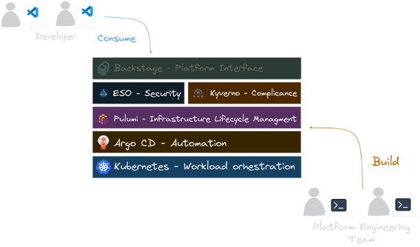

Pulumi: Navigating the Cloud Native Landscape

In today's rapidly evolving tech ecosystem, it's crucial for any tool to seamlessly integrate with the Cloud Native
Computing Foundation (CNCF) landscape. This vast array of technologies can seem overwhelming, but it presents immense
opportunities for innovation and efficiency in software delivery.

At Pulumi's Customer Experience Team, we specialize in guiding software infrastructure teams through their journey from
traditional delivery paradigms to Cloud Native approaches. We've observed that the adoption of an infrastructure as code
tool often serves as a catalyst for organizations to reassess their entire software delivery process. This reassessment
frequently leads to the implementation of more streamlined, automated, and secure methodologies.

While the CNCF landscape continues to expand with new tools emerging daily, we've identified recurring patterns in
successful Cloud Native transformations. Pulumi, as a versatile infrastructure as code platform, plays a pivotal role in
these patterns. It acts as a unifying force, enabling teams to leverage various CNCF technologies cohesively and
efficiently.

By embracing Pulumi and the wider CNCF ecosystem, organizations can create robust, scalable, and future-proof
infrastructure solutions. This approach not only enhances operational efficiency but also positions teams to readily
adopt and benefit from emerging Cloud Native technologies.

## One Reference Architecture: The `KEBAP` Stack

The `KEBAP` stack consists of the following components:

- **K**ubernetes (with Kyverno as a bonus)
- **E**xternal Secrets Operator
- **B**ackstage
- **A**rgo CD
- **P**ulumi

This combination forms a standardized GitOps stack applicable to various infrastructure projects. By implementing the
`KEBAP` stack, we've consistently reduced the time required for teams to establish development and production
environments from months to minutes.

To following along, we are going to use
the [capabilities of platforms](https://tag-app-delivery.cncf.io/whitepapers/platforms/#capabilities-of-platforms)
definition from the CNCF working group on Platforms.


## Let's Break It Down

Let's take a closer look at each component of the `KEBAP` stack and understand how they work together to streamline the
software delivery process.

The five layers of the `KEBAP` stack are designed to address different aspects of the software delivery process:

### Kubernetes


Kubernetes serves as the orchestration layer. It's now the dominant container orchestration platform across the
industry. Kubernetes provides a declarative framework for managing the infrastructure on which your applications will
run, ensuring that your application deployment configuration is fully automated and auditable.

### External Secrets Operator (ESO)


ESO addresses the challenge of securely managing secrets in Kubernetes. It integrates with various secret stores (such
as AWS Secrets Manager, HashiCorp Vault, Google Secrets Manager, Azure Key Vault) in a consistent way. This allows you
to configure access to the secret store once for all your required secrets, enhancing security and simplifying
management.

We even take it a step further by using ESO to manage the secrets from Pulumi ESC (External Secret Configurations) with
the [Pulumi Provider](https://external-secrets.io/latest/provider/pulumi/) for ESO. This way, we can manage the secrets
in the same way as the rest of the infrastructure,
ensuring that the secrets are managed in a secure and consistent manner across different environments.

To give the Pulumi Kubernetes Operator access to the secrets, we create following `ClusterSecretStore` object:

```yaml
apiVersion: external-secrets.io/v1beta1
kind: ClusterSecretStore
metadata:
  name: secret-store
spec:
  provider:
    pulumi:
      organization: <org>
      environment: <env>
      accessToken:
        secretRef:
          name: pulumi-access-token
          key: PULUMI_ACCESS_TOKEN
          namespace: argocd
```

And then we can define the `ExternalSecret` with all the secrets that we want to manage and pass to our Operator as
environment variables `extraEnv`:

```yaml
apiVersion: external-secrets.io/v1beta1
kind: ExternalSecret
metadata:
  name: pulumi-operator-secrets
spec:
  refreshInterval: 20s
  secretStoreRef:
    kind: ClusterSecretStore
    name: secret-store
  data:
  - secretKey: pulumi-access-token
    remoteRef:
      key: "backstage.pulumi-pat"
  - secretKey: do-token
    remoteRef:
      key: "backstage.do"
```

### Backstage


Backstage is an open platform for building developer portals. It provides a centralized place for managing software
catalogs, documentation, and tooling. This layer helps in organizing microservices and infrastructure, streamlining the
process for developers to create, manage, and explore services.

We also installed the [Pulumi plugin](https://github.com/pulumi/pulumi-backstage-plugin) for Backstage, which allows us
to manage our infrastructure as code directly from the Backstage UI. There are several ways to interact with the plugin.
If you want to use the scaffolding feature, you can add following `step` for example to your `Template` definition:

```yaml
apiVersion: scaffolder.backstage.io/v1beta3
kind: Template
metadata:
  name: kubernetes-template
  title: Kubernetes Cluster
  description: |
    A template for creating a new Kubernetes Cluster.
  tags:
  - pulumi
  - kubernetes
spec:
  steps:
  - id: pulumi-new-component
    name: Cookie cut the component Pulumi project
    action: pulumi:new
    input:
      name: "${{ parameters.component_id }}-infrastructure"
      description: ${{ parameters.description | dump }}
      organization: ediri
      stack: ${{ parameters.stack }}
      template: "https://github.com/my-silly-organisation/microservice-civo/tree/main/infrastructure-${{ parameters.cloud }}-${{ parameters.language }}"
      config:
        "node:node_count": "${{ parameters.nodeCount }}"
      folder: .
```

### Argo CD


Argo CD handles the deployment layer, ensuring that the current deployment matches what is declaratively defined in the
source. It's emerging as the de facto standard due to its rich front-end and powerful features. Argo CD implements the
GitOps model, continuously monitoring your Git repositories and automatically updating the deployed applications to
match the desired state.

### Pulumi


Pulumi manages the definition of the infrastructure. It allows you to use familiar programming languages to define your
infrastructure as code, providing more flexibility and power than traditional YAML or domain-specific languages. The
Pulumi Kubernetes Operator enables you to manage your infrastructure directly from within Kubernetes, offering seamless
integration with your existing Kubernetes workflows.

### Bonus: Kyverno



As a bonus, Kyverno can be used to enforce policies and automate security and operational best practices in Kubernetes
clusters. Kyverno is a policy engine designed for Kubernetes that allows you to define policies as code and enforce them
at runtime. This ensures that your Kubernetes clusters are secure and compliant with your organization's policies.

## Putting all the Pieces Together

The `KEBAP` stack fulfills the requirements of a robust GitOps implementation:

1. Kubernetes provides the 'declarative infrastructure' through its use of YAML to define the cluster configuration.
2. Applications run as immutable and versioned containers on these declaratively-defined clusters.
3. Argo CD serves as the GitOps 'agent', ensuring deployments match the defined state.
4. Pulumi provisions the supporting infrastructure and bootstraps the running application platform.
5. Backstage offers a developer portal for service management and discovery.
6. External Secrets Operator ensures secure and consistent secrets management across different environments.

All components are version-controlled in Git, ensuring auditability and traceability.

Let's see how we bootstrap the whole stack:

##### Ignite the Control Plane cluster with Pulumi


We use Pulumi code to create the control plane cluster in our cloud provider of choice. After the creation of the
control plane, we install the Argo CD in a very bare-bones way:

```typescript
const argocd = new ArgoCD("argocd", {
    initialObjects: initialObjects
}, {
    providers: {
        kubernetes: k8sProvider,
    },
});
```

The idea is to let then Argo CD fetch the rest of the configuration from the Git repository and apply it to the cluster.
And here comes the power of GitOps: It will also manage the Argo CD itself. This way, we separated the workload running
on the cluster from the creation of the cluster itself.

##### Ordering a new development Kubernetes cluster


We use Backstage to order a new development Kubernetes cluster. As we want to keep the costs low for development
cluster, we opted here for the [vCluster](https://www.vcluster.com/) project. The vCluster project allows us to create a
Kubernetes cluster on demand, which runs as containers on the control plane cluster. The moment the cluster is created,
we add it to the Argo CD as spoke cluster. This way, we can roll out applications to the development cluster in the same
way as we would do for production clusters.

##### Ordering a new production Kubernetes cluster


We use Backstage to order a new production Kubernetes cluster. This time, we use the Pulumi code to create the cluster
in the cloud provider of choice. After the creation of the cluster, we add it to the Argo CD as a production cluster.
This way, we can roll out applications to the production cluster in the same way as we would do for development
clusters.

##### Ordering Other Infrastructure


We use Backstage to order other infrastructure components, such as databases, message queues, and storage. We use again
the Pulumi Kubernetes Operator to create the infrastructure components in the Kubernetes cluster. This way, we can
manage all the infrastructure components in the same way as we manage the Kubernetes clusters.

## The End Result

The `KEBAP` stack results in a secure, automated, auditable, reproducible, and programmable set of
environments for building, testing, and operating software. This leads to significant cost savings by automating
processes that previously required manual intervention and substantial time investment.

The `KEBAP` stack also facilitates:

- Consistent environments across development, staging, and production
- Improved security through automated secret management and policy enforcement
- Faster onboarding for new team members
- Easier compliance with regulatory requirements due to increased auditability

If you're interested in real-world applications of the `KEBAP` stack, we have numerous case studies and examples to
share.
Feel free to reach out for more information on how this approach can benefit your organization.
