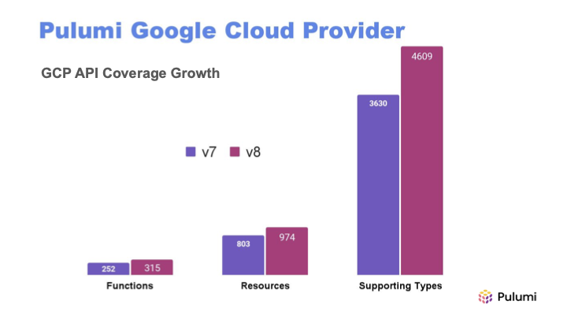

The latest major release of the Pulumi Google Cloud Provider is available now!
Our 8.0 release contains the [latest upstream changes](https://github.com/hashicorp/terraform-provider-google/releases/tag/v6.0.0) to keep you up-to-date along with the latest features and improvements from Pulumi.

The Pulumi Google Cloud provider can be used to provision any of the Google Cloud resources available in the upstream provider.
The provider is open source and available on GitHub so you can always follow along with current issues and developments, or even open your first pull request.

<!--more-->

Here are a few links to help you get started if you are new to Pulumi:

- [Getting Started](https://www.pulumi.com/docs/iac/get-started/gcp/) - A guided walkthrough for creating your first project
- [Setup & Install](https://www.pulumi.com/registry/packages/gcp/installation-configuration/) - Instructions on installing the Google Cloud provider
- [How-to guides](https://www.pulumi.com/registry/packages/gcp/how-to-guides/) - Learn how to use the Google Cloud provider to provision specific resources
- [Templates](https://www.pulumi.com/templates/serverless-application/gcp/) - Use a quickstart template to create a new project
- [Pulumi AI](https://www.pulumi.com/ai) - Ask Pulumi AI to create a new project

## Looking Back

Since the last major release of this provider, we have continuously shipped improvements to our ecosystem, bringing the latest Pulumi features to your production stack.
We have rolled out an [improved diffing strategy](https://github.com/pulumi/pulumi-terraform-bridge/issues/1785) and [fixed state upgrades](https://github.com/pulumi/pulumi-terraform-bridge/pull/2081) in the Pulumi Terraform Bridge, removing spurious diffs on preview and increasing confidence when deploying.
Additionally we have improved accuracy and coverage for registry documentation, via [better example conversion](https://github.com/pulumi/pulumi-gcp/pull/1266) and [general docs improvements for bridged providers](https://github.com/pulumi/pulumi-terraform-bridge/issues/1794).

### New Modules

Over the last year, we have added support for several new modules. Among these are:

- [App Hub](https://www.pulumi.com/registry/packages/gcp/api-docs/apphub/)
- [Application Integration](https://www.pulumi.com/registry/packages/gcp/api-docs/applicationintegration/)
- [Blockchain Node Engine](https://www.pulumi.com/registry/packages/gcp/api-docs/blockchainnodeengine/)
- [Cloud Quota](https://www.pulumi.com/registry/packages/gcp/api-docs/cloudquota/)
- [Discovery Engine](https://www.pulumi.com/registry/packages/gcp/api-docs/discoveryengine/)
- [Edge Container](https://www.pulumi.com/registry/packages/gcp/api-docs/edgecontainer/)
- [Integration Connectors](https://www.pulumi.com/registry/packages/gcp/api-docs/integrationconnectors/)
- [Managed Kafka](https://www.pulumi.com/registry/packages/gcp/api-docs/managedkafka/)
- [Migration Center](https://www.pulumi.com/registry/packages/gcp/api-docs/migrationcenter/)
- [Netapp](https://www.pulumi.com/registry/packages/gcp/api-docs/netapp/)
- [Parallelstore](https://www.pulumi.com/registry/packages/gcp/api-docs/parallelstore/)
- [Privileged Access Manager](https://www.pulumi.com/registry/packages/gcp/api-docs/privilegedaccessmanager/)
- [Secure Source Manager](https://www.pulumi.com/registry/packages/gcp/api-docs/securesourcemanager/)
- [Security Posture](https://www.pulumi.com/registry/packages/gcp/api-docs/securityposture/)
- [Site Verification](https://www.pulumi.com/registry/packages/gcp/api-docs/siteverification/)
- [Workbench](https://www.pulumi.com/registry/packages/gcp/api-docs/workbench/)

### API Coverage Growth

The below chart shows the growth of this provider by resource, function, and supporting types since Version 7.

## What’s New in 8.0

### Added Deletion Protections

Several resources have new `deletionProtection` fields:

- gcp.cloudrunv2.Service
- gcp.cloudrunv2.Job
- gcp.activedirectory.Domain
- gcp.organizations.Folder
- gcp.organizations.Project

Find the documentation for any of these resources in our [registry](https://pulumi.com/registry/packages/gcp)

### New default provisioning label

A new default label, `goog-pulumi-provisioned` lets you discover your Pulumi-provisioned resources in the GCP console
to help you track resources and how they were created.
This label is available as an Output only and can be disabled in your provider configuration.

### Upgrading

You can find our v7 -> v8 Migration Guide [on the Pulumi Registry](https://www.pulumi.com/registry/packages/gcp/how-to-guides/8-0-migration/).
