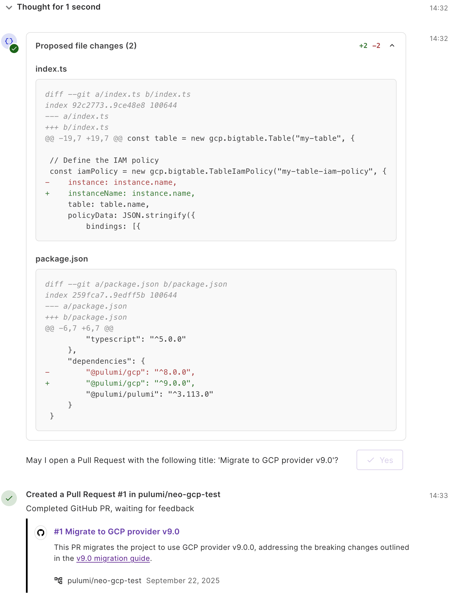
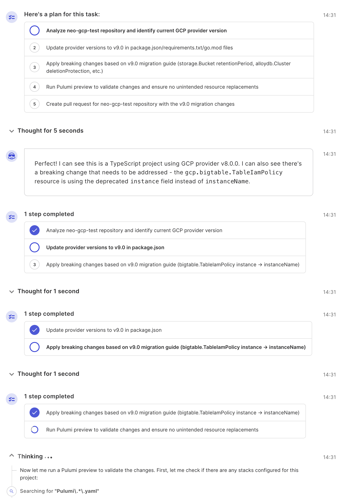

We're excited to announce the v9 release of the Pulumi Google Cloud Provider!
This major release contains important updates to Google Cloud resources and functions, and keeps you up to date with what's new from Pulumi.

The Pulumi Google Cloud provider can be used to provision any of the Google Cloud resources available in the upstream provider.
The provider is open source and available on GitHub so you can be part of the community - issues and pull requests are always welcome!

<!--more-->

Here are a few links to help you get started if you are new to Pulumi:

- [Getting Started](https://www.pulumi.com/docs/iac/get-started/gcp/) - A guided walkthrough for creating your first project
- [Setup & Install](https://www.pulumi.com/registry/packages/gcp/installation-configuration/) - Instructions on installing the Google Cloud provider
- [How-to guides](https://www.pulumi.com/registry/packages/gcp/how-to-guides/) - Learn how to use the Google Cloud provider to provision specific resources
- [Templates](https://www.pulumi.com/templates/serverless-application/gcp/) - Use a quickstart template to create a new project
- [Pulumi Neo](https://www.pulumi.com/product/neo/) - Ask Pulumi Neo to help you with your project

## In Case You missed It - New Modules

Throughout the past year, we have worked to keep this provider in sync with the upstream provider.
Notable new modules are those supporting AI and Google Gemini.
New modules added since the last major release include:

- [Chronicle](https://www.pulumi.com/registry/packages/gcp/api-docs/chronicle)
- [Colab](https://www.pulumi.com/registry/packages/gcp/api-docs/colab)
- [Contact Center Insights](https://www.pulumi.com/registry/packages/gcp/api-docs/contactcenterinsights)
- [Developer Connect](https://www.pulumi.com/registry/packages/gcp/api-docs/developerconnect)
- [Gemini](https://www.pulumi.com/registry/packages/gcp/api-docs/gemini)
- [Lustre](https://www.pulumi.com/registry/packages/gcp/api-docs/lustre)
- [Model armor](https://www.pulumi.com/registry/packages/gcp/api-docs/modelarmor)
- [Oracle Database](pulumi.com/registry/packages/gcp/api-docs/oracledatabase)
- [Parameter Manager](https://www.pulumi.com/registry/packages/gcp/api-docs/parametermanager)
- [Transcoder](https://www.pulumi.com/registry/packages/gcp/api-docs/transcoder)

## What's New in 9.0

### Upstream Improvements

This release includes the latest improvements and changes from the [recent major version in the upstream provider](https://github.com/hashicorp/terraform-provider-google/releases/tag/v7.0.0).
Some themes are:

#### Improved Import Validation

Multiple resources throughout the provider have improved validation and error messages to ensure the supplied GCP resource ID matches import formats specified in the documentation.

#### Increased field validation

Several resource fields have been updated to reflect requirements of Google Cloud and will fail validation if not configured correctly, to avoid failures later on.
Refer to the [migration guide for details.](https://www.pulumi.com/registry/packages/gcp/how-to-guides/9-0-migration/)

### Documentation Improvements

We are always working on improving and updating our documentation.
Among other improvemetns, this release adds 100 new top-level overview descriptions for resources and functions.

### Upgrading

You can find the [migration guide on the Pulumi registry.](https://www.pulumi.com/registry/packages/gcp/how-to-guides/9-0-migration/)

### NEW! Use Pulumi Neo to assist with your upgrade

You can use our new automation agent, [Neo](https://www.pulumi.com/docs/pulumi-cloud/neo/), to help you with your provider upgrade.
In the Pulumi service, ask Neo to help you with your upgrade by providing the migration guide:

Neo will look at the provided migration guide and your stack, and determine a plan of action.
Here, Neo has discovered there were some breaking changes, needing updates to your program.

And finally, Neo can open a pull request with the proposed changes to your code.

