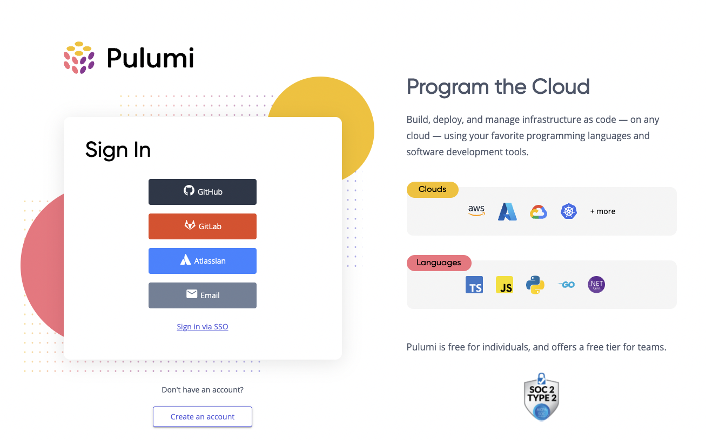

What is user experience, or UX? There are plenty of answers depending on who you ask. At the core, UX is about asking questions and solving problems.

<!--more-->

## Who we are

Here at Pulumi, our UX team asks questions for and about developers. Our purpose is to understand the Pulumi user and do right by them. We come into conversations as user advocates on the lookout for stumbling blocks.

We are a cross-disciplinary UX team. Our designers define and imagine new experiences. Our dedicated UX engineer brings them to life. Collaboration affords us a dual-perspective on every problem. It also empowers us to make the changes we want to see. Together, our team adds value across Pulumi's CLI, Service, marketing website, Docs, and Registry.

Some of the principles that matter most to us:

- Community nurture
- There are infinite ideas and not always a "right" answer
- People are more important than tech

## What we do

Sometimes our UX projects are as small as clarifying navigation options. Other times, they're as large as exploring the future vision of the Pulumi Service Console. No matter what we're working on, we're always thinking about who we're designing for. We optimize how users flow through our product. We reduce friction anywhere we can. In the end, our users can feel more confident using Pulumi.

Since the new year, our team has grown from one to four. Recently, we opened a [new role for a second UX engineer](https://boards.greenhouse.io/pulumicorporation/jobs/4845321003)! Our team expects to scale alongside Pulumi and continue to put people first.

## Where you've seen us

You’ll find the UX team's work everywhere. Maybe you noticed the revamped pricing page following our [Business Critical launch](https://www.pulumi.com/blog/business-critical-launch/).

Or maybe you clicked into our improved sign-in experience in Pulumi Service.

In truth, some of the best UX improvements are invisible. We aim to build experiences that feel so natural, they never break your stride. But should you have trouble, we're here to help.

You can check out our [public GitHub repo](https://github.com/pulumi/user-experience) if you ever have a UX issue to report. There, you can also read more about our team members and our quarterly plans. If GitHub isn't your style, we also frequent Pulumi's [community Slack channel](https://slack.pulumi.com/).

Pulumi's UX team is always ready to make an impact, and we hope you'll stick around to, quite literally, experience it. Look out for more blog posts from our team moving forward!
