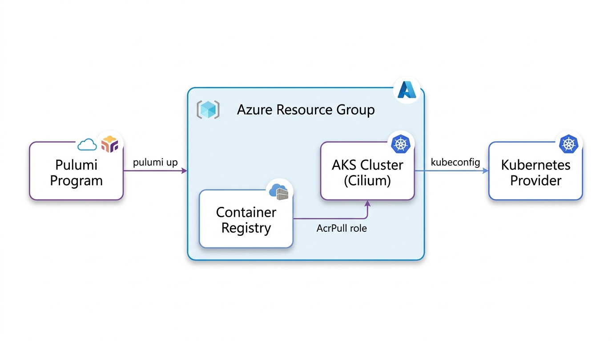
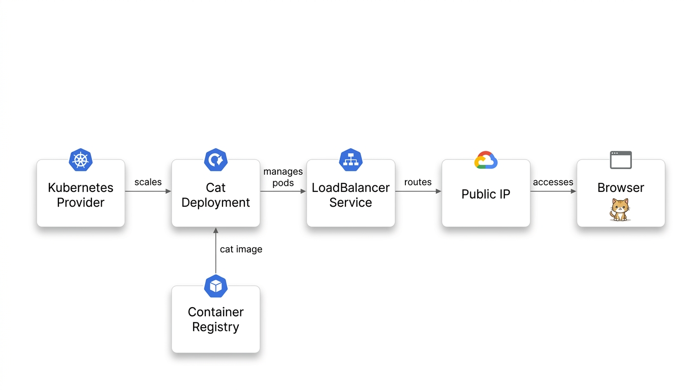
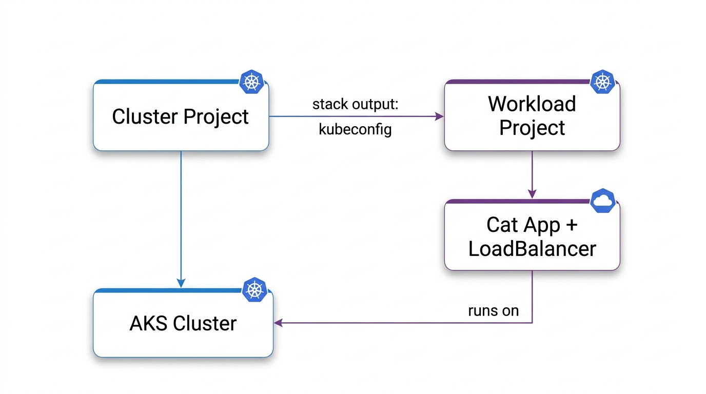
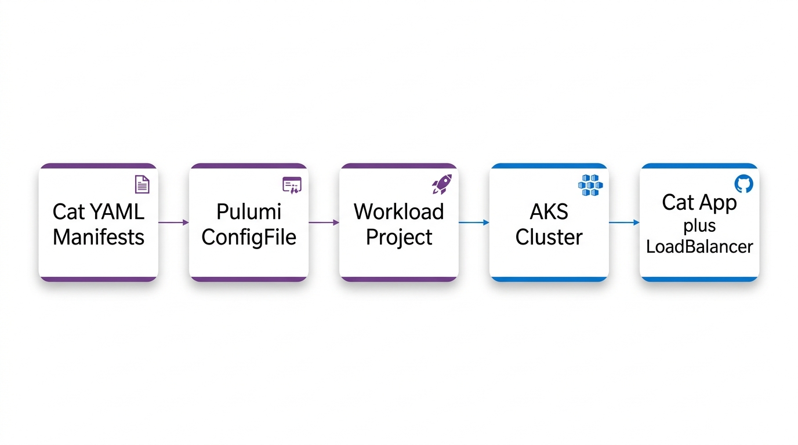

*On June 10th, Engin and I ran a live workshop building an AKS cluster, an Azure Container Registry, and a random-cat web app from scratch in C#. This is the writeup, including the parts we didn't get to live.*



<!--more-->

Live demos keep you honest. On June 10th my AKS workshop went a little sideways. Partway through, Docker Hub rate-limited my image pull and we had to adapt the content on the fly. The original plan was to stand up an AKS cluster with Cilium, an Azure Container Registry with the cluster's pull permission wired in code, and a random-cat web app, then split the infrastructure from the workload into separate Pulumi stacks. Live, we didn't make it through all of that, but we had some fun tangents and it turned out to be a great session. So here are my six recommendations for working with Kubernetes on Azure from this recent workshop.

## 1. Pick the language your team already uses

I opened the session by asking the room what language they prefer to work in, with one caveat from me: "Hopefully, it's not PowerShell because this is not in PowerShell." We got some C# answers and zero requests for PowerShell, which works out, because the whole workshop is in ~~PowerShell~~ C#.

I chose C# because, first, I genuinely love the language. I spent the early part of my career as a C# developer, and on Azure it just makes sense. Second, an Azure workshop tends to draw a big turnout of C# devs, and if they aren't C# devs themselves, they often work somewhere the backend team uses C#. Pulumi lets you bring that language to your infrastructure rather than learn a new DSL.

AI coding assistants also came up. LLMs have substantially more C# and Go in their training data than HCL or Bicep. As I put it live: "If you're working in HCL, well, there's not that much out there in the training set, but there's lots of C#. There's lots of Go." I co-authored parts of the workshop code with Claude.


**Pick the language your team already writes.**

Pulumi runs on the language your backend engineers know, and that language has more AI assistant training data behind it too.


## Aside: everyone's path ran through Docker Swarm

We also had some fun historical conversations about orchestrators. I asked Engin: "Did you use anything before Kubernetes became popular? Like Mesosphere or any of those other interesting solutions of the heyday?"

Engin had walked the same road most of us did.

> **Engin:** "We used the classical Ansible powered provisioning of VMs... And then we switched to Consul to have a little bit more control... And then we had a short intermezzo with Docker Swarm... So Docker Swarm with Portainer was really goated. And Kubernetes then took over."

My own history rhymed with his.

> **Adam:** "I worked at a place where we used a bunch of shell scripts to have like JVM services, like a red green deploy... And then it was Docker Swarm for a little bit. And then it was Kubernetes."

No single tool won. Teams picked what fit their existing skills and shifted gradually as the ecosystem matured.

## 2. Use Cilium on AKS if you can

By default, Kubernetes on AKS doesn't turn on Cilium. My strong recommendation is to turn it on. The option is called Azure CNI Powered by Cilium, and it takes one config block:

```csharp
NetworkProfile = new ACI.ContainerServiceNetworkProfileArgs
{
    NetworkDataplane = "cilium",
    NetworkPlugin = "azure",
    NetworkPluginMode = "overlay",
    NetworkPolicy = "cilium",
    PodCidr = "192.168.0.0/16",
},
```

This buys you eBPF networking instead of kube-proxy and iptables. [eBPF](https://ebpf.io/what-is-ebpf/) lets you run sandboxed programs inside the Linux kernel itself, so packet handling and `NetworkPolicy` enforcement happen down in the kernel instead of up in userspace. You also get Hubble flow visibility built in, the same technology as GKE's Dataplane V2. As I said live, "this is very easy to set up on Azure. You just network data plane, set it to Cilium. Network policy, set it to Cilium."

Self-hosted, Cilium is `helm install cilium` with a dozen flags and a lifecycle you own forever. On AKS, it's these five lines and Azure runs it. On a getting-started cluster, I'll take the managed version every time. Owning that lifecycle yourself buys you nothing here.

Full code: [`01-cluster/Program.cs`](https://github.com/pulumi/workshops/blob/main/az-getting-started-aks/01-cluster/Program.cs)




**On managed Kubernetes, complexity you'd self-host becomes a field you set.**

AKS gives you the managed version of eBPF networking. Pulumi makes the configuration code instead of portal clicks.


## 3. Debugging Kubernetes is easier when your tools have the full context

The rate limit wasn't even the first failure of the hour. That honor went to Azure, which refused to provision the cluster on the first `pulumi up`. I was running in Canada Central, and Pulumi Neo read the error and diagnosed it:

> **Neo:** "Capacity constraints in the selected region. We might need to change our location."
>
> **Adam:** "Maybe this Canadian Azure instance is not all it's cracked up to be."
>
> **Engin:** "East US is always a good bet."

We switched the region to East US, and the cluster came up. That is the kind of diagnosis a stack-aware assistant is good at, reading the actual provisioning error instead of leaving me to guess.

Then the image step hit. The workshop's original flow pulled the cat app image into ACR with `az acr import --source docker.io/agbell/my-random-cat`, and Docker Hub rate-limited me, even though I was the only person in the room running the code. So how do you blow through an anonymous pull limit all by yourself? The trick is that `az acr import` runs server-side. Azure does the pull from Docker Hub, not my laptop, and it goes out over an egress IP shared by who-knows-how-many other Azure tenants. Docker Hub counts anonymous pulls per IP address, so all of that shared traffic lands in one bucket. It flagged me at the worst possible moment: "I just got flagged by Docker Hub. That is awesome. That will be a challenge for this demo."

Nothing focuses a workshop like watching your own demo get rate-limited in front of a live audience.

Live, I asked Neo to route around it: "we're using Neo. And Neo is going to switch us out to a nice Hello World project." Neo could see the whole stack, down to the failing image reference, and it swapped the workload over to a standard hello-world image hosted on Azure, so the deploy no longer depended on Docker Hub. A few minutes later: "we should have a Hello World container running here. It's way less fun than my image... just a bunch of random cats. But here we can see that this is working." I won't oversell it. The cat was gone, and we didn't get through every planned stage. But the cluster was up with a workload deployed, and the session kept moving.

That's the case for a stack-aware assistant over a chatbot. A general chatbot can tell you that Docker Hub has rate limits and that you should host images closer to home. Neo was working with the actual program state, so the workaround it proposed was already wired to my resources. Engin put it this way: "for me, Pulumi Neo, the subcommand is the new Pulumi app." When something breaks mid-demo, the tool that can read your stack is the one that helps.

The long-term fix was switching to `az acr build`, building the image in ACR from source, so the app image never has to come from Docker Hub at all. Every stage in the repo now builds the cat image this way, from source shipped in each stage's `app/` folder:

```bash
az acr build --registry <your-acr> --image my-random-cat:latest app
```

No local Docker, and the app image never touches Docker Hub. The only Docker Hub dependency left is the base image (`python:3.9-slim`), pulled server-side by ACR's build instead of by an import you re-run every time.

Full code: [`02-app/Program.cs`](https://github.com/pulumi/workshops/blob/main/az-getting-started-aks/02-app/Program.cs)




**An assistant that can read your stack beats one that can't.**

A general chatbot knows Docker Hub has rate limits. Neo could see the deployment and the failing image reference, and that context is what turned advice into a working fix mid-session.


## 4. You don't have to abandon Terraform to start

One attendee, Martin, had been using Terraform for eight-plus years. His question, put directly: "I'm using TF for eight plus years. Why should I consider Pulumi? Where is the strength?... It seems unnecessary to TF for me. At least from what I'm seeing now."

Fair question, and the honest answer is you don't have to abandon your modules. Pulumi has [first-class Terraform module support](/docs/iac/guides/building-extending/using-existing-tools/use-terraform-module/), so you can reference existing modules from a Pulumi program. Python ML teams can import infrastructure modules, and platform teams can wrap them in typed abstractions. The portfolio doesn't change. The programs that use it just get more capable.

The sharper reason is about edges. HCL and Bicep are purpose-built DSLs, and when you hit what they can't express, there's no escape hatch inside the language. With a general-purpose language you can always drop to the SDK or shell out. The edges still exist. They're just further out, and that's the whole difference once a project gets past the basics.


**You don't have to rip and replace.**

Pulumi can reference existing Terraform modules. Move what makes sense now. The DSL/language tradeoff shows up at the edges, not the basics.


## 5. Split slow infrastructure from fast workloads

Once we had the cluster up and the app running, the single program had grown: cluster, ACR, `AcrPull`, image build, deployment, service. Every new workload meant editing the file that also declares the cluster. We had planned this turn in the session in advance. I posed the problem and Engin had the recommendation ready:

> **Adam:** "What do you think the problem is with my code here, Engin? ... The problem is like every time I want to add a new service to my Kubernetes cluster, I have to go into this file that declares the cluster and all its infrastructure. I think I would prefer to split it."
>
> **Engin:** "Create other stacks which are then referencing each other to get the values out. Actually, I highly recommend."
>
> **Adam:** "Yes, I totally agree with you, Engin. We should split these out into two separate stacks."

So that's what we did. The infrastructure stack exports the kubeconfig and registry URL. The workload stack references those outputs via [`StackReference`](/docs/iac/concepts/stacks/#stackreferences). The slow-moving infra and the fast-moving app become independent deployment units. The infra team and the app team can ship on their own cadences, without fighting over one file.

```csharp
// workload/Program.cs — pulls cluster outputs, never touches cluster resources
var clusterStack = new StackReference(cfg.Require("clusterStack"));
var kubeconfig = clusterStack.GetOutput("kubeconfig");
var acrLoginServer = clusterStack.GetOutput("acrLoginServer");
```

The tricky part is one we didn't cover live, which is how you split a running workload without taking down the running services. The real answer is migrating the stack state, moving resources between stacks instead of destroying and recreating them. As I noted in the session: "now we are just removing the service from our project. If this was actual production stuff, I don't think I'd be just shutting down the service... You can actually just make changes to the state rather than tearing them down."

For the workshop, a simpler move kept the Kubernetes cluster up and the demo moving: keep the project name. Pulumi identifies stacks as `org/project/stack`, so if you move the cluster code into `aks-cluster/` while keeping the project name `kube-kitties`, Pulumi still sees `org/kube-kitties/dev`. Same stack, nothing recreated. Rename the project and you get a second cluster.

In stage four of the demo, I showed how to extend this pattern to work with existing YAML manifests: [`ConfigGroup`](/registry/packages/kubernetes/api-docs/yaml/configgroup/) drives raw Kubernetes YAML through the Pulumi provider, giving you previews and dependency ordering without rewriting files. One transformation swaps the Docker Hub image reference for the ACR copy, so manifests stay portable and pods pull from your private registry.

Code: [`03-split/`](https://github.com/pulumi/workshops/tree/main/az-getting-started-aks/03-split) and [`04-split-yaml/`](https://github.com/pulumi/workshops/tree/main/az-getting-started-aks/04-split-yaml)






**Keep the project name when you split, and the cluster doesn't move.**

Pulumi identifies stacks as `org/project/stack`. Same project name means the same stack. Rename it and you spin up a new cluster.


## 6. GitOps is the way

The final stage of the workshop is left as homework, and it's a great one to pick up. GitOps is the standard way to run Kubernetes at this point, the One True Way™ depending on who you ask. My position from the call: "I think I'm on team GitOps."

The take-home is the [`05-gitops`](https://github.com/pulumi/workshops/tree/main/az-getting-started-aks/05-gitops) folder. We didn't demo it live, but the code is real and verified: Pulumi stands up the cluster, installs Argo CD, and registers the cat as an Argo `Application`. From there, changes are `git push`.

To see Kubernetes and GitOps worked through end to end, watch the video above. Engin also recently ran a [GCP workshop](https://github.com/pulumi/workshops/tree/main/getting-started-with-kubernetes-google-cloud) with great examples of GitOps with Pulumi, using Flux.


**Let Pulumi stand up the cluster, then let GitOps run the apps.**

Pulumi installs Argo CD or Flux as part of the infrastructure. From there, workload changes are a `git push`. Stage 5 of the workshop repo is a complete Argo CD example.


## Try it yourself

That's the whole workshop, six recommendations and two live failures that ended with a cat app running on AKS. To run it yourself, clone the repo. There's a [DEMO.md](https://github.com/pulumi/workshops/blob/main/az-getting-started-aks/DEMO.md) with every step of this session, and the stage folders mirror the arc above. `01-cluster` is the infrastructure checkpoint, `02-app` adds the cat app built into your own registry, `03-split` and `04-split-yaml` separate infrastructure from workload, and `05-gitops` is the homework.

Pick a stage and bring it up:

```bash
git clone https://github.com/pulumi/workshops
cd workshops/az-getting-started-aks/02-app
pulumi up
curl http://$(pulumi stack output catServiceIp)/
```

Expect 5 to 8 minutes waiting on cluster create. That's just how long AKS takes. And since each folder is a complete, runnable checkpoint with its own stack, run `pulumi destroy` before moving to the next stage, or you'll have several clusters billing at once.

You'll need an Azure subscription, the Pulumi CLI, and the .NET SDK. Basic Kubernetes familiarity helps. For more on the building blocks, see the [Azure Native provider](https://www.pulumi.com/registry/packages/azure-native/) and the [Kubernetes provider](https://www.pulumi.com/registry/packages/kubernetes/) in the Pulumi Registry.

The full workshop code lives at [github.com/pulumi/workshops](https://github.com/pulumi/workshops) under `az-getting-started-aks`. Check out our upcoming sessions on the [workshop page](https://www.pulumi.com/events/), or subscribe to the newsletter to hear what's coming up.

If there's a seventh recommendation hiding in here, it's the one I learned the hard way: never pull from Docker Hub live again. I'll be keeping my images on a paid cloud registry from now on.

Engin and I will be doing more of these, and we'd love to see you at the next one.

*Parts of the workshop code were authored by Claude and Pulumi Neo, and parts of this writeup got help from both as well.*
