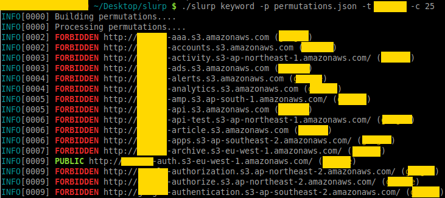

Modern applications have brought many benefits and improvements, including the ability to scale and rapid iterations to update software. However, this has come at the cost of complexity. Modern infrastructure is composed of many resources that require detailed configuration to work correctly and securely. Even managed solutions from cloud service providers need additional configuration to ensure that services are secure and free of defects. Cloud providers, such as AWS, do allow you to create policies to ensure that applications are secure, but they are specific to resources that are already deployed. A significant benefit of Policy as Code is the ability to verify and spot problems before deploying your infrastructure.

<!--more-->

## Leaky Buckets

What do many of the most innovative companies in the modern cloud era have in common? They’ve all had massive data breaches from leaky AWS S3 Buckets.  One of the most common reasons for data breaches is misconfigured AWS S3 Buckets. Both security professionals and bad actors use tools such as slurp to find open S3 buckets by just entering a domain, keyword, or even AWS credentials with the slurp CLI. Ideally, we want to proactively prevent public access to our S3 buckets before they are created.



Pulumi's CrossGuard helps customers adhere to security best practices by checking the final state of a deployment against a set of policies and revealing any non-compliant services. CrossGuard is an SDK for writing policies for services, and it includes best practices playbooks for cloud providers such as AWS, Azure, and Google Cloud Platform. The [Getting Started with PaC]() covers the case of leaking S3 buckets, but let’s do a quick review with an example showing how we can detect a leaky bucket before it gets deployed.

> Note: If you haven’t installed Pulumi, follow the [Pulumi Getting Started]()
Start by creating an S3 bucket with Pulumi.

```bash
$ pulumi new aws-typescript
```

 Running `pulumi new` creates the project files as well as the code to create a single S3 bucket. We’ll use an S3 ACL to make the bucket public by setting it to the [canned ACL `public-read`](https://docs.aws.amazon.com/AmazonS3/latest/dev/acl-overview.html#canned-acl).

```ts
const bucket = new aws.s3.Bucket("my-bucket", {
    acl: "public-read",
});
```

Next, we’ll create a Policy Pack, by creating a directory and making it the current working directory.

```bash
$ mkdir policypack && cd policypack
```

CrossGuard is still in *preview*, and we need to set the environmental variable `PULUMI_EXPERIMENTAL` to use it. We can prepend it before creating the policy.

```bash
$ PULUMI_EXPERIMENTAL=true pulumi policy new aws-typescript
```

By default, this creates a policy that checks to see if the ACL sets the bucket to be publically accessible.

```ts
new PolicyPack("aws-typescript", {
    policies: [{
        name: "s3-no-public-read",
        description: "Prohibits setting the publicRead or publicReadWrite permission on AWS S3 buckets.",
        enforcementLevel: "mandatory",
        validateResource: validateResourceOfType(aws.s3.Bucket, (bucket, args, reportViolation) => {
            if (bucket.acl === "public-read" || bucket.acl === "public-read-write") {
                reportViolation(
                    "You cannot set public-read or public-read-write on an S3 bucket. " +
                    "Read more about ACLs here: https://docs.aws.amazon.com/AmazonS3/latest/dev/acl-overview.html");
            }
        }),
    }],
});
```

A policy consists of a name; a description that is displayed when the policy is violated; an enforcement level of either `advisory` or `mandatory`; and `validateResource` which specifies the type of resource, the resource, any arguments, and the message to report the violation.

We can test this locally using `pulumi preview`

```bash
$ PULUMI_EXPERIMENTAL=true pulumi preview --policy-pack <path-to-policy-pack-directory>
```

The preview will fail and return this output:

```bash
Diagnostics:
  pulumi:pulumi:Stack (test-dev):
    error: preview failed

  aws:s3:Bucket (my-bucket):
    mandatory: [s3-no-public-read] Prohibits setting the publicRead or publicReadWrite permission on AWS S3 buckets.
    You cannot set public-read or public-read-write on an S3 bucket. Read more about ACLs here: https://docs.aws.amazon.com/AmazonS3/latest/dev/acl-overview.html
```

CrossGuard validated the desired state of the S3 bucket against the `no-public-read` policy stopped the preview. If we were deploying the S3 bucket, it would stop the deployment until the policy is met.

## Exposed Databases

Like S3 buckets, exposed services are another source of data breaches. Misconfigured databases, failing to set passwords, or dev services open to the public are responsible for releases of Personal Identifiable Information (PII) that range well into the millions of customers. Many of these breaches were due to misconfigured Elasticsearch instances that were public and not secured with a password, such as the recent exposure of a [Microsoft customer service database](https://siliconangle.com/2020/01/22/microsoft-exposes-250m-customer-service-records-via-misconfigured-elasticsearch-database/).

We’ll take the same approach that we used to secure S3 buckets. First, we'll create an Elasticsearch deployment, write a policy, then apply it.

```bash
$ pulumi new aws-typescript
```

Replace `index.ts` with the following to deploy Elasticsearch:

```ts
import * as pulumi from "@pulumi/pulumi";
import * as aws from "@pulumi/aws";

const example = new aws.elasticsearch.Domain("example", {
   clusterConfig: {
       instanceType: "r4.large.elasticsearch",
   },
   elasticsearchVersion: "1.5",
   snapshotOptions: {
       automatedSnapshotStartHour: 23,
   },
   tags: {
       Domain: "TestDomain",
   },
});
```

In this example, we’ll use [AWSGuard](), which is a set of best practice policies for AWS. First, create a directory, change into it, and create a new policy.

```bash
$ mkdir awsguard && cd awsguard
$ PULUMI_EXPERIMENTAL=true pulumi policy new awsguard-typescript
```

The default policy enforcement level is `advisory,` but given the frequency of misconfigured Elasticsearch deployments, we’ll set to `mandatory`.

```ts
new AwsGuard({ all: "mandatory" });
```

When we run `pulumi preview` with the AWSGuard PolicyPack, we can see how it triggers violations based on best practices that can prevent data exposure.

```bash
$ PULUMI_EXPERIMENTAL=true pulumi preview --policy-pack ../awsguard/
Previewing update (dev):

     Type                         Name               Plan       Info
 +   pulumi:pulumi:Stack          elasticsearch-dev  create     1 error
 +   └─ aws:elasticsearch:Domain  example            create     2 errors

Diagnostics:
  pulumi:pulumi:Stack (elasticsearch-dev):
    error: preview failed

  aws:elasticsearch:Domain (example):
    mandatory: [elasticsearch-encrypted-at-rest] Checks if the Elasticsearch Service domains have encryption at rest enabled.
    Elasticsearch domain example-5510ef8 must be encrypted at rest.
    mandatory: [elasticsearch-in-vpc-only] Checks that the Elasticsearch domain is only available within a VPC, and not accessible via a public endpoint.
    Elasticsearch domain example-5510ef8 must run within a VPC.


Policy Packs run:
    Name                           Version
    pulumi-awsguard (../awsguard)  (local)

Permalink: https://app.pulumi.com/spara/elasticsearch/dev/previews/bb6df58f-69aa-485a-99a4-d076bc067b84
```

AWSGuard flagged two recommended Elasticsearch best practices, encryption and deploying only within a VPC and not publically. By enabling encryption at rest, unauthorized users cannot read data in Elasticseach clusters, storage, indices, and log files. By enabling Elasticsearch’s built-in encryption, your deployment follows recommended practices that comply with [HIPAA](https://aspe.hhs.gov/report/health-insurance-portability-and-accountability-act-1996) and [GDPR](https://eugdpr.org/). AWS VPCs can keep the network traffic between your applications and Elasticsearch cluster within your infrastructure’s network and not over the public internet. Isolating Elasticsearch within your infrastructure can help mitigate the likelihood of data exposure.

## CrossGuard available in Pulumi 2.0

The examples in this article demonstrate how to avoid common security pitfalls experienced by even large organizations. We’ve looked at the out of the box capability of CrossGuard by securing an S3 bucket and showed how best practices encoded in AWSGuard can warn of common configuration errors before deploying infrastructure. These examples provide a preview of how IaC can improve deployments by keeping your infrastructure secure.

As mentioned previously, CrossGuard is currently a technology preview. It will be GA with the release of Pulumi 2.0 with even more features, such as [OPA](https://www.openpolicyagent.org/) integration, and more policy packs. We invite you to try it out and send us feedback either through [Github issues](https://github.com/pulumi/pulumi-policy) or on the [Pulumi Community Slack Channel](https://slack.pulumi.com/).
