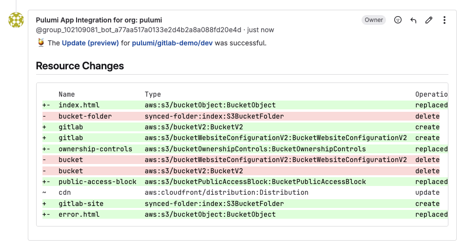

Pulumi's integration with GitLab has reached new heights with enhancements designed to streamline your infrastructure as code workflows. Today, we're excited to announce several significant improvements to our GitLab integration that make managing cloud infrastructure with Pulumi and GitLab more seamless than ever before: GitLab as a first-class VCS in Pulumi Cloud, enhanced merge request comments, organizational templates in GitLab, and later this year, Pulumi Deployments for GitLab.

<!--more-->

Pulumi and GitLab have long enjoyed a productive partnership. From supporting GitLab sign-in to enabling GitLab CI/CD pipelines for infrastructure deployments, we've consistently worked to ensure GitLab users can leverage Pulumi's powerful infrastructure as code capabilities within their existing workflows.

Our GitLab Merge Request integration allows teams to visualize infrastructure changes directly within merge requests, making code reviews more effective and infrastructure changes more transparent.

## What's New in Our GitLab Integration

### Enhanced Merge Request Comments

We've revamped how Pulumi interacts with GitLab merge requests by building a Gitlab application to handle the authentication. Previously, only customers using Gitlab as an identity provider to Pulumi Cloud could leverage it. Now, Pulumi provides even more detailed and actionable comments on your merge requests, giving reviewers comprehensive insights into proposed infrastructure changes.

These comments include:

- Streamlined discoverability of infrastructure changes
- Resource-by-resource breakdown of changes
- Direct links to the Pulumi Console for deeper analysis

To configure this integration:

1. Navigate to **Organization Settings → Integrations** in Pulumi Cloud
2. Select GitLab and enter your access token
3. Choose which projects or groups should receive Pulumi comments

### GitLab as a First-Class VCS in Pulumi Cloud

Version control system is now a first-class, configurable concept in Pulumi Cloud. When you select GitLab as your VCS, the Pulumi Cloud interface adapts to show only relevant options and terminology, creating a more intuitive experience for GitLab users.

This integration enables:

- Direct linking to GitLab repositories, branches, and commits
- Automatic detection of Pulumi projects in GitLab repositories
- Streamlined setup for GitLab-based CI/CD workflows, using the CI/CD wizard on a stack's page

### Organizational Templates in GitLab

Pulumi Cloud now fully supports organizational templates stored in GitLab repositories. This powerful feature allows platform teams to define standardized infrastructure templates that developers across the organization can easily discover and use.

Once a GitLab repository is registered as a template source, Pulumi automatically detects `pulumi.yaml` files and surfaces them in the template gallery. These templates can be:

- Public or private repositories
- Subject to Pulumi's role-based access control (RBAC)
- Available in both the UI and CLI via `pulumi new`

This integration makes it easier than ever to standardize infrastructure patterns across your organization while leveraging GitLab for version control and collaboration.

## Coming Soon: Pulumi Deployments for GitLab

We're also hopeful that [Pulumi Deployments](/docs/pulumi-cloud/deployments) will soon support GitLab, enabling fully automated infrastructure provisioning directly from your GitLab pipelines. This integration will provide:

- Fully managed compute for running Pulumi operations
- Click to deploy self service workflows in the Pulumi Cloud UI
- Rich new out of the box functionality like Time to Live Stacks, Drift Detection, Click to Deploy, Git Push to Deploy, Review Stacks and Scheduled Deployments.

All this functionality is available today by specifying the raw git credentials, but we hope to make the integration more frictionless to set up in the future. To learn more about Pulumi Deployments read our [Pulumi Deployments documentation](/docs/pulumi-cloud/deployments).

## Getting Started

Ready to try these new GitLab integrations? Here's how to get started:

1. If you're new to Pulumi, [sign up for a free account](https://app.pulumi.com/signup)
2. For existing users, navigate to your organization settings to configure the GitLab integration
3. Check out our updated documentation for detailed setup instructions

## Conclusion

With these enhancements, Pulumi's GitLab integration is better than ever, providing a seamless experience for managing infrastructure as code within your GitLab workflows. We're committed to continuing to improve this integration based on your feedback.

Have questions or feedback? Join our [Community Slack](https://slack.pulumi.com/) to connect with the Pulumi team and other users, or open an issue on our [GitHub repository](https://github.com/pulumi/pulumi).
