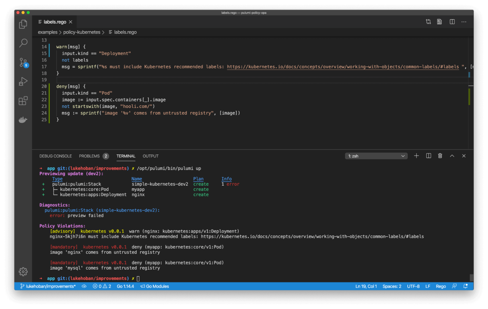

*This is the third of a three-part series originally published on The New Stack. Read [Part 1](/blog/infrastructure-as-code-in-any-programming-language/) and [Part 2](/blog/walkthrough-of-adopting-infrastructure-as-code/).*

Engineers who modernize their [Infrastructure as Code](/what-is/what-is-infrastructure-as-code/) with Pulumi get two classes of benefits:

1. Infrastructure as Code to develop cloud infrastructure with code.
2. Pulumi Cloud, which tames cloud infrastructure management at [scale](https://roadmap.sh/videos/scaling-the-unscalable).

We’ve covered a fair bit of the first above, but have yet to scratch the surface for the second.

Many Infrastructure as Code solutions require that you explicitly manage something typically referred to as “state.” This state is an artifact produced that keeps track of what you think your infrastructure looks like, as defined by your Infrastructure as Code, so that it can be easily compared to what your actual infrastructure looks like. This is how diffs and updates can be done. Every Infrastructure as Code tool stores this infrastructure state, which is really just metadata about all the cloud resources, properties and dependencies. However, how much the tool exposes you to it varies.

Managed services like AWS CloudFormation and Azure Resource Manager (ARM) abstract this state away behind a service. Other tools like Terraform require you to explicitly manage that state by hand, often storing it in an S3 bucket or equivalent on your chosen cloud. The managed service approach tends to be easier to use and also avoids common pitfalls including security ones ([like accidentally committing secrets to your Terraform state file in plain text](https://sysdig.com/blog/cloud-breach-terraform-data-theft/)) as well as reliability ones ([like a code merge gone wrong that takes out your infrastructure](https://www.youtube.com/watch?v=ix0Tw8uinWs)). Pulumi Cloud offers both options, but the default is to use it like a managed service.

Pulumi Cloud is available for unlimited free usage, has a free tier for teams and offers advanced editions for larger teams and enterprises. Pulumi’s SDK is fully open source and can be used without the service, but the cloud service is the easiest, most secure and most reliable way to use Pulumi Cloud.

Pulumi Cloud’s architecture allows your cloud credentials to remain on your client. This when combined with features like identity integration and secrets management, addresses many pressing security concerns, and can mean that using the service is even more secure than managing Infrastructure as Code state on your own.

The service enables integration with your chosen identity provider — such as GitHub, GitLab, Atlassian, Okta, Azure ActiveDirectory or [any SAML/SSO provider](/docs/pulumi-cloud/access-management/saml/) — and provides a complete visual history of who changed what infrastructure and when, very similar to what GitHub offers for code commits. It also makes it easier to see and control what’s going on in your team with organizations, role-based access controls and policy enforcement. It enables rich workflows via webhooks and gives users the ability to deploy either with the click of a button or straight out of a git repo.

You can get a better sense of what functionality is available in the Pulumi Cloud by [reading this overview page](/product/). Although the Pulumi Cloud is trusted by many Global 2000 companies, is regularly audited by outside firms for well-architected and security best practices, and is SOC 2 Type II compliant, there is also a [self-hosted edition available that can be run anywhere](/product/self-hosted/).

## Testing Your Infrastructure as Code

A benefit of using general-purpose languages is that we get to test our code. Most of us wouldn’t think of writing application code without testing it, and Infrastructure as Code is no different. It’s not just that we can test it, but we can use standard tools and practices.

Testing can come in many different forms, including unit tests, property tests and integration tests. The following table summarizes the differences between the three approaches:

|                                | [**Unit Tests**](/docs/using-pulumi/testing/unit)    | [**Property Tests**](/docs/using-pulumi/testing/property-testing)  | [**Integration Tests**](/docs/using-pulumi/testing/integration)  |
|--------------------------------|---------------|---------|----------|
| Provision real infrastructure  | No            | Yes     | Yes      |
| Require the Pulumi CLI         | No            | Yes     | Yes      |
| Time to execute                | Milliseconds  | Seconds | Minutes  |
| Language                       | Same as Pulumi program  | Node.js or Python  | Any language  |
| Validation target              | Resource inputs  | Resource inputs and outputs | External endpoints |

First is basic unit testing which, thanks to using regular programming languages, can be done in the usual way. For instance, the built-in Python and Go test frameworks “just work,” and as do popular third-party frameworks like Mocha (for JavaScript), NUnit (for .NET), JUnit (for Java), and so on. This can be good at ensuring a function that computes CIDR blocks, for instance, is correct. Testing infrastructure itself is a bit more involved, simply because many properties for resources aren’t known a priori until a deployment is done. But when combined with Pulumi Cloud’s infrastructure mocking framework, it’s possible to test infrastructure topologies and properties too. [Read more about testing](/docs/using-pulumi/testing/unit/).

Next are assertions. The idea behind this is to embed assertions within your actual program, so that unexpected situations are caught immediately. This can be associated with any program state, including the resources themselves. [Read more about assertions](/docs/using-pulumi/testing/property-testing/).

Next up is integration testing. For Infrastructure as Code, the typical meaning of an integration test is to spin up a dedicated stack solely for purposes of testing, often referred to as an “ephemeral stack.” Because Pulumi Cloud makes it easy to create independent, isolated copies of your infrastructure, thanks to the projects and stack model, these workflows are surprisingly easy to achieve. This can then be integrated into your typical testing processes, whether those are run by hand or automated as part of your CI/CD process. It’s common to spin up an ephemeral stack whose lifetime is tied to a single pull request, for instance, to validate that the changes being proposed are correct: It is created (and tested) when the pull request is opened, updated (and tested) anytime a new push to it is made and destroyed when it’s closed. [Read more about integration testing and ephemeral stack techniques](/docs/using-pulumi/testing/integration/).

Finally, lots of more exotic tests are possible. For instance, you can fuzz-test your Infrastructure as Code by adding randomization to ensure the infrastructure behaves correctly in the face of strange inputs. You can chaos test your infrastructure by disabling instances or scaling key services below their typical thresholds to understand how your application behaves. You can stress test your infrastructure by placing unreasonable demands and seeing what breaks. The possibilities here are endless, but by using Infrastructure as Code in a general-purpose language, you have a lot more tools than is typically available to you.

To learn more about testing Infrastructure as Code more generally, with specific code examples, please see the [Automated Testing of Pulumi Programs](/docs/using-pulumi/testing/) user guide.

## Enforcing Security, Compliance, Cost and More with Policy as Code

An adjacent approach to both Infrastructure as Code and testing is something called policy as code. Just like Infrastructure as Code, the idea is to encode definitions in a real code artifact. The difference is that those are policies that analyze and flag problems with your infrastructure. The benefits of expressing these in code, however, are very similar to Infrastructure as Code: You can version policies as your requirements change over time, it’s reviewable by the team, and it’s just more expressive.

These policies can cover literally anything that can be analyzed and checked. This commonly includes security (such as ensuring databases aren’t open to the internet), compliance (that only FIPS endpoints are used for government-critical infrastructure), cost (that a deployment about to be done doesn’t exceed a team’s budget), and best practices (that all resources are tagged according to the team’s conventions). The idea is similar to linters and static analysis, both of which just work with Infrastructure as Code written in general-purpose languages, just purpose-built for infrastructure analysis.

Just as Pulumi Cloud lets you use general-purpose languages for your Infrastructure as Code, it lets you use general-purpose languages for policy as code too. This benefits from the richness of those languages and enables advanced use cases like integrating with cost management or ticketing systems like ServiceNow to enforce IT policies. Pulumi Cloud also supports the Open Policy Agent (OPA) language Rego to make it easier to leverage existing policies.

If we violate a policy, we get an error (for mandatory checks) or warning (for advisory ones) before the mistake even makes its way into production:

This might be “boring” from an engineer’s point of view but tends to be very important for an organization, especially for folks who are building out a platform team.

A benefit of using the Pulumi Cloud is that you can manage and enforce policies across the entire organization without individual engineers needing to even know how to run them. To learn more about policy as code, [refer to the user guide for CrossGuard](/docs/using-pulumi/crossguard/), Pulumi’s policy as code.

## Deploying Your Infrastructure as Code Continuously

Most engineering teams ship their applications continuously thanks to CI/CD systems like GitHub Actions, Atlassian BitBucket, GitLab Pipelines, CircleCI, Travis, TeamCity, Spinnaker, or one of the built-in cloud CI/CD services like AWS CodePipeline, Azure DevOps or Google CloudBuild. This unlocks powerful git-driven workflows to push code out into production without needing to deploy things manually. But many teams don’t yet do that for infrastructure.

Adopting Infrastructure as Code helps you to do two things. First, you can verify and ship infrastructure changes the same way you ship application changes, by pushing and reviewing code, a practice we’ve already reviewed as being a core strength of Infrastructure as Code. Second, you can harmonize your application and infrastructure delivery pipelines, so they aren’t as disparate and disconnected. This helps to ship faster while scaling up to many more complex environments as your software sees more success.

The shift to containers, serverless and managed services has blurred the line between “application code” and “infrastructure code.” Is a serverless function on the infrastructure side of the line or application? What about a container registry? A pub/sub-topic? By using entirely different tools and delivery pipelines for applications versus infrastructure, which has historically been true of most infrastructure tools, we introduce a false dichotomy that slows down the team.

Pulumi Cloud offers two solutions for automating infrastructure delivery: First, any of the above CI/CD systems can be used to not just deliver application code, but also your Infrastructure as Code too. Second, Pulumi Cloud offers a built-in system called “Pulumi Deployments” to get up and running and trigger deployments based on git workflows. Read more in the [Pulumi Deployments](/docs/pulumi-cloud/deployments/) and/or [Continuous Delivery](/docs/using-pulumi/continuous-delivery/) user guides.

## Advanced IaC Automation with Automation API

What if Infrastructure as Code were a normal library, in your language of choice, rather than a CLI? That was the question we asked before creating the automation API. Why is that an interesting question? It’s interesting because it elevates Infrastructure as Code to a core capability of any larger piece of software, which can be automated, rather than just a tool that needs to be run by hand by humans. We saw above that a small step toward this is to put Pulumi Cloud into your CI/CD, but the automation API takes it to a whole new level.

The scenarios this unlocks are mentioned earlier — custom tools and libraries, internal infrastructure provisioning portals, and even entire SaaS products — all of which need Infrastructure as Code as a central capability. Indeed, some of your favorite SaaS products, and even those that can be managed with Pulumi, use Pulumi on the backend to provision and manage infrastructure across clouds and across clusters.

Interestingly, we have found that, on average, those who leverage the automation API versus traditional Infrastructure as Code use cases are able to manage more than 10 times the infrastructure per engineer. That’s a big deal and the goal of automation: Doing more with less, experiencing less manual toil and just shipping faster with confidence.

Pulumi’s approach of using general-purpose languages made automation API a natural and unique extension of Infrastructure as Code into new realms. To learn more about Automation API, [check out this page](/automation/), which describes some common scenarios with complete examples.

## Detecting IaC Drift and Doing Something about It

A problematic scenario with any Infrastructure as Code tool is something called “drift”: this happens when someone manually changes your infrastructure outside of the Infrastructure as Code tool. In that case, the actual infrastructure has “drifted” from what it was supposed to be, given your Infrastructure as Code definitions. Detecting drift is one thing, remediating it is another.

As a concrete example, imagine an engineer on the team is debugging an issue in production. To do so, they crack open port 22 so they can SSH into a Bastion host. (There are probably better approaches but as we know, when there’s a live incident, speed matters and sometimes shortcuts are taken.) Unfortunately, after resolving the incident, the engineer has forgotten to remove port 22 access. This is a potential security risk that we want to catch and resolve.

The two potential remediations to drift are typically:

1. Reapply the Infrastructure as Code, thereby eliminating the drift, and in this case, closing port 22 access
2. Incorporate the infrastructure changes into our program, so that the drifted state becomes our last-known-good on a go-forward basis. It’s also sometimes interesting to compare different environments to see if the infrastructure within them has drifted, although thanks to the Pulumi model of projects and stacks, this is uncommon in practice. It’s more of a concern with per-stack configuration, for which the Pulumi Cloud offers features to detect and resolve.

The Pulumi Cloud `refresh` command can be used to detect drift and then you can decide how to remediate it. All of the building blocks are there to either reapply changes, ingest them back into the program or some combination thereof. The combination of refresh, plus automation API, as well as the Pulumi Deployments capability, enables you to detect and remediate drift on demand or on a scheduled basis. [Read more about drift detection and remediation](/blog/patterns-drift-detection/) or [watch the video](https://www.youtube.com/watch?v=-K90I1F6tfs).

## Learn More about Infrastructure as Code

The Pulumi [Getting Started guide](/docs/get-started/) is the easiest way to get up and running with Infrastructure as Code. In addition to that, plus exploring the Pulumi Templates and Examples, we recommend some additional resources:

The tutorial series, [Infrastructure as Code Recommended Practices](/blog/iac-recommended-practices-code-organization-and-stacks/), is a great overview of many concerns you will encounter along your Infrastructure as Code journey. This ranges from how to organize your project code and stacks, how to do local development and testing of your code, how to evolve these structures as your needs change, automation scenarios and more.

The [Using Pulumi](/docs/using-pulumi/) page is a collection of tutorials and getting started guides on specific infrastructure as code topics, such as deeper dives into fundamental concepts, how to simplify your infrastructure projects, and more.

We hope this article has given you a good grasp of the core Infrastructure as Code concepts you’re likely to encounter, no matter the tool you choose, as well as demonstrated some of the unique benefits Pulumi Cloud offers by using general-purpose and popular programming languages.
