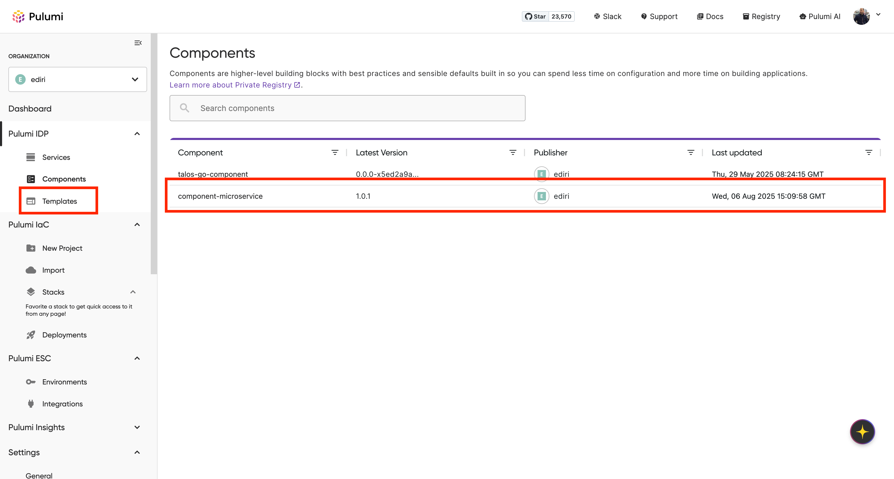
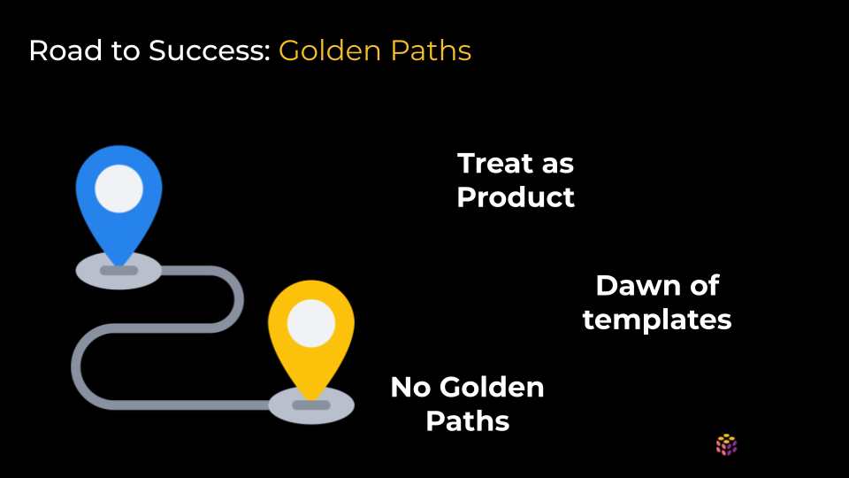
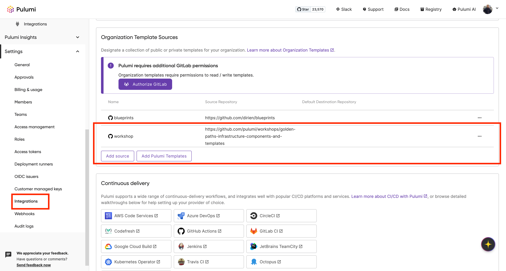
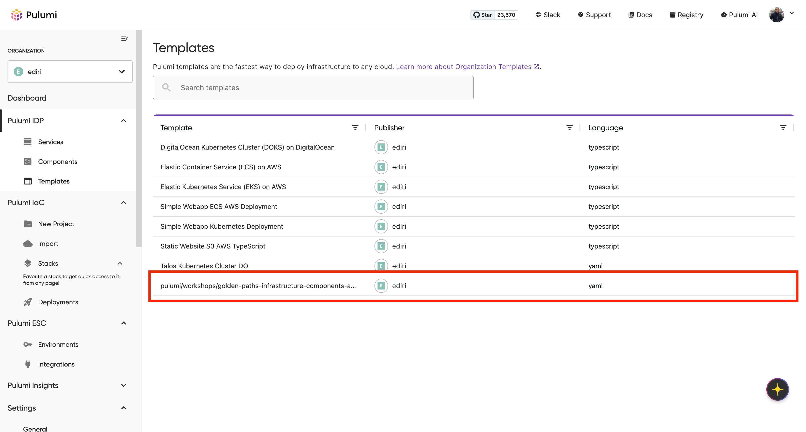
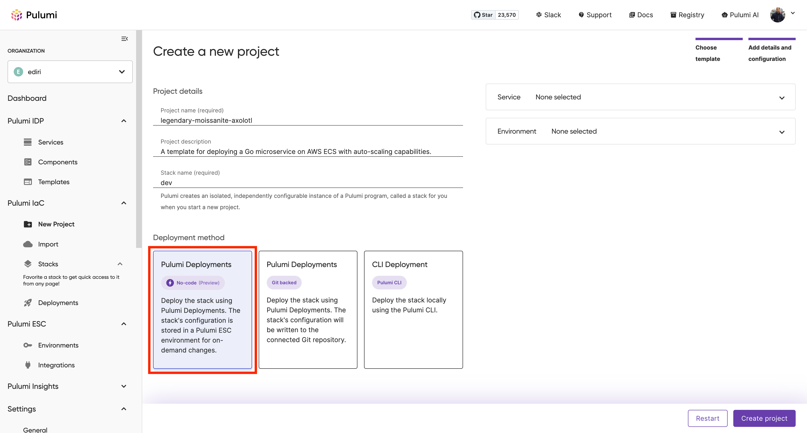
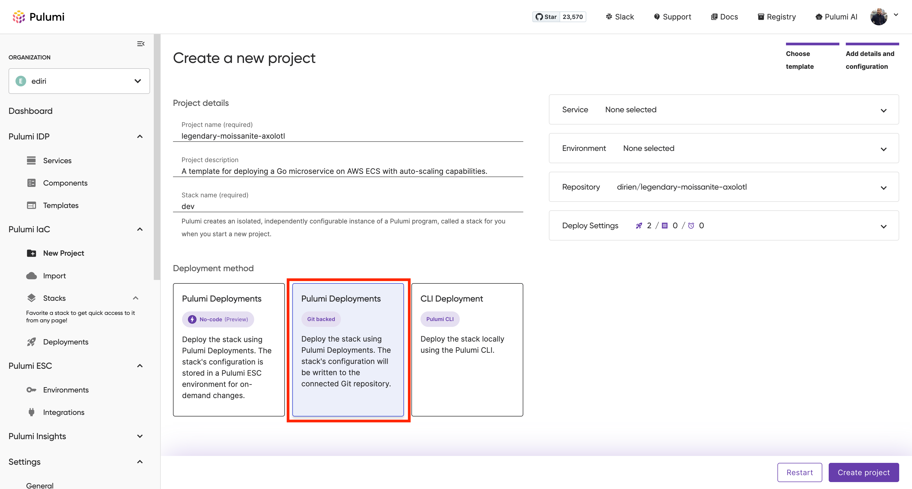

Welcome to the second post in our **IDP Best Practices** series. In this article, we explore how to create **golden paths**, pre-architected, reusable infrastructure patterns that help standardize and accelerate cloud development.

Modern cloud platforms offer endless options, over 200 AWS services, sprawling Azure catalogs, and countless DevOps tools. The result? Developers face decision fatigue and inconsistent implementations. Golden paths solve this by providing **ready-to-use, production-grade infrastructure** that encodes your organization’s best practices, security policies, and operational standards.

In this guide, you'll learn how to build golden paths for your Internal Developer Platform using two core Pulumi constructs: **Components**, reusable infrastructure building blocks, and **Templates**, predefined, deployable patterns. You'll see how to create infrastructure abstractions that are written once, shared across teams, and consumed in any language, turning weeks of setup into minutes of developer-ready infrastructure.

<!--more-->

This post is part of our IDP Best Practices series:

- [How to Build an Internal Developer Platform: Strategy, Best Practices, and Self-Service Infrastructure](/blog/idp-strategy-planning-self-service-infrastructure-that-balances-developer-autonomy-with-operational-control/)
- **Build Golden Paths: Guide to Reusable Infrastructure with Pulumi Components and Templates** (you are here)
- Policy as Code for Safer IDPs: Enabling Developer Self-Service with Guardrails
- Day 2 Platform Operations: Automating Drift Detection and Remediation
- Extend Your IDP for AI Applications: GPUs, Models, and Cost Controls
- Next-Gen IDPs: How to Modernize Legacy Infrastructure with Pulumi

{}
**Want hands-on experience?** Enroll in the free [IDP Builder Workshop Series](https://info.pulumi.com/idp/internal-developer-platform-workshops-course) to access recordings, demo code, slides, and hands-on guidance. The complete code examples from this post are available on [GitHub](https://github.com/pulumi/workshops/tree/main/golden-paths-infrastructure-components-and-templates).
{}

## The Platform Engineering Layer Cake: A Model for IDPs

To understand where golden paths fit into an Internal Developer Platform (IDP), think in layers. This three-tier model structures your platform to deliver increasing levels of abstraction, reuse, and developer value:

### Layer 1: Infrastructure Layer
This is the foundation: raw cloud resources include VMs, databases, networks, and storage, which are the fundamental building blocks from AWS, Azure, GCP, and other providers. Pulumi gives you programmatic access to these resources through [native providers](/registry/), but working at this level requires deep infrastructure knowledge.

### Layer 2: Platform Layer - Components
This is where the magic happens. [Pulumi Components](/docs/iac/concepts/resources/components/) take those raw resources and package them into higher-level abstractions. Instead of manually configuring 20+ AWS resources for a secure web application, you create a component that handles all that complexity and exposes just the configuration that matters:

```typescript
const app = new SecureWebApplication("my-app", {
    instanceType: "t3.medium",
    minReplicas: 2,
    maxReplicas: 10,
    enableWAF: true,
    environment: "production"
});
```

## Part 1: Building Reusable Infrastructure Components

Reusable infrastructure components act as the foundation of your platform. They encapsulate complexity while remaining composable and scalable. Let's build a real-world example: a component that deploys containerized microservices to AWS Fargate.

### The Power of Multi-Language Components

Here's what makes Pulumi components revolutionary: **write once, consume anywhere**. Your platform team can author components in TypeScript, but application teams can consume them in Python, Go, .NET, Java, or even YAML. This separation of concerns is crucial for scaling platform engineering across diverse teams.

### Building a Microservice Component Step-by-Step

Let's create a component that encapsulates everything needed to deploy a production-ready microservice:

```typescript
// microservice-component.ts
import * as pulumi from "@pulumi/pulumi";
import * as aws from "@pulumi/aws";
import * as awsx from "@pulumi/awsx";

export interface MicroserviceArgs {
    appPath: string;      // Path to application code
    cpu?: number;         // CPU units (256, 512, 1024, etc.)
    memory?: number;      // Memory in MB
    port?: number;        // Application port
    desiredCount?: number; // Number of tasks
}

export class MicroserviceComponent extends pulumi.ComponentResource {
    public readonly url: pulumi.Output<string>;
    public readonly serviceName: pulumi.Output<string>;
    public readonly clusterName: pulumi.Output<string>;

    constructor(name: string, args: MicroserviceArgs, opts?: pulumi.ComponentResourceOptions) {
        super("custom:infrastructure:Microservice", name, {}, opts);

        // Set defaults
        const cpu = args.cpu || 256;
        const memory = args.memory || 512;
        const port = args.port || 8080;
        const desiredCount = args.desiredCount || 2;

        // Create ECR repository for Docker images
        const repository = new awsx.ecr.Repository(`${name}-repo`, {
            forceDelete: true
        }, { parent: this });

        // Build and push Docker image
        const image = new awsx.ecr.Image(`${name}-image`, {
            repositoryUrl: repository.url,
            context: args.appPath,
            platform: "linux/amd64",
        }, { parent: this });

        // Create Application Load Balancer
        const loadBalancer = new awsx.lb.ApplicationLoadBalancer(`${name}-lb`, {
            defaultTargetGroup: {
                port: port,
                protocol: "HTTP",
                healthCheck: {
                    path: "/health",
                    interval: 30,
                    timeout: 5,
                    healthyThreshold: 2,
                    unhealthyThreshold: 3,
                }
            }
        }, { parent: this });

        // Create ECS cluster
        const cluster = new aws.ecs.Cluster(`${name}-cluster`, {}, { parent: this });

        // Create Fargate service
        const service = new awsx.ecs.FargateService(`${name}-service`, {
            cluster: cluster.arn,
            taskDefinitionArgs: {
                container: {
                    name: name,
                    image: image.imageUri,
                    cpu: cpu,
                    memory: memory,
                    essential: true,
                    portMappings: [{
                        containerPort: port,
                        targetGroup: loadBalancer.defaultTargetGroup,
                    }],
                },
            },
            desiredCount: desiredCount,
            assignPublicIp: true,
        }, { parent: this });

        // Export outputs
        this.url = pulumi.interpolate`http://${loadBalancer.loadBalancer.dnsName}`;
        this.serviceName = service.service.name;
        this.clusterName = cluster.name;

        // Register outputs
        this.registerOutputs({
            url: this.url,
            serviceName: this.serviceName,
            clusterName: this.clusterName,
        });
    }
}
```

### Documenting for Discoverability and Adoption

To make your component easy to use, add comprehensive documentation and examples to a `README.md` file:

```bash
# MicroserviceComponent

Abstraction for resources needed when using AWS container services.

A component to abstract the details related to:
- Creating a docker image and pushing it to AWS ECR.
- Deploy to ECS Fargate using the docker image.

# Inputs

* appPath: Path to local folder containing the app and Dockerfile.
* port: Port to expose via an ALB.
* cpu (Optional): CPU capacity. Defaults to 256 (i.e. 0.25 vCPU).
* memory (Optional): Memory capacity. Defaults to 512 (i.e. 0.5GB).
* containerName (Optional): Name of the container. Defaults to "my-app".

# Outputs

* publicUrl: The DNS name for the loadbalancer fronting the app.

# Usage
## Specify Package in `Pulumi.yaml`

Add the following to your `Pulumi.yaml` file:
Note: If no version is specified, the latest version will be used.

... omit for brevity ...
```

This documentation will help developers understand how to use your component effectively, including required inputs, outputs, and example usage.

### Publishing Your Component via Private Registry

Once your component is ready, publish it to your [Pulumi Private Registry](/docs/idp/get-started/private-registry/):

```bash
# Tag your component version
git tag v1.0.1

# Publish to your organization's registry
pulumi package publish https://registry.pulumi.com/myorg/microservice-component
```

Now any team in your organization can discover and use your component, regardless of their language preference. All they need is to navigate to the `Components` section in the Pulumi IDP and search for `microservice-component`.



## Part 2: From Building Blocks to Golden Paths


While components are powerful, they’re just the starting point. Golden path templates layer on opinionated scaffolding, workflows, and compliance best practices that guide developers to production.

### Golden Path Maturity: From Zero to Product-Grade Platforms

Teams evolve from ad hoc deployments to mature, productized templates with versioning, metrics, and governance. These maturity levels reflect how deeply your platform enables safe, consistent delivery.



Organizations typically progress through three stages of golden path maturity:

#### Stage 1: No Golden Paths
- Every team reinvents the wheel
- Inconsistent practices across projects
- High cognitive load on developers
- Security and compliance gaps

#### Stage 2: Dawn of Templates
- Basic cookie-cutter templates emerge
- Some standardization begins
- Manual processes still dominate
- Limited support and evolution

#### Stage 3: Templates as Products
- Golden paths have dedicated owners
- Regular release cycles and versioning
- Migration guides for updates
- Metrics track adoption and success
- Continuous improvement based on feedback

### What Makes a Golden Path Golden?

Drawing from [Spotify's pioneering work](https://engineering.atspotify.com/2020/08/how-we-use-golden-paths-to-solve-fragmentation-in-our-software-ecosystem/), golden paths share these characteristics:

1. **Pre-architected and Supported**: The platform team owns and supports the path
2. **Optional but Recommended**: Developers can deviate, but staying on the path ensures support
3. **Transparent Abstractions**: The implementation is visible, not a black box
4. **Extensible**: Teams can add project-specific resources without breaking the pattern
5. **Evolutionary**: Templates improve based on feedback and new requirements

### Building a Go Microservice Golden Path

Let's create a complete golden path for Go microservices that includes:
- Application scaffolding with best practices
- Infrastructure deployment using our component
- CI/CD pipeline configuration
- Observability setup
- Security controls

#### Step 1: Template Structure

```
go-microservice-boilerplate/
├── Pulumi.yaml           # Infrastructure definition
├── src/                  # Application code
│   ├── main.go           # Go microservice
│   ├── Dockerfile        # Container definition
│   └── go.mod            # Dependencies
└── README.md            # Documentation
```

#### Step 2: Application Scaffolding

The `src/main.go` file contains a minimal Go microservice with all the best practices and compliance guardrails baked in. This helps developers to quickly get started and extend the application without worrying too much about selecting the right libraries or frameworks.

```go
// source/main.go
package main

import (
	"context"
	"flag"
	"net/http"
	"os"
	"os/signal"
	"time"

	"github.com/labstack/echo/v4"
	"github.com/labstack/echo/v4/middleware"
	"go.opentelemetry.io/contrib/instrumentation/github.com/labstack/echo/otelecho"
	"go.opentelemetry.io/otel"
	"go.opentelemetry.io/otel/exporters/otlp/otlptrace/otlptracehttp"
	"go.opentelemetry.io/otel/sdk/resource"
	sdktrace "go.opentelemetry.io/otel/sdk/trace"
	semconv "go.opentelemetry.io/otel/semconv/v1.34.0"
)

func initTracer() (*sdktrace.TracerProvider, error) {
	exporter, err := otlptracehttp.New(context.Background())
	if err != nil {
		return nil, err
	}

	resource, err := resource.Merge(
		resource.Default(),
		resource.NewWithAttributes(
			semconv.SchemaURL,
			semconv.ServiceNameKey.String("${PROJECT}"),
			semconv.ServiceVersionKey.String("1.0.0"),
		),
	)
	if err != nil {
		return nil, err
	}

	tp := sdktrace.NewTracerProvider(
		sdktrace.WithBatcher(exporter),
		sdktrace.WithResource(resource),
		sdktrace.WithSampler(sdktrace.AlwaysSample()),
	)

	otel.SetTracerProvider(tp)
	return tp, nil
}

func echoHandler(c echo.Context) error {
	message := c.QueryParam("message")
	if message == "" {
		message = "Hello from Go microservice!"
	}

	return c.JSON(http.StatusOK, map[string]string{
		"echo":      message,
		"service":   "${PROJECT}",
		"timestamp": time.Now().UTC().Format(time.RFC3339),
	})
}

func healthHandler(c echo.Context) error {
	return c.JSON(http.StatusOK, map[string]string{
		"status":  "healthy",
		"service": "${PROJECT}",
	})
}

func main() {
	healthCheck := flag.Bool("health-check", false, "Run health check and exit")
	flag.Parse()

	if *healthCheck {
		resp, err := http.Get("http://localhost:8080/health")
		if err != nil || resp.StatusCode != http.StatusOK {
			os.Exit(1)
		}
		os.Exit(0)
	}

	tp, err := initTracer()
	if err != nil {
		panic(err)
	}
	defer func() {
		if err := tp.Shutdown(context.Background()); err != nil {
			panic(err)
		}
	}()

	e := echo.New()

	e.Use(middleware.Logger())
	e.Use(middleware.Recover())
	e.Use(middleware.CORS())
	e.Use(otelecho.Middleware("${PROJECT}"))

	e.GET("/echo", echoHandler)
	e.GET("/health", healthHandler)

	go func() {
		if err := e.Start(":8080"); err != nil && err != http.ErrServerClosed {
			e.Logger.Fatal("shutting down the server")
		}
	}()

	quit := make(chan os.Signal, 1)
	signal.Notify(quit, os.Interrupt)
	<-quit
	ctx, cancel := context.WithTimeout(context.Background(), 10*time.Second)
	defer cancel()
	if err := e.Shutdown(ctx); err != nil {
		e.Logger.Fatal(err)
	}
}
```

#### Step 3: Infrastructure Template with YAML

Here's how you define the infrastructure using Pulumi YAML. You can instantly spot one of the features of Pulumi Components. We consume the `micorservice-component` in YAML without knowing that it was authored in a different language. This is the power of Pulumi Components: write once, consume anywhere.

And we see another feature of Pulumi Components: As it is a first-class citizen, we can embed the component and add additional resources like auto-scaling policies, alarms, and more directly in the YAML file. This allows us to create a complete golden path for deploying Go microservices on AWS ECS with auto-scaling capabilities.

```yaml
# Pulumi.yaml
name: ${PROJECT}
description: ${DESCRIPTION}
runtime: yaml
packages:
  component-microservice: https://github.com/smithrobs/component-microservice@v1.0.1
template:
  description: A template for deploying a Go microservice on AWS ECS with auto-scaling capabilities.
resources:
  microserviceComponent:
    type: component-microservice:MicroserviceComponent
    properties:
      appPath: ./src
      port: 8080
      containerName: ${PROJECT}
  ecsTarget:
    type: aws:appautoscaling:Target
    name: ecs_target
    properties:
      maxCapacity: 4
      minCapacity: 1
      resourceId: service/${microserviceComponent.clusterName}/${microserviceComponent.serviceName}
      scalableDimension: ecs:service:DesiredCount
      serviceNamespace: ecs
  ecsPolicyUP:
    type: aws:appautoscaling:Policy
    name: ecs_policy_up
    properties:
      name: ecs_policy_up
      policyType: StepScaling
      resourceId: ${ecsTarget.resourceId}
      scalableDimension: ${ecsTarget.scalableDimension}
      serviceNamespace: ${ecsTarget.serviceNamespace}
      stepScalingPolicyConfiguration:
        adjustmentType: ChangeInCapacity
        cooldown: 60
        metricAggregationType: Maximum
        stepAdjustments:
        - metricIntervalUpperBound: 0
          scalingAdjustment: 1
  ecsPolicyDown:
    type: aws:appautoscaling:Policy
    name: ecs_policy_down
    properties:
      name: ecs_policy_down
      policyType: StepScaling
      resourceId: ${ecsTarget.resourceId}
      scalableDimension: ${ecsTarget.scalableDimension}
      serviceNamespace: ${ecsTarget.serviceNamespace}
      stepScalingPolicyConfiguration:
        adjustmentType: ChangeInCapacity
        cooldown: 60
        metricAggregationType: Maximum
        stepAdjustments:
        - metricIntervalLowerBound: 0
          scalingAdjustment: -1
  serviceCPUHighUtilization:
    type: aws:cloudwatch:MetricAlarm
    name: service_cpu_high_utilization
    properties:
      name: service_cpu_high_utilization
      comparisonOperator: GreaterThanOrEqualToThreshold
      evaluationPeriods: 2
      metricName: CPUUtilization
      namespace: AWS/ECS
      period: 60
      statistic: Average
      threshold: 80
      alarmActions:
      - ${ecsPolicyUP.arn}
      dimensions:
        ClusterName: ${microserviceComponent.clusterName}
        ServiceName: ${microserviceComponent.serviceName}
  serviceCPULowUtilization:
    type: aws:cloudwatch:MetricAlarm
    name: service_cpu_low_utilization
    properties:
      name: service_cpu_low_utilization
      comparisonOperator: LessThanOrEqualToThreshold
      evaluationPeriods: 2
      metricName: CPUUtilization
      namespace: AWS/ECS
      period: 60
      statistic: Average
      threshold: 10
      alarmActions:
      - ${ecsPolicyDown.arn}
      dimensions:
        ClusterName: ${microserviceComponent.clusterName}
        ServiceName: ${microserviceComponent.serviceName}

outputs:
  publicUrl: ${microserviceComponent.publicUrl}
```

#### Step 4: Documentation and Examples

Add a `README.md` file to your template directory to provide clear instructions on how to use the template, including prerequisites, configuration options, and example commands:

# Go Microservice Golden Path

A **golden path** template that gets your Go microservice from code to production on AWS in minutes, not weeks.

## What You Get

This golden path provides everything your development team needs to deploy production-ready Go microservices:

✅ **Production-ready Go microservice** with Echo framework and OpenTelemetry tracing
✅ **AWS infrastructure that scales** - ECS with auto-scaling from 1-4 instances
✅ **Security by default** - Hardened containers, IAM roles, security groups
✅ **Monitoring built-in** - Health checks, load balancer monitoring, CloudWatch alarms
✅ **One-command deployment** - `pulumi up` handles everything
✅ **No AWS expertise required** - Complex ECS setup abstracted away

## For Development Teams: What to Expect

### Your Experience

**Day 1: Getting Started**
- Clone this repo, run `pulumi up`
- Your service is live on AWS in 5-10 minutes
- Public URL provided automatically - no manual setup needed

**Day 2-N: Development Workflow**
- Write your Go code in `microservice/main.go`
- Test locally with `go run main.go`
- Deploy changes with `pulumi up`
- AWS automatically rebuilds and redeploys your container

**Production Operations**
- Service automatically scales with CPU load (80% up, 10% down)
- Health checks ensure unhealthy containers are replaced
- Load balancer distributes traffic across healthy instances
- Distributed tracing helps debug issues across services

### What's Handled For You

You **don't** need to learn or configure:
- ECS clusters, services, and task definitions
- Application Load Balancers and target groups
- Auto-scaling policies and CloudWatch alarms
- Security groups and IAM roles
- Container registries and image building
- Health check configuration

You **do** focus on:
- Writing your Go application logic
- Adding your business endpoints
- Testing your service locally
- Deploying with confidence

### Making Templates Available in Pulumi IDP

Publishing your template to [Pulumi IDP](/docs/idp/) enables true self-service. Head to `Settings` → `Integrations` → `Organization Template Sources` and add your template repository.



Once published, developers can discover and deploy it directly from the IDP interface.



Now developers can deploy through multiple interfaces:

**CLI Deployment:**
```bash
pulumi new https://github.com/myorg/go-microservice-boilerplate
```

**No-Code Deployment:**
Navigate to [Pulumi IDP](/docs/idp/get-started/workflows/) → `Templates` → `Deploy with Pulumi` → Configure and launch



**Pulumi Deployment:**
Navigate to [Pulumi IDP](/docs/idp/get-started/workflows/) → `Templates` → `Deploy with Pulumi` → Configure and launch



## Best Practices for Reusable Infrastructure Components and Templates

Well-designed components and templates are the foundation of scalable, self-service infrastructure. These best practices ensure your abstractions are maintainable, discoverable, and production-ready.

### 1. Design for Day 2 Operations from Day 1
Think beyond deployment. A golden path must also support ongoing operations:
- How will teams safely update their infrastructure?
- What happens during scaling events?
- How do you handle disaster recovery?
- What metrics and logs are needed for troubleshooting?

### 2. Expose Complexity Progressively
Provide sensible defaults that work, while enabling customization for advanced use cases:

```typescript
interface ComponentArgs {
    // Required - what users must provide
    appName: string;

    // Common customizations with good defaults
    instanceType?: string;  // default: "t3.micro"
    replicas?: number;       // default: 2

    // Advanced options for power users
    networkConfig?: NetworkConfig;
    securityPolicies?: SecurityPolicy[];
    customMetrics?: MetricDefinition[];
}
```

### 4. Use Semantic Versioning Everywhere
Clear versioning for both components and templates indicate stability and reliability:
- **Major versions** (1.0.0 → 2.0.0): Breaking changes
- **Minor versions** (1.0.0 → 1.1.0): New features, backward compatible
- **Patch versions** (1.0.0 → 1.0.1): Bug fixes

This lets teams adopt updates with confidence and control.

### 5. Test Your Abstractions
Don't ship black boxes. Create automated tests to validate key functionality and resource creation. Focus on:

- Smoke tests that validate resource existence
- Output validation to ensure correctness
- Integration tests to confirm end-to-end behavior

```typescript
import { expect } from "chai";
import * as pulumi from "@pulumi/pulumi";

describe("MicroserviceComponent", () => {
    it("should create required resources", async () => {
        const component = new MicroserviceComponent("test", {
            appPath: "./test-app",
            port: 3000
        });

        const resources = await pulumi.runtime.allResources();
        expect(resources).to.include("aws:ecs/cluster:Cluster");
        expect(resources).to.include("aws:ecs/service:Service");
        expect(resources).to.include("aws:lb/loadBalancer:LoadBalancer");
    });
});
```

## How to Measure Golden Path Success

Golden paths aren’t complete until they deliver measurable value. Use these KPIs to assess performance and drive iteration:

### Adoption Metrics
- **Template usage rate**: Percentage of new projects using golden paths
- **Component reuse**: Number of stacks consuming shared components
- **Time to first deployment**: Deployment time and frequency from code to production

### Quality Metrics
- **Security compliance rate**: Percentage of deployments passing security policies
- **Stability**: Deployment incident frequency
- **Mean time to recovery (MTTR)**: Time to recover from production issues

### Developer Experience Metrics
- **Developer satisfaction**: Survey teams about their platform experience
- **Support ticket volume**: Ticket volume related to infrastructure
- **Contribution**: Number of PRs or issues submitted to platform templates

## Real-World Results: Success Stories

Organizations using golden paths report significant improvements in speed and reliability:

- **[Snowflake](https://www.pulumi.com/case-studies/snowflake/)** reduced deployment time from 1.5 weeks to less than a day
- **[Mercedes-Benz](https://www.pulumi.com/case-studies/mercedes-benz/)** decreased infrastructure provisioning from weeks to minutes
- **[Starburst Data](https://www.pulumi.com/case-studies/starburst/)** cut deployment time from 2 weeks to 3 hours

These results show that golden paths are not just developer tools, they're a competitive advantage. To learn more, download the whitepaper: [The Golden Path to Cloud Success: Your IDP Roadmap](https://info.pulumi.com/whitepaper-the-golden-path-to-cloud-success).

## Common Pitfalls and How to Avoid Them

### Pitfall 1: Over-Abstraction
**Problem**: Creating components so abstract they're unusable
**Solution**: Start with concrete use cases, then generalize based on actual patterns

### Pitfall 2: Insufficient Escape Hatches
**Problem**: Golden paths become golden cages
**Solution**: Always provide ways to extend or override default behavior

### Pitfall 3: Poor Versioning Strategy
**Problem**: Breaking changes without migration paths
**Solution**: Maintain backward compatibility and provide clear upgrade guides

### Pitfall 4: Lack of Ownership
**Problem**: Templates become orphaned and outdated
**Solution**: Assign clear ownership and establish maintenance schedules

## The Future of Golden Paths: AI and Beyond

The future of golden paths is intelligent, cross-cloud, and fully integrated with modern workflows.

### AI-Enhanced Templates
Imagine templates that adapt based on your application's actual behavior, automatically tuning resources and configurations for optimal performance and cost.

### Cross-Cloud Portability
Components that abstract not just resources but entire cloud providers, enabling true multi-cloud golden paths.

### GitOps-Native Workflows
Templates that include not just infrastructure but complete GitOps pipelines, from code commit to production deployment.

## Your First Steps to Golden Paths

Ready to get started? Here's your action plan:

1. **Audit Current Patterns**: Document the infrastructure patterns your teams use most frequently
2. **Build one reusable component**: Pick your most common pattern and build a reusable component
3. **Create Your First Template**: Build a complete golden path for one project type
4. **Gather Feedback**: Deploy with a pilot team and iterate based on their experience
5. **Scale Gradually**: Expand your component library and template catalog based on demand
6. **Measure and Iterate**: Track adoption and continuously improve based on metrics

## Conclusion: From Fragmentation to Flow

Golden paths aren't about restricting creativity or enforcing rigid standards. They're about **removing friction** from the development process, **encoding expertise** into reusable patterns, and **empowering developers** to move at the speed of business.

By building a library of components and templates, you transform your Internal Developer Platform from a collection of tools into a **force multiplier** for your entire engineering organization. You give developers the gift of not having to solve solved problems, while maintaining the flexibility to innovate where it matters.

Start small. Solve one problem well. Expand from there. With the right foundation, your developer platform will evolve into a system of self-service, speed, and stability.

### Ready to Build Your Golden Paths?

- **Code examples**: [Explore golden path examples on GitHub](https://github.com/pulumi/workshops/tree/main/golden-paths-infrastructure-components-and-templates)
- **Build with Components**: [Pulumi Components documentation](/docs/iac/concepts/resources/components/)
- **Enable Self-Service**: [Pulumi IDP documentation](/docs/idp/)
- **Join the Community**: Connect with platform engineers in our [Pulumi Slack](https://slack.pulumi.com)

*Next in our series: Policy as Code for Safer IDPs. You will learn how to add automated guardrails that make sure every deployment meets your security and compliance standards without slowing down development.*
