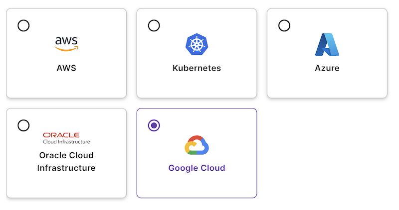

We're excited to introduce Google Cloud support to [Insights Account Discovery](/docs/insights/get-started/). This new capability expands Pulumi’s resource discovery to help you uncover infrastructure in Google Cloud, regardless of how those resources are managed. With full visibility into all of your cloud resources, you can monitor, search, and manage your environments more effectively.

<!--more-->

## Scan an Entire Google Cloud Project in Minutes

With [Pulumi Insights](/blog/insights-cloud-account-discovery/), gaining visibility into your Google Cloud environment is fast and frictionless. Once configured, Pulumi  scans your selected project and uncovers resource data across services like Compute Engine, Cloud Storage, IAM, networking, and more.  There’s no need to install agents or write custom scripts—just link your account and let Pulumi do the rest.

Within minutes, you’ll have a comprehensive view of your cloud infrastructure, including resources not managed by infrastructure-as-code. From there, you can explore your project, search for specific configurations, and start identifying security gaps, cost inefficiencies, and compliance risks.

## Visibility Beyond Infrastructure as Code

While infrastructure as code provides control and repeatability, the reality of most cloud environments includes resources created manually or by third-party automation. [Pulumi Insights](/docs/insights/get-started/) bridges that gap by discovering all of your resources—regardless of how they were created.

With this unified view, you can:

* Identify drift from your intended infrastructure state
* Spot resources that may introduce security or cost risks
* Enforce compliance across all resources using [Pulumi Crossguard](/blog/enforcing-policy-as-code-on-discovered-resources-with-pulumi/)
* Bring unmanaged resources under Pulumi IaC using [Pulumi Interactive Import](/blog/visual-import/)

This makes [Pulumi Insights](/docs/insights/get-started/) an essential tool not just for monitoring, but also for cloud governance, compliance, and modernization.

## Getting Started

Get started today by [creating a Google Cloud Insights Account](/docs/insights/accounts/#google-cloud) and start uncovering your hidden resources.
