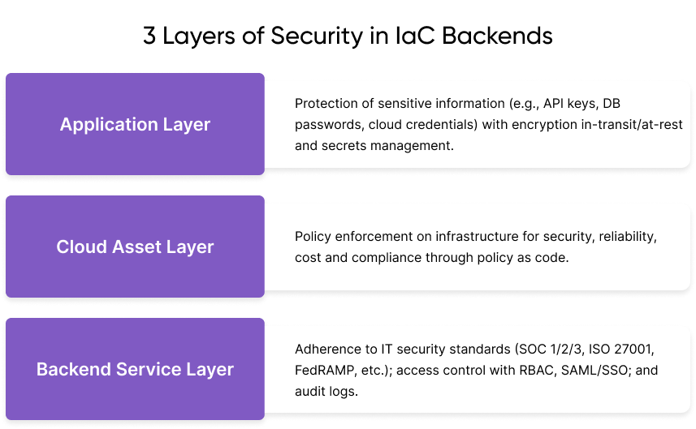

[Infrastructure as Code (IaC)](/what-is/what-is-infrastructure-as-code/) has revolutionized how cloud resources are managed, allowing for more efficient, scalable, and repeatable deployments. We designed [Pulumi IaC](/product/infrastructure-as-code/) to let you program cloud infrastructure using familiar programming languages like TypeScript, JavaScript, Python, Go, .NET, Java, and YAML. This approach not only simplifies the process but also integrates seamlessly with existing development tools and ecosystems (e.g., IDEs, standard unit test frameworks, integration test). You can define infrastructure with code, often in just one line, for serverless, Kubernetes, AI/ML, databases, and more. You can also preview changes before deploying unlike many other IaC solutions. Pulumi IaC is fully open source with a [public roadmap](https://github.com/orgs/pulumi/projects/44/). We value working with the community to shape the product through feedback and contributions.

## What is Pulumi Cloud?

Infrastructure as Code tools like Pulumi require systems for coordinating deployments, which include concurrency control, state management, and security. For the purposes of this post, let's refer to these systems as IaC backends. There are several options for managing these backends: you can either handle them yourself, which we'll call DIY, or you can leverage [Pulumi Cloud](/product/pulumi-cloud/), available as a SaaS or self-hosted solution. With Pulumi Cloud, you gain access to a comprehensive infrastructure management platform designed to handle everything running in the cloud. This platform automates your IaC deployments, centralizes [secrets management](/what-is/what-is-secrets-management/) and orchestration to manage secrets sprawl effectively, and employs AI to oversee infrastructure assets and ensure compliance. On the other hand, with a DIY approach, you have the flexibility to build everything Pulumi Cloud offers or opt for a more minimalistic setup tailored to your organization's specific needs. Both options are well-supported by Pulumi, but there are distinct advantages to choosing Pulumi Cloud over the DIY method, which we'll explore further.

## Costs and Complexities of DIY Backends



Building and maintaining your own Infrastructure as Code backend involves a significant engineering and operational commitment. On the engineering front, you face security and compliance challenges, as well as the need to develop features that ensure enterprise readiness. Operationally, the backend must be highly available and reliable, and it should facilitate easy onboarding for the rest of the organization when the time comes. Beyond these immediate concerns, there are also hidden personnel costs associated with running your own backend. Let's break down some of those hidden costs.

{}
**Materialize** reduced costs and accelerated time to market by making developer onboarding 75% faster.  

*"Pulumi lets us manage multi-cluster Kubernetes infrastructure efficiently, all in one stack. It has hugely benefited productivity and our service's reliability. Without Pulumi, we know that scaling and maintaining Materialize would be much harder for the team."*  

–— Paul Hemberger, Engineering Manager for Materialize’s cloud team  

[Learn more](/case-studies/materialize/)
{}

### Operational Excellence

One of the primary functions of IaC backends is managing state. State management involves managing concurrency controls, preventing state corruption, ensuring backup and recovery, maintaining high availability of the state service, and providing consistent visibility across all managed resources; this is easy to get wrong. For instance, an incorrect Git merge of your state can result in outages, as evidenced by [Spotify speaking publicly](https://www.youtube.com/watch?v=ix0Tw8uinWs) about accidentally deleting two-thirds of their production Kubernetes clusters due to a faulty state merge.

Pulumi Cloud offers total visibility into changes within your organization, allowing you to track who is deploying what, when, and where, down to the individual cloud infrastructure properties being changed and the source commits triggering them. If issues arise and you need to revert to a prior known state, Pulumi Cloud's transactional state checkpointing protocol ensures automatic recovery from failures, and failures are common with transient cloud and networking issues. In contrast, DIY backends require manual human intervention to recover and repair state files, a process that is time-consuming, extends outages, and carries significant risk. Pulumi Cloud also automatically backs up and replicates your state checkpoints, facilitating easy recovery for audits or rollbacks, potentially preventing outages or meeting audit standards.

Managing your infrastructure with IaC demands considerable time and energy. Pulumi Cloud provides [Pulumi Insights](/product/pulumi-insights/), offering search, analytics, and AI-driven insights over your infrastructure. If you're using a DIY backend, you'll need to build your own search clusters and grep systems. With Insights, you can instantly search for critical information - such as finding MySQL databases on end-of-life versions across all your cloud assets. You can also have a conversation with [Pulumi Copilot](/product/copilot/) about your infrastructure in plain English and get
answers to operational questions that would take hours to piece together from other sources.

With this total visibility, Pulumi Insights helps you reduce waste by showing you usage information and identifying potentially stale infrastructure, which can lead to substantial cost savings.

When you build and operate your own IaC backend, you'll need to dedicate one full-time engineer for every team of ten - that's nearly 10% of your engineering expense. Pulumi Cloud, as a fully managed service, frees up your team's time from the operational and maintenance burdens of managing an IaC backend.

{}
**Unity** reduced deployment times by 80%, from weeks to hours, significantly improving their time to market.

*"Terraform relies on HCL and lacks support for concepts like classes, objects and inheritance. An equivalent deployment would take more lines of code while yielding IaC that is less reusable."*  

[Learn more](/case-studies/unity/)
{}

### Security and Compliance

IaC backends are mission-critical components that require robust security measures to protect the backend service, cloud assets, and applications running on the infrastructure.

At the backend service layer, you must design and manage the service to adhere to numerous IT security standards, including SOC 1/SSAE 16/ISAE 3402, SOC 2, SOC 3, FISMA, FedRAMP, DOD SRG Levels 2 and 4, PCI DSS Level 1, EU Model Clauses, ISO 9001 / ISO 27001 / ISO 27017 / ISO 27018, ITAR, IRAP, FIPS 140-2, MLPS Level 3, and MTCS. This involves a manual assessment and validation process for each standard, which can be time-consuming and complex.

Pulumi, as an Amazon Web Services Advanced Partner, undergoes a thorough review and certification of its security and compliance practices by the AWS team. Pulumi Cloud operates on AWS infrastructure, which is designed and managed in alignment with security best practices and all the aforementioned IT security standards. This infrastructure does not require or have access to personally identifiable information (PII), making it suitable for managing applications that require HIPAA and ISO 27018 compliance. Pulumi also conducts annual penetration testing of Pulumi Cloud and maintains active SOC 2 Type II compliance.

Access control at the backend service layer is crucial for enforcing least privilege access. Pulumi Cloud integrates seamlessly with various identity providers like Azure ActiveDirectory, Okta, G Suite, or any SAML/SSO provider, offering deep support for role-based access control (RBAC) and SCIM for automatic synchronization and revocation of access based on identity provider groups. This fine-grained control over state access is a significant advantage over DIY backends, where all access control mechanisms would need to be built from scratch.
Audit logs play a vital role in tracking user activity within an organization, recording what actions were taken, when, and by whom. Pulumi's audit logs are immutable, capturing the UNIX timestamp of events, the user who invoked the action, the event itself, and the source IP of the call. This level of auditing ensures that the activities of organization members are attributable, enhancing security and compliance.

At the cloud asset layer, you and your team need to prevent infrastructure deployments that violate policies related to security, reliability, cost, or compliance. Pulumi Cloud, through [Pulumi CrossGuard](/crossguard/), provides out-of-the-box support for common security and compliance policies, ensuring PCIDSS, ISO27001, SOC2, and CIS compliance for cloud applications and infrastructure. Such organization-wide enforcement and specific policy support are not readily available with DIY backends.

At the application layer, securing sensitive information like database passwords, cloud credentials, and API keys is paramount. Secrets can inadvertently end up in insecurely stored state files, leading to potential breaches, as highlighted by a [Sysdig article](https://sysdig.com/blog/cloud-breach-terraform-data-theft/) where an attacker exploited a manually managed state file to gain control over an entire AWS account. Pulumi Cloud, however, encrypts all data in transit and at rest, utilizing hardware security module (HSM) based encryption. It also avoids capturing cloud credentials, instead relying on client-side authentication, as detailed in the [Pulumi Cloud Security Whitepaper](/security/pulumi-cloud-security-whitepaper.pdf).

Pulumi Cloud further enhances security with [Pulumi ESC](/product/secrets-management/), a centralized secrets management and orchestration service. This service allows for pulling and syncing secrets from various stores like HashiCorp Vault, AWS Secrets Manager, Azure Key Vault, GCP Secret Manager, and 1Password, making it easy to adopt dynamic, short-lived secrets on demand. Pulumi ESC leverages the same identity, RBAC, Teams, SAML/SCIM, OIDC, and scoped access tokens used for Pulumi IaC, ensuring that secrets management complies with enterprise security policies. Every access or change to secrets or configuration values is logged for auditing, providing a secure and auditable environment for you and your team to access secrets via CLI, API, Kubernetes operator, the Pulumi Cloud UI, and in-code with TypeScript/JavaScript, Python, and Go SDKs. With a DIY backend, you have to manage integration and access controls with individual secrets stores, with potential secrets sprawl and operational overhead.

{}
**Tetrate** uses Pulumi ESC to stop secrets sprawl and attain compliance more efficiently.

*“With Pulumi ESC, our developers get dynamic AWS and Azure credentials on-demand. Onboarding new developers is quick and secure, with no more manually filling in .env templates.”*  

–— Liam White, Platform Lead  

[Learn more](/product/secrets-management/)
{}

### Organizational Scaling

As your organization grows, you need an IaC backend that scales with the organization and makes it easy to onboard new teams.  Pulumi IaC brings your development, infrastructure and security teams together. Your infrastructure teams can define and manage common infrastructure across the organization, collaborate with security teams to establish security and compliance guardrails, and enable easy self-service of infrastructure through custom developer platforms or shared infrastructure libraries. Teams that prefer not to program can use YAML, while those who do can leverage Python, TypeScript, Golang, or C# to define organization-wide components.



With Pulumi IaC, your teams can tackle the growing complexity of modern architectures using familiar software engineering principles. Programming languages offer loops, conditional logic, class inheritance, and object-oriented design, allowing your organization to craft more sophisticated infrastructure compared to legacy IaC tools.

When you’re scaling your organization, you’ll need an IaC backend that makes team onboarding efficient. DIY backends often involve ad-hoc onboarding with bespoke identity solutions, requiring custom documentation and training to troubleshoot unique problems. This can slow down onboarding and reduce end-user productivity. Additionally, DIY backends place the internal support burden on your team, requiring them to assist users in navigating the system.

In contrast, Pulumi Cloud offers standardized, well-documented capabilities and integrates seamlessly with identity systems, leading to efficient onboarding and increased productivity for new employees. Pulumi Cloud provides [12x5 or 24x7 support](https://support.pulumi.com/hc/en-us), ensuring your organization receives immediate assistance with any architectural, cloud-related, or Pulumi best-practices issues. Furthermore, Pulumi Cloud includes built-in RBAC, simplifying the onboarding and scaling of new users.

{}
**BMW Group** used Pulumi to build a scalable and resilient hybrid cloud implementation that could handle more than eleven thousand developers.

*“When we started to use Terraform to deploy our first cloud services with AWS, it didn’t scale quickly enough for our needs. With Pulumi we’re really speeding up development. We can use any language instead of some special language like HCL and by automating policies, we have compliant and secure systems from the beginning.”*  

–— Jan-Peter Alten, DevOps Engineer

[Learn more](/case-studies/bmw/)
{}

## Conclusion

When you choose between managing your own backend and using Pulumi Cloud, you need to carefully consider all the costs.  You'll face substantial operational costs with DIY backends, requiring dedicated engineering resources for maintenance, updates, and troubleshooting. Outages and incidents can lead to significant financial losses, as demonstrated by real-world examples where improper state management resulted in major service disruptions. The cost of setup and maintenance for a DIY backend is not just financial but also involves the time and effort of your team, which could otherwise be focused on core business activities.

Moreover, the cost of an engineer dedicated to managing the backend can be nearly 10% of your engineering budget, a significant investment for any organization. Figuring it out on your own adds to the complexity and potential for errors, increasing the risk of costly mistakes. Invisible excess waste in terms of unused or underutilized infrastructure can also accumulate, leading to unnecessary expenses.

When it comes to scaling, the cost of onboarding new teams or users onto a DIY system can be high due to the need for custom documentation, training, and support. Security is another critical area where the costs can escalate, with the need to comply with numerous IT security standards, manage access control, and ensure robust secrets management.

We built Pulumi Cloud as a fully managed service to address these concerns by providing a platform that automates deployments, ensures compliance, and offers comprehensive security features out-of-the-box. You’ll reduce your operational burden, minimize your risk of outages, and make scaling and onboarding easier, ultimately leading to cost savings and increased productivity. By choosing Pulumi Cloud, your organization can focus on innovation and growth rather than the intricacies of IaC backend management. You get to optimize your infrastructure without the overhead of running your own DIY solution.

## Next Steps

Each unique variable in your environment –— cloud providers, languages, team structure, business objective, etc. –— makes realizing the full benefits of Pulumi Cloud different for each organization.

Our newly launched program called Immersion Days, is a customizable, half-day event designed to expand Pulumi’s impact across your organization.

The program has 3 key components:  

1. **Strategic Leadership Engagement:** Address key business challenges like security posture, cost optimization, and developer productivity.
2. **Architectural Review:** Evaluate and refine platform engineering projects to enhance efficiency and scalability.
3. **Hands-On Workshops:** Equip your engineering teams with practical Pulumi skills through interactive technical sessions.

This program will help strengthen executive buy-in for your infrastructure initiatives while showcasing Pulumi's value to your peer engineering teams.

If this sounds valuable, let’s discuss tailoring the agenda to fit your organization’s priorities.

[Register now](https://info.pulumi.com/pulumi-platform-engineering-immersion-days) or [contact your Pulumi sales team](/contact).

_Meta image credit: [ESO/L. Calçada](https://www.eso.org/public/images/eso0942a/)_
