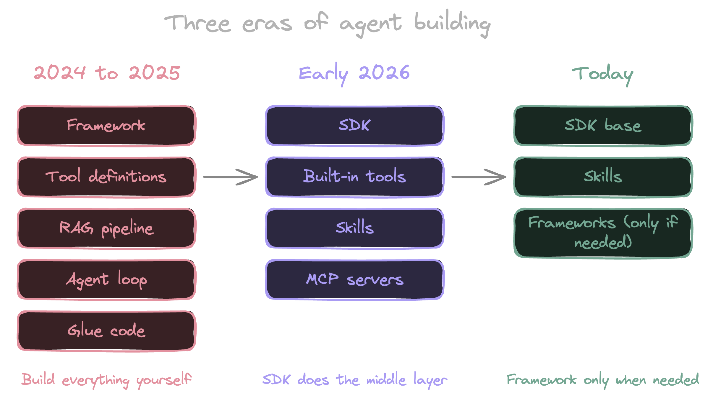
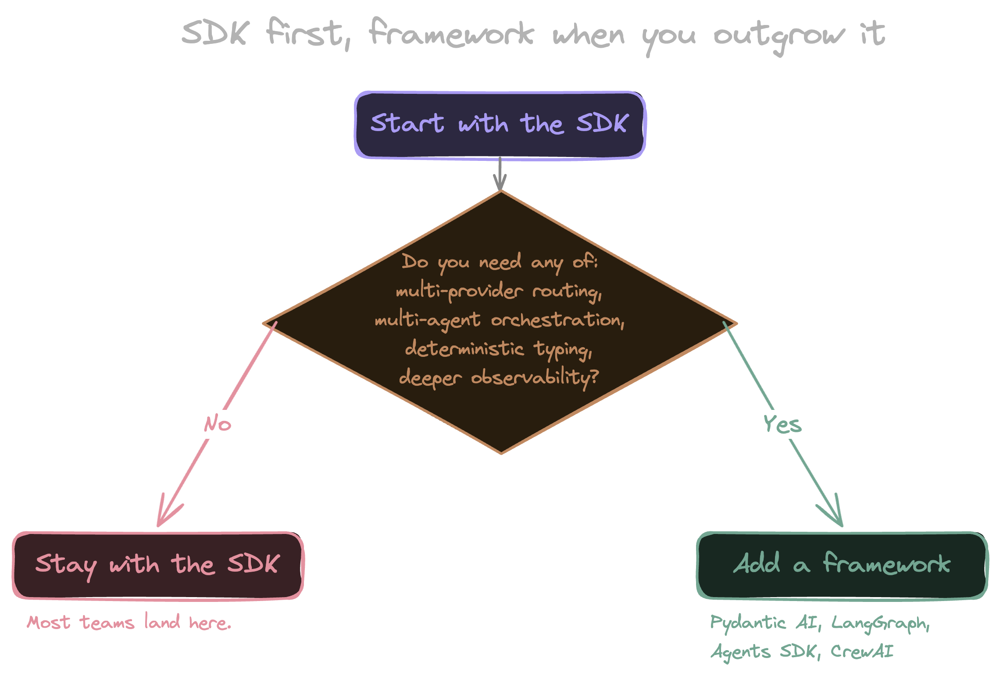

Twelve months ago, building an AI agent meant picking a framework, defining your tools, standing up a RAG pipeline, and writing a stack of glue code to wire it all together. That was the default playbook. The post-mortem on six months of work usually went the same way: half the time went into infrastructure that had nothing to do with the agent's actual job.

That isn't where the work is anymore. Most of the middle layer is gone. The SDKs ship with the tools, the skills system replaced the upfront tool registry, and longer context windows pushed vector search out of the default slot it held all of last year.

The shape is the same as a lot of infrastructure shifts before it. The hard thing got cheap, the cheap thing got expected, and the question moved up a level.

<!--more-->

## The old playbook

A 2024 to 2025 agent project looked like this. You picked a framework, usually [LangChain](https://www.langchain.com/), [LlamaIndex](https://www.llamaindex.ai/), or an early version of [Pydantic AI](https://ai.pydantic.dev/). You wrote tool definitions, usually a wrapper around an API the agent would call. You stood up a RAG pipeline: chunk your documents, embed them, pick a vector database, write retrievers, layer reranking on top. Then you wrote the agent loop yourself, including prompt assembly, tool dispatch, retry logic, and observability.

This was the default for good reasons. Foundation models had short context windows. They didn't ship with file access. They couldn't run code. If you wanted an agent to do anything useful with your data, you had to bring the data to the model in pre-digested chunks.

The cost wasn't only setup time. It was infra bills, retries against embedding APIs, and a context strategy that fought the model as the model got better. By mid-2025 the retrieval layer was often the bottleneck on quality. The agent would ask a question, get five plausible-looking chunks, and answer from those instead of the document you actually wanted it to read. Chunking decisions made on a Tuesday in March were still hurting answer quality six months later.

Most teams I talked to in 2025 were tuning their RAG pipeline. Almost nobody enjoyed it.

## The shift: three things changed at once

Three changes landed close enough together that they collapsed the middle layer.

**Built-in tools.** The [Claude Agent SDK](https://code.claude.com/docs/en/agent-sdk/overview) ships with Read, Write, Edit, Bash, Grep, Glob, WebSearch, and WebFetch out of the box. [OpenAI's Codex SDK](https://developers.openai.com/codex/sdk) is similar in shape, with shell and file tools available to the agent by default. These are the tools every agent project was rebuilding in 2024, often as a side quest to the work the agent was actually meant to do. A `Read` that handles binary files. A `Bash` that streams output and respects working directory. A `Grep` that doesn't choke on large files. The 80% of agent tooling everyone was paying their team to reimplement is now table stakes.

The consequence is that you can give an agent the ability to do real work with about ten lines of configuration. The flip side is that the differentiator moved up a layer. The value isn't in having `Read`. It's in what the agent does with it.

Anything outside the built-in toolbox plugs in through [MCP](https://modelcontextprotocol.io/) servers. [The registry has grown nearly 8x since early 2025](https://thenewstack.io/model-context-protocol-roadmap-2026/), and every major model vendor now ships first-party support. The picture in 2026 is more layered than that, though. A lot of what used to call for an MCP server is now better served by the agent invoking a CLI through `Bash` and wrapping the recipe in a skill. [Benchmarks put CLI-based tool calls at a fraction of the context cost of equivalent MCP calls](https://www.scalekit.com/blog/mcp-vs-cli-use), with fewer round-trips and fewer failure modes. MCP still earns its place for protocol-heavy work like browser control, OAuth flows, and streaming services, but it stopped being the automatic answer to "how do I give my agent a new capability."

**Skills replaced tool stuffing.** The old way was to register every tool the agent might need at startup, eating context every turn whether the agent used the tool or not. A hundred tools meant a heavy system prompt before the agent had thought about anything. The skills pattern flips that. A skill is a small markdown package with a name and a one-line description. The agent sees the description (around 100 tokens) and only loads the body when it decides the skill is relevant. A hundred skills no longer means a hundred tools' worth of context tax. [Anthropic frames this as progressive disclosure](https://www.anthropic.com/engineering/equipping-agents-for-the-real-world-with-agent-skills): because the body only loads on demand, the amount of content you can bundle into a single skill is effectively unbounded.

Progressive disclosure isn't a new idea. What's new is that the agent harness now treats it as the default loading strategy instead of something you have to engineer.

**RAG got demoted.** This is the change with the biggest blast radius and the smallest amount of commentary. A year ago, "we need to add RAG" was the reflex answer when somebody asked how an agent would handle a corpus. Today that question splits three ways. If the corpus fits in the context window, put it in. If the agent can grep the filesystem, let it grep. If the corpus is genuinely too large for either, vector search is still right, but you'll find that's a smaller set of cases than it used to be. You can see this in the coding agents that already ship today. [Cursor](https://cursor.com/blog/fast-regex-search), Claude Code, and Devin lean on grep, find, and direct file reads more than vector search. [LlamaIndex's own writing on agentic retrieval](https://www.llamaindex.ai/blog/agentic-rag-with-llamaindex-2721b8a49ff6) is one of the clearer reads on where this is going.

Vector search didn't get worse. The context around it improved enough that it stopped being the right first move.

Taken together, what got pulled into the SDK is the middle of an agent project: the tools layer, the retrieval layer, and the loop. What's left for the team is the system prompt, the skills, and the policies around what the agent is allowed to do.

## When you still need a framework

The first reaction to a lot of this is to declare that frameworks are over. They aren't, but the cases where you reach for one have narrowed.

Pydantic AI is still the right choice when you want strong typing, deterministic output schemas, and an evaluation loop that matches how the rest of your Python codebase already thinks. [LangGraph](https://www.langchain.com/langgraph) is still the right choice when your problem is genuinely a graph of agent states with branching and human approval steps. [OpenAI's Agents SDK](https://openai.github.io/openai-agents-python/) is built around explicit handoffs between agents and earns its place when that pattern fits how you want to decompose the work. [CrewAI](https://www.crewai.com/) is the fastest path I've seen for prototyping a multi-agent system, as long as you can live with its opinions. Any team running production traffic across multiple model providers is going to want a routing layer that the official SDK from any single vendor isn't going to give them. [Anthropic's own writing on building effective agents](https://www.anthropic.com/research/building-effective-agents) lands in the same place: start with the simplest thing, add complexity only when the problem demands it.

The mental model that works for me: start with the SDK, reach for a framework when you outgrow it. "Outgrow" usually means one of four things:

1. **Multi-provider routing.** You're running production traffic across more than one model vendor and need a routing layer the official SDKs don't ship.
1. **Multi-agent orchestration.** Your problem genuinely decomposes into separate agents with handoffs, branching, or human approval steps.
1. **Deterministic typing.** You need strong schemas and validation around inputs and outputs, and the rest of your codebase already thinks that way.
1. **Production observability.** You need eval loops, replay, or tracing beyond what the SDK provides out of the box.

If none of those four are biting, the SDK is probably enough, and adding a framework on top is a layer you'll regret in six months.

## Where this lands for infrastructure work

Two things from the new agent shape map cleanly onto infrastructure work. The first is that "built-in tools plus governed actions" is the model an IaC platform was already running. The SDK assumes the agent has tools that do real work. The platform assumes those tools have policies, audit logs, and short-lived credentials around them. Those assumptions stack.

The second is that a state graph is already structured context. You don't need to chunk it. You don't need to embed it. An agent reasoning over a Pulumi stack can grep its way through the program graph the same way it greps a codebase, and the answers are grounded in the same source of truth the rest of your platform uses. I wrote the deeper version in [Grounded AI: Why Neo Knows Your Infrastructure](/blog/grounded-ai-why-neo-knows-your-infrastructure/). The dark-factory and sprawl posts ([The Dark Factory Pattern for Infrastructure](/blog/dark-factory-pattern-pulumi-autonomous-iac/) and [Agent Sprawl Is Here. Your IaC Platform Is the Answer.](/blog/agent-sprawl-iac-platform-is-the-answer/)) are the places to go if you want to push on this further.

## Start with the SDK

A year ago, an agent project was 80% glue code and 20% the thing the agent actually did. On most projects today that ratio is flipped. If you've been sitting on an agent idea, build it the SDK way first and reach for a framework only when you hit something the SDK genuinely can't do. Most teams will be surprised how often they don't.

There's one agent you don't have to build at all. [Pulumi Neo](/product/neo/) is the same SDK-first shape applied to the IaC slice: tools that reason directly over your state graph, governed by the controls the rest of your platform already runs on. Save your own SDK time for the agents only you can build.


