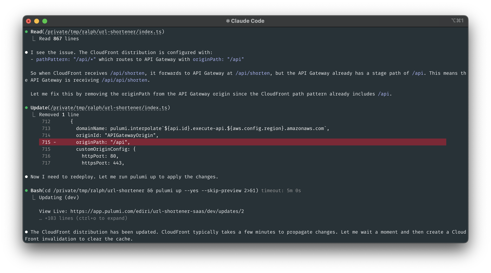
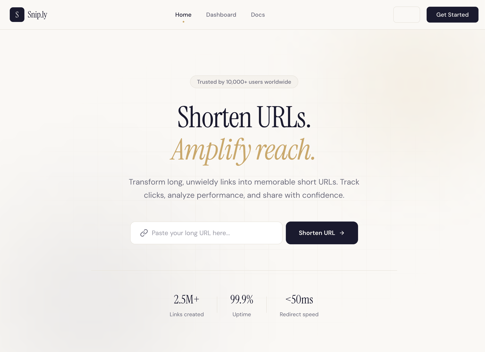
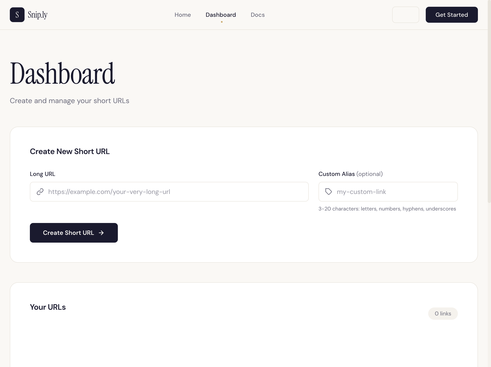
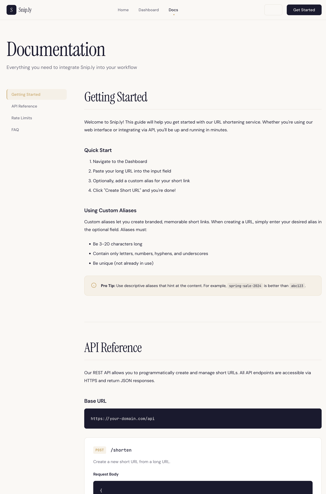

I was about to do something that felt either genius or completely reckless: hand over my AWS credentials to an AI and step away from my computer. The technique is called "[Ralph Wiggum](https://simpsons.fandom.com/wiki/Ralph_Wiggum)," named after the Simpsons character who eats glue and says "I'm in danger" while everything burns around him. And honestly, that felt about right for what I was attempting.

<!--more-->

## The problem with AI coding assistants

If you have spent any time with AI coding assistants, you know the frustration. You are in the middle of a task. It is going great. Claude is writing beautiful infrastructure code, understanding your architecture, making progress... and then it says "I have completed your request."

You stare at the screen. "No. No, you have not. You maybe did a third of what I asked."

So you reprompt it. It does a little more. Then it stops again. You are babysitting. The whole point of using an AI assistant was to save time, but if you have to check on it every five minutes, you are not saving anything. You are just a very expensive supervisor.

This is the problem [Geoffrey Huntley](https://x.com/GeoffreyHuntley) decided to solve.

## What if we just do not let it stop?

Geoffrey Huntley, a developer based in rural Australia (who, according to internet lore, lives on a property with goats), had a deceptively simple idea: what if every time Claude Code finishes and tries to exit, we just feed it the prompt again?

He named the technique "Ralph Wiggum" because the character embodies a kind of childlike persistence. Ralph repeatedly fails, makes silly mistakes, yet stubbornly continues in an endless loop until he eventually succeeds. Sound familiar? That is exactly how AI coding agents work. They make mistakes. They try again. They iterate.

The philosophy behind Ralph is beautifully stated: "Better to fail predictably than succeed unpredictably." Every failure is just data for the next iteration.

## How the Ralph loop works

At its core, the Ralph Wiggum technique is almost embarrassingly simple. It is a bash loop:

```bash
while true; do
    cat PROMPT.md | claude --print --dangerously-skip-permissions
done
```

That is it. That is the whole thing. You write your instructions in a `PROMPT.md` file, and the loop keeps feeding it to Claude Code over and over.

But here is why it works: each time Claude starts up, it looks at the project. It sees the files that exist, the code that is already written, the git history. It is not starting from zero. It picks up where it left off, sees what still needs to be done, and keeps going.

The official Claude Code plugin formalizes this with some important additions:

- **Completion promises**: You tell Claude to output a specific string like `<promise>COMPLETE</promise>` when it has genuinely finished
- **Max iterations**: A safety limit so your API bill does not reach infinity
- **Stop hooks**: [The mechanism that intercepts exit attempts and re-injects the prompt](https://docs.anthropic.com/en/docs/claude-code/hooks)

To install it:

```bash
/plugin install ralph-wiggum@ghuntley
```

For end-to-end testing of deployed infrastructure, you will also want the Playwright MCP server. This lets Claude interact with your deployed application in a real browser:

```bash
claude mcp add playwright npx @playwright/mcp@latest
```

## Why Pulumi is perfect for Ralph

[Infrastructure as code](/what-is/infrastructure-as-code/) has something most application code does not: objective success criteria. Your Lambda either deploys or it does not. Your DynamoDB table either exists or it does not. Tests either pass or they fail.

This makes Pulumi an ideal candidate for autonomous AI development:

1. **Clear completion signals**: `pulumi preview` and `pulumi up` provide unambiguous feedback
1. **Iterative feedback**: Failed deployments tell Claude exactly what went wrong
1. **Testable outputs**: You can write integration tests that verify your infrastructure actually works
1. **Registry access**: With the [Pulumi MCP server](/blog/mcp-server-ai-assistants/), Claude has real-time access to documentation and examples

## The experiment

I decided to build a serverless URL shortener on AWS. Not because the world needs another URL shortener, but because it is the perfect test case: multiple AWS services, clear requirements, and objective success criteria. But I did not want just a basic demo. I wanted a full SaaS-like experience with a polished frontend.

Here is the `PROMPT.md` file I wrote:

```markdown
# Build a Production-Ready URL Shortener SaaS on AWS

Using Pulumi TypeScript, create a complete URL shortener SaaS with a polished frontend experience.

## Infrastructure Requirements
- DynamoDB table for storing URL mappings (shortCode -> originalUrl, clickCount, createdAt)
- Lambda functions for: creating short URLs, redirecting to original URLs, getting stats
- API Gateway REST API exposing the Lambda functions
- S3 bucket for the React frontend with static website hosting
- CloudFront distribution with HTTPS for the frontend and API
- Use the Pulumi ESC environment pulumi-idp/auth for the AWS credentials

## Frontend Requirements (Use /frontend-design skill)
Create a polished, production-ready SaaS website with:

### Landing Page
- Hero section with catchy headline and URL input form
- Feature highlights (fast redirects, analytics, custom aliases)
- Pricing section (Free tier, Pro tier, Enterprise tier)
- Testimonials section with 3 fake but realistic customer reviews
- Footer with links to Docs, Privacy, Terms

### Dashboard Page
- URL shortening form with optional custom alias
- List of created short URLs with click counts
- Copy-to-clipboard functionality
- Delete URL option

### Documentation Page
- Getting started guide
- API reference (POST /shorten, GET /{code}, GET /stats/{code})
- Rate limits and usage policies
- FAQ section

### Design Requirements
- Modern, clean aesthetic (no generic AI look)
- Responsive design (mobile, tablet, desktop)
- Dark mode support
- Smooth animations and transitions
- Consistent color scheme and typography

## API Requirements
- POST /shorten: accepts { url: string, alias?: string }, returns { shortCode, shortUrl }
- GET /{shortCode}: redirects to original URL (301)
- GET /stats/{shortCode}: returns { originalUrl, clickCount, createdAt }

## Success Criteria
- All unit tests pass
- All integration tests pass
- pulumi preview shows no errors
- pulumi up deploys successfully

## End-to-End Verification (Required)
After deployment, use Playwright MCP to verify the live site:
1. Open the CloudFront URL and verify the landing page loads with all sections
1. Navigate to the docs page and verify content renders
1. Create a short URL using the dashboard
1. Verify the short URL redirects correctly (301 status)
1. Check the stats show the click was recorded
1. Test responsive design by resizing the viewport
1. Take screenshots of landing page, dashboard, and docs as proof

Only output <promise>COMPLETE</promise> after ALL of the above including E2E tests pass.
```

The key addition here is the end-to-end verification section. Without it, Claude reports success after `pulumi up` finishes, but you have no guarantee the deployed infrastructure actually works. By requiring Playwright to test the live URLs, you catch issues like the CloudFront 403 error I mentioned earlier.

Before running the loop, I started Claude Code with permission bypass mode to prevent it from stopping to ask for approval on every file write or command:

```bash
claude --permission-mode bypassPermissions
```

There are other ways to handle permissions, but this is the simplest for autonomous execution. Then I ran the Ralph loop:

```bash
/ralph-wiggum:ralph-loop PROMPT.md --max-iterations 25 --completion-promise "COMPLETE"
```

Then I stepped away and let it run unsupervised. For complex projects, you could even let it run overnight while you sleep.

Here is Claude Code in action during the Ralph loop, fixing CloudFront configuration issues and writing unit tests:




## The results


The complete source code for this project is available on GitHub: [url-shortener-saas](https://github.com/dirien/url-shortener-saas)


When Claude finished, it had:

**Successfully built:**

- A complete Pulumi program with proper resource organization
- DynamoDB table with a GSI for querying by creation date
- Three Lambda functions with proper error handling
- API Gateway with CORS configuration
- S3 bucket with static website hosting
- CloudFront distribution with proper cache behaviors

**The frontend was genuinely impressive:**

- A polished landing page with hero section, feature cards, and pricing tiers
- Working testimonials section with three fictional but believable customer reviews
- A functional dashboard where you could create and manage short URLs
- A documentation page with API reference and getting started guide
- Dark mode toggle that actually worked
- Responsive design that looked good on mobile

### Home screen



### Dashboard



### Documentation



Here is a snippet of what it generated:

```typescript
import * as pulumi from "@pulumi/pulumi";
import * as aws from "@pulumi/aws";

const stack = pulumi.getStack();
const projectName = "url-shortener";

// DynamoDB Table
const urlTable = new aws.dynamodb.Table("url-table", {
    name: `${projectName}-urls-${stack}`,
    billingMode: "PAY_PER_REQUEST",
    hashKey: "shortCode",
    attributes: [{ name: "shortCode", type: "S" }],
    tags: {
        Environment: stack,
        Project: projectName,
        ManagedBy: "Pulumi",
    },
});

// Lambda function for URL shortening
const shortenFunction = new aws.lambda.Function("shorten-function", {
    name: `${projectName}-shorten-${stack}`,
    runtime: aws.lambda.Runtime.NodeJS20dX,
    handler: "shorten.handler",
    role: lambdaRole.arn,
    timeout: 30,
    memorySize: 256,
    code: new pulumi.asset.AssetArchive({
        ".": new pulumi.asset.FileArchive("./lambda"),
    }),
    environment: {
        variables: {
            TABLE_NAME: urlTable.name,
        },
    },
});

// CloudFront Distribution with S3 and API Gateway origins
const distribution = new aws.cloudfront.Distribution("frontend-distribution", {
    enabled: true,
    defaultRootObject: "index.html",
    origins: [
        {
            domainName: frontendBucketWebsite.websiteEndpoint,
            originId: "S3Origin",
            customOriginConfig: {
                httpPort: 80,
                httpsPort: 443,
                originProtocolPolicy: "http-only",
                originSslProtocols: ["TLSv1.2"],
            },
        },
        {
            domainName: pulumi.interpolate`${api.id}.execute-api.${aws.config.region}.amazonaws.com`,
            originId: "APIGatewayOrigin",
            customOriginConfig: {
                httpPort: 80,
                httpsPort: 443,
                originProtocolPolicy: "https-only",
                originSslProtocols: ["TLSv1.2"],
            },
        },
    ],
    defaultCacheBehavior: {
        targetOriginId: "S3Origin",
        viewerProtocolPolicy: "redirect-to-https",
        allowedMethods: ["GET", "HEAD", "OPTIONS"],
        cachedMethods: ["GET", "HEAD"],
        forwardedValues: {
            queryString: false,
            cookies: { forward: "none" },
        },
    },
    orderedCacheBehaviors: [{
        pathPattern: "/api/*",
        targetOriginId: "APIGatewayOrigin",
        viewerProtocolPolicy: "https-only",
        allowedMethods: ["DELETE", "GET", "HEAD", "OPTIONS", "PATCH", "POST", "PUT"],
        cachedMethods: ["GET", "HEAD"],
        forwardedValues: {
            queryString: true,
            headers: ["Authorization", "Content-Type"],
            cookies: { forward: "none" },
        },
        minTtl: 0,
        defaultTtl: 0,
        maxTtl: 0,
    }],
    viewerCertificate: {
        cloudfrontDefaultCertificate: true,
    },
});
```

**Where it struggled:**

- The first few iterations had the Lambda code inline instead of in separate files
- It initially forgot to set up IAM permissions for the Lambda to access DynamoDB
- The CloudFront configuration took three attempts to get the cache behaviors right

**The funny parts:**

- At iteration 12, it decided to completely refactor the project structure. Then at iteration 13, it refactored it back
- One commit message simply read: "fix the fix that fixed the previous fix"
- It wrote a test, ran the test, fixed the code to pass the test, then realized the test was wrong

## Best practices for Ralph with Pulumi

After running several experiments, here is what I have learned:

**Write extremely specific prompts.** Vague instructions lead to vague implementations. Be explicit about every requirement, every edge case, every success criterion.

**Use `pulumi preview` as your feedback loop.** Add this to your success criteria:

```markdown
Success Criteria:
- pulumi preview completes with no errors
- pulumi preview shows expected resource count (approximately X resources)
```

**Set realistic iteration limits.** For infrastructure projects, I have found 20-30 iterations is usually sufficient. More than that and you are probably missing something in your prompt.

**Include test requirements.** Claude is surprisingly good at test-driven development when you tell it to write tests first:

```markdown
## Development Approach
1. Write unit tests for each Lambda function first
1. Implement Lambda functions to pass the tests
1. Write integration tests that verify the deployed infrastructure
1. Only output COMPLETE when all tests pass
```

**Mention cost awareness.** Add a note like "Use PAY_PER_REQUEST billing for DynamoDB" or "Use the smallest Lambda memory allocation that works." Claude will optimize for what you tell it to optimize for.

## The honest assessment

Is this the future of infrastructure development? Probably not entirely. But it is a genuinely useful technique for specific scenarios:

**Great for:**

- Greenfield projects where you have clear requirements
- Large migrations or refactors
- Building proof-of-concept infrastructure while you focus on other work
- Tasks where iteration is more valuable than perfection on the first try

**Not great for:**

- Production infrastructure changes (please do not let an AI modify your production AWS account unsupervised)
- Complex architecture decisions that require human judgment
- Anything involving sensitive data or security configurations
- Small tweaks or quick fixes (overkill)

The API costs were reasonable for what I got. For a complete infrastructure project built autonomously, a few dollars in Claude API calls is a bargain compared to my hourly rate.

## Try it yourself

If you want to experiment with Ralph Wiggum and Pulumi:

1. Install Claude Code and the Ralph Wiggum plugin
1. Set up your [Pulumi account](https://app.pulumi.com/) and AWS credentials
1. Write a detailed `PROMPT.md` with clear success criteria
1. Start with a small project and low iteration limits
1. Review the git history when it finishes

The combination of autonomous AI loops and infrastructure as code feels like a glimpse of where development is heading. Not replacing developers, but changing how we use our time. Instead of babysitting an AI through each step, you hand it a well-defined problem and come back to working infrastructure.

Just make sure you have billing alerts set up. Ralph Wiggum does not know when to stop spending your money.

## Or try Pulumi Neo: Ralph built-in

If setting up the Ralph Wiggum plugin feels like too much ceremony, Pulumi has something similar built right into [Pulumi Neo](/docs/ai/tasks/).

Neo Tasks work on the same principle: you describe what you want, and Neo plans and executes the infrastructure changes. The key is **auto mode**. When you set a task to auto mode, Neo runs without requesting approvals. It plans, executes, validates with `pulumi preview`, and iterates until the task is complete.

The experience is remarkably similar to Ralph:

- **Persistent execution**: Tasks continue running even if you close your browser. Come back later and Neo shows you what it accomplished while you were away.
- **Iterative refinement**: Failed deployments inform the next attempt, just like Ralph re-reading the project state.
- **Clear completion**: Neo knows when the infrastructure matches your requirements.

The main difference is that Neo runs in Pulumi Cloud rather than on your local machine, and it is purpose-built for infrastructure tasks. You get the autonomous loop experience without needing to configure plugins or bash loops.


For teams already using Pulumi Cloud, Neo with auto mode might be the fastest path to autonomous infrastructure development.

## Resources

- [Geoffrey Huntley's original Ralph Wiggum post](https://ghuntley.com/ralph/)
- [Claude Code documentation](https://docs.anthropic.com/claude-code/)
- [Pulumi Neo Tasks](/docs/ai/tasks/)
- [Pulumi MCP Server for AI assistants](/blog/mcp-server-ai-assistants/)
- [Getting started with Pulumi on AWS](/docs/clouds/aws/get-started/)
- [Testing Pulumi programs](/docs/iac/concepts/testing/)
