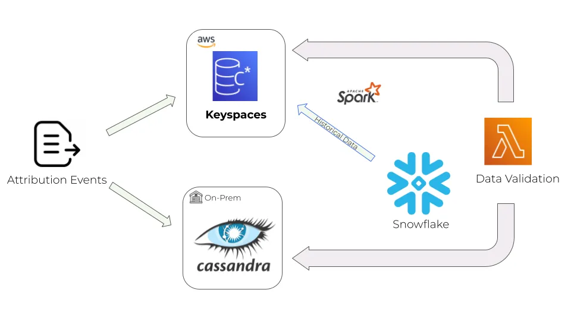

> Danny Zalkind is the Senior Director of Infrastructure Engineering for Skai, an award-winning intelligent marketing platform. He brings his 15 years of experience of managing tech teams to his current role where he's dedicated to allow Skai R&D to efficiently produce and serve software. You can find him on [Linkedin](https://www.linkedin.com/in/danny-zalkind-01602b56/).

As Skai continues its journey towards [fully migrating to the cloud using Pulumi](https://www.pulumi.com/blog/kenshoo-migrates-to-aws-with-pulumi/), we've taken another large bite out of the migration pie, moving our most critical data to AWS on top of [Amazon Keyspaces](https://aws.amazon.com/keyspaces/), an Apache Cassandra–compatible database service.

This blog post will dive into how we used Pulumi and AWS Lambda to perform the migration.

## Offloading a piece of the pie to AWS

First, some background on what we do. Skai helps marketers work smarter and faster with a unified platform to reach and convert shoppers. An important service we provide to our clients is optimization of their digital marketing campaign efficiency. We store billions of events per day to enable clients to continuously improve the value they get from their ad spend.

Our on-premises setup included a 100-node Apache Cassandra cluster to be able to withstand the scale of billions of events, some stored for prolonged periods of time. Maintaining and scaling this setup was a high effort from our Data Infra teams. It was clear to us it was time to offload that piece of the pie to our cloud provider.

## Why Amazon Keyspaces

When looking for a solution, we were looking for a service that would mark the following checkboxes:

* Fully serverless to allow us focus on our business instead of server maintenance.
* Scalability should be automatic and easy to perform.
* High availability and multi-region built-in.
* Cost effective pay-as-you-go and commitment-based model.
* Extensive support and rich documentation.
* Fully automatable using Pulumi, our main Infrastructure as Code framework.

## Migration method

Let's take a look at how we set up the migration. We decided to migrate the data using a dual-write method, writing new data to both our on-prem Cassandra cluster and Keyspaces. Any historical data needed could be fetched from Snowflake, our data lake solution, using our Apache Spark pipeline.



Finally, to make sure that the data is valid and we have no data discrepancies on the Keyspaces side, we added a Lambda function to periodically sample the data and compare it to the data in our on-prem cluster.

We made a conscious decision to decouple the application code from the provisioning of the infrastructure, letting Pulumi handle all resource creation and configuration, while the application team used our standard CI/CD pipeline to deliver their code to the service owning the Keyspaces data.

## Let's start provisioning

Keyspaces requires creating a logical entity called a keyspace, which groups related tables relevant for one or more applications. After that, we iterate over our config and create each table with the relevant columns and the preferred provisioning mode --- either "on-demand" or "provisioned," depending on our workload pattern. A provisioned workload in pre-allocated and thus significantly (x7) lower in hourly price, suitable mainly for use cases where the workload is quite predictable with no spikes.

Finally we populate AWS tags in order to be able track costs and performance metrics.

The following Python code illustrates the process:

```python
import pulumi
import pulumi_aws as aws
from pulumi_komponents.account_provider.account_provider import get_account_provider

# Define resource tagging
def __populate_tags(aws_config: pulumi.Config, component_type: str, tags: dict):
    return {
        "Project": pulumi.get_project(),
        "Environment": aws_config.require("account"),
        "Type": component_type,
        **tags,
    }

def pulumi_program():
    aws_config = pulumi.Config("aws")
    keyspaces_config = pulumi.Config("keyspaces")
    tags = keyspaces_config.require_object("tags")
    provider = get_account_provider(aws_config)

    # Define keyspace
    keyspace = aws.keyspaces.Keyspace(
        resource_name=f'keyspaces-{keyspaces_config.require("name")}',
        name=keyspaces_config.require("name"),
        tags=__populate_tags(aws_config, "keyspace", tags),
        opts=pulumi.ResourceOptions(provider=provider, protect=True),
    )

    # Define and iterate over keyspace tables
    tables = keyspaces_config.require_object("tables")

    for table_name, table_ddl in tables.items():
        columns = []
        partition_keys = []
        clustering_keys = []
        static_columns = []
        for col in table_ddl.get("schema").get("columns"):
            name, type = col.popitem()
            columns.append(
                aws.keyspaces.TableSchemaDefinitionColumnArgs(name=name, type=type)
            )
        for par in table_ddl.get("schema").get("partition_keys"):
            partition_keys.append(
                aws.keyspaces.TableSchemaDefinitionPartitionKeyArgs(name=par)
            )
        for cl in table_ddl.get("schema").get("clustering_keys") or []:
            name, order_by = cl.popitem()
            clustering_keys.append(
                aws.keyspaces.TableSchemaDefinitionClusteringKeyArgs(
                    name=name, order_by=order_by
                )
            )
        for s_col in table_ddl.get("schema").get("static_columns") or []:
            static_columns.append(
                aws.keyspaces.TableSchemaDefinitionStaticColumnArgs(name=s_col)
            )

        mode = table_ddl.get("throughput").get("mode")

        aws.keyspaces.Table(
            resource_name=f"keyspaces-table-{table_name}",
            keyspace_name=keyspace.name,
            table_name=table_name,
            schema_definition=aws.keyspaces.TableSchemaDefinitionArgs(
                columns=columns,
                partition_keys=partition_keys,
                clustering_keys=clustering_keys,
                static_columns=static_columns,
            ),

            # Set capacity mode and units for read and write per Table
            capacity_specification=aws.keyspaces.TableCapacitySpecificationArgs(
                throughput_mode=mode,
                read_capacity_units=table_ddl.get("throughput").get("rcu")
                if mode == "PROVISIONED"
                else None,
                write_capacity_units=table_ddl.get("throughput").get("wcu")
                if mode == "PROVISIONED"
                else None,
            ),

            # Set general table properties such as TTL and recovery method
            default_time_to_live=None,
            ttl=aws.keyspaces.TableTtlArgs(status="ENABLED"),
            point_in_time_recovery=aws.keyspaces.TablePointInTimeRecoveryArgs(
                status="ENABLED"
            ),

            # Populate AWS resource tagging
            tags=__populate_tags(
                aws_config,
                "table",
                {
                    "Table-type": "unarchived"
                    if table_name.endswith("_unarchived")
                    else "standard",
                    **tags,
                },
            ),
            opts=pulumi.ResourceOptions(
                parent=keyspace, provider=provider, protect=True
            ),
        )
```

## Comparison Lambda

Next we define and create a Lambda function that samples and compares data between the data newly ingested into  Keyspaces, our on-premise Cassandra cluster, and our data lake Snowflake.

We created an abstract class implementation of AWS Lambda to standardize our various Lambda implementations and keep the code readable. This class returns all needed arguments, configuration, layers, etc. Here is some Python code that shows our abstraction, named `AwsFunction`:

```python
class AwsFunction(AbstractAwsFunction):
    def __init__(self, args: AwsFunctionArgs):
        super().__init__(resource_type="AwsLambda:Function", args=args)

    # Set Lambda zip artificate path
    def _create_function(self) -> aws.lambda_.Function:
        code_archive_path = f"/tmp/{self.args.name}.zip"
        with zipfile.ZipFile(code_archive_path, "w") as zip_obj:
            zip_sub_folders(
                root_source=self.args.functions_absolute_path,
                destination=code_archive_path,
                selected_sub_folders=[ZIP_COMMON_DIR, self.args.code_directory_name],
                zip_obj=zip_obj,
            )

        # Get iam role, kms keys and layers
        self.function_role = self._get_function_role()
        self.kms_key = self._create_kms()
        layers_arn, layers = self.__build_layers()

        # Return function outputs
        return aws.lambda_.Function(
            resource_name=generate_resource_name(self.args.name, "function"),
            name=self.args.function_name,
            role=self.function_role.arn,
            package_type=self.args.package_type,
            architectures=[self.args.architecture.lambda_value],
            handler=self.args.handler,
            memory_size=self.args.memory_size,
            reserved_concurrent_executions=self.args.concurrent_executions,
            runtime=self.args.runtime,
            code=pulumi.FileArchive(code_archive_path),
            timeout=self.args.timeout,
            layers=layers_arn,
            tags=self._populate_tags(component="lambda", resource_type="function"),
            kms_key_arn=self.kms_key.arn,
            environment=aws.lambda_.FunctionEnvironmentArgs(
                variables=self.args.environment_variables.to_dict()
            ),
            vpc_config=self.args.vpc_config,
            opts=ResourceOptions(
                provider=self.args.provider, depends_on=[self.kms_key] + layers
            ),
        )
```

Now we instantiate the abstract class as part of our "building block" component class, create the function, triggers and invocation:

```python
class AwsLambda(ComponentResource):
    def __init__(self, args: AwsLambdaArgs):
        super().__init__(f"AwsLambda", args.lambda_name)

        # Define the function nased on the abstract class
        aws_function = (
            AwsFunction(args.aws_function_args)
            if args.aws_function_args.package_type == "Zip"
            else AwsFunctionContainer(args.aws_function_args)
        )

        # Add triggers
        triggers = {}
        for trigger, config in args.aws_function_args.lambda_triggers.items():
            triggers[trigger] = LAMBDA_TYPES_TO_DEF[trigger](
                config, aws_function.function, args.provider, args.tags
            )

        # Add async invocation config
        FunctionEventInvokeConfig(
            generate_resource_name(args.lambda_name, "event-invoke-config"),
            function_name=aws_function.function.name,
            destination_config=FunctionEventInvokeConfigDestinationConfigArgs(
                on_failure=FunctionEventInvokeConfigDestinationConfigOnFailureArgs(
                    destination=args.aws_function_args.on_failure_arn,
                )
                if args.aws_function_args.on_failure_arn
                else None,
                on_success=FunctionEventInvokeConfigDestinationConfigOnSuccessArgs(
                    destination=args.aws_function_args.on_success_arn,
                )
                if args.aws_function_args.on_success_arn
                else None,
            ),
            qualifier=args.aws_function_args.qualifier,
            maximum_event_age_in_seconds=args.aws_function_args.maximum_event_age_in_seconds,
            maximum_retry_attempts=args.aws_function_args.maximum_retry_attempts,
            opts=ResourceOptions(provider=args.provider),
        )
```

Now we're ready to call our class to create our comparison Lambda:

```python
from pulumi_komponents.awslambda import AwsLambda, AwsLambdaArgs
from pulumi import Config

config = Config()

AwsLambda(AwsLambdaArgs(config))
```

Note: This only a partial code example, meant to demonstrate the way we use object-oriented paradigms to create reusable building-blocks of code to be consumed by various platform and R&D teams to provision AWS resources.

## Putting it all together

Once we have our Keyspaces setup in place and the confidence that our dual-write process is writing the data correctly, we are now able to wait enough time to accumulate the data on the AWS side, using a feature toggle in our application to switch our backend systems to work with AWS Keyspaces.

## Outcome

Following the successful migration, we have gained 50% reduction in backend process runtime, increased event processing throughput by 400% and freed up 30% of our team's time to do other things, instead of maintaining cluster infrastructure.

I hope this post provides readers with useful techniques and ideas for migrating large-scale databases to the public cloud.
