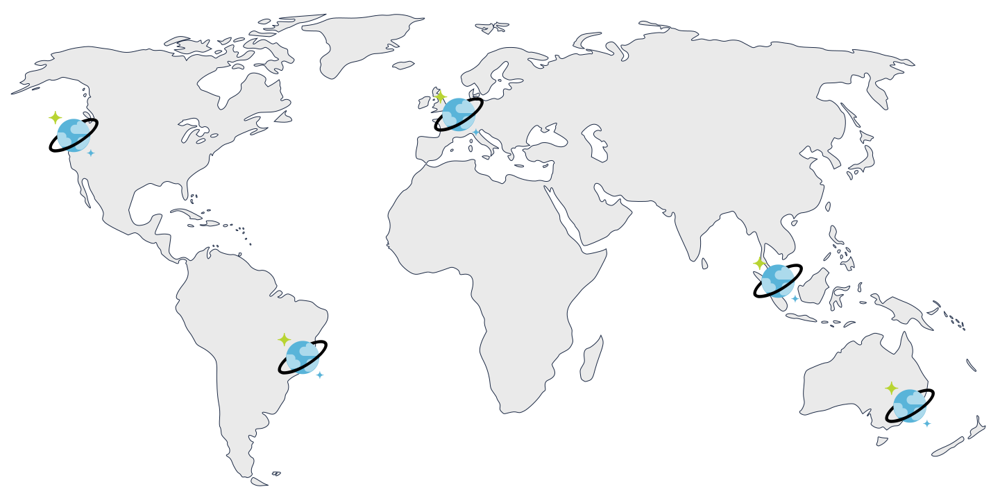

In a [previous blog post](), I shared how easy it is to create a globally distributed, highly-available, low-latency application with Azure Functions, Azure Cosmos DB, and Pulumi.

Today, I want to show how the same approach can be generalized for any cloud compute service, including containers, virtual machines, and serverless functions.

<!--more-->

## E-commerce Example

Let’s consider an example of an e-commerce website which targets a worldwide audience. The architecture of such a website should address several challenges.

### Multiple Teams

A large e-commerce website is a sophisticated software application and consists of many subcomponents. Many engineers in multiple teams work on it simultaneously.

A typical approach is to organize engineers into smaller teams and make each team autonomous and responsible for one or several business domains. This strategy leads to microservices architecture when the application is built out of loosely coupled components. Each component represents a "vertical slice": a team owns functionality across the vertical stack, from its user interface and service API to the data storage layer and underlying infrastructure.

Here is an example of such a breakdown:


{}Multiple components on a single web page{}

### Diversity of Technology Decisions

One of the guiding principles of microservices architecture is that each team makes decisions regarding which tools and technologies to use. They are free to choose programming languages, databases, or cloud services that are the best fit for the service. In practice, some restrictions do apply---for instance, the teams might need to share the same cloud provider.

In our hypothetical example, the whole product is hosted on Azure cloud, however other aspects differ:

- Product Page team runs JavaScript serverless functions and stores data in a document database
- Shopping Cart team uses C# and .NET Core, packages the code in a Docker container, and uses event sourcing to store every action ever made by users while shopping
- Pricing Engine team has a mix of Java and C++ code with a bunch of third-party libraries and deploys the services to Ubuntu VMs that use MongoDB drivers for storage

### Global Presence

Regardless of the tech, the user-facing services must serve customers across the globe and serve them fast. This requirement demands a geo-distributed infrastructure so that user requests could be handled by the nearest data center to minimize the latency and ensure excellent user experience.

Each team has to solve the following problems in a way which fits their tech stack:

- Distribute the data across the globe
- Run their compute workload in each region next to the data
- Manage all this infrastructure in a reliable way

Let's consider these goals and possible solutions.

## Azure Cosmos DB

Distributing data across many data centers while keeping them consistent and available is one of the hardest problems in computer science and engineering. Delegating this challenge to a specialized service or product is usually a sensible idea.

Azure Cosmos DB is the database of choice for global applications running in the Azure cloud. Cosmos DB provides a turn-key global distribution to any number of regions worldwide. Regions can be added or removed along the way while running production workloads and without having any impact on high availability. The accounts can be provisioned with a single write region or in multi-master mode with every region being writable, thus enabling writes that are local to each region.



{}Azure Cosmos DB with multiple locations{}

Cosmos DB supports multiple models of data: key-value, document, column family, graph, with wire-protocol compatible APIs for MongoDB, Apache Cassandra, SQL, etcd, Gremlin, etc. It also supports multiple well-defined and practical consistency levels, from eventual to strong consistency, so that each application can strike the right balance between latency, availability, and consistency guarantees. All of this is offered as a fully-managed service, with the comprehensive SLAs covering latency, throughput, consistency, and 99.999% high availability for both reads and writes.

Sounds great, but how do we build applications to leverage this power?

## Distributed Web Applications

In contrast to Cosmos accounts, compute services in Azure are located in a single region. This holds true for Virtual Machines, Container Instances, Serverless Functions, and managed Azure Kubernetes Service.

If an application is deployed to a single location, we are not making good use of geographic redundancy of the database. If a user happens to be far from the application region, their request has to travel across the globe. Moreover, the application connects to the nearest region of Cosmos DB, while all other regions stay idle:


{}Application deployed in a single location{}

Instead, we should deploy a copy of application infrastructure to each of the target regions:


{}Application deployed in multiple locations{}

Each application instance has to be configured to connect to the endpoint of the Cosmos DB in the same region to enjoy local single-digit-milliseconds latency for reads and writes.

While beneficial to end-users, such setup brings much extra complexity in terms of infrastructure management:

- Application regions must stay in sync with Cosmos DB regions, including the correct configuration of preferred locations.
- With the growth of the number of regions, the traditional capacity planning gets harder and harder. This makes a dynamic auto-scaling configuration increasingly important.
- A central routing service must be configured to flow the traffic from end-users to the closest application instance.
- Each team must execute all these tasks, independently but coherently.

Let’s see how infrastructure as code and a general-purpose programming language come to the rescue.

## Search for a Reusable Abstraction

In our example, three teams have a common goal of providing high-quality service to customers around the world, but they differ in the compute services they want to use.

Product Card team relies on serverless functions, so their infrastructure may look like this:


{}Global application with Azure Functions{}

Shopping Cart team packages their code as a Docker container, which they put into Azure Container Registry, and then use Azure Container Instances to run the application. The Registry is a global Azure resource, while Container Instances are deployed separately per region.


{}Global application with Azure Container Instances{}

Pricing Engine team runs their code on Infrastructure-as-a-Service (IaaS), so they have a task of creating Virtual Machine images, and then deploying those to an Azure Virtual Machine Scale Set, fronting it with a Load Balancer, and configuring all the networking infrastructure including Virtual Networks, Subnets, Public IPs, Network Security Groups, etc. Once again, this has to be done for each location independently.


{}Global application with Virtual Machines{}

Each team has the same global structure of infrastructure, including a Traffic Manager front-end and a Cosmos DB data store. At the same time, the per-region compute infrastructure differs substantially.

Instead of copying the common pieces of infrastructure between the teams, we can think of a reusable abstraction which could be shared by every service.


{}Global application pattern{}

For this blog post, I created a custom Pulumi component called CosmosApp which implements such abstraction and simplifies the provisioning of global web applications. The component creates distributed Cosmos DB resources, as well as the front-end routing component, while allowing pluggable compute layer implementation.

## Cosmos App with Azure Functions

Let's look at an example of how the component can be used. Creating a globally-distributed application requires three steps:

### List the Regions

We define a configuration value to contain a comma-separated list of Azure regions that we’ll deploy the application to.

```
$ pulumi config set locations WestUS,WestEurope,SouthEastAsia,SouthBrazil,AustraliaCentral
```

This value can be loaded and parsed into a JavaScript array:

```ts
const locations = new pulumi.Config().require("locations").split(",");
```

### Build a Region Template

We define a factory function to create the infrastructure in each location. Its signature is a bit unusual in that we return a function from another function. I'll explain the motivation in the next example. For now, it's important to understand the following:

- We get a Cosmos account and a location as input arguments
- We create a Function App in the specified location with connection settings pointing to the local Cosmos DB replica
- We return the identifier of the Function App so that a Traffic Manager endpoint could point to it

Here is the function:

```ts
function buildProductApp({ cosmosAccount }: GlobalContext) {
    return ({ location }: RegionalContext) => {
        const app = new azure.appservice.ArchiveFunctionApp("function-app", {
            resourceGroupName: resourceGroup.name,
            location,
            archive: new pulumi.asset.FileArchive("./app"),
            appSettings: {
                COSMOSDB_ENDPOINT: cosmosAccount.endpoint,
                COSMOSDB_KEY: cosmosAccount.primaryMasterKey,
                COSMOSDB_LOCATION: location,
            },
        });

        return {
            id: app.functionApp.id,
        };
    };
}
```

### Instantiate a Cosmos App

Finally, we use the `buildProductApp` factory function to create the geo-distributed application:

```ts
const products = new CosmosApp("products", {
    resourceGroup,
    locations,
    databaseName: "productsdb",
    containerName: "products",
    factory: buildProductApp,
});
```

[ [Full Example](https://github.com/pulumi/examples/tree/master/azure-ts-cosmosapp-component/functionApp.ts) ]

## Cosmos App with Container Instances

The Shopping Cart team will have to follow the same steps but define their compute infrastructure accordingly.

A significant difference to the Functions-based example is the fact that the Container-based application needs some infrastructure to be shared across regions. The top block of the factory function defines an instance of Azure Container Registry, builds a Docker image, and puts that image into the Registry:

```ts
function buildShoppingCartApp({ cosmosAccount, database, container }: GlobalContext) {

    const registry = new azure.containerservice.Registry("global", {
        resourceGroupName: resourceGroup.name,
        adminEnabled: true,
        sku: "Premium",
    }, opts);

    const dockerImage = new docker.Image("node-app", {
        imageName: pulumi.interpolate`${registry.loginServer}/mynodeapp:v1.0.0`,
        build: {
            context: "./container",
        },
        registry: {
            server: registry.loginServer,
            username: registry.adminUsername,
            password: registry.adminPassword,
        },
    });

    return ({ location }: RegionalContext) => {
        // ... see the next sample
    };
}
```

Now, the factory function that builds per-region infrastructure can directly reference the Registry and the image to deploy an Azure Container Instances group. Note how `registry` and `dockerImage` are used as any other TypeScript variable inside the closure factory function:

```ts
function buildShoppingCartApp({ cosmosAccount, database, container }: GlobalContext) {

    const registry = new azure.containerservice.Registry(/* ... */);
    const dockerImage = new docker.Image(/* ... */);

    return ({ location }: RegionalContext) => {
        const group = new azure.containerservice.Group(`aci-${location}`, {
            resourceGroupName: resourceGroup.name,
            location,
            imageRegistryCredentials: [{
                server: registry.loginServer,
                username: registry.adminUsername,
                password: registry.adminPassword,
            }],
            osType: "Linux",
            containers: [
                {
                    cpu: 0.5,
                    image: dockerImage.imageName,
                    memory: 1.5,
                    name: "web-server",
                    ports: [{
                        port: 80,
                        protocol: "TCP",
                    }],
                    environmentVariables: {
                        ENDPOINT: cosmosAccount.endpoint,
                        MASTER_KEY: cosmosAccount.primaryMasterKey,
                        DATABASE: database.name,
                        COLLECTION: container.name,
                        LOCATION: location,
                    },
                },
            ],
            ipAddressType: "public",
            dnsNameLabel: `acishop-${location}`,
        });

        return {
            url: group.fqdn,
        };
    };
}
```

Finally, a `CosmosApp` is defined:

```ts
const aci = new CosmosApp("aci", {
    resourceGroup,
    locations,
    databaseName: "cartdb",
    containerName: "items",
    factory: buildShoppingCartApp,
    enableMultiMaster: true,
});
```

Shopping Cart workload expects both reads and writes from the end-users, so the team decides to enable multi-master support in their Cosmos DB instance.

[ [Full Example](https://github.com/pulumi/examples/tree/master/azure-ts-cosmosapp-component/aci.ts) ]

## Cosmos App with Virtual Machine Scale Sets

The Pricing Engine team has to go through the same steps but employ IaaS-based infrastructure to run application code. The factory function creates a dozen resources related to virtual machines, load balancing, networking, and auto-scaling. You may define as many resources as needed in the code, as long as it returns a pointer to the proper resource to link the endpoint.

```ts
function buildVMScaleSetApp({ cosmosAccount, database }: GlobalContext) {

    // Build a VM image here...

    // Define a MongoDB compatible collection
    const collection = new azure.cosmosdb.MongoCollection(`mongo-${name}`, {
        resourceGroupName: resourceGroup.name,
        accountName: cosmosAccount.name,
        databaseName: database.name,
    });

    return ({ location }: RegionalContext) => {

        const publicIp = new azure.network.PublicIp(/* ... */);
        const loadBalancer = new azure.lb.LoadBalancer(/* ... */);
        const bpepool = new azure.lb.BackendAddressPool(/* ... */);
        const probe = new azure.lb.Probe(/* ... */);
        const rule = new azure.lb.Rule(/* ... */);
        const vnet = new azure.network.VirtualNetwork(/* ... */);
        const subnet = new azure.network.Subnet(/* ... */);
        const scaleSet = new azure.compute.ScaleSet(/* ... */);
        const autoscale = new azure.monitoring.AutoscaleSetting(/* ... */);

        return {
            id: publicIp.id,
        };
    };
}
```

The code also uses a collection with the MongoDB protocol compatibility because that’s what the application expects.

[ [Full Example](https://github.com/pulumi/examples/tree/master/azure-ts-cosmosapp-component/vms.ts) ]

## Conclusion

Azure Cloud Platform offers an amazing array of capabilities for application developers. Azure Cosmos DB takes care of distributing the data globally, reliably, consistently, and with low-latency access anywhere around the world. Nonetheless, developers still need to take care of adequately provisioning the application layer for efficiently serving users around the globe.

Cosmos App component is an excellent example of the power of using a general-purpose programming language to define cloud infrastructure. Such a component can let you codify the best practices and let multiple teams or companies share the implementation. The component and applications can evolve independently, with tools like versioning, package managers, compilers, and automated tests helping to maintain high-quality standards.
