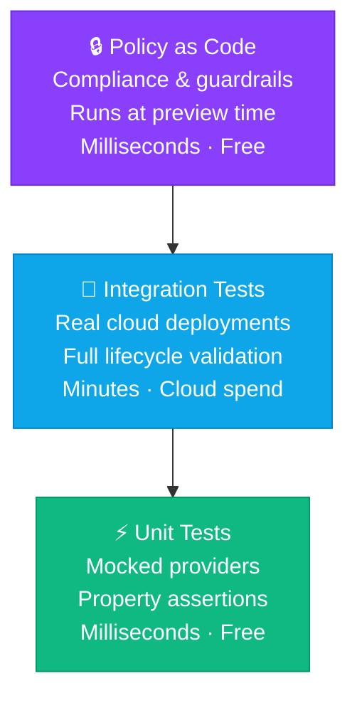

IaC testing means validating your infrastructure code the same way you test application software—unit tests with mocked cloud providers that run in milliseconds, integration tests that deploy and inspect real resources, and policy checks that enforce compliance rules on every preview and deploy. Together, these layers catch misconfigurations before they reach production.

<!--more-->

Untested infrastructure code is a liability. A missing tag in a security group rule, an S3 bucket with public read access, a misconfigured IAM policy—any of these can slip through code review and land in production. Infrastructure bugs are often harder to debug than application bugs, because the feedback loop is slow (deploy, observe, destroy) and the blast radius is large (an outage, a security incident, a surprise AWS bill).

The good news: Pulumi is built on general-purpose programming languages, which means you can test infrastructure code with the exact same tools and frameworks you already use to test application code. No new language to learn. No separate toolchain. Just pytest, Mocha, or `go test`—pointing at your infrastructure program.

This guide walks through all three testing layers with complete, runnable examples.

## Why should you test infrastructure as code?

The case for testing application code is well-established. The case for testing IaC is just as strong—arguably stronger, because the consequences of an undetected bug are more severe.

**Catch misconfigurations before they deploy.** A unit test that checks whether a security group allows SSH from 0.0.0.0/0 will catch that misconfiguration in milliseconds, before any cloud API call is made. The same test in CI catches it before the code is merged.

**Prevent drift and outages.** Integration tests that deploy to a staging environment and validate runtime behavior—does the HTTP endpoint return 200? does the database accept connections?—give you confidence that an infrastructure change doesn't silently break a dependent service.

**Refactor safely.** Well-tested infrastructure code can be restructured, modularized, and upgraded without fear. When all your properties, tags, and security rules are asserted in tests, you know immediately if a refactor breaks a constraint.

**Enforce security and compliance automatically.** Policy as code lets you encode your organization's security rules as executable tests. Mandatory policies block non-compliant deployments entirely; advisory policies surface warnings for human review. These rules run on every `pulumi preview` and `pulumi up`—not just at audit time.

**Ship infrastructure at software speed.** Teams that test IaC ship changes faster, with less fear. The CI pipeline becomes a confidence engine rather than a deployment gate.

The annual [DORA State of DevOps research](https://cloud.google.com/devops/state-of-devops) consistently finds that elite-performing engineering teams—those that deploy frequently and recover quickly from failures—share one defining characteristic: comprehensive automated testing across the stack. Infrastructure is no longer exempt from that standard.

## What types of IaC tests are there?

IaC testing mirrors the classic software test pyramid: a wide base of fast, cheap unit tests, a smaller layer of integration tests against real infrastructure, and policy checks that enforce rules throughout.

| Layer | What it tests | Speed | Cost | Cloud credentials? |
|-------|--------------|-------|------|-------------------|
| **Unit tests** | Resource properties, tags, security rules, naming conventions | Milliseconds | Free | No |
| **Integration tests** | Full stack lifecycle, runtime behavior, cross-resource dependencies | Minutes | Real cloud spend | Yes |
| **Policy as code** | Compliance rules, security baselines, organizational standards | Milliseconds | Free | No (runs at preview time) |



Start with unit tests—they're free, fast, and catch the most common mistakes. Add integration tests for critical paths (the deployment pipeline, data infrastructure, security-sensitive resources). Layer in policy as code for compliance requirements that must never regress.

## How do you write unit tests for Pulumi?

Pulumi unit tests replace the communication channel between the Pulumi program and the cloud provider with **mocks**. When the program registers a resource (e.g., `aws.ec2.SecurityGroup(...)`), the mock intercepts the call, returns dummy state, and never makes a real cloud API call. Tests run in the same process, in the same language, using the same test runner you already use.

### Setting up mocks

**The import-order rule:** You must set up mocks *before* importing your Pulumi program. If you import the program first, the Pulumi runtime initializes without mocks and will attempt real cloud calls.



{}

```python
# test_infra.py
import unittest
import pulumi

class MyMocks(pulumi.runtime.Mocks):
    def new_resource(self, args: pulumi.runtime.MockResourceArgs):
        # Return [id, state]. State keys must be camelCase.
        return [args.name + "_id", args.inputs]

    def call(self, args: pulumi.runtime.MockCallArgs):
        return {}

# Set mocks BEFORE importing the program
pulumi.runtime.set_mocks(MyMocks())
import infra  # import program AFTER setting mocks

class TestInfra(unittest.TestCase):

    @pulumi.runtime.test
    def test_no_public_ssh(self):
        """Security group must not expose SSH to the public internet."""
        def check_security_group(args):
            ingress_rules = args[0]
            for rule in (ingress_rules or []):
                for cidr in (rule.get("cidrBlocks") or []):
                    self.assertNotEqual(
                        cidr, "0.0.0.0/0",
                        "Security group must not expose port 22 to the internet."
                    )
        return pulumi.Output.all(infra.group.ingress).apply(check_security_group)

    @pulumi.runtime.test
    def test_server_has_tags(self):
        """EC2 instance must have required tags."""
        def check_tags(args):
            tags = args[0]
            self.assertIn("Environment", tags, "Missing 'Environment' tag")
            self.assertIn("Name", tags, "Missing 'Name' tag")
        return pulumi.Output.all(infra.server.tags).apply(check_tags)

if __name__ == "__main__":
    unittest.main()
```

Run with: `python -m unittest discover -v`

{}

{}

```typescript
// infra.test.ts
import * as pulumi from "@pulumi/pulumi";
import { expect } from "chai";

// Set mocks BEFORE dynamic import of the program
pulumi.runtime.setMocks(
    {
        newResource: (args: pulumi.runtime.MockResourceArgs): { id: string; state: any } => {
            // State keys must be camelCase
            return { id: `${args.name}-id`, state: args.inputs };
        },
        call: (args: pulumi.runtime.MockCallArgs) => ({ ...args.inputs }),
    },
    "my-project",
    "test",
    false // preview = false
);

describe("Infrastructure", function () {
    let infra: typeof import("./index");

    before(async function () {
        // Dynamic import AFTER setting mocks
        infra = await import("./index");
    });

    it("must not expose SSH to the internet", function (done) {
        pulumi.all([infra.group.ingress]).apply(([ingress]) => {
            for (const rule of ingress ?? []) {
                for (const cidr of rule.cidrBlocks ?? []) {
                    expect(cidr).to.not.equal(
                        "0.0.0.0/0",
                        "Security group must not expose port 22 to the internet"
                    );
                }
            }
            done();
        });
    });

    it("must have required tags", function (done) {
        pulumi.all([infra.server.tags]).apply(([tags]) => {
            expect(tags).to.include.keys("Environment", "Name");
            done();
        });
    });
});
```

Run with: `mocha -r ts-node/register infra.test.ts`

{}

{}

```go
// infra_test.go
package infra_test

import (
	"testing"

	"github.com/pulumi/pulumi/sdk/v3/go/pulumi"
	"github.com/stretchr/testify/assert"
)

// MockResourceMonitor implements pulumi.ResourceMonitor for unit tests.
func TestNoPublicSSH(t *testing.T) {
	err := pulumi.RunErr(func(ctx *pulumi.Context) error {
		infra, err := NewInfra(ctx)
		assert.NoError(t, err)

		infra.Group.Ingress.ApplyT(func(rules []ec2.SecurityGroupIngress) error {
			for _, rule := range rules {
				for _, cidr := range rule.CidrBlocks {
					assert.NotEqual(t, "0.0.0.0/0", cidr,
						"Security group must not expose port 22 to the internet")
				}
			}
			return nil
		})
		return nil
	}, pulumi.WithMocks("my-project", "test", mocks{}))
	assert.NoError(t, err)
}

type mocks struct{}

func (mocks) NewResource(args pulumi.MockResourceArgs) (string, map[string]interface{}, error) {
	return args.Name + "_id", args.Inputs, nil
}
func (mocks) Call(args pulumi.MockCallArgs) (map[string]interface{}, error) {
	return args.Args, nil
}
```

Run with: `go test ./... -v`

{}

{}

```csharp
// InfraTests.cs
using System.Collections.Generic;
using System.Threading.Tasks;
using Pulumi;
using Pulumi.Testing;
using Xunit;

public class InfraTests
{
    [Fact]
    public async Task NoPublicSSH()
    {
        var resources = await Testing.RunAsync<MyStack>();

        var sg = resources.OfType<Pulumi.Aws.Ec2.SecurityGroup>().First();
        var ingress = await sg.Ingress.GetValueAsync();

        foreach (var rule in ingress)
        {
            foreach (var cidr in rule.CidrBlocks)
            {
                Assert.NotEqual("0.0.0.0/0", cidr);
            }
        }
    }

    [Fact]
    public async Task ServerHasRequiredTags()
    {
        var resources = await Testing.RunAsync<MyStack>();

        var server = resources.OfType<Pulumi.Aws.Ec2.Instance>().First();
        var tags = await server.Tags.GetValueAsync();

        Assert.True(tags.ContainsKey("Environment"), "Missing 'Environment' tag");
        Assert.True(tags.ContainsKey("Name"), "Missing 'Name' tag");
    }
}
```

Run with: `dotnet test`

{}

{}

```java
// InfraTest.java
package myproject;

import com.pulumi.test.Mocks;
import com.pulumi.test.MockResourceArgs;
import com.pulumi.test.MockCallArgs;
import com.pulumi.test.Testing;
import org.junit.jupiter.api.Test;
import java.util.Map;
import java.util.List;
import java.util.concurrent.CompletableFuture;
import static org.junit.jupiter.api.Assertions.*;

class InfraTest {

    // Implement Mocks to intercept resource creation
    static final Mocks mocks = new Mocks() {
        @Override
        public CompletableFuture<Map.Entry<String, Object>> newResourceAsync(MockResourceArgs args) {
            // Return [id, state]. State keys must be camelCase.
            return CompletableFuture.completedFuture(Map.entry(args.name() + "_id", args.inputs()));
        }

        @Override
        public CompletableFuture<Map<String, Object>> callAsync(MockCallArgs args) {
            return CompletableFuture.completedFuture(Map.of());
        }
    };

    @Test
    void serverHasRequiredTags() throws Exception {
        Testing.runAsync(() -> {
            var stack = new Infra();
            stack.server.tags().applyValue(tags -> {
                assertNotNull(tags, "Tags must not be null");
                assertTrue(tags.containsKey("Environment"), "Missing 'Environment' tag");
                assertTrue(tags.containsKey("Name"), "Missing 'Name' tag");
                return null;
            });
        }, mocks).get();
    }

    @Test
    void noPublicSshExposed() throws Exception {
        Testing.runAsync(() -> {
            var stack = new Infra();
            stack.group.ingress().applyValue(rules -> {
                for (var rule : rules) {
                    for (var cidr : rule.cidrBlocks()) {
                        assertNotEquals("0.0.0.0/0", cidr,
                            "Security group must not expose SSH to the internet");
                    }
                }
                return null;
            });
        }, mocks).get();
    }
}
```

Run with: `mvn test` (JUnit 5)

{}



### The program under test

Both examples above test this program:



{}

```python
# infra.py
import pulumi
from pulumi_aws import ec2

group = ec2.SecurityGroup("web-secgrp",
    ingress=[{
        "protocol": "tcp",
        "from_port": 80,
        "to_port": 80,
        "cidrBlocks": ["0.0.0.0/0"],
    }],
)

server = ec2.Instance("web-server",
    instance_type="t2.micro",
    ami="ami-0b0ea68c435eb488d",
    vpc_security_group_ids=[group.id],
    tags={"Name": "web-server", "Environment": "dev"},
)
```

{}

{}

```typescript
// index.ts
import * as pulumi from "@pulumi/pulumi";
import * as aws from "@pulumi/aws";

export const group = new aws.ec2.SecurityGroup("web-secgrp", {
    ingress: [{
        protocol: "tcp",
        fromPort: 80,
        toPort: 80,
        cidrBlocks: ["0.0.0.0/0"],
    }],
});

export const server = new aws.ec2.Instance("web-server", {
    instanceType: "t2.micro",
    ami: "ami-0b0ea68c435eb488d",
    vpcSecurityGroupIds: [group.id],
    tags: { Name: "web-server", Environment: "dev" },
});
```

{}

{}

```go
// main.go
package infra_test

import (
	"github.com/pulumi/pulumi-aws/sdk/v6/go/aws/ec2"
	"github.com/pulumi/pulumi/sdk/v3/go/pulumi"
)

type Infra struct {
	Group  *ec2.SecurityGroup
	Server *ec2.Instance
}

func NewInfra(ctx *pulumi.Context) (*Infra, error) {
	group, err := ec2.NewSecurityGroup(ctx, "web-secgrp", &ec2.SecurityGroupArgs{
		Ingress: ec2.SecurityGroupIngressArray{
			ec2.SecurityGroupIngressArgs{
				Protocol:   pulumi.String("tcp"),
				FromPort:   pulumi.Int(80),
				ToPort:     pulumi.Int(80),
				CidrBlocks: pulumi.StringArray{pulumi.String("0.0.0.0/0")},
			},
		},
	})
	if err != nil {
		return nil, err
	}

	server, err := ec2.NewInstance(ctx, "web-server", &ec2.InstanceArgs{
		InstanceType:        pulumi.String("t2.micro"),
		Ami:                 pulumi.String("ami-0b0ea68c435eb488d"),
		VpcSecurityGroupIds: pulumi.StringArray{group.ID()},
		Tags: pulumi.StringMap{
			"Name":        pulumi.String("web-server"),
			"Environment": pulumi.String("dev"),
		},
	})
	if err != nil {
		return nil, err
	}

	return &Infra{Group: group, Server: server}, nil
}
```

{}

{}

```csharp
// MyStack.cs
using Pulumi;
using Pulumi.Aws.Ec2;
using Pulumi.Aws.Ec2.Inputs;

public class MyStack : Stack
{
    public MyStack()
    {
        var group = new SecurityGroup("web-secgrp", new SecurityGroupArgs
        {
            Ingress = new[]
            {
                new SecurityGroupIngressArgs
                {
                    Protocol = "tcp", FromPort = 80, ToPort = 80,
                    CidrBlocks = new[] { "0.0.0.0/0" },
                },
            },
        });

        var server = new Instance("web-server", new InstanceArgs
        {
            InstanceType = "t2.micro",
            Ami = "ami-0b0ea68c435eb488d",
            VpcSecurityGroupIds = new[] { group.Id },
            Tags = new InputMap<string>
            {
                { "Name", "web-server" },
                { "Environment", "dev" },
            },
        });
    }
}
```

{}

{}

```java
// Infra.java
package myproject;

import com.pulumi.Context;
import com.pulumi.Pulumi;
import com.pulumi.aws.ec2.SecurityGroup;
import com.pulumi.aws.ec2.SecurityGroupArgs;
import com.pulumi.aws.ec2.Instance;
import com.pulumi.aws.ec2.InstanceArgs;
import com.pulumi.aws.ec2.inputs.SecurityGroupIngressArgs;
import java.util.List;
import java.util.Map;

public class Infra {
    public final SecurityGroup group;
    public final Instance server;

    public Infra() {
        this.group = new SecurityGroup("web-secgrp",
            SecurityGroupArgs.builder()
                .ingress(SecurityGroupIngressArgs.builder()
                    .protocol("tcp")
                    .fromPort(80)
                    .toPort(80)
                    .cidrBlocks("0.0.0.0/0")
                    .build())
                .build());

        this.server = new Instance("web-server",
            InstanceArgs.builder()
                .instanceType("t2.micro")
                .ami("ami-0b0ea68c435eb488d")
                .vpcSecurityGroupIds(group.id().applyValue(List::of))
                .tags(Map.of("Name", "web-server", "Environment", "dev"))
                .build());
    }
}
```

{}



> **Key detail:** State property keys in the mock's `new_resource`/`newResource` return value must be **camelCase** (`cidrBlocks`, not `cidr_blocks`), regardless of the language you're writing in. This is how Pulumi serializes properties internally.

## How do you run integration tests against real cloud resources?

Unit tests tell you whether your resource definitions are correct. Integration tests tell you whether your infrastructure actually works. Integration tests deploy real cloud resources, run assertions against them, and then destroy everything—giving you end-to-end confidence at the cost of actual cloud spend and time.

### Using the Automation API

The [Pulumi Automation API](/docs/iac/concepts/automation-api/) lets you drive `pulumi up`, `pulumi destroy`, and every other Pulumi CLI operation programmatically, from within a test. You define the stack inline (using a function that runs your Pulumi program) or point it at an existing project directory.



{}

```python
# test_integration.py
import pytest
import pulumi
import pulumi_aws as aws
from pulumi import automation as auto

def create_bucket_program():
    """The Pulumi program to deploy during the test."""
    bucket = aws.s3.Bucket("test-bucket",
        tags={"Environment": "test", "ManagedBy": "pulumi"},
    )
    pulumi.export("bucket_name", bucket.id)
    pulumi.export("bucket_arn", bucket.arn)

@pytest.fixture(scope="module")
def deployed_stack():
    """Deploy the stack for the test module and destroy it when done."""
    stack = auto.create_or_select_stack(
        stack_name="integration-test",
        project_name="bucket-test",
        program=create_bucket_program,
    )
    stack.set_config("aws:region", auto.ConfigValue(value="us-west-2"))

    # Install provider plugins
    stack.workspace.install_plugin("aws", "v7.34.0")

    # Deploy
    up_result = stack.up(on_output=print)

    yield up_result.outputs

    # Teardown: destroy everything after the test module completes
    stack.destroy(on_output=print)
    stack.workspace.remove_stack("integration-test")

def test_bucket_was_created(deployed_stack):
    """The S3 bucket should have been created with the expected name prefix."""
    bucket_name = deployed_stack["bucket_name"].value
    assert bucket_name.startswith("test-bucket"), f"Unexpected bucket name: {bucket_name}"

def test_bucket_has_tags(deployed_stack):
    """Verify the bucket was created with required tags (via AWS SDK)."""
    import boto3
    s3 = boto3.client("s3", region_name="us-west-2")
    bucket_name = deployed_stack["bucket_name"].value
    tagging = s3.get_bucket_tagging(Bucket=bucket_name)
    tag_map = {t["Key"]: t["Value"] for t in tagging["TagSet"]}
    assert tag_map.get("Environment") == "test"
    assert tag_map.get("ManagedBy") == "pulumi"
```

Run with: `pytest test_integration.py -v`

{}

{}

```typescript
// integration.test.ts
import { LocalWorkspace, ConfigValue, UpResult } from "@pulumi/pulumi/automation";
import * as aws from "@pulumi/aws";
import * as pulumi from "@pulumi/pulumi";
import { expect } from "chai";

describe("S3 Bucket Integration", function () {
    this.timeout(300_000); // 5 min — real deploys take time

    let outputs: UpResult["outputs"];
    let stackName = "integration-test-ts";

    before(async function () {
        const stack = await LocalWorkspace.createOrSelectStack({
            stackName,
            projectName: "bucket-test",
            program: async () => {
                const bucket = new aws.s3.Bucket("test-bucket", {
                    tags: { Environment: "test", ManagedBy: "pulumi" },
                });
                return {
                    bucketName: bucket.id,
                    bucketArn: bucket.arn,
                };
            },
        });

        await stack.setConfig("aws:region", { value: "us-west-2" });
        await stack.workspace.installPlugin("aws", "v7.34.0");

        const upResult = await stack.up({ onOutput: console.log });
        outputs = upResult.outputs;
    });

    after(async function () {
        const stack = await LocalWorkspace.selectStack({ stackName, projectName: "bucket-test", program: async () => {} });
        await stack.destroy({ onOutput: console.log });
        await stack.workspace.removeStack(stackName);
    });

    it("creates a bucket with the right name prefix", function () {
        const name = outputs["bucketName"].value as string;
        expect(name).to.match(/^test-bucket/);
    });
});
```

Run with: `mocha -r ts-node/register integration.test.ts`

{}

{}

```go
// integration_test.go
package integration_test

import (
	"fmt"
	"testing"

	"github.com/pulumi/pulumi/sdk/v3/go/auto"
	"github.com/pulumi/pulumi/sdk/v3/go/auto/optup"
	"github.com/stretchr/testify/assert"
)

func TestBucketIntegration(t *testing.T) {
	ctx := context.Background()

	stack, err := auto.NewStackInlineSource(ctx, "integration-test", "bucket-test",
		func(ctx *pulumi.Context) error {
			bucket, err := s3.NewBucket(ctx, "test-bucket", &s3.BucketArgs{
				Tags: pulumi.StringMap{
					"Environment": pulumi.String("test"),
					"ManagedBy":   pulumi.String("pulumi"),
				},
			})
			if err != nil {
				return err
			}
			ctx.Export("bucketName", bucket.ID())
			return nil
		},
	)
	assert.NoError(t, err)

	_ = stack.SetConfig(ctx, "aws:region", auto.ConfigValue{Value: "us-west-2"})
	upResult, err := stack.Up(ctx, optup.ProgressStreams(os.Stdout))
	assert.NoError(t, err)

	t.Cleanup(func() {
		_, _ = stack.Destroy(ctx)
		_ = stack.Workspace().RemoveStack(ctx, "integration-test")
	})

	name := fmt.Sprintf("%v", upResult.Outputs["bucketName"].Value)
	assert.Contains(t, name, "test-bucket")
}
```

Run with: `go test ./... -v -timeout 10m`

{}

{}

```csharp
// IntegrationTests.cs
using System;
using System.Threading.Tasks;
using Pulumi.Automation;
using Xunit;

public class IntegrationTests : IAsyncLifetime
{
    private WorkspaceStack _stack = null!;
    private UpResult _upResult = null!;

    public async Task InitializeAsync()
    {
        var program = PulumiFn.Create(() =>
        {
            var bucket = new Pulumi.Aws.S3.Bucket("test-bucket", new()
            {
                Tags = new() { ["Environment"] = "test", ["ManagedBy"] = "pulumi" },
            });
            return new System.Collections.Generic.Dictionary<string, object?>
            {
                ["bucketName"] = bucket.Id,
            };
        });

        _stack = await LocalWorkspace.CreateOrSelectStackAsync(new InlineProgramArgs(
            projectName: "bucket-test",
            stackName: "integration-test",
            program: program
        ));

        await _stack.SetConfigAsync("aws:region", new ConfigValue("us-west-2"));
        _upResult = await _stack.UpAsync(new UpOptions { OnStandardOutput = Console.WriteLine });
    }

    public async Task DisposeAsync()
    {
        await _stack.DestroyAsync(new DestroyOptions { OnStandardOutput = Console.WriteLine });
        await _stack.Workspace.RemoveStackAsync("integration-test");
    }

    [Fact]
    public void BucketNameHasExpectedPrefix()
    {
        var name = _upResult.Outputs["bucketName"].Value.ToString();
        Assert.StartsWith("test-bucket", name);
    }
}
```

Run with: `dotnet test`

{}

{}

```java
// IntegrationTest.java
package myproject;

import com.pulumi.automation.*;
import org.junit.jupiter.api.*;
import java.util.*;
import static org.junit.jupiter.api.Assertions.*;

@TestInstance(TestInstance.Lifecycle.PER_CLASS)
class IntegrationTest {

    private LocalWorkspace workspace;
    private WorkspaceStack stack;
    private Map<String, OutputValue> outputs;

    @BeforeAll
    void setUp() throws Exception {
        var program = PulumiFn.create(() -> {
            var bucket = new com.pulumi.aws.s3.Bucket("test-bucket",
                com.pulumi.aws.s3.BucketArgs.builder()
                    .tags(Map.of("Environment", "test", "ManagedBy", "pulumi"))
                    .build());
            com.pulumi.Context.export("bucketName", bucket.id());
        });

        var opts = LocalWorkspaceOptions.builder()
            .program(program)
            .build();

        workspace = LocalWorkspace.create(opts);
        stack = WorkspaceStack.createOrSelect("integration-test", "bucket-test", workspace);
        stack.setConfig("aws:region", ConfigValue.of("us-west-2"));
        stack.workspace().installPlugin("aws", "v7.34.0");

        var upResult = stack.up(UpOptions.builder().onOutput(System.out::println).build());
        outputs = upResult.outputs();
    }

    @AfterAll
    void tearDown() throws Exception {
        if (stack != null) {
            stack.destroy(DestroyOptions.builder().onOutput(System.out::println).build());
            stack.workspace().removeStack("integration-test");
        }
    }

    @Test
    void bucketNameHasExpectedPrefix() {
        var name = (String) outputs.get("bucketName").value();
        assertTrue(name.startsWith("test-bucket"), "Unexpected bucket name: " + name);
    }
}
```

Run with: `mvn test`

{}



### Using the Go integration framework

If you prefer Go-based integration tests, Pulumi ships a purpose-built Go test framework at `github.com/pulumi/pulumi/pkg/v3/testing/integration`. It handles the full `create → validate → destroy` lifecycle for any Pulumi program (written in any language), with an `ExtraRuntimeValidation` hook for assertions against deployed state.

```go
func TestS3Website(t *testing.T) {
    integration.ProgramTest(t, &integration.ProgramTestOptions{
        Dir: path.Join("..", "my-s3-website"),
        Config: map[string]string{"aws:region": "us-west-2"},
        ExtraRuntimeValidation: func(t *testing.T, stack integration.RuntimeValidationStackInfo) {
            url := stack.Outputs["websiteUrl"].(string)
            resp, _ := http.Get("http://" + url)
            assert.Equal(t, 200, resp.StatusCode)
        },
    })
}
```

> **Best practice:** Always destroy test stacks in a `finally` block or test teardown fixture. Leaked integration test stacks are one of the top causes of unexpected cloud spend.

## How does policy as code complement IaC testing?

Unit and integration tests validate what your infrastructure *does*. Policy as code enforces what your infrastructure *must* conform to—security standards, tagging conventions, compliance requirements—and it runs automatically on every `pulumi preview` and `pulumi up`.

Pulumi Policies are currently supported in Python and TypeScript. You write policies in the same language as the rest of your stack, without learning a DSL. A `mandatory` policy blocks a deployment entirely when violated; an `advisory` policy surfaces a warning but allows the deploy to proceed.



{}

```python
# __main__.py in your policy pack directory
from pulumi_policy import (
    EnforcementLevel,
    PolicyPack,
    ReportViolation,
    ResourceValidationArgs,
    ResourceValidationPolicy,
)

REQUIRED_TAGS = {"Name", "Environment", "Owner"}

def require_tags(args: ResourceValidationArgs, report_violation: ReportViolation):
    if args.resource_type.startswith("aws:"):
        tags = args.props.get("tags") or {}
        missing = REQUIRED_TAGS - set(tags.keys())
        if missing:
            report_violation(
                f"Resource is missing required tags: {', '.join(sorted(missing))}"
            )

def no_public_s3(args: ResourceValidationArgs, report_violation: ReportViolation):
    if args.resource_type == "aws:s3/bucket:Bucket":
        if args.props.get("acl") in ("public-read", "public-read-write"):
            report_violation("S3 buckets must not have a public ACL.")

PolicyPack(
    name="aws-security-baseline",
    policies=[
        ResourceValidationPolicy(
            name="require-tags",
            description="All AWS resources must have Name, Environment, and Owner tags.",
            enforcement_level=EnforcementLevel.MANDATORY,
            validate=require_tags,
        ),
        ResourceValidationPolicy(
            name="no-public-s3",
            description="S3 buckets must not be publicly accessible via ACL.",
            enforcement_level=EnforcementLevel.MANDATORY,
            validate=no_public_s3,
        ),
    ],
)
```

{}

{}

```typescript
// index.ts in your policy pack directory
import * as aws from "@pulumi/aws";
import { PolicyPack, validateResourceOfType } from "@pulumi/policy";

new PolicyPack("aws-security-baseline", {
    policies: [
        {
            name: "require-tags",
            description: "All EC2 instances must have Name, Environment, and Owner tags.",
            enforcementLevel: "mandatory",
            validateResource: validateResourceOfType(aws.ec2.Instance, (instance, args, reportViolation) => {
                const required = ["Name", "Environment", "Owner"];
                const tags = instance.tags || {};
                for (const tag of required) {
                    if (!tags[tag]) {
                        reportViolation(`Missing required tag: ${tag}`);
                    }
                }
            }),
        },
        {
            name: "no-public-s3",
            description: "S3 buckets must not have a public ACL.",
            enforcementLevel: "mandatory",
            validateResource: validateResourceOfType(aws.s3.Bucket, (bucket, args, reportViolation) => {
                if (bucket.acl === "public-read" || bucket.acl === "public-read-write") {
                    reportViolation("S3 bucket must not have a public ACL.");
                }
            }),
        },
    ],
});
```

{}



**Running a policy pack**

```bash
# Scaffold a new policy pack from a template
mkdir my-policies && cd my-policies
pulumi policy new aws-typescript

# Run policy checks against a stack
pulumi preview --policy-pack ./my-policies
pulumi up --policy-pack ./my-policies

# Or publish to Pulumi Cloud and enforce organization-wide
pulumi policy publish
```

> As Joe Duffy, Pulumi CEO, [puts it](https://www.pulumi.com/blog/the-agentic-infrastructure-era/): "The smartest agent in the world still needs guardrails, audit trails, and policy enforcement to be trusted with production systems at scale."

Policy checks complement unit tests: unit tests verify your intent ("I wrote tags into this resource"), while policies enforce your standards ("all resources must have these tags, regardless of what any one developer intended"). For complex compliance environments, [publish policies to Pulumi Cloud](/docs/insights/policy/) and assign them via policy groups to enforce them across the stacks or accounts you choose—including organization-wide.

## How is testing IaC in Pulumi different from Terraform?

The fundamental difference is **language cohesion**. With Pulumi, you write infrastructure, tests, and policies all in the same general-purpose language. With Terraform, your infrastructure is HCL but your tests must be something else—either Go (Terratest) or a constrained HCL DSL (`terraform test`).

| | Pulumi | Terratest | `terraform test` (≥ 1.6) |
|-|--------|-----------|--------------------------|
| **Language for tests** | Same language as infra (Python, TypeScript, Go, C#, Java); YAML programs tested via Automation API from any of those languages | Always Go (regardless of infra language) | HCL DSL (`.tftest.hcl`) |
| **Unit tests with mocks** | Yes — `pulumi.runtime.set_mocks()`, no cloud credentials needed | No — always deploys real infrastructure | Limited — `mock_provider` (v1.7+) is HCL-declarative, no programmatic logic |
| **Integration testing** | Automation API (any language) or Go framework | Full-featured but Go-only | Yes, via `command = apply` run blocks |
| **Policy / guardrails** | Pulumi Policies: Python or TypeScript, runs at preview time | External tools (checkov, tfsec, OPA/Rego — separate toolchain) | Sentinel (enterprise) or external |
| **Execution speed** | Unit: milliseconds; integration: depends on cloud | Minutes (real deployments by default) | Plan-only: fast; apply: minutes |
| **Learning curve** | Use existing language skills and test frameworks | Requires Go knowledge and understanding of `go test` | Low if you know HCL; limited expressiveness |

Terratest is battle-tested and widely adopted, particularly for Terraform module testing. It offers deep integrations with AWS, GCP, Azure, and Kubernetes. Its limitation is inherent: it's always deploying real infrastructure, making it slow and costly to run for every commit.

`terraform test` has improved significantly in Terraform 1.6 and 1.7. The `command = plan` mode avoids real deployments, and `mock_provider` enables basic unit-like testing. But expressiveness is bounded by HCL's declarative model—no general-purpose programming, no third-party assertion libraries, and a fixed set of `run`/`assert` test constructs.

With Pulumi, there's no context switch. The same developer who writes the infrastructure writes the tests in the same language, using the same IDE, the same debugger, and the same CI pipeline. That cohesion is a productivity multiplier.

## How to set up IaC testing with Pulumi

Follow these steps to add a complete test suite to a Pulumi project. The examples use Python, but the pattern is identical in TypeScript, Go, C#, or Java.

<script type="application/ld+json">
{
  "@context": "https://schema.org",
  "@type": "HowTo",
  "name": "How to Set Up IaC Testing with Pulumi",
  "description": "Add unit tests, integration tests, and policy checks to a Pulumi infrastructure project in seven steps.",
  "totalTime": "PT30M",
  "step": [
    {
      "@type": "HowToStep",
      "name": "Install Pulumi and choose a language SDK",
      "text": "Install the Pulumi CLI and initialize a new project with your preferred language. Run 'pulumi new aws-python' (or aws-typescript, aws-go, etc.) to scaffold a project with the right SDK dependencies."
    },
    {
      "@type": "HowToStep",
      "name": "Add a test framework",
      "text": "Add a language-native test runner: pytest for Python ('pip install pytest'), Mocha + ts-node for TypeScript ('npm install --save-dev mocha ts-node @types/mocha chai'), or the standard testing package for Go (built in)."
    },
    {
      "@type": "HowToStep",
      "name": "Implement the Mocks class and set mocks before importing your program",
      "text": "Create a class that extends pulumi.runtime.Mocks (Python) or implements the setMocks interface (TypeScript). Override new_resource to return dummy IDs and pass-through state. Call pulumi.runtime.set_mocks() before importing your Pulumi program—this is the critical import-order rule."
    },
    {
      "@type": "HowToStep",
      "name": "Write unit tests asserting resource properties",
      "text": "Write test functions that access stack outputs (infra.server.tags, infra.group.ingress) via pulumi.Output.all(...).apply(...). Assert security rules, required tags, naming conventions, and other properties. Decorate Python test methods with @pulumi.runtime.test; use done() callbacks in Mocha."
    },
    {
      "@type": "HowToStep",
      "name": "Add integration tests using the Automation API with ephemeral stacks",
      "text": "Import pulumi.automation (Python) or @pulumi/pulumi/automation (TypeScript). Create an ephemeral stack with create_or_select_stack(), call stack.up() to deploy, run assertions against stack.outputs, then call stack.destroy() in a teardown fixture. Always destroy in a finally block to avoid leaked resources."
    },
    {
      "@type": "HowToStep",
      "name": "Enforce guardrails with a Pulumi policy pack",
      "text": "Create a policy pack directory and run 'pulumi policy new aws-python' or 'pulumi policy new aws-typescript'. Define ResourceValidationPolicy rules for your compliance requirements. Use EnforcementLevel.MANDATORY to block non-compliant deployments. Run 'pulumi preview --policy-pack ./my-policies' to enforce locally, or publish to Pulumi Cloud for org-wide enforcement."
    },
    {
      "@type": "HowToStep",
      "name": "Run all tests in CI on every pull request",
      "text": "Add unit tests to your standard CI job (no cloud credentials needed). Add integration tests in a separate CI stage with cloud credentials, using a dedicated test account. Reference the Pulumi GitHub Actions integration or any CI provider—unit tests run on every PR commit; integration tests run on merge to main or on a schedule."
    }
  ]
}
</script>

**Step 1: Install Pulumi and choose a language SDK**

```bash
# Install Pulumi CLI
curl -fsSL https://get.pulumi.com | sh

# Create a new project (or use an existing one)
pulumi new aws-python --name my-project --stack dev
```

**Step 2: Add a test framework**

```bash
# Python
pip install pytest pytest-asyncio

# TypeScript
npm install --save-dev mocha ts-node @types/mocha chai @types/chai

# Go uses the built-in testing package — no additional dependencies
```

**Step 3: Implement the Mocks class**

Create `mocks.py` (or equivalent) with your `Mocks` subclass. Keep it simple for unit tests: return `[args.name + "_id", args.inputs]` from `new_resource`.

**Step 4: Write unit tests**

Create `test_infra.py` in your project root. Import mocks first, then your program. Write test functions that use `@pulumi.runtime.test` and `pulumi.Output.all(...).apply(...)` to assert resource properties.

**Step 5: Add integration tests**

Create `test_integration.py` with a `pytest` fixture that creates a stack, calls `stack.up()`, yields outputs for assertions, and calls `stack.destroy()` in teardown. Point this at a dedicated test cloud account.

**Step 6: Create a policy pack**

```bash
mkdir policies && cd policies
pulumi policy new aws-python
# Edit __main__.py to add your rules
```

**Step 7: Wire it all into CI**

```yaml
# .github/workflows/test.yml (GitHub Actions excerpt)
jobs:
  unit-tests:
    runs-on: ubuntu-latest
    steps:
      - uses: actions/checkout@v4
      - uses: pulumi/actions@v6
      - run: pip install -r requirements.txt
      - run: python -m pytest tests/unit/ -v

  integration-tests:
    runs-on: ubuntu-latest
    needs: unit-tests
    environment: staging
    steps:
      - uses: actions/checkout@v4
      - uses: pulumi/actions@v6
      - run: pip install -r requirements.txt
      - env:
          PULUMI_ACCESS_TOKEN: ${{ secrets.PULUMI_ACCESS_TOKEN }}
          AWS_ACCESS_KEY_ID: ${{ secrets.AWS_ACCESS_KEY_ID }}
          AWS_SECRET_ACCESS_KEY: ${{ secrets.AWS_SECRET_ACCESS_KEY }}
        run: python -m pytest tests/integration/ -v --timeout=300
```

## Frequently asked questions

### What is infrastructure as code testing?

Infrastructure as code testing is the practice of writing automated checks that validate your IaC programs before they deploy to production. Just like application testing, it includes unit tests (fast, no cloud credentials, mock the provider), integration tests (real cloud deployments in ephemeral environments), and policy checks (rules that enforce compliance standards on every preview and deploy).

### Can you unit test IaC without deploying to the cloud?

Yes. Pulumi's mocking framework intercepts all cloud API calls and replaces them with in-process stubs. Unit tests run entirely in memory—no cloud credentials, no network calls, no cost. A suite of 50 unit tests runs in under a second. This is the primary reason to write unit tests: fast, free, deterministic feedback on every commit.

### Do you need real cloud credentials to test Pulumi?

Only for integration tests. Unit tests use Pulumi's mock runtime and require no cloud credentials at all. Policy checks also run without credentials at `pulumi preview` time. Integration tests that use the Automation API do need credentials—they deploy real resources—so they're typically run in a CI stage with access to a dedicated test account, not on every PR.

### What's the difference between unit and integration tests for IaC?

Unit tests validate resource properties, configurations, and relationships using mocked cloud providers—they run in milliseconds with no cloud credentials. Integration tests deploy actual resources to a real cloud environment, validate runtime behavior (does the endpoint respond? does the database accept connections?), and then destroy everything. Unit tests are cheap and frequent; integration tests are slower, cost real cloud spend, and run less often.

### How do you mock cloud resources in Pulumi?

Implement `pulumi.runtime.Mocks` (Python) or call `pulumi.runtime.setMocks()` (TypeScript/JavaScript) before importing your Pulumi program. The `new_resource` method receives every resource registration and returns a fake `[id, state]` pair. The `call` method handles data-source lookups. Set mocks with `pulumi.runtime.set_mocks(MyMocks())` and then import your program—the runtime will route all resource registrations through your mock instead of making real API calls.

### What test frameworks work with Pulumi?

Any language-native test framework works. For Python: **pytest** (recommended) or **unittest**. For TypeScript/JavaScript: **Mocha**, **Jest**, or **Vitest**. For Go: the standard `testing` package. For C#: **NUnit** or **xUnit**. For Java: **JUnit**. The `@pulumi/pulumi/automation` SDK and `pulumi.automation` module integrate naturally with all of them. YAML is Pulumi's declarative configuration language; because it has no control flow or executable statements, you cannot write test logic in YAML itself. YAML programs are tested by pointing the Automation API from Python, TypeScript, Go, C#, or Java at the project directory and asserting on the stack outputs.

### How do you test Pulumi in CI/CD?

Split your test suite into two CI stages. Stage 1 (unit tests): runs on every PR commit, no cloud credentials required, fast. Stage 2 (integration tests): runs on merge to main or on a schedule, requires cloud credentials for a dedicated test account, uses the Automation API to deploy ephemeral stacks. The [Pulumi GitHub Actions integration](https://github.com/pulumi/actions) simplifies credential injection and stack management in both stages.

### Is policy as code the same as testing?

Policy as code is complementary to—but distinct from—testing. Tests validate what your program *produces* (resource A has property B); policies enforce what your resources *must conform to* (all resources must have tag X). Policies run automatically at preview time and block non-compliant deployments at deploy time. Together, they create defense in depth: tests verify intent, policies enforce standards regardless of intent.

### How is Pulumi testing different from Terratest?

Terratest typically deploys real infrastructure—it has no mock layer for cloud providers—so most test runs provision actual cloud resources, incurring real cost and taking 5–30 minutes. Tests must be written in Go regardless of what language your infrastructure uses. Pulumi's unit testing framework runs in milliseconds with no cloud credentials, uses your existing language and test runner, and provides true mock isolation. For integration testing, Pulumi's Automation API offers a similar model to Terratest but in any language.

### How do you tear down resources after integration tests?

In Python pytest, use a module-scoped fixture that yields after `stack.up()` and calls `stack.destroy()` in the teardown. In TypeScript Mocha, call `stack.destroy()` in an `after()` hook. In Go, use `defer stack.Destroy(ctx, ...)`. Always use a `try/finally` pattern (or equivalent in your language) so teardown runs even when a test assertion fails. Pulumi Cloud also has built-in [stack TTL and auto-destroy](/docs/deployments/concepts/) features for extra safety.

## Where to go next

Testing IaC is not an all-or-nothing investment. Start by adding a handful of unit tests to your most critical stack—the one that manages your production VPC, your IAM roles, or your data infrastructure. Pick three to five properties that, if wrong, would cause an outage or a security incident. Write tests for those. Run them in CI. Expand from there.

When you're ready to go deeper:

- **[Testing overview](/docs/iac/guides/testing/)** — Pulumi's full testing documentation
- **[Unit testing guide](/docs/iac/guides/testing/unit/)** — detailed mock API reference with Go and C# examples
- **[Automation API integration testing](/docs/iac/guides/testing/integration/automation-api/)** — advanced patterns (multi-stack tests, config injection, parallel test execution)
- **[Policy as code authoring](/docs/insights/policy/policy-packs/authoring/)** — writing and publishing Pulumi Policies
- **[Pulumi vs. Terraform](/docs/iac/comparisons/terraform/)** — a full comparison of the two platforms

If you're migrating from Terraform, the [Pulumi conversion tool](/tf2pulumi/) translates your existing HCL to Python, TypeScript, Go, C#, and more, including your test infrastructure. Your Terratest or `terraform test` suites can be ported to Pulumi's native test runner—using your existing language—as part of the migration.

**[Get started with Pulumi for free →](https://app.pulumi.com/signup)**
