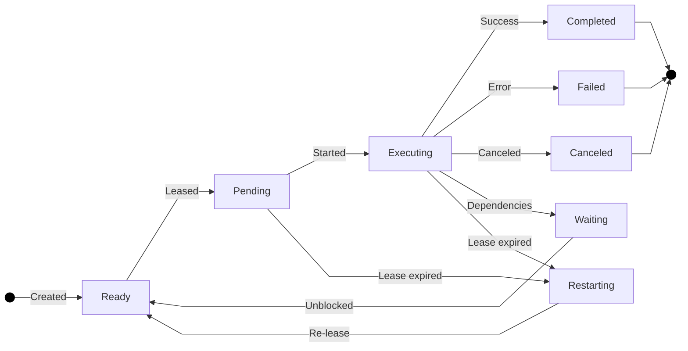
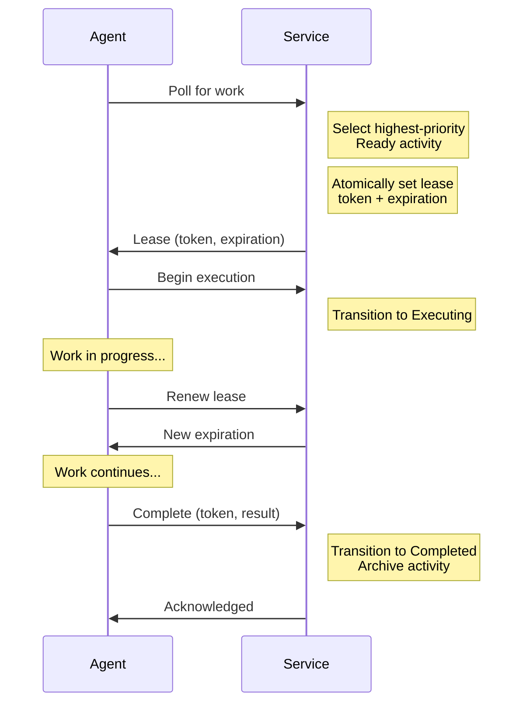
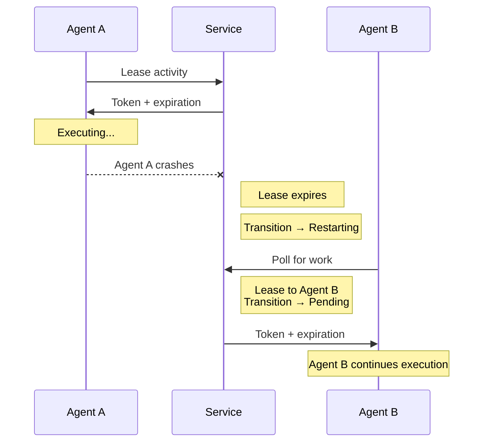
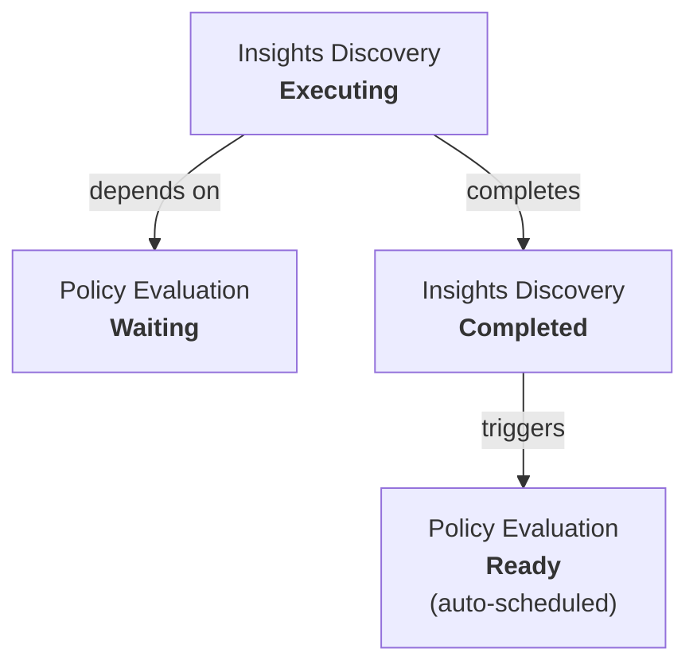
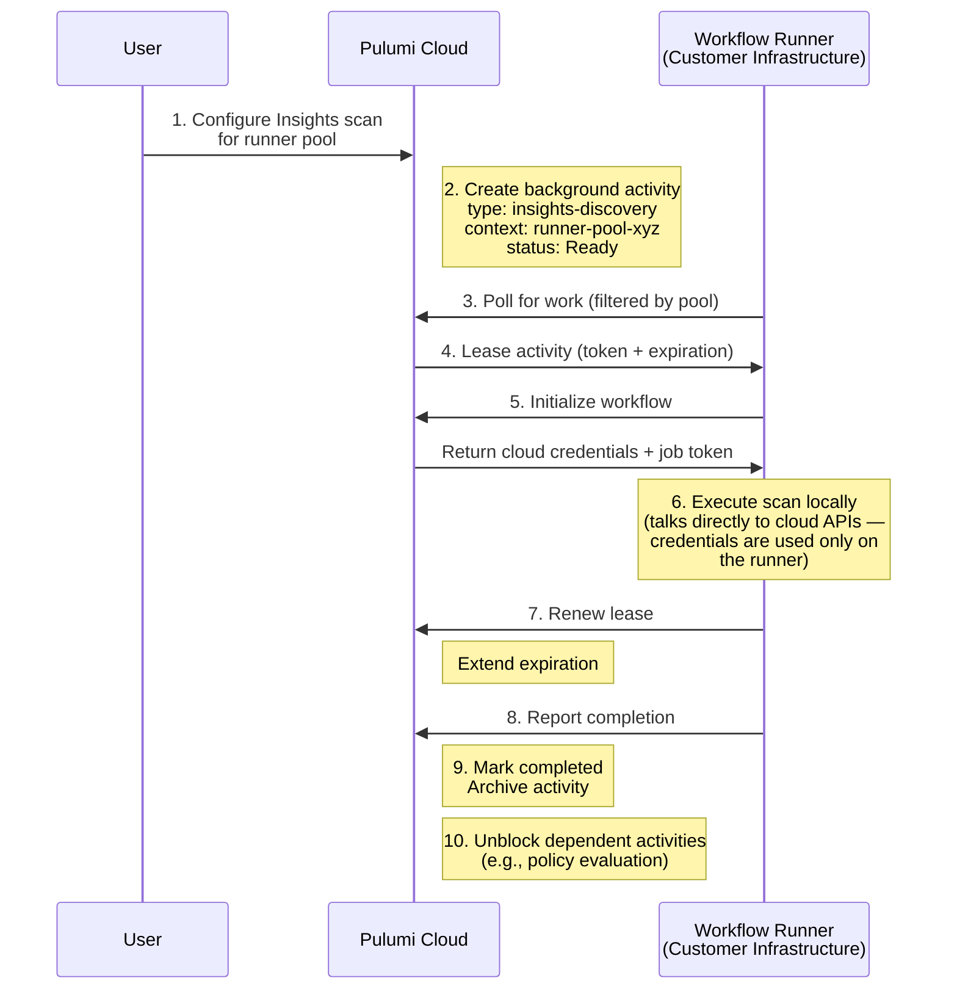

Pulumi Cloud orchestrates a growing number of workflow types: [Deployments](/docs/deployments/), [Insights](/docs/insights/) discovery scans, and [policy evaluations](/docs/insights/policy/). Some of that work runs on Pulumi's infrastructure, and some of it runs on yours via [customer-managed workflow runners](/docs/deployments/deployments/customer-managed-agents/). We needed a scheduling system that could handle all of these workflow types reliably across both environments. In this post, we'll take a look at the system we built.

<!--more-->

## Where we started

For our first workflow integration, Deployments, scheduling wasn't too complicated. A deployment was queued, a worker picked it up, and it ran. The queue was purpose-built for deployments, and it worked well for that single use case. Over time, we added more sophisticated logic to handle retries, ordering, rate limiting, observability, and more.

With the launch of Insights, the number of workflow types grew. Now Pulumi Cloud manages discovery scans to catalog cloud resources and runs audit policy evaluations to continuously verify compliance. While these workflows share similarities, each type needed its own scheduling, retry logic, and failure handling.

Later we added the option for customers to run workflows on their own infrastructure using [customer-managed workflow runners](/docs/deployments/deployments/customer-managed-agents/). As the complexity of these requirements grew, we knew that our initial approach for Deployments wasn't going to scale. We needed a single system that could schedule any type of work, route it to the right place, and handle the messy reality of distributed execution: crashes, network failures, rate limits, and retries.

We call this the **background activity system**.

## Why not use an off-the-shelf queue?

Why build this instead of using Amazon SQS, RabbitMQ, or one of the many existing queue libraries? We considered these options but chose to build our own for a few reasons.

Pulumi Cloud supports [self-hosted installations](/docs/administration/self-hosting/), including air-gapped environments. We intentionally minimize external dependencies so that self-hosted customers don't have to stand up additional infrastructure. A system built on an external queue works fine for our hosted service, but it means self-hosted customers would need to provide a compatible backend. By building on top of the database we already require, we avoid adding another system to maintain.

More importantly, queueing is only part of the problem. What we actually need is *scheduling with durability*. This means ensuring that remote workers don't lose activities on restart, priority so that urgent work gets compute resources first, constraints like "only so many scans per org at a time," structured logging for observability, and checkpointing so that long-running operations can resume after a failure.

These features can be layered onto a generic queue library but can require more code than implementing them directly. For example, priority queues are often implemented with multiple ranked queues, but this breaks single-activity-at-a-time constraints. A second queue wouldn't see a job already running in the first one. There's no way for producers in a distributed system to coordinate across the queues without support in the queuing system itself.

Capacity management is another area where generic queues fall short. Distributed systems need to respond dynamically to slowdowns, network interruptions, and rate limits from downstream services. These are common low-level details that every workflow type needs, and building them into the scheduling layer means individual handlers don't have to solve them independently.

We also need structured logging that works everywhere, including on customer-managed runners behind firewalls where centralized logging services aren't accessible.

Building this ourselves gave us a system that works with existing infrastructure and handles these requirements natively.

## Design constraints

With that context, here are some of the constraints that shaped the design:

- **Pull-only agents.** Customer-managed workflow runners live behind NATs, corporate proxies, and air-gapped networks. They can't accept inbound connections, so all communication has to be agent-initiated.
- **Mixed execution environments.** The same system needs to work for Pulumi-hosted workers (with direct access to internal systems) and customer-managed runners (communicating entirely over REST). We didn't want to maintain two separate code paths.
- **Different workflow types.** Deployments, Insights scans, and audit policy evaluations have different payloads and execution semantics, but they all need the same scheduling guarantees: exactly-once execution, automatic retries, failure recovery, and observability.
- **Automatic fault tolerance.** Agents crash, networks drop, and machines get recycled by autoscalers. The system needs to detect these failures and recover without needing a person to step in.
- **Extensibility.** We knew we'd keep adding workflow types. Adding a new one should mean writing a handler and registering it, not building new infrastructure.

## The background activity

At the center of the system is the **background activity**, a persistent, typed work unit. Each activity includes:

- A **type discriminator** that identifies what kind of work it represents (e.g., "insights-discovery" or "policy-evaluation")
- A **payload** specific to that type, containing whatever data the handler needs
- A **routing context** that determines which runner pool should execute it
- **Scheduling metadata** like priority, activation time, and retry configuration
- A **status** tracking where the activity is in its lifecycle

The type discriminator makes this system polymorphic. The scheduling engine doesn't need to know what's inside the payload. It moves activities through their lifecycle and delegates the actual work to a type-specific handler.

### The state machine

Every activity follows the same lifecycle regardless of type:

The states fall into two groups:

**Running states** (work is in flight or can be resumed):

- **Ready**: queued and eligible to be claimed by a worker
- **Pending**: claimed by a worker, execution about to start
- **Executing**: actively running on a worker
- **Waiting**: parked, blocked on one or more dependency activities
- **Restarting**: recovered after a worker failure, ready to be re-claimed

**Terminal states** (work is done):

- **Completed**, **Failed**, **Canceled**

New workflow types get these features automatically: scheduling, retries, dependency management, and observability.

## Leases: distributed execution without coordination

A central challenge of any distributed work queue is preventing double-execution. If two agents try to execute the same activity simultaneously, you get duplicate work and data corruption. A central coordinator can solve this, but it becomes a single point of failure.

We use lease-based optimistic concurrency instead. This is a well-known pattern, adapted here for long-running, stateful workflows.

### How it works

When an agent is ready for new work, it asks the service to **lease** an activity. The service atomically selects the highest-priority ready activity, assigns a lease token with an expiration time, and transitions the activity to `Pending`. No other agent can claim the same activity.

While executing, the agent periodically **renews** its lease to signal that it's still working. If the agent crashes, loses network connectivity, or is terminated, it stops renewing. Once the lease expires, the service transitions the activity to `Restarting`, making it available for another agent to claim.

The service doesn't need to explicitly coordinate between workers because leases are acquired using atomic database operations. The lease expiration is the failure detector; if a lease expires, then the work needs to be rescheduled.

## Routing work to the right runner pool

Pulumi Cloud supports multiple [workflow runner pools](/docs/deployments/deployments/customer-managed-agents/). An organization might have one pool for production in `us-east-1`, another for staging in `eu-west-1`, and use Pulumi-hosted runners for development. Work needs to reach the right pool.

Each activity carries a **routing context** that identifies which runner pool should execute it. When a runner polls for work, it filters by its own pool identifier so that it only sees activities meant for it.

We use prefix matching for this filtering. A runner matches activities whose context starts with its pool's identifier. This means the service can use hierarchical contexts (e.g., `pool-abc/insights/scan-123`) and runners will still match on the pool prefix. Cleanup is also straightforward; when a runner pool is deleted, all activities with that context prefix are bulk-canceled.

This routing mechanism works the same way regardless of workflow type, and adding a new workflow type doesn't require changes to the routing layer.

## Dependencies and multi-step workflows

Some workflows are naturally multi-step. An Insights discovery scan might discover resources that then need policy evaluation. Rather than building a separate orchestration engine, we built dependency management into the activity system.

An activity can declare a **dependency set**: a list of other activities that must complete before it can run. A dependent activity enters the `Waiting` state when created. As its dependencies complete, the system checks whether all prerequisites are satisfied. When the last one finishes, the waiting activity transitions to `Ready` and enters the scheduling queue.

This gives us a lightweight [DAG](https://en.wikipedia.org/wiki/Directed_acyclic_graph) of work without requiring a separate workflow engine. Dependent activities get the same guarantees as any other activity: lease-based execution, automatic recovery, and observability.

## Two execution modes, one interface

This is where the design really pays off for customer-managed runners. The system supports two execution modes:

- **Direct mode** runs in-process alongside the Pulumi Cloud service. Workers have low-latency access to internal systems and can process activities with minimal overhead. This is what Pulumi-hosted runners use.
- **Remote mode** communicates over REST APIs. The runner polls for activities, leases them, executes work locally, and reports results back over HTTP. This is what customer-managed runners use. No database access, no internal network access, no inbound connectivity required.

Both modes share the same handler interface so that a workflow handler doesn't need to know where it's running. Whether it's running on Pulumi's hosted infrastructure or on a customer's Kubernetes cluster, the handler simply processes the payload and reports a result.

## Putting it all together

Let's walk through a concrete example. A user wants to run an Insights discovery scan on an AWS account using a customer-managed workflow runner.

1. A user configures an AWS account for Insights scanning in Pulumi Cloud and assigns it to a workflow runner pool.
1. Pulumi Cloud creates a background activity with the type set to insights discovery, the routing context set to the runner pool, and the payload containing the account configuration.
1. A customer-managed workflow runner polling that pool detects new work.
1. The runner leases the activity, acquiring an exclusive lock via the lease token.
1. The runner initializes the workflow, receiving any required cloud provider credentials (e.g., resolved from [Pulumi ESC (Environments, Secrets, and Configuration)](/docs/esc/)) and a job token from Pulumi Cloud.
1. The runner executes the scan locally on the customer's infrastructure, talking directly to the cloud provider APIs.
1. During execution, the runner periodically renews its lease to signal liveness.
1. The scan completes, and the runner reports the result back to Pulumi Cloud.
1. The service marks the activity as completed and archives it.
1. If a dependent policy evaluation activity was waiting on this scan, it automatically transitions to `Ready` and enters the scheduling queue, where another runner in the pool can pick it up.

This flow works the same way whether the runner is hosted by Pulumi or by the customer. The only difference is whether the execution mode is direct or remote.

## Retries and scheduling

Failures are expected in distributed systems. The background activity system handles them at several levels:

- **Lease expiration** covers hard failures like agent crashes, network partitions, and machine terminations. If a lease expires, the activity moves to `Restarting`, and is available for another agent to pick up.
- **Handler-controlled retries** cover soft failures like transient API errors and rate limits. A handler can request a reschedule with a delay, putting the activity back in `Ready` with a future activation time.
- **Automatic retries** provide a configurable retry budget per activity. Each activity can specify how many times it should be retried and the delay between attempts, preventing runaway retry loops.
- **Priority scheduling** ensures urgent work gets processed first. Higher-priority activities are leased before lower-priority ones, even if the lower-priority activity has been waiting longer.
- **Lease renewal during slowdowns** keeps the activity alive without blocking other work, even if a downstream service is slow. The agent continues renewing its lease while it waits, and the scheduler remains free to assign other activities to other agents.

## Observability

Every activity generates a structured log of its execution, including timestamps, severity levels, and code context. Logs are stored with the activity record and are accessible via an API and admin tooling.

This is especially useful for customer-managed runners, where the service can't directly observe the execution environment. The structured log gives operators visibility into the execution context, even when the runner is behind a firewall. Handlers can also use these logs as a progress journal, encoding checkpoints that allow a restarted activity to pick up where it left off rather than starting from scratch.

Retention policies are configurable per organization and per workflow type. Completed activities can be retained for auditing or purged to manage storage, and failed activities are typically retained longer for debugging.

## What we learned

**A generic system pays off quickly.** Our initial instinct was to build targeted solutions for each workflow type. Investing in a generic activity system required more upfront design work, but now adding a new workflow type requires a fraction of the effort it would take otherwise. New workflows ship with full scheduling, retry, and observability support from day one.

**Leases handle many failure modes.** We evaluated several approaches for distributed work coordination, including message queues with explicit acknowledgment and coordinator-based assignment. The lease model works well because all failure modes are handled through timeouts. If an agent is running as expected, it renews. If it isn't, the lease expires.

**Keeping the execution paths symmetric requires discipline.** Making the hosted and self-hosted paths share the same handler interface was a deliberate choice. It would be easy to add shortcuts for the hosted path that bypass the remote API, but resisting that temptation means that features work for both cases automatically.

**The hard part isn't running the work.** Running a scan or a deployment is straightforward once you have the right credentials. The real complexity is in everything around the execution: scheduling, routing, leasing, retrying, resolving dependencies, and cleaning up. These operational concerns aren't visible to users, but they are essential to providing a reliable experience.

## Wrapping it up

Today this system powers deployments, Insights discovery scans, and policy evaluations across both Pulumi Cloud and customer-managed infrastructure. The architecture is general enough that every new workflow type we add inherits the full scheduling, routing, retry, and observability stack without additional plumbing.

If you're interested in running workflows on your own infrastructure, check out [customer-managed workflow runners](/docs/deployments/deployments/customer-managed-agents/). To see how Insights can help you understand and manage your cloud infrastructure, [get started with Pulumi Insights](/docs/insights/).
