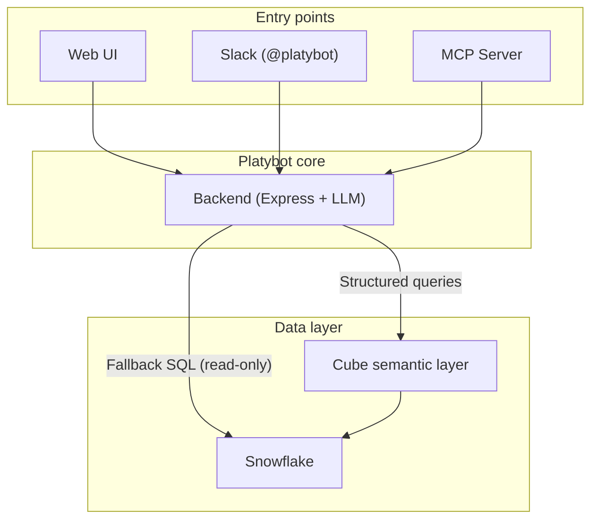
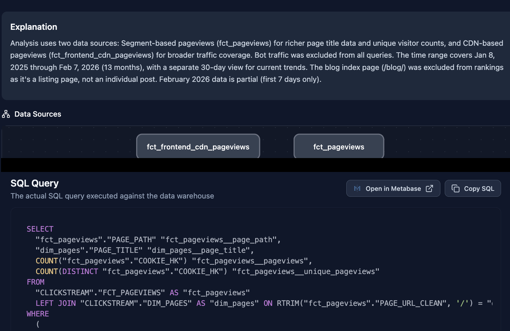
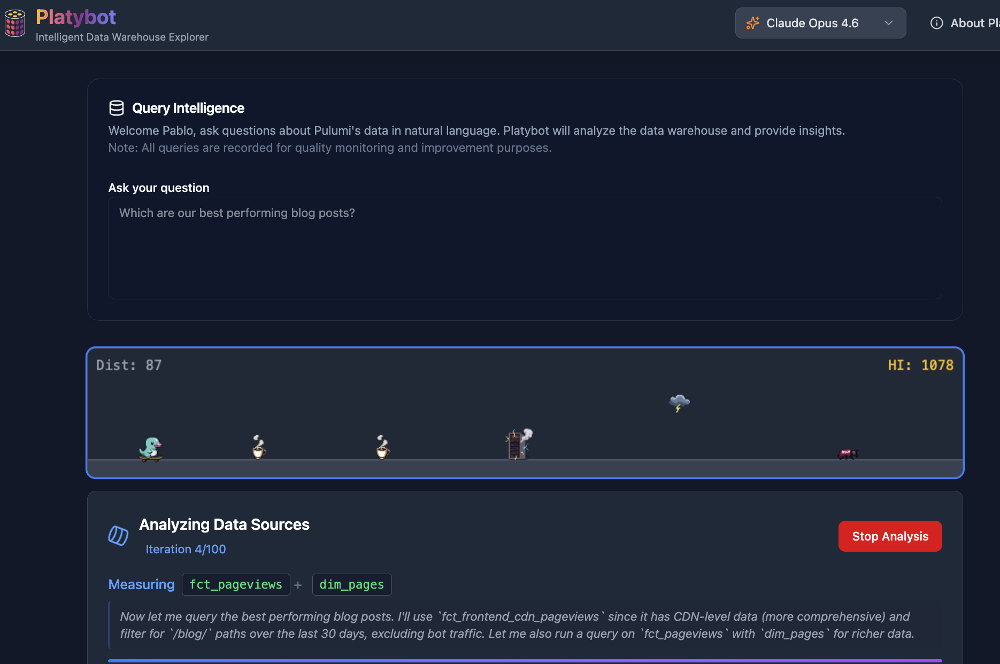
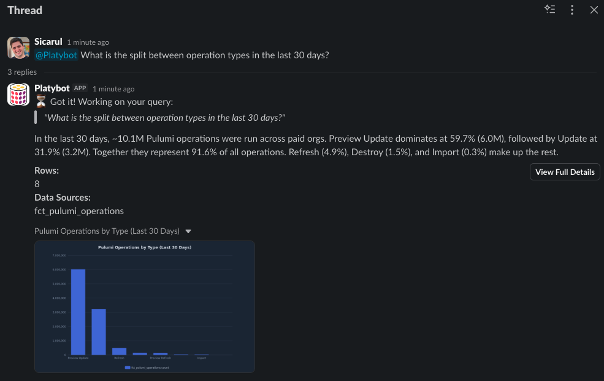

Before Platybot, our #analytics Slack channel was a support queue. Every day, people from every team would ask questions: "Which customers use feature X?", "What's our ARR by plan type?", "Do we have a report for template usage?" Our two-person data team was a bottleneck.

<!--more-->

We didn't want to just throw an LLM at our [Snowflake](/case-studies/snowflake/) warehouse either. Without guardrails, large language models generate SQL that may work but silently gets the answer wrong. Different join logic, wrong filters, missing snapshot handling, incorrect summarization. We needed something that could answer reliably for most queries, otherwise we'd switch to fixing LLM SQL queries.

So we built Platybot (platypus + bot, named after our mascot), an AI-powered analytics assistant that any Pulumi employee can use to query our Data Warehouse in natural language. It's available as a Web App, a Slack bot, and a [Model Context Protocol (MCP)](https://modelcontextprotocol.io/) server. The infrastructure is deployed with Pulumi IaC (Infrastructure as Code). But the most important thing we learned building it is that the AI was the easy part. The semantic layer is what makes it work.

## The problem with throwing AI at your Data Warehouse

The naive solution is obvious: connect an LLM to your database and let it write SQL. But this fails in practice, and the failure mode is insidious. Consider a few examples from our warehouse:

- **ARR is a snapshot metric.** If you query ARR (Annual Recurring Revenue) without filtering by end-of-period dates (last day of month or quarter), you get duplicate rows and wildly inflated numbers. An LLM doesn't automatically know this.
- **Account queries need exclusions.** Most queries should exclude Pulumi's own internal accounts and deleted ones. Without these filters, you're counting test data alongside real customers.
- **User queries need employee filters.** Querying active users without excluding Pulumi employees inflates adoption metrics.

The danger shows up when results feel decision-ready before anyone has validated how the numbers were derived. A confidently wrong ARR figure presented to leadership is worse than no answer at all.

Many organizations run into the same constraint once data usage spreads. Dashboards answer yesterday's questions, not today's. Ad-hoc LLM queries answer today's questions, but incorrectly. The gap between "I have a question" and "I have a trustworthy answer" is where data teams can get stuck.

## Why we built a semantic layer first

Before writing a single line of AI code, we built a semantic layer using [Cube](https://cube.dev/) (open source). This was the hardest, least glamorous, and most important part of the entire project.

A semantic layer is a shared, versioned definition of what your business metrics mean.

“Monthly active users” starts with COUNT(DISTINCT user_id), but the aggregation is only the outer layer. It has to be applied to the right table (`fct_pulumi_operations`), with the right filters (exclude Pulumi employees, exclude deleted organizations), scoped to a calendar month, and counting only users who performed real operations — not just previews. The semantic layer encodes all of this once, and the AI can use it to build queries without needing to guess which tables are related to each other, whether it's one-to-one or many-to-many, etc.

We organized our data into seven domains: Revenue, Cloud, Core, Clickstream, Community, Support, and People. Each domain contains cubes (think of them as well-defined, composable views) with explicit measures, dimensions, and joins. Here's a real example from our Cloud domain (trimmed for readability):

```yaml
cubes:
  - name: fct_pulumi_operations
    sql_table: CLOUD.FCT_PULUMI_OPERATIONS
    description: >
      Pulumi CLI operations (update, preview, destroy, refresh).
      Each row is one operation with resource changes, duration,
      and CLI environment.

    joins:
      - name: dim_organization
        sql: '{CUBE}.ORGANIZATION_HK = {dim_organization}.ORGANIZATION_HK'
        relationship: many_to_one
      - name: dim_stacks
        sql: '{CUBE}.STACK_PROGRAM_HK = {dim_stacks}.STACK_PROGRAM_HK'
        relationship: many_to_one
      - name: dim_user
        sql: '{CUBE}.USER_HK = {dim_user}.USER_HK'
        relationship: many_to_one

    measures:
      - name: count
        type: count
      - name: resource_count
        sql: '{CUBE}.RESOURCE_COUNT'
        type: sum
        description: Number of resources active when the operation finished
      - name: operations_succeeded
        sql: "CASE WHEN {CUBE}.OPERATION_STATE = 'succeeded' THEN 1 ELSE 0 END"
        type: sum
        description: Count of operations that succeeded
      # ... plus other measures

    dimensions:
      - name: operation_type
        sql: '{CUBE}.OPERATION_TYPE'
        type: string
        description: Type of operation (Refresh, Update, Destroy, etc)
      - name: operation_state
        sql: '{CUBE}.OPERATION_STATE'
        type: string
        description: Last known state of this operation
      # ... 20+ more dimensions
```

The key insight: the semantic layer makes the AI's job tractable. Instead of generating arbitrary SQL from scratch, where the search space is "any possible SQL query against hundreds of tables," the AI picks from a defined set of measures, dimensions, and joins. The search space shrinks from almost infinite to a well-bounded set of valid combinations.

A semantic layer is to an AI data assistant what a type system is to a programming language. It doesn't eliminate errors, but it makes entire categories of mistakes structurally impossible. The AI can't calculate ARR wrong because it doesn't calculate ARR at all. It references a pre-defined measure that already encodes the correct logic.

Building the semantic layer was mainly data engineering work. We already had agreed-upon metric definitions across the company. The challenge was encoding those definitions into Cube: specifying the correct joins between tables, wiring up the right filters, and making sure every measure matched the logic our dashboards already used. Tedious, but essential.

## Adding the AI layer

With the semantic layer in place, the AI becomes a translation problem: convert natural language into a Cube query.

Platybot supports multiple models: Claude Opus 4.6, Claude Sonnet 4.5, and Gemini 3 Pro. Users can choose which model to use. We found that different models have different strengths. Claude excels at structured data queries, while Gemini performs very well on text-heavy tasks like analyzing call transcriptions.

The system prompt gives the model awareness of available cubes, their measures, dimensions, and joins. When a user asks "What's the ARR breakdown by plan type?", the model doesn't write SQL. Instead, it constructs a Cube query, selecting the `total_arr` measure from the ARR table and grouping by the `sku` from the subscriptions dimension. Cube handles the SQL generation, the joins, and the filters. For edge cases the semantic layer doesn't cover, the model can fall back to direct (read-only) SQL against Snowflake, but it may already have a basic query that is already close to what it needs.

Query generation follows a workflow that maps to the same tools a human analyst would use:



The workflow is: discover domains, explore cubes, understand the schema, construct and execute the query. This mirrors how a data analyst would work. You don't jump straight to SQL; you first understand what data is available and what the metrics mean.

The system's role is narrower than people expect. It's a translator between human intent and a well-defined data model, not a general-purpose data scientist. This is a feature, not a limitation. By constraining Platybot to operate within the semantic layer, we get reliability. The creativity goes into understanding the question, not into inventing SQL.

## Meeting users where they are

The backend solved query generation. It did not solve usage and if people don't use it, it doesn't matter. We launched Platybot across three interfaces, each designed for a different workflow.

### The web UI

The web app is the primary interface: a React 19 + TypeScript + Vite + Tailwind conversational UI where employees can explore data through multi-turn conversations. It supports table visualization, data export, and conversation history so you can pick up where you left off.

Every analysis produces a shareable report with a permanent link, protected behind company authentication. The report shows the agent's reasoning so you can verify its approach, and lists every query and table used along with a sample of the data. Each query includes a direct link to run it in Metabase, our reporting tool, so any useful query can be saved, scheduled, or extended without starting from scratch.



The web UI sees the highest adoption of all three access points. It's where people go for deeper data exploration: multi-step analyses, follow-up questions, and comparing metrics across different dimensions.

One fun detail we've added during our last hackathon: while queries iterate through analysis steps (discovering domains, exploring cubes, executing queries), users are entertained by a platypus-themed runner game. Think Chrome's dinosaur game, but with our mascot on a skateboard. Sometimes Platybot can take a long time iterating, so you can try to beat your high score in the meantime!



### Slack

Platybot is also available as a Slack bot. Users @mention it in any channel, and it replies in a thread with the answer, keeping the channel clean while making results visible to the whole team. It's best suited for quick lookups — "what's the ARR for account X?" — where the answer fits in a message rather than a deep analysis. Most usage stayed in the web UI, but the Slack bot fills a different niche: answers that benefit from being shared in context.



### MCP: Making Platybot usable by Agents

The [Model Context Protocol (MCP)](https://modelcontextprotocol.io/) server is the newest addition, launched February 4, 2026. It exposes six tools that any MCP-compatible client can use:

- `list_domains` - discover available data domains
- `list_cubes` - explore cubes within a domain
- `get_cube_details` - get measures, dimensions, and joins for a cube
- `execute_cube_query` - run a structured query
- `execute_sql_query` - raw SQL fallback (read-only)
- `get_generated_sql` - preview SQL without executing

Setup is a single command:

```bash
claude mcp add --transport http platybot <platybot-mcp-url>
```

This is a paradigm shift. Platybot goes from a destination (open the app, ask a question) to a capability that any AI tool can use. An engineer writing a postmortem can pull live metrics without leaving their terminal. An analyst building a report in Claude Code can query data inline. The Data Warehouse becomes ambient, always available, never in the way.

Security uses OAuth 2.0 Device Authorization Flow with PKCE for CLI-friendly authentication, with @pulumi.com domain restriction, read-only enforcement, rate limiting, and full audit logging.

A meta moment: we used the Platybot MCP server to query our Slack messages table to find the real usage data cited above.

## Deploying with Pulumi

Platybot's infrastructure runs on AWS and is managed entirely with Pulumi IaC. The stack includes ECS Fargate for the application, an Application Load Balancer for traffic routing, EFS for persistent storage, ECR for container images, and Route 53 for DNS. The setup is intentionally simple and we use a small instance size since it's just for internal usage.

Here's a representative snippet of the Fargate service definition:

```typescript
const service = new awsx.ecs.FargateService("platybot", {
    cluster: cluster.arn,
    assignPublicIp: false,
    taskDefinitionArgs: {
        container: {
            name: "platybot",
            image: image.imageUri,
            essential: true,
            portMappings: [{
                containerPort: 3000,
                targetGroup: targetGroup,
            }],
            environment: [
                { name: "CUBE_API_URL", value: cubeApiUrl },
                { name: "NODE_ENV", value: "production" },
            ],
            secrets: [
                { name: "ANTHROPIC_API_KEY", valueFrom: anthropicKeySecret.arn },
                { name: "SNOWFLAKE_PASSWORD", valueFrom: snowflakePasswordSecret.arn },
            ],
            logConfiguration: {
                logDriver: "awslogs",
                options: {
                    "awslogs-group": logGroup.name,
                    "awslogs-region": aws.config.region!,
                    "awslogs-stream-prefix": "platybot",
                },
            },
        },
    },
});
```

Dogfooding Pulumi for our internal tools has real benefits beyond the obvious. Staging environments are trivial: spin up a full copy of the stack with different parameters. Secrets management is built in, so API keys and database credentials never touch a config file. And when something needs to change, the diff-and-preview workflow (`pulumi preview`) catches mistakes before they hit production.

## Results

Since launch in September 2025: over 1,700 questions from 83 employees across every team. Usage grew steadily — from around 8 questions per day in the first month to 18 per day by January 2026, with 51 unique users that month alone. This was real production work, not experimentation. Customer analysis for sales calls, resource breakdowns for account managers, blog performance metrics for marketing, policy adoption research for product, ARR deep-dives for leadership.

The impact on the data team was immediate. Questions that used to land in the #analytics channel and wait for a human now get answered in seconds. The data team shifted from answering routine queries to building better models and improving data quality. We went from being a help desk to being a platform team.

Accuracy is harder to quantify, but the semantic layer gives us confidence. Because Platybot uses pre-defined measures instead of generating arbitrary SQL, entire categories of errors (wrong joins, missing filters, incorrect aggregations) are structurally less likely. When the model does get something wrong, it's usually in interpreting the question, not in the data — and users can verify that through the report's reasoning trace.

## What we learned

**The semantic layer matters more than the model.** We spent more time defining metrics in Cube than we did on any AI work. That investment pays for itself: swap the model, and the answers stay correct. Swap the semantic layer, and nothing works.

**Meet users where they already are.** Different UIs handle different cognitive loads. Slack catches the quick questions, the web UI handles deep exploration, and MCP makes data ambient for AI-native workflows. Each interface serves a different mode of thinking.

**Transparency builds trust.** Showing the AI's reasoning, the queries it ran, and linking to Metabase for verification turned skeptics into regular users. People don't trust a black box, but they'll trust a tool that shows its work.

If you're building something similar, here are the resources that helped us:

- [Cube](https://cube.dev/) for building a semantic layer on top of your data warehouse
- [Pulumi IaC getting started](/docs/get-started/) for deploying your infrastructure
- [Pulumi Community Slack](https://slack.pulumi.com) for questions and conversation


