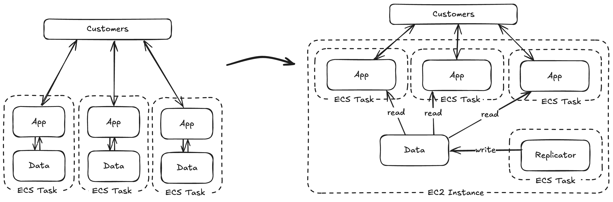
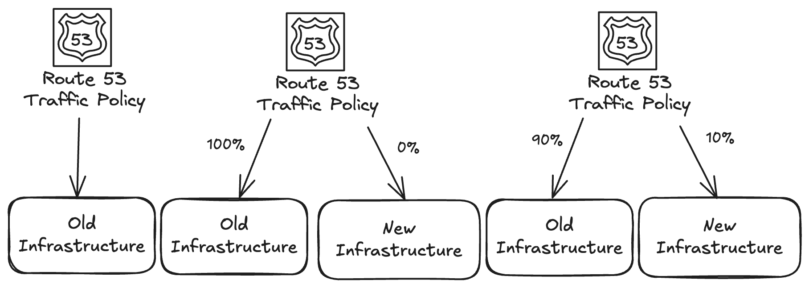
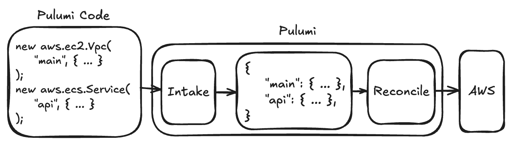
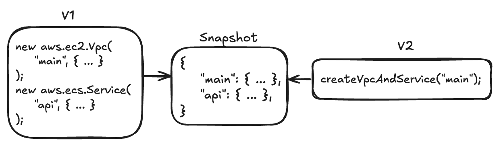

Infrastructure as Code (IaC) tools such as Pulumi can provide enormous amounts of leverage, but they must be used correctly to also provide safety. One of our main jobs as infrastructure engineers is to not break things, so leverage without safety is useless. If something is safe, we can change things easily without even thinking about it. If it isn't, we'll be up until 2 a.m. fixing what we broke.

At Oso, we recently had to do a large infrastructure migration and learned three key principles that make a huge difference in using Pulumi for safe migrations. First, understand how it's even possible to safely change your infrastructure independently of Pulumi. Second, write reusable and predictable Pulumi code. Finally, refactor your Pulumi code to your new version using zero-diff refactors.

## Osoʼs Migration



[Oso](https://www.osohq.com/) provides Authorization as a Service, so every application decision must first query Oso. This means that if Oso goes down, our customers will also go down. We can't afford a moment of downtime.

However, we're also growing quickly, and one of the side effects of growth is that architectural decisions that worked for us in the past quickly reach their expiration date. One example of this is when we hit a scaling limit and needed to quickly migrate from Amazon ECS Fargate to ECS on our own self-managed EC2 instances.

We can't overstate the Pandora's box of complexity this opened up for us. From the lifecycle of our data to our deployment orchestration, this touched nearly every part of our stack. On top of this, because performance and data locality are critical for us, we are deployed globally in 12 different regions. We need to be extremely careful to do this correctly.

## How the Migration Actually Worked



The most important thing to realize when using an infrastructure tool like Pulumi is that ultimately you're dealing with real resources. It doesn't matter how cleverly you refactor your Pulumi code; if something gets deleted that isn't supposed to be deleted, or if at any point a critical component is missing, there will be an outage.

At Oso, we were already using a Route 53 Traffic Policy to do latency-based per-region routing, so Route 53 was a convenient tool for us in this migration. The plan was to create an entirely new Oso infrastructure and include it in our traffic policy, but send 0% of our traffic to it. Then, we could run tests ourselves directly against the new infrastructure and gradually ramp up traffic until we were fully migrated.

That is the first big lesson we took away from this. If we didn't have a point in our infrastructure where we could easily reroute customer traffic from one place to the other, this transition would have been impossible without downtime.

## Writing Reusable Pulumi Code



The holy grail of infrastructure development is to achieve what we already have in application development: code reuse. Besides the benefit of reducing the burden of maintaining more code, it also reduces risk because we can concentrate our testing in one place and benefit from using code that has already been proven.

In Osoʼs case, because our migration involved creating a copy of our entire infrastructure with the new changes, code reuse was vital. Even the smallest reusable component meant fewer new bugs and less time fixing bugs we had already fixed in the old infrastructure.

In Pulumi, you can use the import and function system of the underlying programming language, so that part of managing libraries is not an issue. The real challenge lies in how to actually write the business logic of libraries in Pulumi because writing Pulumi code is not like writing normal code.

Take a look at this example of creating an ECS service:

```typescript

let service = new aws.ecs.Serice("api",{ });

```

This line of code might seem trivial, but a lot is happening here, and it's important to understand Pulumi's programming model on a deeper level to know how to work with it properly.

The first thing to note is the first argument: `api`. This is the [logical resource name](https://www.pulumi.com/docs/iac/concepts/resources/names/) in Pulumi. The subsequent arguments are more about how to actually create the resource, and we wonʼt talk about that here. This logical resource is how Pulumi identifies this resource in the internal state.

The internal state is the core of the Pulumi engine. It maps the “logical resource name" we provide to the actual resource that Pulumi either created or plans to create. The code example above, at some point deep inside the Pulumi engine, turns into something that roughly looks like this:

```json
{
  "aws:ecs:Service": {
    "api": {...},
    ...
  },
  ...
}
```

This is the key to understanding why writing Pulumi code is not like writing normal code. There is one "state namespace" per Pulumi execution, which effectively means that there is one global object that we are adding resources to. So the `new aws.ecs.Service` function call wasn't just creating a service object that we can pass around; it was registering the service with the global list of resources we plan to deploy.

After we understand that calls to the Pulumi library have side effects on this global state, we can start to write better Pulumi libraries. For example, say we have this function call:

```typescript
deployWebStack("app",true,false,"enabled");
```

Do you know which resources this will create? Is it safe to call `deployWebStack` again with the same arguments? What would happen if we deleted this line of code? These are all the familiar perils of global state, and something we must proactively contend with to write a good Pulumi library.

Here are some rules that we recommend:

* DO use [Pulumi Component Resources](https://www.pulumi.com/docs/iac/concepts/resources/components/) in libraries that create resources.

    * This encourages a more declarative object-based approach to resources, which fits better with Pulumi's model and also causes these objects to show up in the Pulumi output.

* Do NOT conditionally create resources inside library functions.

    * If the function is called, all the resources should be created, and if it is not, the resources should not be created. Conditionals should be at the top level, because that's where you are deciding what is deployed in a particular region or component.

* Do NOT check the current infrastructure state inside library functions.

    * This should be passed in as arguments; otherwise, the library function will have non-deterministic behavior.

* Do NOT attempt to implement idempotent resource creation functions.

    * See the previous rule. The only way to implement a function that creates a resource only if it hasn't been created yet is to check if it has been created, leading to non-determinism.

* DO write functional code as inputs to resources.

    * You can still write normal code in some cases, as long as it doesn't call into Pulumi. For example, the code that generates the list of environment variables for an app can be a normal function.

* DO have a strategy for resource naming.

    * Because any function might register new resources, and because you may even have naming conflicts on the cloud provider side, having a coherent strategy for naming resources is helpful. We don't have anything prescriptive here, because it's really a matter of preferences and specific situations.

* DO favor assigning resources to named objects and variables over getter functions.

    * Rather than implementing a function or some kind of "getter" to refer to another resource, save that resource object in a variable at some scope where it can be referenced by the other resources that need it. This can even be in the global scope to match the reality that all the resources end up in one resource namespace in the end.

There's a lot of advice here, but it really all comes down to keeping in mind what Pulumi is actually doing with your code and remembering that calls into the Pulumi library are actually registering resources in the global state.

## Infrastructure Snapshot Testing for Zero Diff Refactors



Now that we know what we want to change in our infrastructure, and we know how to write our Pulumi code in a reusable way, we're faced with a familiar software engineering challenge: How can we safely refactor our existing code to get to where we want to be? To answer this question, we can step back from the Pulumi specifics for a moment and think about refactoring in general.

One method that is amazing for refactoring code is Snapshot Testing. With Snapshot Testing, you run the legacy code that you want to change, save the output, and create a unit test around that. Then, when you make a code change, you can detect if your code changes result in any unintended changes in behavior.

We can imitate this with Pulumi by taking advantage of the fact that we can see a `preview` of the changes Pulumi will make before we deploy them. While we don't have direct access to Pulumi's internal data model in the code itself to make this "snapshot," the `preview` can give us this comparison. If we make changes to our infrastructure, as long as `pulumi preview` shows no changes, we are 100% sure that the refactor we made is safe and won't cause any issues. Because of this, we at Oso internally call this method a "zero diff refactor."

This is a relatively simple concept, but it is necessary to make this migration possible. In our original infrastructure, most of our resources were deployed in one monolithic Pulumi project, and resources were created at the top level rather than in libraries. The 12-region deployment also made running Pulumi on this project very slow, and we wanted a clean separation between the old and new infrastructure. Using snapshot testing to refactor allowed us to build and reuse our in-house infrastructure libraries with 100% confidence and let us focus on the parts that held the real risk.

## Conclusion

This migration did not go smoothly. We constantly found problems and unexpected assumptions that our code was making about the underlying infrastructure.

But no one outside Oso noticed. We had a clear migration plan, factored out common Pulumi code, and used zero-diff refactors. Putting this all together meant we could benefit from the leverage that Pulumi has the potential to provide. This allowed us to make major changes with confidence that they wouldn't break our system.

In the early days of Oso, people were often surprised by how much we were able to accomplish with such a small core team of engineers. Part of the secret to this is using the tools we have available to gain maximum leverage, but this isn't the entire story. Knowing how to use them safely allows us to actually benefit from that leverage in practice.

