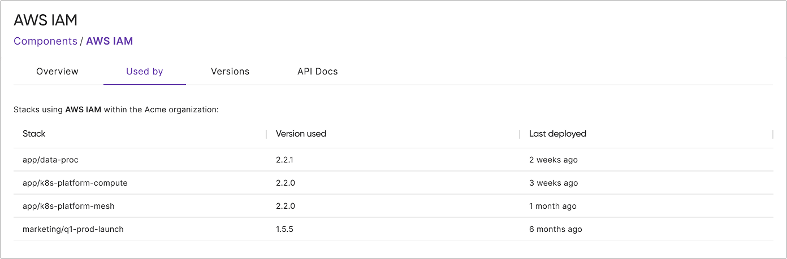

Platform teams publishing components to the Pulumi IDP registry can now see exactly which stacks are using each component and at which version.
<!--more-->

## The visibility problem

You've published a new major version of a component to your private registry. Most teams across your organization have adopted it. Then you need to answer a critical question: "Which teams still haven't adopted it?"

This visibility gap creates real consequences. When a security vulnerability appears in an old version, you can't assess the blast radius. When you want to deprecate a version, you don't know which teams need to migrate. When you release a new feature, you can't measure adoption. Version sprawl accumulates silently.

## Centralized components, centralized visibility

The Pulumi IDP registry solves this by providing both centralized distribution and centralized insight. When you publish a component to the registry, you automatically gain visibility into its usage across your organization.

The new usage tracking feature shows:

- Which stacks are using your component
- What version each stack is running
- When each stack was last updated

Access usage data through the "Used By" tab on any component's detail page in the registry. The view respects your existing access controls, showing only stacks you have permission to see.

## Why this matters

This visibility transforms conversations that were previously not possible or painfully slow.

**Security response:** When a vulnerability is discovered in version 1.2.0 of your component, you can immediately identify every affected stack and reach out to the right teams. What used to take hours or days of detective work now takes minutes.

**Deprecation planning:** Before removing support for version 1.x, you can see exactly which teams are still using it and coordinate migration timelines with complete information.

**Version sprawl management:** See the full distribution of versions in use across your organization and make informed decisions about consolidation.

The registry becomes your source of truth, not just for distributing components, but for understanding how they're used.

## Get started

If you're already publishing components to the Pulumi IDP registry, usage tracking is automatically available. Visit any component detail page to see the "Used By" tab.

If you haven't published to the registry yet, now is the time to start. Publishing a component is as simple as running `pulumi publish`.

For more information, see the [private registry documentation](/docs/idp/get-started/private-registry/).
