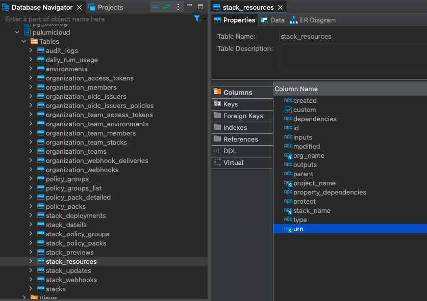

The [Pulumi Cloud REST API](https://www.pulumi.com/docs/pulumi-cloud/cloud-rest-api) allows our users to read the same data available in the [Pulumi Cloud UI](https://app.pulumi.com) and this presents an opportunity for data teams trying to integrate metrics of their Pulumi usage, by accessing said API.

<!--more-->

However, manually integrating dozens of API endpoints into a data pipeline can be a time consuming effort, having to figure out the intricacies of each API, how each endpoint is structured, how to work with the api's paging method, etc.

This is where the [Meltano SDK shines](https://sdk.meltano.com/en/latest/index.html) - It allows anyone to build "Taps" and "Targets" that read and write data, respectively. This way, we can use [tap-pulumi-cloud](https://github.com/pulumi/tap-pulumi-cloud) with loaders such as [target-snowflake](https://hub.meltano.com/loaders/target-snowflake), [target-bigquery](https://hub.meltano.com/loaders/target-bigquery), [target-redshift](https://hub.meltano.com/loaders/target-redshift) or even [target-postgres](https://hub.meltano.com/loaders/target-postgres); allowing us to load the data into our own Data Warehouse easily.

## Set up

First of all set up your environment [by following Meltano's installation guide](https://docs.meltano.com/guide/installation-guide), when this is done, continue by adding tap-pulumi-cloud and your choice of loader into your environment, we'll use target-duckdb for this example:

```bash
meltano add extractor tap-pulumi-cloud
meltano add loader target-duckdb
```

Then switch your tap variant to use Pulumi's instead of the default, open meltano.yml and change the pip_url to `git+https://github.com/pulumi/tap-pulumi-cloud.git`

```yml
version: 1
default_environment: dev
project_id: be90b150-3e48-4ecd-be9d-161ef7417e3c
environments:
- name: dev
- name: staging
- name: prod
plugins:
  extractors:
  - name: tap-pulumi-cloud
    variant: meltanolabs
    pip_url: git+https://github.com/pulumi/tap-pulumi-cloud.git
  loaders:
  - name: target-duckdb
    variant: jwills
    pip_url: target-duckdb~=0.6
```

And run `meltano install` to make sure the right version is installed

## Configure

To configure all settings available for this tap, you can use Meltano's interactive config running:

```bash
meltano config tap-pulumi-cloud set --interactive
```

The required variables are the `token` [(Get one from the Pulumi Cloud)](https://app.pulumi.com/) and `organizations` is a list of organizations you want to extract data from.

## Load data

When your configuration has been finished, you can run the data pipeline like so:

```bash
meltano run tap-pulumi-cloud target-duckdb
```

After the run finishes, you can access the exported tables and create whichever analytics you need on top of them, for example, you could combine this dataset with [tap-github](https://github.com/MeltanoLabs/tap-github) in order to calculate DORA Metrics.



## Orchestration

Once you have this working, you'll need to establish some way of running this regularly in an automated fashion, to keep the data fresh. A popular way to do this is to use an orchestration tool such as [Airflow](https://airflow.apache.org/), [Dagster](https://dagster.io/) or [Mage](https://www.mage.ai/) (Among others) - An easy way to set up Meltano to run in this way is to use [a Docker container with your Meltano project.](https://docs.meltano.com/guide/containerization/)

Another option is to use [Arch which is based on Meltano](https://arch.dev/), which path you choose will depend on your requirements and existing stack.

Since each table is created with primary keys, when the process is run again, each run will "upsert" (update+insert) new data, replacing rows which match the same primary keys; e.g. stream Stacks has a primary key by `org_name, project_name and stack_name`, so if the same combination of keys arrives in the next update, the row will be updated instead of a new row being inserted.

If building a landing zone with all historical changes instead of just the current status, this behavior might not be the desired one, to ignore primary keys and only insert new data, you can add this setting to meltano.yml on the plugin configuration for tap-pulumi-cloud:

```yml
    metadata:
      '*':
        table-key-properties: []
        key-properties: []
```

## Generate metrics

With all of the data in one place, you can generate metrics based on Pulumi data, and combine it with other data sources, for example if you wanted to look at your average Resources Under Management (RUM) monthly (Using DuckDB's SQL Flavor, adjust to your specific database):

```sql
WITH monthly_rum_average AS (
    SELECT
        DATE_TRUNC('month', MAKE_DATE(CAST(year AS INT), CAST(month AS INT), CAST(day AS INT))) AS rum_month,
        org_name,
        AVG(resources) AS monthly_avg_rum
    FROM
        pulumicloud.daily_rum_usage
    GROUP BY
        rum_month, org_name
)
SELECT
    rum_month,
    org_name,
    monthly_avg_rum,
    LAG(monthly_avg_rum) OVER (ORDER BY rum_month) AS previous_month_avg_rum,
    CASE
        WHEN LAG(monthly_avg_rum) OVER (ORDER BY rum_month) IS NULL THEN NULL
        ELSE ((monthly_avg_rum - LAG(monthly_avg_rum) OVER (ORDER BY rum_month)) / LAG(monthly_avg_rum) OVER (ORDER BY rum_month)) * 100
    END AS month_over_month_rum_growth_percentage
FROM
    monthly_rum_average
```

Or if you want to see the total updates per user:

```sql
WITH operations_by_members AS (
    SELECT
        org_name,
        REPLACE(CAST(json_extract(requested_by, '$.github_login') AS STRING), '"', '') AS github_login,
        COUNT(*) AS total_updates
    FROM
        pulumicloud.stack_updates
    GROUP BY
        org_name, github_login
    ORDER BY
        total_updates DESC
)
SELECT
    om.org_name,
    om.role,
    om.user_github_login,
    om.user_name,
    obm.total_updates
FROM
    pulumicloud.organization_members om
INNER JOIN
    operations_by_members obm
ON
    om.org_name = obm.org_name
    AND om.user_github_login = obm.github_login
ORDER BY
    total_updates DESC
```
