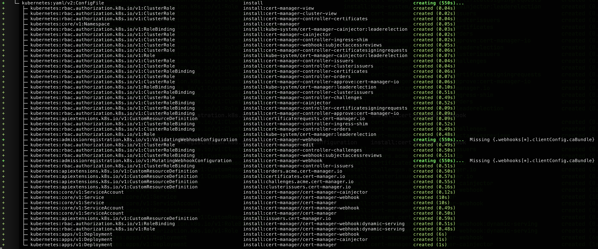

Kubernetes' eventual consistency model is incredibly powerful but can also pose a challenge for workflows that provision complex applications and infrastructure.
Sometimes you really just need to know that a step has succeeded before being able to proceed.

One of the advantages of using Pulumi to manage Kubernetes resources is that it natively and intuitively handles this problem of readiness and dependencies, giving you an easy way to express complex [rollout](https://kubernetes.io/docs/reference/kubectl/generated/kubectl_rollout/) relationships in the programming language of your choice.

The latest v4.18.0 release of the Pulumi Kubernetes provider includes a number of bug fixes and enhancements to the way Pulumi Kubernetes handles resource readiness:

* More helpful errors are surfaced when a resource doesn't become ready in time.
* A new `pulumi.com/deletionPropagationPolicy` annotation enables faster deletions.
* A new `pulumi.com/waitFor` annotation allows for custom readiness criteria.
* And a new experimental feature enables readiness criteria for all resources.

<!--more-->

## Better error reporting

Our goal is that Pulumi Kubernetes users should never need to manually query the cluster to figure out why an update failed, so we try to surface as much information as possible when something fails.

To that end we've made three improvements to the information Pulumi surfaces when something goes wrong while it's waiting for a resource to become ready (or be deleted):

1. Any Kubernetes Events involving the resource with `type: Warning` are now surfaced by Pulumi as warnings. This can help you see if a Service had trouble provisioning a LoadBalancer, for example.

2. Pulumi will now warn you if it looks like a resource's deletion might be blocked by stuck finalizers. This is a common gotcha that is not always obvious.

3. Error messages from resources that actuate Pods (i.e. Deployments, StatefulSets, etc.) now include status codes and termination messages if their Pods failed to start.
   A Pod's [termination message](https://kubernetes.io/docs/tasks/debug/debug-application/determine-reason-pod-failure/) can be helpful in `CrashLoopBackOff` situations and is read from `/dev/termination-log` by default.

   (You can configure this path with `terminationMessagePath`, or use `terminationMessagePolicy: FallbackToLogsOnError` to use a Pod's logs as its termination message.)

## Faster deletions with "pulumi.com/deletionPropagationPolicy"

Pulumi uses [foreground](https://kubernetes.io/docs/concepts/architecture/garbage-collection/#foreground-deletion) cascading deletion by default, which deletes a resource _and_ all of its dependents.
This is the most robust form of deletion but it is also the slowest, and until now there was no way to safely customize this behavior.

The new `pulumi.com/deletionPropagationPolicy` annotation allows you to customize delete behavior while still allowing Pulumi to await readiness when creating or updating the resource.

The annotation accepts three propagation policies, corresponding to the options supported by Kubernetes (see "[Cascading Deletion](https://kubernetes.io/docs/concepts/architecture/garbage-collection/#cascading-deletion)").

1. "background": delete the owner object and leave dependent objects to be asynchronously garbage collected.
   This is faster than "foreground" deletion propagation, but dependent objects can remain temporarily or even indefinitely if they are not finalized.
2. "orphan": delete the owner object and leave dependent objects untouched.
   This can be useful if you want to keep objects around for migration or debugging purposes.
3. "foreground": the provider's default behavior of deleting an object and all of its dependents.
   This is slower but guarantees all dependents have been cleaned up if it succeeds.

{}
Using `skipAwait` to speed up deletion is not recommended when server-side apply is enabled because it is not respected by all resources and it can lead to race conditions during replacement.
The current behavior is considered buggy, and future releases might change the behavior of the `skipAwait` annotation to have no effect during deletion.

The `pulumi.com/deletionPropagationPolicy` annotation is the recommended way to delete something quickly and safely if it has children that are slow to cleanup.
{}

## Experimental: Custom readiness with "pulumi.com/waitFor"

{}
The `pulumi.com/waitFor` annotation is considered experimental and its syntax may change in the future.
{}

There is no one-size-fits-all definition for what it means for a Kubernetes resource to be "ready," so we have also introduced a new annotation, `pulumi.com/waitFor`, which allows you to specify custom readiness criteria on a per-resource basis.
This is functionally similar to `kubectl` [wait](https://kubernetes.io/docs/reference/kubectl/generated/kubectl_wait/).

The new `pulumi.com/waitFor` annotation can be applied to any resource with metadata, and it accepts three possible formats:

1. A `kubectl` [JSONPath] expression -- a string prefixed with "jsonpath=" followed by a path expression and an optional value.

   For example this resource expects its "phase" status field to have a value of "Running":

        "pulumi.com/waitFor": "jsonpath={.status.phase}=Running"

   If a value isn't provided, the resource is considered ready when any value exists at the given path.
   This resource will wait until it has a web hook configured with a CA bundle:

        "pulumi.com/waitFor": "jsonpath={.webhooks[*].clientConfig.caBundle}"

2. A string prefixed with "condition=" followed by the type of the condition and an optional status.
   This matches the behavior of `kubectl wait --for=condition=...` and will wait until the resource has a matching status condition.
   The expected status defaults to "True" if not specified.
   For example this will wait until the resource has a "Synced=True" condition:

       "pulumi.com/waitFor": "condition=Synced"

   and this will wait until it has a "Reconciling=False" condition:

       "pulumi.com/waitFor": "condition=Reconciling=False"

3. Lastly, the `pulumi.com/waitFor` annotation also accepts a JSON-encoded string containing an array of one or more "jsonpath=" or "condition=" expressions.
   For example, this resource will be considered ready when it simultaneously has a "Bar=True" condition and a populated "foo" field.

       "pulumi.com/waitFor": '["jsonpath={.foo}", "condition=Bar"]'

### Custom readiness example: cert-manager

[cert-manager](http://cert-manager.io) is a popular X.509 certificate management solution with some installation nuances.
If you follow the default [instructions](https://cert-manager.io/docs/installation/) with a goal of also creating a new Certificate as part of your Pulumi stack, you might end up with something like this:

```typescript
import * as kubernetes from "@pulumi/kubernetes";

const install = new kubernetes.yaml.v2.ConfigFile("install",
  {
    file: "https://github.com/cert-manager/cert-manager/releases/download/v1.15.2/cert-manager.yaml",
  },
);

const issuer = new kubernetes.apiextensions.CustomResource("issuer",
  {
    apiVersion: "cert-manager.io/v1",
    kind: "ClusterIssuer",
    metadata: {
      name: "selfsigned-issuer",
    },
    spec: {
      selfSigned: {},
    },
  },
  { dependsOn: [install] }
);

new kubernetes.apiextensions.CustomResource("certificate", {
  apiVersion: "cert-manager.io/v1",
  kind: "Certificate",
  metadata: {
    name: "selfsigned-cert",
  },
  spec: {
    isCA: true,
    commonName: "my-ca",
    secretName: "root-secret",
    privateKey: {
      algorithm: "ECDSA",
      size: 256,
    },
    issuerRef: {
      name: issuer.metadata.name,
      kind: issuer.kind,
      group: "cert-manager.io",
    },
  },
});
```

This uses a [v2 ConfigFile](https://www.pulumi.com/blog/kubernetes-yaml-v2/) to `kubectl apply` the cert-manager custom resource definitions (CRDs), and then it creates a self-signed Issuer and Certificate using those CRDs.

The dependencies between resources _appear_ reasonable, however this program will likely fail when it is first run:

{}
error: resource "kubernetes:cert-manager.io/v1:ClusterIssuer::issuer" was not successfully created by the Kubernetes API server: Internal error occurred: failed calling webhook "webhook.cert-manager.io": failed to call webhook: Post "https://cert-manager-webhook.cert-manager.svc:443/validate?timeout=30s": tls: failed to verify certificate: x509: certificate signed by unknown authority
{}

We see this "certificate signed by unknown authority" error because a few things need to happen before the cert-manager webhooks are operational:

* At least one `cainjector` pod needs to be running.
* The `cainjector` pod(s) need to have a leader elected.
* The `cainjector` leader needs to inject certificate authority data into the cert-manager webhooks.

Previously, Pulumi had no way to know whether those pre-requisite steps had taken place.
However, now we can use the `pulumi.com/waitFor` annotation to instruct Pulumi to wait until web hooks have CA data injected before proceeding to create Certificates.
One way to achieve this is by using the new [transforms API](https://www.pulumi.com/blog/resource-transforms/) to annotate the webhooks appropriately:

```typescript
const install = new kubernetes.yaml.v2.ConfigFile("install",
  {
    file: "https://github.com/cert-manager/cert-manager/releases/download/v1.15.2/cert-manager.yaml",
  },
  {
    // Add a "waitFor" annotation which waits for the cainjector pod to come
    // online and modify our webhooks with valid CA bundles. Webhooks
    // needed by our Certificate will fail until this happens.
    transforms: [
      (args) => {
        if (
          args.type ===
            "kubernetes:admissionregistration.k8s.io/v1:ValidatingWebhookConfiguration" ||
          args.type ===
            "kubernetes:admissionregistration.k8s.io/v1:MutatingWebhookConfiguration"
        ) {
          args.props.metadata.annotations["pulumi.com/waitFor"] =
            "jsonpath={.webhooks[*].clientConfig.caBundle}";
          return {
            props: args.props,
            opts: args.opts,
          };
        }
        return undefined;
      },
    ],
  },
);
```

Here we've given the `pulumi.com/waitFor` annotation a value of `jsonpath={.webhooks[*].clientConfig.caBundle}`, which is a [JSONPath] expression that will wait until a webhook in the `webhooks` array has a `clientConfig` with a `caBundle` populated -- indicating that the webhook is fully operational.

Now the program will deploy successfully with a `Missing {.webhooks[*].clientConfig.caBundle}` message while Pulumi waits for the field to be configured.



## Experimental: Generic readiness

Being able to specify custom readiness is powerful, but a lot of resources follow well-known conventions like the `Ready=True` condition.
Rather than requiring you to specify `"pulumi.com/waitFor": "condition=Ready"` on every resource that needs it, there's now an opt-in feature to automatically apply well-known readiness criteria to all resources managed by Pulumi.

Running your program with the environment variable `PULUMI_K8S_AWAIT_ALL=true` will cause Pulumi to automatically wait for _all_ resources to become ready when creating or updating them -- including custom resources.

If a resource appears to follow well-known conventions (like the "Ready" condition, among others) Pulumi will wait for it to become ready.
If the resource doesn't appear to follow well-known conventions, Pulumi will maintain its existing behavior and assume the resource is ready immediately.

(Generic readiness criteria are determined by [cli-utils](https://github.com/kubernetes-sigs/cli-utils/tree/master/pkg/kstatus) (a collection of Go libraries maintained by the [SIG CLI](https://github.com/kubernetes/community/blob/master/sig-cli/README.md)), and behavior is unchanged for any resources that Pulumi already waits for readiness.)

Please don't hesitate to reach out on [GitHub](https://github.com/pulumi/pulumi-kubernetes/issues/new) or [Slack](https://pulumi-community.slack.com/archives/CRFURDVQB) if you're excited about this feature; if you experience any issues with it; or if you have any feedback to share!

## Additional improvements

Several other bug fixes related to the Pulumi Kubernetes provider's await logic are also worth mentioning.

PersistentVolumeClaims with a bind mode of WaitForFirstConsumer are now assumed to be ready as soon as they are created.
Previously, these PVCs could cause deadlocks by preventing their consumer from being provisioned.

Services are now considered ready as long as they have no non-ready Endpoints.
Previously, Services would block forever if they matched Deployments that had been scaled down to zero replicas, or if they had manually provisioned endpoints.

Pulumi will now wait for DaemonSets to become ready instead of always using `skipAwait` semantics.

## Conclusion

We hope you will enjoy the increased flexibility of the `pulumi.com/deletionPropagationPolicy` annotation; the extensibility of the `pulumi.com/waitFor` annotation; and the improved visibility into errors and events Pulumi Kubernetes now provides while managing your cluster resources.

Check out the following links to learn more about Pulumi Kubernetes today!

* [Getting Started](/docs/iac/get-started/kubernetes/)
* [Documentation](/docs/clouds/kubernetes/)
* [Open Source](https://github.com/pulumi/pulumi-kubernetes)
* [Community Slack](https://pulumi-community.slack.com/archives/CRFURDVQB)

[JSONPath]: https://kubernetes.io/docs/reference/kubectl/jsonpath/
