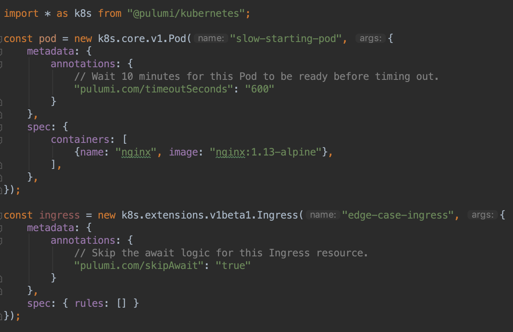

Pulumi enables customers to create, deploy, and manage modern
applications and infrastructure in their preferred cloud environment
using general purpose languages such as Javascript, Typescript and
Python. For many businesses today, the use of modern technology is
associated with Kubernetes, tools (command line or domain specific
tools) to bring-up Kubernetes and a large pile of raw YAML files to
deploy Kubernetes resources with.

Pulumi's ready to use, language specific
[**Kubernetes**](https://github.com/pulumi/pulumi-kubernetes) packages
allow you to trade in the grab bag of tools and YAML files in exchange
for the full expressive power of a general purpose language. In this
blog post, we discuss "await logic", which allows users to have better
visibility into the state of Kubernetes resources as they are being
deployed or created.
<!--more-->

We've
[**previously talked about**]()
how Pulumi [**tracks the status**]()
of Kubernetes resources to provide fine-grained status messages for both
your [**infrastructure and applications**]().
Pulumi [**uses a resource graph**]()
for orchestration, dependency management, differential updates, and
cascading rollouts.

Kubernetes' high availability design is based on an eventually
consistent model. Pulumi augments this model with await logic to provide
the notion of resource "readiness." When you bring up a Kubernetes
cluster with `pulumi up`, cluster resources are only marked ready after
the resource status has been verified by the await logic.

You can see an example of what this looks like in practice in the
screencast below:

Pulumi's sophisticated await logic helps customers with a couple use
cases:

1) Visualize fine-grained, live, single-view status updates for all of
the Kubernetes cluster resources belonging to a [**Pulumi stack**](). Most applications
deployed to Kubernetes have a variety of interacting components,
including Pods, Deployments, Secrets, Persistent Volumes, Config Maps,
Ingress and more. Rather than requiring multiple commands like
`kubectl get pod --all-namespaces`, `kubectl get pv --all-namespaces`,
`kubectl get configmap`, etc., Pulumi understands the complex
dependencies in your application, and takes the guesswork out of
deploying applications to Kubernetes. Pulumi can easily manage multiple
stacks of cloud resources, simplifying the process of adding new
applications, or sharing responsibilities between teams.

2) Reliably integrate with
[**CI/CD systems**]() for infrastructure and
application deployments without requiring hardcoded timeouts, or
scripting kubectl and parsing the resulting JSON/YAML to detect errors.
If errors are encountered, Pulumi automatically surfaces the relevant
messages, making it easy to understand why your deployment failed.

## New Annotations to Customize Kubernetes Await Logic

Although this await logic works great for most workloads, the
fast-moving Kubernetes ecosystem is vast and complex, and edge cases are
inevitable. We have recently added two annotations that can be used to
configure the behavior of the await logic.

In the [`0.20.4` release](https://github.com/pulumi/pulumi-kubernetes/releases/tag/v0.20.4),
we added the "timeoutSeconds" parameter to allow users to override the
default timeout values for resource creation. This is useful for special
cases where a resource is expected to take a long time to be ready, but
should not generally need to be set. To override the timeout for a
selected resource, choose a timeout value, and add the following
annotation to the resource's metadata:
`pulumi.com/timeoutSeconds: "600"`.

In the [`0.20.2` release](https://github.com/pulumi/pulumi-kubernetes/releases/tag/v0.20.2),
we added the ability to completely disable await logic for user-selected
Kubernetes resources. Since the default await logic is so useful, we
only recommend using this feature to work around currently unhandled
edge cases while we work on longer term solutions. To disable await
logic for a selected resource, add the following annotation to the
resource's metadata: `pulumi.com/skipAwait: "true"`.

Here's a TypeScript example that demonstrates both annotations:

If you do encounter an edge case and have to use this feature to work
around it, it may be an oversight in the Pulumi Kubernetes provider - we
would love to hear from you - please
[**open a GitHub issue**](https://github.com/pulumi/pulumi-kubernetes/issues/new)!

Special thanks to our awesome community, including
[Piotrek Bzdyl](https://github.com/pulumi/pulumi-kubernetes/issues/248) and
[Jamie Neil](https://github.com/pulumi/pulumi-kubernetes/issues/317),
who have helped us track down and improve the await logic for several
interesting edge cases!

## Learn More

If you'd like to learn about Pulumi and how to manage your
infrastructure and Kubernetes through code,
[click here to get started today](). Pulumi is open source and free to
use.

If you'd like to go deeper on certain topics, here are some additional
resources to check out:

- [Overview of Pulumi Kubernetes Scenarios]()
- Tutorial: Create a Kubernetes cluster on a cloud provider
  [Amazon EKS](),
  [Google GKE](), or
  [Azure AKS](https://github.com/pulumi/examples/tree/master/azure-ts-aks-mean)
- Tutorial: [Operate and deploy to a Kubernetes cluster]()
- Docs: [Pulumi docs](), including an
  [overview of the programming model]()
- Video: [Watch Joe Beda take Pulumi for a spin in last week's TGIK](https://www.youtube.com/watch?v=ILMK65YVSKw)

As always, you can check out our code
on [GitHub](https://github.com/pulumi), follow us
on [Twitter](https://twitter.com/pulumicorp), subscribe to our [YouTube
channel](https://www.youtube.com/channel/UC2Dhyn4Ev52YSbcpfnfP0Mw), or
join our [Community Slack](https://slack.pulumi.io/) channel if you have
any questions, need support, or just want to say hello.

If you'd like to chat with our team, or get hands-on assistance with
migrating your existing configuration code (including ksonnet programs)
to Pulumi, please don't hesitate [to drop us a line]().
