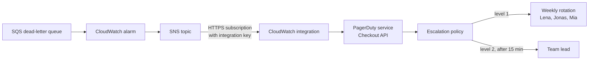
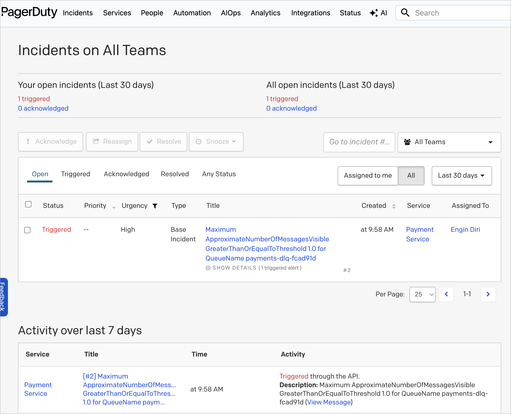
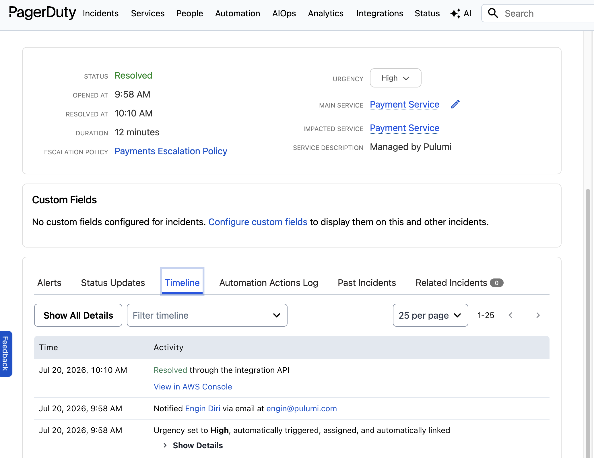

You usually find out in the postmortem: the alarm fired, but it paged a schedule nobody was on anymore. Or the service had been running in production for three months before anyone created the matching [PagerDuty](https://www.pagerduty.com/) service, so the first person to notice the outage was a customer. The infrastructure was code, reviewed and versioned. The incident response setup was forty clicks in a web UI, done once, by someone who has since changed teams.

PagerDuty's own engineering team has been making the case for [managing PagerDuty as code](https://www.pagerduty.com/eng/how-why-terraform/) for years, and the OneUptime folks recently published a [hands-on guide to the PagerDuty Terraform provider](https://oneuptime.com/blog/post/2026-02-23-how-to-configure-pagerduty-provider-in-terraform/view) that walks the whole resource catalog. I liked both posts, and you probably know where this is going: I want the same thing in TypeScript, with the on-call setup and the infrastructure it protects living in the same Pulumi program. Teams, schedules, escalation policies, services, and the CloudWatch alarm that pages you: one `pulumi up`.

<!--more-->

## What you are building

The demo models a small platform team that owns a checkout service on AWS. On the PagerDuty side: a team with three members, a weekly on-call rotation, an escalation policy with two levels, and a service with a CloudWatch integration. On the AWS side: a dead-letter queue, an alarm that fires when a message lands in it, and an SNS topic that forwards the alarm to PagerDuty. The interesting part is where the two meet: the integration key PagerDuty mints flows straight into the SNS subscription without ever touching a clipboard.



Everything on both sides of that diagram is one TypeScript program. If you would rather write Python, JavaScript, Go, .NET, Java, or YAML, the [Pulumi PagerDuty provider](https://www.pulumi.com/registry/packages/pagerduty/) supports all of them. It is bridged from PagerDuty's official Terraform provider (which started life as a community project by Alexander Hellbom before PagerDuty adopted it), so its resource coverage closely tracks the upstream provider.

## Prerequisites

Before getting started, ensure you have:

- [Pulumi CLI](/docs/install/) installed and configured
- A [Pulumi Cloud account](https://app.pulumi.com/signup)
- A PagerDuty account with admin access; a [free trial](https://www.pagerduty.com/sign-up/) works fine
- An [AWS](https://aws.amazon.com/) account for the alarm wiring in the second half
- Node.js 18+ for the TypeScript program

## The provider and the token

Create a new project and add the PagerDuty provider:

```bash
pulumi new aws-typescript --name pagerduty-oncall
npm install @pulumi/pagerduty
```

The provider authenticates with a REST API key. In PagerDuty, navigate to **Integrations** > **API Access Keys** and create a new key. This is the account-level REST API key, not a user token: user tokens are scoped to what one person can see, and you want the automation to manage the whole account.

I store the key in [Pulumi ESC](/docs/esc/) so it never lands in a `.env` file, shell history, or agent context:

```bash
pulumi env init <your-org>/pagerduty-demo/dev
```

Add the token to the environment definition:

```yaml
values:
  pagerduty:
    token:
      fn::secret: <your-rest-api-key>
  pulumiConfig:
    pagerduty:token: ${pagerduty.token}
```

Then reference the environment from your stack in `Pulumi.dev.yaml`:

```yaml
environment:
  - <your-org>/pagerduty-demo/dev
```

{}
In a hurry? `pulumi config set pagerduty:token --secret` does the same job for a single stack, and the provider also reads the `PAGERDUTY_TOKEN` environment variable. If your account lives on the EU service region, additionally set `pagerduty:serviceRegion` to `eu`.
{}

## Teams, users, and memberships

Everything in PagerDuty hangs off teams and users, so that is where the program starts:

```typescript
import * as pagerduty from "@pulumi/pagerduty";

const platformTeam = new pagerduty.Team("platform-team", {
    name: "Platform Engineering",
    description: "Owns the checkout path and the shared platform",
});

const lena = new pagerduty.User("lena", {
    name: "Lena Fischer",
    email: "lena@example.com",
});

const jonas = new pagerduty.User("jonas", {
    name: "Jonas Weber",
    email: "jonas@example.com",
});

const mia = new pagerduty.User("mia", {
    name: "Mia Schneider",
    email: "mia@example.com",
});

new pagerduty.TeamMembership("lena-platform", {
    userId: lena.id,
    teamId: platformTeam.id,
    role: "manager",
});

new pagerduty.TeamMembership("jonas-platform", {
    userId: jonas.id,
    teamId: platformTeam.id,
    role: "responder",
});

new pagerduty.TeamMembership("mia-platform", {
    userId: mia.id,
    teamId: platformTeam.id,
    role: "responder",
});
```

Three users, one team, three memberships. Reorgs stop being an afternoon of UI archaeology and become a pull request where the diff shows exactly who moved where.

{}
If your users already come from SSO or SCIM provisioning (they usually do), don't create them in the program. Look them up instead with the `getUser` data source: `pagerduty.getUserOutput({ email: "lena@yourcompany.com" })`. And if your account restricts sign-ups to your company's email domain, the API enforces that too, so swap the `example.com` addresses for ones on your own domain when trying this out.
{}

## A schedule people can live with

The on-call schedule is where incident response meets real life, so it deserves more care than a demo usually gives it. If you have seen PagerDuty schedules in Terraform before, you probably remember the `Schedule` resource and its `layers`. That resource is deprecated in the current provider because it speaks the legacy v1 schedules API; its successor `Schedulev2` uses PagerDuty's new model built on rotations, events, and RFC 5545 recurrence rules:

```typescript
const primary = new pagerduty.Schedulev2("primary", {
    name: "Platform Primary On-Call",
    description: "Weekly hand-off rotation for the platform team",
    timeZone: "Europe/Berlin",
    teams: [platformTeam.id],
    rotations: [{
        events: [{
            name: "Weekly rotation",
            startTime: "2026-08-03T09:00:00+02:00",
            endTime: "2026-08-10T09:00:00+02:00",
            effectiveSince: "2026-08-03T07:00:00Z",
            recurrences: ["RRULE:FREQ=WEEKLY;BYDAY=MO"],
            assignmentStrategies: [{
                type: "rotating_member_assignment_strategy",
                shiftsPerMember: 1,
                members: [
                    { type: "user_member", userId: lena.id },
                    { type: "user_member", userId: jonas.id },
                    { type: "user_member", userId: mia.id },
                ],
            }],
        }],
    }],
});
```

Read it from the inside out. The event is one shift: it starts Monday at 09:00 Berlin time and ends the following Monday at 09:00, and the RRULE makes it recur weekly. The assignment strategy hands each occurrence to the next member in the list, so Lena, Jonas, and Mia each take a full week, round robin. `effectiveSince` tells PagerDuty when this configuration starts producing shifts. Business-hours-only coverage falls out of the same model: shorten the shift window and change the recurrence to `RRULE:FREQ=WEEKLY;BYDAY=MO,TU,WE,TH,FR`.

## The escalation policy

The escalation policy reads top to bottom, the same way the incident will play out:

```typescript
const escalation = new pagerduty.EscalationPolicy("platform-escalation", {
    name: "Platform Escalation Policy",
    numLoops: 2,
    teams: platformTeam.id,
    rules: [
        {
            escalationDelayInMinutes: 15,
            targets: [{
                type: "schedule_reference",
                id: primary.id,
            }],
        },
        {
            escalationDelayInMinutes: 10,
            targets: [{
                type: "user_reference",
                id: lena.id,
            }],
        },
    ],
});
```

Page whoever the primary schedule says is on call. If nobody acknowledges within 15 minutes, page Lena directly. If the whole chain runs dry, `numLoops: 2` starts it over twice more before PagerDuty gives up. When someone asks what actually happens when this fires at 3 AM, the answer is a dozen lines of reviewed code, not a screenshot of a UI that may or may not be current.

## The service

A PagerDuty service is the unit incidents attach to, and it is where the escalation policy gets wired in:

```typescript
const checkoutService = new pagerduty.Service("checkout", {
    name: "Checkout API",
    escalationPolicy: escalation.id,
    autoResolveTimeout: "14400",
    acknowledgementTimeout: "600",
});
```

Think of a service as the thing that can break, like the checkout API or the payments queue behind it. Every incident in PagerDuty opens against exactly one service, and the service decides what happens next. The escalation policy answers who gets paged. `acknowledgementTimeout` re-triggers an incident that was acknowledged and then went quiet for ten minutes, so a sleepy "ack" cannot make a problem disappear. And `autoResolveTimeout` closes an incident that has sat open for four hours, which keeps the dashboard honest when everyone forgot to press resolve. Map services one-to-one to the things your team actually owns, and the service directory turns into an honest inventory of your system, each entry with an owner attached.

## The payoff: the alarm and the pager in one program

So far this is a nicer syntax for what the Terraform guides already do. Here is where it starts earning its keep. Remember the service from the top of this post that ran for three months without a pager? The place that failure usually hides is a dead-letter queue, where bad news piles up quietly. This is what it looks like when the queue, the alarm, and the pager live in one program:

```typescript
import * as aws from "@pulumi/aws";
import * as pulumi from "@pulumi/pulumi";

const cloudwatch = pagerduty.getVendorOutput({ name: "Amazon CloudWatch" });

const checkoutIntegration = new pagerduty.ServiceIntegration("checkout-cloudwatch", {
    name: "Amazon CloudWatch",
    service: checkoutService.id,
    vendor: cloudwatch.id,
});

const alarmTopic = new aws.sns.Topic("checkout-alarms");

new aws.sns.TopicSubscription("checkout-alarms-to-pagerduty", {
    topic: alarmTopic.arn,
    protocol: "https",
    endpoint: pulumi.interpolate`https://events.pagerduty.com/integration/${checkoutIntegration.integrationKey}/enqueue`,
    endpointAutoConfirms: true,
});

const dlq = new aws.sqs.Queue("checkout-dlq");

new aws.cloudwatch.MetricAlarm("checkout-dlq-alarm", {
    alarmDescription: "Messages are landing in the checkout dead-letter queue",
    namespace: "AWS/SQS",
    metricName: "ApproximateNumberOfMessagesVisible",
    dimensions: {
        QueueName: dlq.name,
    },
    statistic: "Maximum",
    period: 60,
    evaluationPeriods: 1,
    threshold: 1,
    comparisonOperator: "GreaterThanOrEqualToThreshold",
    alarmActions: [alarmTopic.arn],
    okActions: [alarmTopic.arn],
});
```

Follow the integration key. PagerDuty mints it when the `ServiceIntegration` is created, and a few lines later it is interpolated into the SNS subscription endpoint. In the two-tool world, this is the step where you open the PagerDuty UI, copy the integration URL, and paste it into a variables file or a wiki page, which is exactly the step that gets skipped at 5 PM on a Friday. Here it cannot be skipped, because it is a dependency: Pulumi will not create the subscription before the integration exists.

`endpointAutoConfirms: true` matters because PagerDuty answers the SNS subscription handshake on its own; without it, the subscription sits in "pending confirmation" forever. And since the alarm sends its OK state to the same topic, PagerDuty resolves the incident automatically once the queue drains.

Tearing down the service? The alarm, the topic, the subscription, and the PagerDuty service all go in the same `pulumi destroy`, which spares you the orphaned PagerDuty service that keeps paging people about infrastructure that no longer exists. I have seen that one too.

## Azure and Google Cloud, same trick

Nothing about this is AWS-specific. It is always the same two steps: PagerDuty mints a key, the monitoring side consumes it. On Google Cloud, Cloud Monitoring has a native PagerDuty channel type, and its `serviceKey` is the integration key of an Events API v2 integration:

```typescript
import * as gcp from "@pulumi/gcp";

const gcpIntegration = new pagerduty.ServiceIntegration("checkout-gcp", {
    name: "Google Cloud Monitoring",
    service: checkoutService.id,
    type: "events_api_v2_inbound_integration",
});

new gcp.monitoring.NotificationChannel("checkout-pagerduty", {
    displayName: "PagerDuty: Checkout API",
    type: "pagerduty",
    sensitiveLabels: {
        serviceKey: gcpIntegration.integrationKey,
    },
});
```

On Azure, an Azure Monitor action group with a webhook receiver does the same job, pointed at the familiar enqueue URL (with `resourceGroup` being an `azure.resources.ResourceGroup` from earlier in your program):

```typescript
import * as azure from "@pulumi/azure-native";

const azureVendor = pagerduty.getVendorOutput({ name: "Microsoft Azure" });

const azureIntegration = new pagerduty.ServiceIntegration("checkout-azure", {
    name: "Microsoft Azure",
    service: checkoutService.id,
    vendor: azureVendor.id,
});

new azure.monitor.ActionGroup("checkout-pagerduty", {
    resourceGroupName: resourceGroup.name,
    location: "global",
    groupShortName: "checkout",
    enabled: true,
    webhookReceivers: [{
        name: "pagerduty",
        serviceUri: pulumi.interpolate`https://events.pagerduty.com/integration/${azureIntegration.integrationKey}/enqueue`,
        useCommonAlertSchema: true,
    }],
});
```

The `location: "global"` is not a placeholder. Action groups are a global service, and Azure rejects regular regions like `westeurope` for them; setting it explicitly makes that intent obvious in the code.

Same program, same key handoff, different cloud. If your platform spans all three, the PagerDuty side does not care.

## Breaking a Fargate payment service on purpose

Everything so far wires configuration together, but I did not want to publish wiring I had never watched fire. So I put it to the test: a companion project that deploys a small payment service on [AWS Fargate](https://aws.amazon.com/fargate/) together with its entire failure chain, and then breaks it on purpose.

The worker is deliberately boring: the plain AWS CLI container image running a shell loop. It receives payment messages from an SQS queue, processes anything that has an `amount`, and refuses everything else. A refused message goes back to the queue, and after three failed receives SQS moves it to the dead-letter queue. From there, the chain from earlier in this post takes over: DLQ alarm, SNS topic, CloudWatch integration, escalation policy, phone.

A valid payment flows through in seconds:

```bash
./scripts/send-payment.sh
# worker log: processed payment: {"orderId":"4711","amount":"49.99","currency":"EUR"}
```

A payment without an amount poisons the queue:

```bash
./scripts/inject-failure.sh
```

Here is the timeline from my test run, as the test script observed it through the AWS and PagerDuty APIs:

| Elapsed | What happened |
|---------|---------------|
| 0:00 | Poison payment injected |
| 3:45 | Third receive failed, message redriven to the DLQ, alarm in `ALARM` |
| 3:49 | PagerDuty incident triggered on Payment Service |
| 3:50 | Recovery: dead-letter queue purged |
| 6:48 | Alarm back to `OK` |
| 6:49 | Incident resolved |



Under four minutes from a bad message to a page, and I never touched the PagerDuty UI in either direction; the incident opened and closed itself off the alarm's state transitions. The incident timeline spells it out: automatically triggered and assigned, then resolved through the integration API.



The full program, the worker loop, and the inject and recover scripts are in the companion repo:



## Growing without the drift: a reusable component

Whether any of this stays consistent as your organization grows comes down to defaults. If creating a properly paged service takes a checklist, people will skip items. If it takes a [component](/docs/iac/concepts/components/), they won't, because the component is less work than the checklist. So wrap the service, the integration, and the alarm topic into one:

```typescript
export class OnCallService extends pulumi.ComponentResource {
    public readonly service: pagerduty.Service;
    public readonly alarmTopic: aws.sns.Topic;

    constructor(name: string, args: {
        displayName: string;
        escalationPolicy: pulumi.Input<string>;
    }, opts?: pulumi.ComponentResourceOptions) {
        super("acme:oncall:OnCallService", name, {}, opts);

        this.service = new pagerduty.Service(name, {
            name: args.displayName,
            escalationPolicy: args.escalationPolicy,
            autoResolveTimeout: "14400",
            acknowledgementTimeout: "600",
        }, { parent: this });

        const cloudwatch = pagerduty.getVendorOutput({ name: "Amazon CloudWatch" });

        const integration = new pagerduty.ServiceIntegration(name, {
            name: "Amazon CloudWatch",
            service: this.service.id,
            vendor: cloudwatch.id,
        }, { parent: this });

        this.alarmTopic = new aws.sns.Topic(name, {}, { parent: this });

        new aws.sns.TopicSubscription(name, {
            topic: this.alarmTopic.arn,
            protocol: "https",
            endpoint: pulumi.interpolate`https://events.pagerduty.com/integration/${integration.integrationKey}/enqueue`,
            endpointAutoConfirms: true,
        }, { parent: this });

        this.registerOutputs({});
    }
}
```

And now every new service ships with a pager attached. The `checkout` instance here replaces the hand-rolled service, integration, and topic from earlier:

```typescript
const checkout = new OnCallService("checkout", {
    displayName: "Checkout API",
    escalationPolicy: escalation.id,
});

const payments = new OnCallService("payments", {
    displayName: "Payments API",
    escalationPolicy: escalation.id,
});
```

App teams get one contract: point your alarms at `alarmTopic`. The escalation policy, the timeouts, the integration, the SNS wiring, all of it becomes the paved road instead of a checklist item. This is the same [components-and-templates story](/blog/golden-paths-infrastructure-components-and-templates/) I keep telling for compute and networking; incident response just turns out to be another thing a platform team can pave.

## Importing what you already clicked together

Nobody starts from an empty PagerDuty account. The realistic adoption path is `pulumi import`, resource by resource:

```bash
pulumi import pagerduty:index/team:Team platform-team PXXXXXX
pulumi import pagerduty:index/service:Service checkout PYYYYYY
```

The IDs are in the URL when you open a team or service in the PagerDuty web UI, and `pulumi import` writes the matching code for you, so bringing an existing setup under management is mostly a copy-paste loop. The [import guide](/docs/iac/guides/migration/import/) covers the mechanics.

One habit matters after that, and PagerDuty's engineering post makes the same point about Terraform: once a resource is managed as code, stop editing it in the UI. Changes made in the web console are drift, and you will want to run `pulumi refresh` (or let [drift detection](/blog/day-2-operations-drift-detection-and-remediation/) do it on a schedule) to catch them before the 3 AM page tests your assumptions for you.

## Conclusion

The pitch for managing PagerDuty as code has less to do with YAML versus HCL versus TypeScript than with the gap between two systems that each hold half the truth. Your infrastructure code knows a queue exists; PagerDuty knows who gets paged when it backs up. Keep them in separate tools and that gap is maintained by hand, which means it is maintained until the person who cared about it leaves.

Putting both sides in one Pulumi program closes the gap structurally. The integration key becomes a dependency edge instead of a wiki entry, and forgetting the escalation policy is not even possible, because `escalationPolicy` is a required property and the program will not compile without it. That is the version of "nothing gets forgotten" I am willing to rely on.

To go further:

- The [PagerDuty provider in the Pulumi Registry](https://www.pulumi.com/registry/packages/pagerduty/) covers the full resource catalog: event orchestrations, maintenance windows, response plays, and more.
- [Pulumi ESC](/docs/esc/) keeps the API token out of your shell history.
- Coming from the Terraform provider? Your resource knowledge maps one-to-one, and the [migration guide](/docs/iac/guides/migration/migrating-to-pulumi/from-terraform/) covers the rest.

If you build something with this, or if your on-call setup has a horror story that code would have prevented, come tell me in the [Pulumi Community Slack](https://slack.pulumi.com/).
