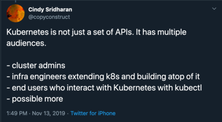
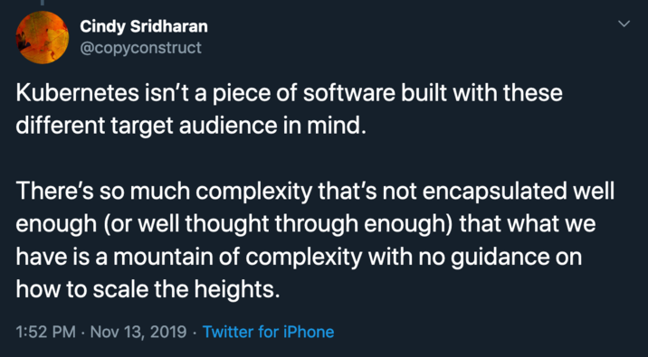
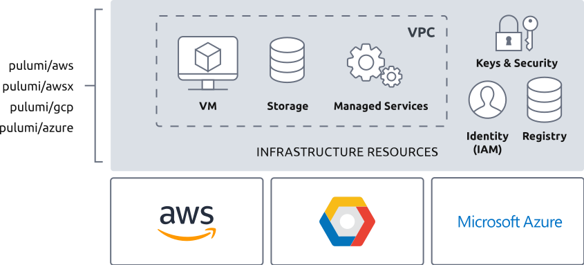
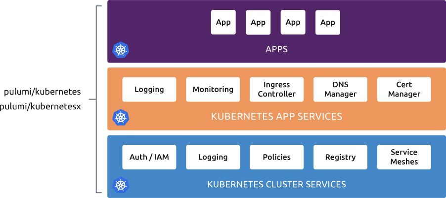

Running Kubernetes in production can be challenging. This past year, Pulumi has collected common patterns of usage informed by best practices for provisioning Kubernetes infrastructure and running containerized applications. We call this Pulumi Crosswalk for Kubernetes: a collection of playbooks and libraries to help you to successfully configure, deploy, and manage Kubernetes in a way that works for teams in production.

## Kubernetes is Vast and Complex




Kubernetes is the standard multi-cloud platform for modern containerized applications. Usage has grown by 50% in just six months according to a [DZone article](https://dzone.com/articles/survey-reveals-rapid-growth-in-kubernetes-usage-se). There is also a strong trend for public cloud container adoption shifting to [Kubernetes](https://www.tigera.io/blog/top-6-kubernetes-trends-for-2019/).

Rapid adoption of a complex platform such as Kubernetes presents challenges. For example, enterprise teams can take six to twelve months to on-ramp to Kubernetes, containers, and the cloud before their application goes into production. Once deployed, misconfigured infrastructure accounts for 40 to 50% of [production outages](https://danluu.com/postmortem-lessons/).

Managed Kubernetes clusters, such as AWS Elastic Kubernetes Services (EKS), Azure Kubernetes Services (AKS), Google Kubernetes Engine and Digital Ocean, have become popular because they help tame the complexity of building and maintaining clusters. However, managed Kubernetes solutions are just the starting point and require adding and configuring additional infrastructure and services before they are secure, robust, and ready for deploying your production applications.

## How Crosswalk for Kubernetes Is Organized

We have been working with customers and open source users of our infrastructure as code tools for Kubernetes and we’ve seen several common patterns that we’ve distilled into six distinct playbooks realized as [stacks](https://www.pulumi.com/docs/intro/concepts/stack/):

* Identity
* Managed Infrastructure
* Cluster Configuration
* Cluster Services
* Application Services
* Applications

By leveraging stacks, we can tackle each unique concern one at a time in a way that composes nicely.

### Identity

Establishing identities and roles for organizations and CI/CD is a requirement for secure production software configuration. An identity stack contains identities and roles for the team and service accounts for CI/CD and bots that automate processes. Each cloud provider establishes identity in their unique way and the guides provide instructions for [AWS IAM](https://aws.amazon.com/iam/), [GCP IAM](https://cloud.google.com/iam/), and [Azure AD](https://azure.microsoft.com/en-us/services/active-directory/). Example code is available for each cloud provider: [AWS Identity and Access Management](https://github.com/pulumi/kubernetes-guides/tree/master/aws/01-identity), [GCP Identity and Access Management](https://github.com/pulumi/kubernetes-guides/tree/master/gcp/01-identity), [Azure Active Directory](https://github.com/pulumi/kubernetes-guides/tree/master/azure/01-identity).

After completing this step, your cluster and CI/CD deployment procedures can use IAM to ensure access to your cluster, the ability to change applications and configuration and the resulting runtime environment is secure using similar techniques to what you might have already been using on your cloud of choice.

### Managed Infrastructure



Many of us are shifting to infrastructure running on a managed cloud provider. While there are benefits to using managed cluster infrastructure, additional related resources often need to be provisioned. At the minimum, this requires building networking infrastructure, storage backends and any number of resources such as CMS, container registries, and data pipelines.

Crosswalk for Kubernetes covers two of the most common tasks, configuring networking and provisioning storage, in detail. Kubernetes will typically use private subnets for load balancers, private subnets for workers and managed Pod networking. Another requirement of Kubernetes is storage which provides data persistence through either shared storage and or volumes for Pods. There are many types of volumes and they vary from cloud provider but can generally be divided into mechanical drives and SSDs and network backed storage such as CephFS or NFS.

The guide provides [instructions](https://www.pulumi.com/docs/guides/crosswalk/kubernetes/control-plane/#managed-infrastructure) and full code examples to implement managed infrastructure stacks for both networking for [AWS](https://github.com/pulumi/kubernetes-guides/tree/master/aws/02-managed-infra), [Azure](https://github.com/pulumi/kubernetes-guides/tree/master/azure/02-managed-infra), and [GCP](https://github.com/pulumi/kubernetes-guides/tree/master/gcp/02-managed-infra).

After completing these guides, you will have all of the underlying infrastructure required to begin configuring your actual Kubernetes cluster itself.

### Cluster Configuration


Managed Kubernetes services, such as AWS EKS, Azure AKS, and Google GKE, provide a simple way to deploy a barebones Kubernetes cluster with reasonable defaults. The cluster requires cluster-wide services to be used in production, this includes creating resources for the application and logically segmenting the cluster and setting policies and quotas.

The guide demonstrates how to create names for [cluster services](https://www.pulumi.com/docs/guides/crosswalk/kubernetes/configure-defaults/#namespaces) such as logging and monitoring, application services like ingress and DNS services, and applications. An example of [resource quotas](https://www.pulumi.com/docs/guides/crosswalk/kubernetes/configure-defaults/#quotas) across all Pods in a namespace, and how to set [PodSecurityPolicies](https://www.pulumi.com/docs/guides/crosswalk/kubernetes/configure-defaults/#podsecuritypolicies) for setting cluster level security controls. Complete examples for [AWS](https://github.com/pulumi/kubernetes-guides/tree/master/aws/03-cluster-configuration), [Azure](https://github.com/pulumi/kubernetes-guides/tree/master/azure/03-cluster-configuration), and [GCP](https://github.com/pulumi/kubernetes-guides/tree/master/gcp/03-cluster-configuration) are on GitHub.

After this step, you'll have a fully-functioning Kubernetes cluster. Before moving on to deploying applications into it, however, you will want to set up some services to make your cluster more manageable and ready to connect applications to the outside world.

### Cluster Services



Cluster services are scoped at the [Kubernetes cluster](https://kubernetes.io/docs/concepts/cluster-administration/cluster-administration-overview/) level and typically shared between many applications deployed to the same cluster. Common cluster services are logging, monitoring, policy enforcement, container registries, and service meshes. The [guide](https://www.pulumi.com/docs/guides/crosswalk/kubernetes/cluster-services/) provides an example of how to configure logging and monitoring, including how to set up Datadog to aggregate node and container metrics and events. Examples are also provided on how to configure native cloud provider logging solutions. Full examples are available for [AWS](https://github.com/pulumi/kubernetes-guides/tree/master/aws/04-cluster-services) and [Azure](https://github.com/pulumi/kubernetes-guides/tree/master/azure/04-cluster-services) on Github.

### Application Services

Applications also require additional services such as ingress controllers, DNS and TLS, and data stores. The guide covers how to implement [datastores](https://www.pulumi.com/docs/guides/crosswalk/kubernetes/app-services/#datastores) and general application services such as a [NGINX ingress controller](https://www.pulumi.com/docs/guides/crosswalk/kubernetes/app-services/#nginx-ingress-controller).

Configuring data stores is another common task-specific to your application. In many cases, end-users are more successful when leveraging hosted data services like AWS S3 or RDS, Azure CosmosDB, or Google Bigtable, rather than worrying about configuring stateful containers. The [AWS example](https://github.com/pulumi/kubernetes-guides/tree/master/aws/05-app-services) and the [GCP example](https://github.com/pulumi/kubernetes-guides/tree/master/gcp/05-app-services) shows how to deploy and configure PostgreSQL and Redis. The [Azure example](https://github.com/pulumi/kubernetes-guides/tree/master/azure/05-app-services) example demonstrates how to deploy Cosmos DB and MongoDB.

Now that we've configured our cluster and all of the services required to run an application, the next step is to configure and deploy your application. This begins with the authoring experience and ends with continuous delivery.

### Applications

Deploying applications can involve many types of tasks, ranging from building and deploying apps in a container, deploying with Helm charts, deploying a job, a DaemonSet, and StatefulSet. One of the most common tasks in a microservices architecture is [building a container, pushing it to a registry and deploying it to Kubernetes](https://www.pulumi.com/docs/guides/crosswalk/kubernetes/apps/#build-and-deploy-a-container). For comparison, the example is written in typescript with just the Pulumi for Kubernetes library and the Kubernetes Crosswalk. Note the difference in deployment.

Pulumi supports the entire Kubernetes object model out of the box so you can use languages like TypeScript and Python rather than YAML. Crosswalk for Kubernetes also includes a library to reduce boilerplate in your application's configuration and help you be more productive. For comparison, this example is written in TypeScript first using the raw Pulumi for Kubernetes library, and then using Kubernetes Crosswalk. Although the differences here are small, for large configurations, we often see a reduction of code by over 50%.

Pulumi for Kubernetes

```typescript
// Create a Deployment of the built container.
const appLabels = { app: customImage };
const appDeployment = new k8s.apps.v1.Deployment("app", {
 spec: {
 selector: { matchLabels: appLabels },
 replicas: 1,
 template: {
 metadata: { labels: appLabels },
 spec: {
 containers: [{
 name: customImage,
 image: appImage,
 ports: [{name: "http", containerPort: 80}],
 }],
 }
 },
 }
}, { provider: provider });
```

Crosswalk for Kubernetes

```typescript
// Define the Pod for the Deployment.
const pb = new kx.PodBuilder({
 containers: [{
 image: appImage,
 ports: { "http": 80 },
 }],
});

// Create a Deployment of the Pod defined by the PodBuilder.
const appDeploymentKx = new kx.Deployment("app-kx", {
 spec: pb.asDeploymentSpec(),
}, { provider: provider });
```

There are many more [application examples](https://www.pulumi.com/docs/guides/crosswalk/kubernetes/apps/#overview) in the Guide. Complete [code examples](https://github.com/pulumi/kubernetes-guides) for building and deploying a container in a Kubernetes cluster are available on Github. Additional application examples for other [common application tasks](https://github.com/pulumi/kubernetes-guides/tree/master/apps) are also available on Github.

Often teams will start with manual CLI-driven deployments, which is great for a fast initial development experience. Afterward, however, most teams will adopt CI/CD, so that deployments are triggered automatically by other events such as Git commits or Slack commands. This helps multiple team members collaborate on reviews and shared changes, ensure that practices such as testing are well-integrated into the workflow, and help promotions between multiple environments. [A series of guides](https://www.pulumi.com/docs/guides/continuous-delivery/) walks through how to continuously deliver your Kubernetes applications using many popular CI/CD systems, such as GitLab, Codefresh, Azure DevOps Pipelines, and more.

## Playbooks for Multiple Audiences

Crosswalk for Kubernetes was informed by our experience working with developers and operators. We have grouped common tasks in playbooks that make deploying applications on Kubernetes accessible regardless of what part of the deployment you are working on. If you work with Kubernetes, we invite you to try infrastructure as code using [Crosswalk for Kubernetes](https://www.pulumi.com/docs/guides/crosswalk/kubernetes/).
