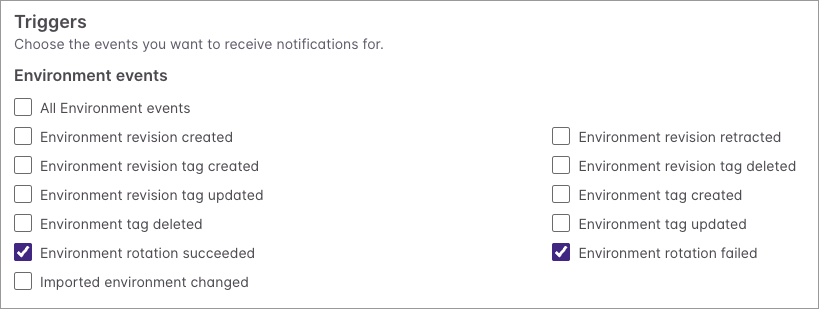

[Pulumi ESC](/docs/esc/) centralizes your secrets and configuration, and it can [automatically rotate secrets](/docs/esc/concepts/rotators/) on a schedule so credentials never go stale. But a rotation is only useful if the systems that depend on it know it happened. ESC secret rotation webhooks close that gap by notifying you the moment a secret rotates.

<!--more-->

## Introducing secret rotation webhooks

With [ESC webhooks](/docs/esc/concepts/webhooks/), you can react to rotations automatically. When ESC rotates an environment's secrets, a webhook can be configured to trigger on either success or failure. Use it to notify your team in Slack, refresh services that hold the old credential, or catch a failed rotation before it causes an outage.

## How to configure

Using the Pulumi Cloud Console, you can now configure webhooks for "Environment rotation succeeded" and "Environment rotation failed" in your ESC Environment's Settings page (under **Settings** -> **Notifications**).



You can also use the Pulumi Service Provider to configure webhooks. Here is an example in TypeScript:

```typescript
const environmentWebhook = new service.Webhook("env-webhook", {
  active: true,
  displayName: "env-webhook",
  organizationName: "my-org",
  projectName: environment.project,
  environmentName: environment.name,
  payloadUrl: "https://example.com",
  filters: [WebhookFilters.EnvironmentRotationSucceeded, WebhookFilters.EnvironmentRotationFailed],
})
```

## Get started

Secret rotation webhooks are available now for all Pulumi ESC environments. See the [webhooks documentation](/docs/esc/concepts/webhooks/) to get started, and share your feedback on our [GitHub repository](https://github.com/pulumi/esc).
