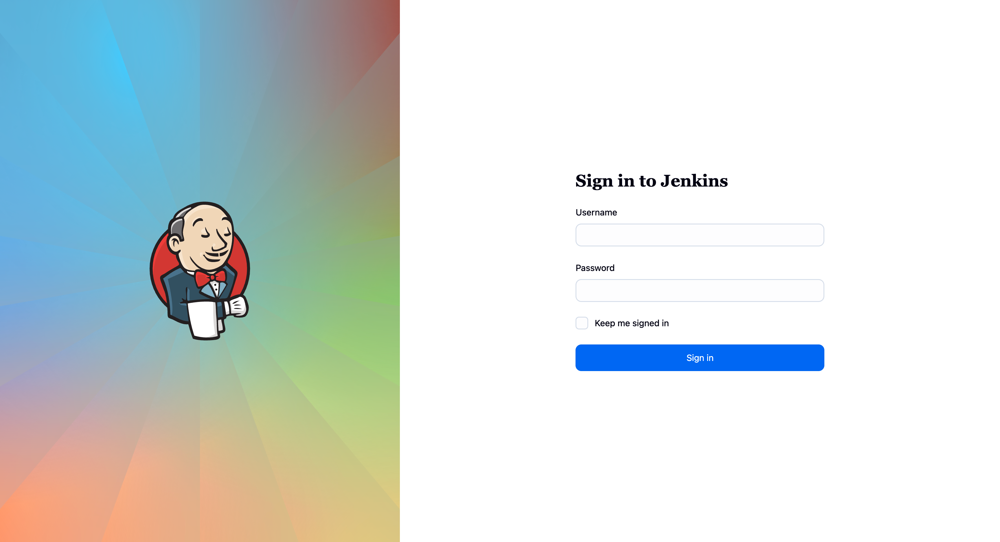

It's funny how technology has a way of sneaking back into your life just when you think you've moved on for good. Jenkins and I have quite the history. Think of it as that reliable but slightly temperamental friend from your college days who you haven't seen in years.

<!--more-->

## A Blast from the Jenkins Past

The last time Jenkins and I were on speaking terms was during my tenure at my former workplace, back when the CI/CD landscape looked very different than it does today. We weren't just casual acquaintances either. We were deep in the trenches together, orchestrating builds, managing deployments, and occasionally cursing at each other when things went sideways (which, let's be honest, happened more often than I'd like to admit).

Those were the days when Jenkins was transitioning from its scrappy, plugin-heavy adolescence into something resembling maturity. I was part of a significant modernization effort that would make any DevOps engineer's heart race: migrating our entire Jenkins infrastructure from Jenkins 1.x to the shiny new [Jenkins 2.0](https://www.jenkins.io/2.0/). If you've never experienced a Jenkins major version upgrade in a production environment, imagine performing heart surgery while the patient is running a marathon. Technically possible, but requiring nerves of steel and copious amounts of coffee.

The migration wasn't just about version numbers. Jenkins 2.0 brought with it the [Pipeline plugin](https://www.jenkins.io/doc/book/pipeline/) as a first-class citizen, transforming how we thought about continuous integration. Gone were the days of clicking through endless GUI configurations and praying that someone had documented the build process correctly. Instead, we embraced the revolutionary concept of "Pipeline as Code", storing our build definitions in `Jenkinsfile` scripts that lived alongside our application code.

But the real game-changer came when we decided to containerize our Jenkins worker nodes using Docker. This was back when Docker was still the new kid on the block, and the idea of running build agents in containers felt both cutting-edge and slightly reckless. We implemented the [Docker plugin for Jenkins](https://plugins.jenkins.io/docker-plugin/), which allowed us to spin up fresh, isolated environments for each build. No more "but it works on my machine" syndrome. Every build got its own pristine container, complete with exactly the dependencies it needed.

The transformation was remarkable. What used to take us hours of manual environment setup and dependency management became as simple as defining a `Dockerfile`. Our build agents went from being precious, hand-crafted snowflakes that required constant care and feeding to becoming ephemeral, reproducible environments that could be destroyed and recreated at will.

Here's what a typical Jenkinsfile looked like during that era. Notice how we could seamlessly combine different technologies and services, each running in their own containers:

```groovy
pipeline {
    agent none
    stages {
        stage('Back-end') {
            agent {
                docker { image 'maven:3.9.10-eclipse-temurin-21-alpine' }
            }
            steps {
                sh 'mvn clean compile test'
                junit 'target/surefire-reports/*.xml'
            }
        }
        stage('Front-end') {
            agent {
                docker { image 'node:22.17.0-alpine3.22' }
            }
            steps {
                sh 'npm install && npm test'
            }
        }
        stage('Integration Tests') {
            agent any
            steps {
                script {
                    docker.image('postgres:13').withRun('-e POSTGRES_PASSWORD=test') { db ->
                        docker.image('redis:7-alpine').withRun() { redis ->
                            docker.build('myapp:test').inside("--link ${db.id}:postgres --link ${redis.id}:redis") {
                                sh 'npm run integration-tests'
                            }
                        }
                    }
                }
            }
        }
    }
}
```

This pipeline definition encapsulated everything we'd learned about containerized CI/CD: isolated environments, service orchestration, and the beautiful simplicity of treating infrastructure as disposable. Each stage could use exactly the tools it needed, without worrying about conflicts or environmental drift.

Fast forward to 2025, and here I am, staring at a Jenkins instance again. But this time, there's a twist: instead of the traditional XML configurations and GUI-heavy setup processes I remember, I'm armed with [Pulumi](/docs/). This tool promises to bring [infrastructure-as-code practices](/blog/iac-best-practices-summarizing-key-learnings/) to Jenkins deployment itself. The irony isn't lost on me: using modern infrastructure tooling to deploy a CI/CD platform that helped define what modern infrastructure tooling could become.

So buckle up for this nostalgic yet forward-looking journey. We're about to find out whether Jenkins has kept up with the times, and more importantly, whether the combination of Jenkins and Pulumi can create something greater than the sum of its parts.

## How I'd Set Up Jenkins in 2025: The Kubernetes Way

Fast forward to 2025, and the infrastructure landscape has evolved dramatically. While my old Jenkins setup was running on virtual machines with Docker containers as build agents, the modern approach demands something more cloud-native. Today, if you're serious about CI/CD at scale, Kubernetes isn't just an option. It's practically a requirement.

The beauty of running Jenkins on Kubernetes lies in its perfect marriage of concepts. Jenkins already understood the value of ephemeral build agents, and Kubernetes takes that philosophy to its logical conclusion: everything is ephemeral, everything is disposable, and everything can be recreated on demand. Your Jenkins controller becomes just another workload in your cluster, and your build agents become pods that spin up, do their work, and disappear without a trace.

But here's where it gets interesting. Instead of clicking through installation wizards or crafting complex shell scripts, I'm going to use Pulumi to define my entire Jenkins infrastructure as code. This isn't just about following the latest trends. It's about bringing the same "everything as code" philosophy that made Jenkins 2.0 so compelling to the infrastructure layer itself.

### The Pulumi Advantage

Why Pulumi for this task? After years of wrestling with YAML manifests and Helm charts, I've come to appreciate [Pulumi's approach to infrastructure as code](/product/infrastructure-as-code/). With Pulumi, I can leverage real programming languages (in this case, [Python](/docs/iac/languages-sdks/python/)) to define my infrastructure, complete with loops, conditionals, and all the abstractions that make complex deployments manageable.

Let me show you what a modern Jenkins deployment looks like when we combine Pulumi's infrastructure-as-code capabilities with Kubernetes' orchestration power. This isn't just theoretical. This is production-ready code that you could deploy in any Kubernetes cluster.

### Setting Up Our Local Kubernetes Cluster with Kind

Before we dive into the Pulumi code, we need a Kubernetes cluster to deploy to. For this demonstration, I'm using [Kind](https://kind.sigs.k8s.io/) (Kubernetes in Docker), which creates a local Kubernetes cluster using Docker containers as nodes. It's perfect for development, testing, and learning scenarios like this.

Kind has become the de facto standard for local Kubernetes development because it's lightweight, fast, and provides a genuine multi-node Kubernetes experience without the overhead of virtual machines. Plus, it's what the Kubernetes project itself uses for testing, so you know it's reliable.

**Creating the Cluster:**

Once [Kind is installed](https://kind.sigs.k8s.io/docs/user/quick-start/#installation), creating a cluster is straightforward:

```bash
kind create cluster --name jenkins-cluster
```

This command spins up a single-node Kubernetes cluster running in a Docker container. The beauty of Kind is that it configures your `kubectl` context automatically, so you're immediately ready to start deploying workloads.

You can verify your cluster is running:

```bash
kubectl cluster-info --context kind-jenkins-cluster
kubectl get nodes
```

For our Jenkins deployment, the default single-node cluster is sufficient, but Kind also supports multi-node clusters if you need to test more complex scenarios. The cluster will persist until you explicitly delete it with

```bash
kind delete cluster --name jenkins-cluster
```

Now that we have our Kubernetes cluster ready, let's deploy Jenkins using Pulumi.

```python
import pulumi
import pulumi_kubernetes as k8s
from pulumi_kubernetes.helm.v3 import Chart, ChartOpts, FetchOpts

# Configuration - making it parameterizable
config = pulumi.Config()
namespace_name = config.get("namespace", "jenkins")
storage_class = config.get("storageClass", "standard")  # Kind uses 'standard' by default
jenkins_admin_password = config.require_secret("adminPassword")

# Create a dedicated namespace for Jenkins
jenkins_namespace = k8s.core.v1.Namespace(
    "jenkins-namespace",
    metadata=k8s.meta.v1.ObjectMetaArgs(
        name=namespace_name,
        labels={"app": "jenkins", "managed-by": "pulumi"}
    )
)

# Create persistent storage for Jenkins
jenkins_pvc = k8s.core.v1.PersistentVolumeClaim(
    "jenkins-pvc",
    metadata=k8s.meta.v1.ObjectMetaArgs(
        name="jenkins-pv-claim",
        namespace=jenkins_namespace.metadata.name,
    ),
    spec=k8s.core.v1.PersistentVolumeClaimSpecArgs(
        access_modes=["ReadWriteOnce"],
        storage_class_name=storage_class,
        resources=k8s.core.v1.ResourceRequirementsArgs(
            requests={"storage": "20Gi"}
        )
    )
)

# Create a service account for Jenkins with proper RBAC
jenkins_service_account = k8s.core.v1.ServiceAccount(
    "jenkins-service-account",
    metadata=k8s.meta.v1.ObjectMetaArgs(
        name="jenkins",
        namespace=jenkins_namespace.metadata.name,
    )
)

# Create cluster role for Jenkins to manage pods (for Kubernetes plugin)
jenkins_cluster_role = k8s.rbac.v1.ClusterRole(
    "jenkins-cluster-role",
    metadata=k8s.meta.v1.ObjectMetaArgs(
        name="jenkins-cluster-role",
    ),
    rules=[
        k8s.rbac.v1.PolicyRuleArgs(
            api_groups=[""],
            resources=["pods", "pods/exec", "pods/log", "persistentvolumeclaims"],
            verbs=["get", "list", "watch", "create", "update", "patch", "delete"]
        ),
        k8s.rbac.v1.PolicyRuleArgs(
            api_groups=["apps"],
            resources=["deployments", "replicasets"],
            verbs=["get", "list", "watch", "create", "update", "patch", "delete"]
        )
    ]
)

# Bind the cluster role to the service account
jenkins_cluster_role_binding = k8s.rbac.v1.ClusterRoleBinding(
    "jenkins-cluster-role-binding",
    metadata=k8s.meta.v1.ObjectMetaArgs(
        name="jenkins-cluster-role-binding",
    ),
    role_ref=k8s.rbac.v1.RoleRefArgs(
        api_group="rbac.authorization.k8s.io",
        kind="ClusterRole",
        name=jenkins_cluster_role.metadata.name
    ),
    subjects=[
        k8s.rbac.v1.SubjectArgs(
            kind="ServiceAccount",
            name=jenkins_service_account.metadata.name,
            namespace=jenkins_namespace.metadata.name
        )
    ]
)

# Create a secret for Jenkins admin credentials
jenkins_admin_secret = k8s.core.v1.Secret(
    "jenkins-admin-secret",
    metadata=k8s.meta.v1.ObjectMetaArgs(
        name="jenkins-admin-secret",
        namespace=jenkins_namespace.metadata.name,
    ),
    string_data={
        "jenkins-admin-user": "admin",
        "jenkins-admin-password": jenkins_admin_password,
    }
)

# Deploy Jenkins using the official Helm chart from https://charts.jenkins.io
jenkins_chart = Chart(
    "jenkins",
    ChartOpts(
        chart="jenkins",
        version="5.8.72",  # Using latest stable version
        namespace=jenkins_namespace.metadata.name,
        fetch_opts=FetchOpts(
            repo="https://charts.jenkins.io"  # Official Jenkins Helm repository
        ),
        values={
            "controller": {
                "admin": {
                    "existingSecret": jenkins_admin_secret.metadata.name,
                    "userKey": "jenkins-admin-user",
                    "passwordKey": "jenkins-admin-password",
                },
                "resources": {
                    "requests": {
                        "cpu": "500m",
                        "memory": "1Gi"
                    },
                    "limits": {
                        "cpu": "2000m",
                        "memory": "4Gi"
                    }
                },
                "installPlugins": [
                    "kubernetes",
                    "workflow-aggregator",
                    "git",
                    "configuration-as-code",
                    "blueocean"  # Modern Jenkins UI
                ],
                "JCasC": {  # Jenkins Configuration as Code
                    "enabled": True,
                    "defaultConfig": True,
                    "configScripts": {
                        "kubernetes-config": '''
                          jenkins:
                            clouds:
                              - kubernetes:
                                  name: "kubernetes"
                                  serverUrl: "https://kubernetes.default:443"
                                  namespace: "''' + namespace_name + '''"
                                  credentialsId: ""
                                  jenkinsTunnel: "jenkins-agent:50000"
                                  jenkinsUrl: "http://jenkins:8080"
                                  maxRequestsPerHostStr: 64
                                  retentionTimeout: 5
                                  connectTimeout: 10
                                  templates:
                                    - name: "pulumi-agent"
                                      namespace: "''' + namespace_name + '''"
                                      label: "pulumi"
                                      nodeUsageMode: NORMAL
                                      containers:
                                        - name: "pulumi"
                                          image: "pulumi/pulumi:latest"
                                          alwaysPullImage: true
                                          workingDir: "/home/jenkins/agent"
                                          command: ""
                                          args: ""
                                          resourceRequestCpu: "500m"
                                          resourceRequestMemory: "1Gi"
                                          resourceLimitCpu: "2000m"
                                          resourceLimitMemory: "4Gi"
                                      serviceAccount: "jenkins"
                                    - name: "default"
                                      namespace: "''' + namespace_name + '''"
                                      label: "jenkins-agent"
                                      nodeUsageMode: NORMAL
                                      containers:
                                        - name: "jnlp"
                                          image: "jenkins/inbound-agent:latest"
                                          alwaysPullImage: true
                                          workingDir: "/home/jenkins/agent"
                                          command: ""
                                          args: ""
                                          resourceRequestCpu: "500m"
                                          resourceRequestMemory: "512Mi"
                                          resourceLimitCpu: "1000m"
                                          resourceLimitMemory: "1Gi"
                        '''
                    }
                }
            },
            "serviceAccount": {
                "create": False,
                "name": jenkins_service_account.metadata.name
            },
            "persistence": {
                "existingClaim": jenkins_pvc.metadata.name
            },
            "agent": {
                "enabled": True,
                "namespace": jenkins_namespace.metadata.name
            }
        }
    )
)

# Export useful information
pulumi.export("namespace", jenkins_namespace.metadata.name)
pulumi.export("jenkins_url", "http://jenkins.{}.svc.cluster.local:8080".format(namespace_name))
pulumi.export("admin_user", "admin")
```

In the browser, you can access Jenkins at `http://localhost:8080` (or the appropriate URL for your cluster).



### What Makes This Approach Special

This Pulumi program does several things that would be much more cumbersome with traditional approaches:

**Infrastructure as Code**: Every aspect of the Jenkins deployment is version-controlled and reproducible. No more "it works on my machine" scenarios with infrastructure.

**Kubernetes-Native**: The deployment leverages Kubernetes' native capabilities for service discovery, persistent storage, and RBAC, making Jenkins a first-class citizen in your cluster.

**Configuration as Code**: Using [Jenkins Configuration as Code (JCasC)](https://www.jenkins.io/projects/jcasc/), the Jenkins instance comes pre-configured with the [Kubernetes plugin](https://plugins.jenkins.io/kubernetes/) and agent templates, eliminating manual setup steps.

**Security by Default**: Proper RBAC configurations ensure Jenkins has exactly the permissions it needs, no more and no less.

**Scalable Agent Model**: Build agents are ephemeral pods that scale based on demand, just like the containerized agents we used years ago, but with Kubernetes orchestration.

The beauty of this approach is that it combines the lessons learned from our Docker-based Jenkins setup with modern cloud-native practices. Agents are still containerized and ephemeral, but now they're managed by Kubernetes rather than the Docker plugin. Storage is persistent but managed by Kubernetes PVCs. And everything is defined as code using a real programming language rather than YAML.

This setup gives you a production-ready Jenkins instance that can handle serious workloads while being completely reproducible and maintainable. But more importantly, it sets the foundation for the kind of advanced CI/CD practices that modern teams need. These practices go far beyond what we could achieve with our old VM-based approach.

## Configuring Our First Pipeline to Deploy a Pulumi Program

Now comes the fun part: putting our Kubernetes-based Jenkins setup to work with a real-world scenario. What better way to test our new infrastructure than by creating a pipeline that deploys infrastructure itself? We're going to configure Jenkins to automatically deploy Pulumi programs using Kubernetes agents, creating a complete infrastructure-as-code CI/CD workflow.

This scenario hits close to home for any modern DevOps team. Gone are the days when infrastructure changes required manual server configurations or clicking through cloud provider consoles. Today's teams need automated, reliable ways to manage infrastructure changes through the same rigorous processes they use for application code, including peer reviews, automated testing, and controlled deployments.

### The Power of Kubernetes Agents

One of the most compelling features of our Kubernetes-based Jenkins setup is its ability to spawn dedicated agent pods for specific workloads. Unlike traditional Jenkins agents that run on persistent VMs or containers, Kubernetes agents are truly ephemeral. They exist only for the duration of a single build, then disappear without a trace.

This approach solves several problems that plagued our old Docker-based setup:

**Resource Efficiency**: Agents consume cluster resources only when actively building, not sitting idle waiting for work.

**Perfect Isolation**: Each pipeline run gets its own dedicated environment with no risk of interference from previous builds.

**Unlimited Scalability**: Need to run 50 concurrent builds? Kubernetes will happily schedule 50 agent pods across your cluster.

**Tool-Specific Environments**: Different pipelines can use completely different toolchains without conflicts.

For Pulumi deployments, this means we can create specialized agent pods that include exactly the tools we need: [the Pulumi CLI](/docs/cli/), cloud provider SDKs, and any additional dependencies our infrastructure code requires.

### A Complete Pulumi Deployment Pipeline

Now let's create a Jenkinsfile that demonstrates the full power of our setup. This pipeline will:

1. Check out a Pulumi program from source control
2. Install dependencies and validate the Pulumi code
3. Run a preview to show planned changes
4. Deploy the infrastructure changes (with manual approval for production)
5. Clean up temporary resources

```groovy
pipeline {
    agent {
        kubernetes {
            label 'pulumi-deployment'
            yaml """
apiVersion: v1
kind: Pod
spec:
  serviceAccountName: jenkins
  containers:
  - name: pulumi
    image: pulumi/pulumi:latest
    command:
    - sleep
    args:
    - 99d
    env:
    - name: PULUMI_SKIP_UPDATE_CHECK
      value: "true"
    resources:
      requests:
        memory: "1Gi"
        cpu: "500m"
      limits:
        memory: "4Gi"
        cpu: "2000m"
"""
        }
    }

    parameters {
        string(name: 'GIT_URL', defaultValue: 'https://github.com/pulumi/examples', description: 'Git repository URL')  // Official Pulumi examples
        string(name: 'PULUMI_FOLDER', defaultValue: 'aws-ts-s3-folder', description: 'Folder containing Pulumi program')
    }

    environment {
        PULUMI_ACCESS_TOKEN = credentials('pulumi-access-token')
    }

    stages {
        stage('Checkout') {
            steps {
                git url: "${params.GIT_URL}",
                        branch: "master"
            }
        }

        stage('Install Dependencies') {
            steps {
                container('pulumi') {
                    sh '''
                        # Navigate to the Pulumi program directory
                        cd ${PULUMI_FOLDER}/

                        # Install Python dependencies if using Python
                        if [ -f "requirements.txt" ]; then
                            pip install -r requirements.txt
                        fi

                        # Install Node.js dependencies if using TypeScript/JavaScript
                        if [ -f "package.json" ]; then
                            npm install
                        fi

                        # Install Go dependencies if using Go
                        if [ -f "go.mod" ]; then
                            go mod download
                        fi

                        # Login to Pulumi service
                        pulumi login

                        echo "environment:\n- pulumi-ultimate-gitops/dev" > Pulumi.dev.yaml
                        cat Pulumi.dev.yaml
                    '''
                }
            }
        }

        stage('Preview Changes') {
            steps {
                container('pulumi') {
                    sh '''
                        cd ${PULUMI_FOLDER}/
                        pulumi stack select dev

                        # Generate a preview of changes
                        pulumi preview --diff --cwd . > preview.txt

                        # Display the preview
                        cat preview.txt
                    '''
                }

                // Archive the preview for later reference
                archiveArtifacts artifacts: "${params.PULUMI_FOLDER}/preview.txt", allowEmptyArchive: true
            }
        }

        stage('Approval') {
            steps {
                script {
                    def preview = readFile "${params.PULUMI_FOLDER}/preview.txt"
                    def userInput = input(
                            id: 'deploy-approval',
                            message: 'Deploy these infrastructure changes?',
                            parameters: [
                                    text(name: 'PREVIEW', defaultValue: preview, description: 'Preview of changes')
                            ],
                            submitterParameter: 'APPROVER'
                    )
                    env.APPROVER = userInput
                }
            }
        }

        stage('Deploy Infrastructure') {
            steps {
                container('pulumi') {
                    sh '''
                        cd ${PULUMI_FOLDER}/
                        pulumi stack select dev
                        pulumi up --yes --cwd .
                    '''
                }
            }
        }
    }

    post {
        always {
            sh "rm -f ${params.PULUMI_FOLDER}/preview.txt"
        }

        success {
            script {
                if (env.APPROVER) {
                    echo "Infrastructure deployment completed successfully for stack ${env.PULUMI_STACK}. Approved by: ${env.APPROVER}"
                }
            }
        }

        failure {
            echo "Infrastructure deployment failed for stack ${env.PULUMI_STACK}. Check the build logs for details."
        }
    }
}
```

Open the Jenkins UI, create a new pipeline job, and paste this `Jenkinsfile` into the pipeline configuration.


Now we can run this pipeline to deploy a Pulumi program.


Show the preview of changes to be applied:


And wait for manual approval before proceeding with the deployment:


### Key Features of This Pipeline

This `Jenkinsfile` demonstrates several advanced concepts that make modern CI/CD pipelines robust and production-ready:

**Kubernetes-Native Agent Pods**: The pipeline uses a dedicated Kubernetes pod with a Pulumi-specific container image, providing an isolated environment with all necessary tools pre-installed. The pod exists only for the duration of the build, ensuring perfect isolation between pipeline runs.

**Parameterized Deployments**: The pipeline accepts parameters for Git repository URL and Pulumi folder path, making it reusable across different Pulumi projects and repositories. This flexibility allows teams to standardize their deployment process while supporting diverse infrastructure codebases.

**Multi-Language Support**: The dependency installation stage automatically detects and installs dependencies for Python (`requirements.txt`), Node.js/TypeScript (`package.json`), and Go (`go.mod`) projects, making the pipeline adaptable to any Pulumi program regardless of the chosen language.

**Manual Approval Gates**: All deployments require explicit manual approval, with the complete preview of infrastructure changes displayed to the approver. This ensures that infrastructure modifications are always reviewed by a human before being applied to live environments.

**Stack Configuration Management**: The pipeline dynamically creates and configures Pulumi stack files, demonstrating how to manage environment-specific configurations programmatically within the CI/CD process.

**Comprehensive Artifact Management**: Preview outputs are automatically archived for audit trails and debugging, providing a historical record of what changes were planned and approved for each deployment.



## Wrap Up

After this deep dive into Jenkins with Pulumi in 2025, I'm reminded of why Jenkins became the workhorse of CI/CD in the first place. It's reliable, it's battle-tested, and most importantly, it adapts. Just as we successfully containerized our build agents years ago, Jenkins has seamlessly evolved to thrive in the Kubernetes era.

The transformation from those early days of XML configurations and GUI-heavy setup processes to today's infrastructure-as-code approach is remarkable. What we've built here (a fully automated Jenkins deployment with Kubernetes agents and Pulumi integration) represents the kind of setup that would have been a months-long project back in the day. Now, it's defined in a single Python file and deployable in minutes.

But here's the honest truth: **Would I choose Jenkins for a greenfield project today?** Probably not.

The modern DevOps landscape offers compelling alternatives that were purpose-built for cloud-native environments. [GitHub Actions](https://docs.github.com/en/actions) provides seamless integration with source control and requires zero infrastructure management. [GitLab CI/CD](https://docs.gitlab.com/ee/ci/) offers similar convenience with its integrated approach. Cloud-native solutions like [Tekton](https://tekton.dev/) or [Argo Workflows](https://argoproj.github.io/workflows/) were designed from the ground up for Kubernetes, without the historical baggage that Jenkins carries.

These newer platforms offer several advantages over Jenkins:

- **Zero infrastructure overhead**: No need to manage controllers, agents, or storage
- **Native cloud integration**: Built-in support for modern authentication, secrets management, and scaling
- **Simpler configuration**: Pipelines without the complexity of Jenkins' plugin ecosystem
- **Better resource efficiency**: No persistent controllers consuming resources when idle

However, Jenkins still has its place. If you're working with legacy systems, have extensive existing Jenkins infrastructure, or need the ultimate flexibility that comes from its massive plugin ecosystem, Jenkins remains a solid choice. The setup we've demonstrated proves that Jenkins can absolutely hold its own in modern environments.

The beauty of what we've accomplished here isn't just about Jenkins. It's about the power of infrastructure-as-code. Whether you choose Jenkins, GitHub Actions, or any other CI/CD platform, the principles remain the same: define your infrastructure declaratively, version control everything, and automate the deployment process.

Jenkins may be the old workhorse, but as we've seen, this workhorse still has plenty of life left in it.

## Next Steps

This post demonstrated how to modernize Jenkins deployment using Pulumi and [Kubernetes](/blog/top-5-things-for-azure-devs-kubernetes-infrastructure/). By leveraging infrastructure-as-code principles, we created a completely reproducible CI/CD platform that bridges traditional practices with cloud-native approaches.

If you want to explore more modern CI/CD approaches or dive deeper into infrastructure automation with Pulumi, check out our [documentation](/docs/) and try building your own infrastructure-as-code solutions. For more insights on DevOps best practices, explore our [guide on IaC best practices](/blog/iac-best-practices-summarizing-key-learnings/).


