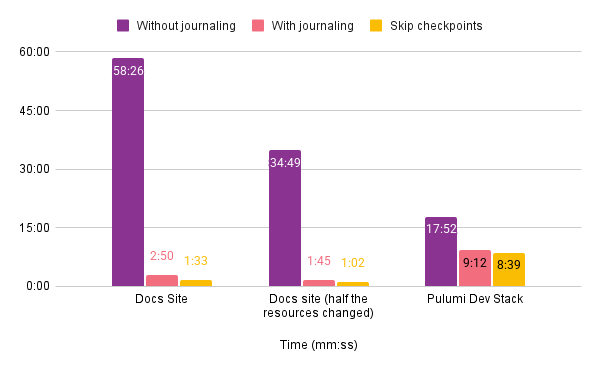
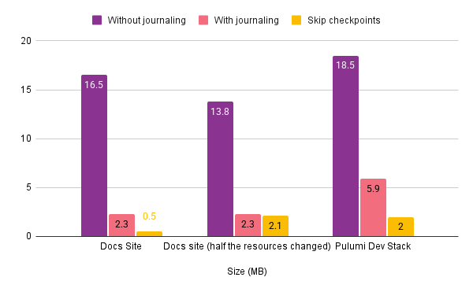

Today we're introducing an improvement that can speed up operations by up to 20x. At every operation, and at every step within an operation, `pulumi` saves a snapshot of your cloud infrastructure. This gives `pulumi` a current view of state even if something fails mid-operation, but it comes with a performance penalty for large stacks. Here's how we fixed it.

<!--more-->

## Benchmarks

Before getting into the more technical details, here are a number of benchmarks demonstrating what this new experience looks like. To run the benchmarks we picked a couple of Pulumi projects: one that can be set up massively parallel, which is the worst case scenario for the old snapshot system, and another that looks a little more like a real world example.  Note that we conducted all of these benchmarks in Europe, connecting to Pulumi Cloud, which runs in AWS's `us-west-2` region, so exact numbers may vary based on your location and internet connection. This should however give a good indication of the performance improvements.

We're benchmarking two somewhat large stacks, both of which are or were used at Pulumi. The first program sets up a website using AWS bucket objects. We're using the [aws-ts-static-website](https://github.com/pulumi/examples/tree/master/aws-ts-static-website) example here with a small subset of the fraction from our docs site. This means we're setting up more than 3000 bucket objects, with 3222 resources in total.

The benchmarks were measured using the `time` built-in command and using the best time in a best-of-three benchmark. The network traffic was measured using `tcpdump`, limiting the measured traffic to only the IP addresses for Pulumi Cloud. Finally, `tshark` was used to process the packet captures and count the bytes sent.

All the benchmarks are run with journaling off (the default experience) and with journaling on (the new experience). To begin with, let's look at the results when creating our stack from scratch:

|                    | Time   | Bytes sent |
|--------------------|--------|------------|
| Without journaling | 58m26s | 16.5MB     |
| With journaling    | 02m50s | 2.3MB      |

Now let's have a look at what this looks like if we only change half the resources, but the remaining ones remain unchanged:

|                    | Time   | Bytes sent |
|--------------------|--------|------------|
| Without journaling | 34m49s | 13.8MB     |
| With journaling    | 01m45s | 2.3MB      |

The second example is setting up an instance of the Pulumi app and API. Here we'll have an example that's a bit more dominated by the cost of setting up the actual infrastructure in the cloud, but we still have a very noticeable improvement in the time it takes to set up the stack.

|                    | Time   | Bytes sent |
|--------------------|--------|------------|
| Without journaling | 17m52s | 18.5MB     |
| With journaling    | 9m12s  | 5.9MB      |





{}
This feature is still behind a feature flag, but we are ready for testers. To get enrolled in the feature flag, please reach out to us, either on the [Community Slack](https://slack.pulumi.com/), or through our [Support channels](https://support.pulumi.com/hc/en-us). Once that's done, all you need to do is to set the `PULUMI_ENABLE_JOURNALING` environment variable to `true`, and your operations will start finishing faster.
{}

If you are interested in the more technical details read on!

## Introduction to snapshotting

`pulumi` keeps track of all resources in a stack in a snapshot. This snapshot is stored in the stack's configured backend, which is either the Pulumi Cloud or a DIY backend. Future operations on the stack then use this snapshot to figure out which resources need to be created, updated or deleted.

`pulumi` creates a new snapshot at the beginning and at the end of each resource operation to minimize the possibility of untracked changes even if a deployment is aborted unexpectedly (for example due to network issues, power outages, or bugs).

At the beginning of the operation, `pulumi` adds a new "pending operation" to the snapshot. Pending operations declare the intent to mutate a resource. If a pending operation is left in the snapshot (in other words the operation started, but `pulumi` couldn't record the end of it), the next operation will try to resolve this. If we have an ID for the resource already, for example on partial updates/deletes, `pulumi` will try to read the resource state from the cloud and resolve it internally. If there is no ID yet, `pulumi` will ask the user to check the actual state of the resource. Depending on the user's response, `pulumi` will either remove the operation from the snapshot or import the resource. This is because it is possible that the resource has been set up correctly or that the resource creation failed. If `pulumi` aborted midway through the operation, it's impossible to know which state the resource is in.

Once an operation finishes, the pending operation is removed and the resource's final state is recorded in the snapshot.

There's also some additional metadata that is stored in the snapshot that is only updated infrequently.

Here's how the [snapshot looks in code](https://github.com/pulumi/pulumi/blob/76588836f542c95e8f43ed785cc1828c40369ada/pkg/resource/deploy/snapshot.go#L34). This snapshot is serialized and sent to the backend. `Resources` holds the list of known resource states and is updated after each operation finishes, and `PendingOperations` is the list of pending operations described above.

```go
type Snapshot struct {
	Manifest          Manifest             // a deployment manifest of versions, checksums, and so on.
	SecretsManager    secrets.Manager      // the secrets manager to use when serializing this snapshot.
	Resources         []*resource.State    // all resources and their associated states.
	PendingOperations []resource.Operation // all currently pending resource operations.
	Metadata          SnapshotMetadata     // metadata associated with the snapshot.
}
```

Before we dive in deeper, we also need to understand a little bit about how the `pulumi` engine works internally. Whenever a `pulumi` operation is run (e.g. `pulumi up`, `pulumi destroy`, `pulumi refresh` etc.), the engine internally generates and executes a series of steps, to create, update, delete etc. resources. To maintain correct relationships between resources, the steps need to be executed in a partial order such that no step is executed until all of the steps it depends on have executed successfully. Steps may otherwise execute concurrently.

As each step is responsible for updating a single resource, we can generate a snapshot of the state before each step starts, and after it completes. Before each step starts, we create a pending operation, and add it to the `PendingOperations` list. After that step completes, we remove the pending operation from that list, and update the `Resources` list, either adding a resource, removing it, or updating it, depending on the kind of operation we just executed.

After this introduction, we can dive into what's slow, how we fixed it, and some benchmarks.

## Why is it slow?

To make sure the state is always as up-to-date as possible, even if there are any network hiccups/power outages etc., a step won't start until the snapshot that includes the pending operation is confirmed to be stored in the backend. Similarly an operation won't be considered finished until the snapshot with an updated resources list is confirmed to be stored in the backend.

To send the current state to the backend, we simply serialize it as a JSON file, and send it to the backend.  However, as mentioned above, steps can be executed in parallel. If we uploaded the snapshot at the beginning and end of every step with no serialization, there would be a risk that we overwrite a new snapshot with an older one, leading to incorrect data.

Our workaround for that is to serialize the snapshot uploads, uploading one snapshot at a time. This gives us the data integrity properties we want, however it can slow step execution down, especially on internet connections with lower bandwidth, and/or high latency.

This impacts performance especially for large stacks, as we upload the whole snapshot every time, which can take some time if the snapshot is getting big. For the Pulumi Cloud backend we improved on this a little [at the end of 2022](https://github.com/pulumi/pulumi/pull/10788). We implemented a diff based protocol, which is especially helpful for large snapshots, as we only need to send the diff between the old and the new snapshot, and Pulumi Cloud can then reconstruct the full snapshot based on that. This reduces the amount of data that needs to be transferred, thus improving performance.

However, the snapshotting is still a major bottleneck for large `pulumi` operations. Having to serially upload the snapshot twice for each step does still have a big impact on performance, especially if many resources are modified in parallel. Furthermore, the time spent performing textual diffs between snapshots scales in proportion to the size of the data being processed, which adds additional execution time to each operation.

## Fast, but lacking data integrity?

As long as `pulumi` can complete its operation, there's no need for the intermediate checkpoints. We could allow `pulumi` operations to skip uploading the intermittent checkpoints to the backend. This, of course, avoids the single serialization point we have sending the snapshots to the backend, and thus makes the operation much more performant.

However, it also has the serious disadvantage of compromising some of the data integrity guarantees `pulumi` gives you. If anything goes wrong during the update, `pulumi` has no notion of what happened until then, potentially leaving orphaned resources in the provider, or leaving resources in the state that no longer exist.

Neither of these solutions is very satisfying, as the tradeoff is either performance or data integrity. We would like to have our cake and eat it too, and that's exactly what we're doing with journaling.

## Enter journaling

To achieve this, we went back to the drawing board, and asked ourselves, "What would a solution look like that's both performant *and* preserves data integrity throughout the update?".

Making that happen is possible because of three facts:

- We always start with the same snapshot on the backend and the CLI.
- Every step the engine executes affects only one resource.
- We have a service that can reconstruct a snapshot from what is given to it.

(The third point here already hints at it, but this feature is only available and made possible by Pulumi Cloud, not on the DIY backend).

What if instead of sending the whole snapshot, or a diff of the snapshot, we could send the individual changes to the base snapshot to the service, which could then apply it, and reconstruct a full snapshot from it? This is exactly what we are doing here, in the form of what we call journal entries. Each journal entry has the following form:

```go
const (
	JournalEntryKindBegin            JournalEntryKind = 0
	JournalEntryKindSuccess          JournalEntryKind = 1
	JournalEntryKindFailure          JournalEntryKind = 2
	JournalEntryKindRefreshSuccess   JournalEntryKind = 3
	JournalEntryKindOutputs          JournalEntryKind = 4
	JournalEntryKindWrite            JournalEntryKind = 5
	JournalEntryKindSecretsManager   JournalEntryKind = 6
	JournalEntryKindRebuiltBaseState JournalEntryKind = 7
)

type JournalEntry struct {
	// Version of the journal entry format.
	Version int `json:"version"`
	// Kind of journal entry.
	Kind JournalEntryKind `json:"kind"`
	// Sequence ID of the operation.
	SequenceID int64 `json:"sequenceID"`
	// ID of the operation this journal entry is associated with.
	OperationID int64 `json:"operationID"`
	// ID for the delete Operation that this journal entry is associated with.
	RemoveOld *int64 `json:"removeOld"`
	// ID for the delete Operation that this journal entry is associated with.
	RemoveNew *int64 `json:"removeNew"`
	// PendingReplacementOld is the index of the resource that's to be marked as pending replacement
	PendingReplacementOld *int64 `json:"pendingReplacementOld,omitempty"`
	// PendingReplacementNew is the operation ID of the new resource to be marked as pending replacement
	PendingReplacementNew *int64 `json:"pendingReplacementNew,omitempty"`
	// DeleteOld is the index of the resource that's to be marked as deleted.
	DeleteOld *int64 `json:"deleteOld,omitempty"`
	// DeleteNew is the operation ID of the new resource to be marked as deleted.
	DeleteNew *int64 `json:"deleteNew,omitempty"`
	// The resource state associated with this journal entry.
	State *ResourceV3 `json:"state,omitempty"`
	// The operation associated with this journal entry, if any.
	Operation *OperationV2 `json:"operation,omitempty"`
	// If true, this journal entry is part of a refresh operation.
	RebuildDependencies bool `json:"isRefresh,omitempty"`
	// The secrets manager associated with this journal entry, if any.
	SecretsProvider *SecretsProvidersV1 `json:"secretsProvider,omitempty"`

	// NewSnapshot is the new snapshot that this journal entry is associated with.
	NewSnapshot *DeploymentV3 `json:"newSnapshot,omitempty"`
}
```

These journal entries encode all the information needed to reconstruct the snapshot from them. Each journal entry can be sent in parallel from the engine, and the snapshot will still be fully valid. All journal entries have a Sequence ID attached to them, and they need to be replayed in that order on the service side to make sure we get a valid snapshot. It is however okay to replay without journal entries that have not yet been received by the service, and whose sequence ID is thus missing. This is safe because the engine only sends entries in parallel for resources whose parents/dependencies have been fully created and confirmed by the service.

This way we make sure that the resources list is always in the correct partial order that is required by the engine to function correctly, and for the snapshot to be considered valid.

The algorithm looks as follows:

```
# Apply snapshot writes. This replaces the full snapshot we have on the service.
# We do this if default providers change, because we don't emit steps for that, as
# we do for the rest of the operations.
snapshot = find_write_journal_entry_or_use_base(base, journal)

# Track changes
deletes, snapshot_deletes, mark_deleted, mark_pending = set(), set(), set(), set()
operation_id_to_resource_index = {}

# Process journal entries.  This is the main algorithm, that adds new resources
# to the snapshot, removes existing ones, deals with refreshes, and operations
# that update outputs.
incomplete_ops = {}
has_refresh = false

index = 0
for entry in journal:
    match entry.type:
        case BEGIN:
            incomplete_ops[entry.op_id] = entry

        case SUCCESS:
            del incomplete_ops[entry.op_id]

            if entry.state and entry.op_id:
                resources.append(entry.state)
                operation_id_to_resource_index.add(entry.op_id, index)
                index++
            if entry.remove_old:
                snapshot_deletes.add(entry.remove_old)
            if entry.remove_new:
                deletes[remove_new] = true
            if entry.pending_replacement:
                mark_pending(entry.pending_replacement)
            if entry.delete:
                mark_deleted(entry.delete)
            has_refresh |= entry.is_refresh

        case REFRESH_SUCCESS:
            del incomplete_ops[entry.op_id]
            has_refresh = true
            if entry.remove_old:
                if entry.state:
                    snapshot_replacements[entry.remove_old] = entry.state
                else:
                    snapshot_deletes.add(entry.remove_old)
            if entry.remove_new:
                if entry.state:
                    deletes[entry.remove_new] = true
                else:
                    resources.replace(operation_id_to_resource_index(entry.remove_new), entry.state)
        case FAILURE:
            del incomplete_ops[entry.op_id]

        case OUTPUTS:
            if entry.state and entry.remove_old:
                snapshot_replacements[entry.remove_old] = entry.state
            if entry.state and entry.remove_new:
                resources.replace(operation_id_to_resource_index(entry.remove_new), entry.state)

deletes = deletes.map(|i| => operation_id_to_resource_index[i])

# Now that we have marked all the operations, and created a new list of resources, we can
# go through them, and merge the list of new resources and old resources from the snapshot
# that remain together.
for i, res in resources:
    if i in deletes:
        remove_from_resources(resources, i)

# Merge snapshot resources. These resources have not been touched by the update, and will
# thus be appended to the end of the resource list. We also need to mark existing resources as
# `Delete` and `PendingReplacement` here.
for i, res in enumerate(snapshot.resources):
    if i not in snapshot_deletes:
        if i in snapshot_replacements:
            resources.append(snapshot_replacements[i])
        else:
            if i in mark_deleted:
                res.delete = true
            if i in mark_pending:
                res.pending_replacement = true
            resources.append(res)

# Collect pending operations. These are stored separately from the resources list
# in the snapshot.
pending_ops = [op.operation for op in incomplete_ops.values() if op.operation]
pending_ops.extend([op for op in snapshot.pending_ops if op.type == CREATE])

# Rebuild dependencies if necessary. Refreshes can delete parents or dependencies
# of resources, without affecting the resource itself directly. We need to now remove
# these relationships to make sure the snapshot remains valid.
if has_refresh:
    rebuild_dependencies(resources)
```

The full documentation of the algorithm can be found in our [developer docs](https://pulumi-developer-docs.readthedocs.io/latest/docs/architecture/deployment-execution/state.html#snapshot-journaling).

### Rollout

`pulumi` state is a very central part of `pulumi`, so we wanted to be extra careful with the rollout to make sure we don't break anything. We did this in a few stages:

- We implemented the replay interface inside the `pulumi` CLI, and ran it in parallel with the current snapshotting implementation in our tests. The snapshots were then compared automatically, and tests made to fail when the result didn't match.
- Since tests can't cover all possible edge cases, the next step was to run the journaler in parallel with the current snapshotting implementation internally. This was still without sending the results to the service. However we would compare the snapshot, and send an error event to the service if the snapshot didn't match. In our data warehouse we could then inspect any mismatches, and fix them. Since this does involve the service in a minor way, we would only do this if the user is using the Cloud backend.
- Next up was adding a feature flag for the service, so journaling could be turned on selectively for some orgs. At the same time we implemented an opt-in environment variable in the CLI (`PULUMI_ENABLE_JOURNALING`), so the feature could be selectively turned on by users, if both the feature flag is enabled and the user sets the environment variable. This way we could slowly start enabling this in our repos, e.g. first in the integration tests for `pulumi/pulumi`, then in the tests for `pulumi/examples` and `pulumi/templates`, etc.
- Allow users to start opting in.  If you want to opt-in with your org, please reach out to us, either on the [Community Slack](https://slack.pulumi.com/), or through our [Support channels](https://support.pulumi.com/hc/en-us), and we'll opt your org into the feature flag. Then you can begin seeing the performance improvements by setting the `PULUMI_ENABLE_JOURNALING` env variable to true.

## What's next

After some time with more orgs opted in, we'll enable this feature for everyone using Pulumi Cloud, and by default in the `pulumi` CLI. This is currently planned for the end of January. We want to make the default experience of using `pulumi` as fast as possible.

While these performance improvements hopefully make your day to day use of `pulumi` quicker and more enjoyable, we're not quite done here. We're looking at some other performance improvements, that will hopefully speed up your workflows even more.
