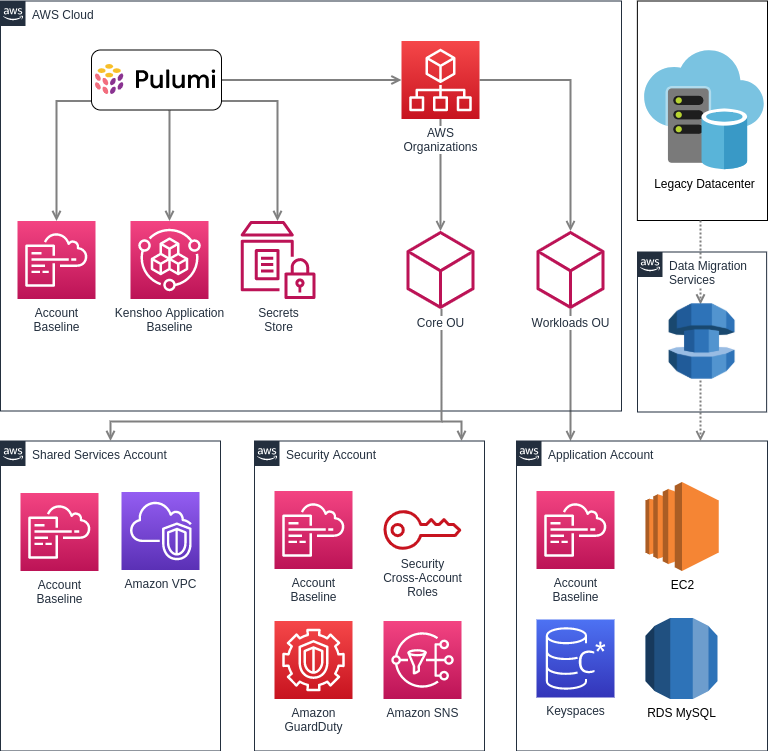

> Danny Zalkind is the DevOps group manager for Skai, an award-winning intelligent marketing platform. He brings his 15 years of exprience of managing tech teams to his current role where he's dedicated to allow Skai R&D to efficiently produce and serve software. You can find him on [Linkedin](https://www.linkedin.com/in/danny-zalkind-01602b56/).

Skai is an independent, global marketing platform for strategy, measurement, and best-of-breed activation across all of the world’s most influential digital channels. Skai’s solution provides data-driven insights and optimization technology to help companies make informed decisions and scale performance across critical publishers.

Skai possesses a highly technical engineering organization with over 350 software engineers, data experts, and DevOps engineers.

<!--more-->

## Why Skai is moving to AWS

The public cloud is not entirely new to us. Skai’s microservices have been running on AWS for a few years now. Our core monolith service is hosted in a data center running our private cloud infrastructure with its hundreds of Terabytes of data.

As our business grew, we noticed that our private cloud infrastructure could not keep pace with our business needs. Adding new capacity to our private cloud could take months of purchasing hardware, preparation, shipping, and deployment.

We decided to adopt infrastructure elastic enough to support the rate of innovation and growth that the business demanded.

We sought out the best infrastructure provider to shift as many services as possible to the cloud. AWS is a clear choice because of its unmatched managed services: RDS for our MySQL databases, Lambda functions for our scheduled processes and various automation tasks, DMS for data migration from the datacenter, Keyspaces for our Cassandra cluster, and EKS for our container workloads.



## How Pulumi helped with migration

Once the team selected a cloud platform, it was time to plan and execute the migration. Skai’s DevOps group was selected to lead the project.

### Why Pulumi

Skai’s private cloud infrastructure was provisioned and deployed using a combination of Puppet and Fabric. The code was long, full of customizations, not readable, and challenging to troubleshoot.

We were looking for a new solution that would:

- Support cloud-native and multi-cloud architectures
- Allow adding complex logic to the deployment process
- Support reusable code blocks for various use cases
- Allow each team to author different parts of the infrastructure
- Use a modern programming language
- And not create bottlenecks in the release process between the teams

We immediately fell in love with Pulumi, with its programmatic design, extensive modules, and extensibility via dynamic providers.

### Project and Stack design

When the Skai team decided to standardize on Pulumi, we designed our architecture to support our use case and development cycle.

We decided to create a project for each AWS organization OUs and a stack for each instance of our application service.


For example, a project would be “platform-production” and contain all stacks and resources of individual environments such as “app1234,” where the number is an environment identifier.

This provided the optimal mix of releasing new code versions per workload type and placing them in the development lifecycle while making granular configuration changes per each instance more manageable.

### Programming language

Pulumi supports several programming languages. For us, Python was an obvious choice due to its highly extensible nature, simplicity, and the team's considerable amount of prior experience with Python. Since most existing automations were written in Python, this made adopting Pulumi very easy for the team.

### Multi-team collaboration

Our organization is structured in multiple teams, with each team responsible for different areas of our infrastructure:

- The Core team in charge of shared infrastructure such as provisioning AWS accounts
- Multiple application teams are  responsible for provisioning specific applications, and
- An architect who leads designs, builds proof of concepts, and writes code.

It was essential to build our IaC projects with minimal coupling between the teams while keeping each team aligned with the same overarching project goals.

To enable this “loosely-coupled, tightly-aligned” approach, we created component classes for different infrastructure elements, which we later referenced in different places in our end-to-end code.

```python
import pulumi
from pulumi_aws import ec2
from pulumi_aws import ebs

class KSAppServer(pulumi.ComponentResource):

    def __init__(self,
                 name: str,
                 args: KSAppServerArgs,
                 opts: pulumi.ResourceOptions = None):
        super().__init__('kenshoo:KS:KSAppServer', name, None, opts)
        self.name = name
        self.app_instance = ec2.Instance("ks-aws-ue-" + args.ks_id + "-app",
                                         instance_type=args.instance_size,
                                         vpc_security_group_ids=args.security_groups_id,
                                         subnet_id=args.subnet,
                                         ami=args.ami,
                                         user_data=args.user_data_content,
                                         key_name=args.key_pair,
                                         tags={
                                             'Name': "ks-aws-ue-" + args.ks_id + "-app"
                                         },
                                         opts=pulumi.ResourceOptions(parent=self, delete_before_replace=True))
```

This practice enabled the application team to work on classes without being entirely dependent on the progress of the Core infrastructure team, which worked on classes of more low-level infrastructure such as VPCs and networking objects.

### What about those internal metadata systems?

One more challenge we faced is registering each new instance of our application with internal metadata and IT systems. In our data center setup, we relied on a set of Jenkins jobs, but now, we wanted to integrate these processes with our code and make sure that we always have a consistent state of registration. We decided to use Pulumi’s dynamic providers to achieve this:

```python
from requests import post, get

URL = 'https://krem.ourdomain.com/api/'

class KremMetadataRegistration:
    def create(self, ks_id):
        post(url=f'{URL}/onboarding/init_new_ks',
             params={'ks': f'ks{ks_id}'})

    def delete(self, ks_id):
        response_id = get(url=f'{URL}/config', params={'ks': ks_id}).json()[
            'id']
        if response_id:
            post(url=f'{URL}/onboarding/offboarding',
                 params={'id': response_id})
```

Next, we reference the dynamic provider in another class that we call from the end-to-end code of the whole provisioning flow.

```python
from pulumi.dynamic import *
from .metadata.krem_metadata_registration import KremMetadataRegistration

class RegistrationSchemaInputs(object):
    ks_id: Input[str]
    registered_service: Input[bool]

    def __init__(self, ks, registered_service):
        self.ks = ks
        self.ks_id = ks.lstrip('ks')
        self.registered_service = registered_service

class SchemaProvider(ResourceProvider):
    def __init__(self):
        self.metadatas = {
            'krem': KremMetadataRegistration()
        }
```

We can streamline the registration and deregistration processes for multiple systems as part of our provisioning lifecycle, creating a more streamlined flow with this approach.

## Summary

Moving a high-scale and mature application to the public cloud presented quite a few challenges. We have selected Pulumi as our IaC framework of choice due to its native programmatic nature, an endless number of modules, and the ability to customize the solution using our dynamic providers and custom logic.

This post gave you a glimpse into how we designed and implemented provisioning of our application on AWS. Join us at the second part of the blog that follows our journey of automating data migration.
