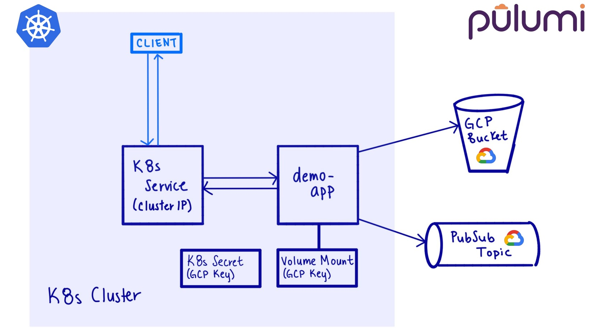
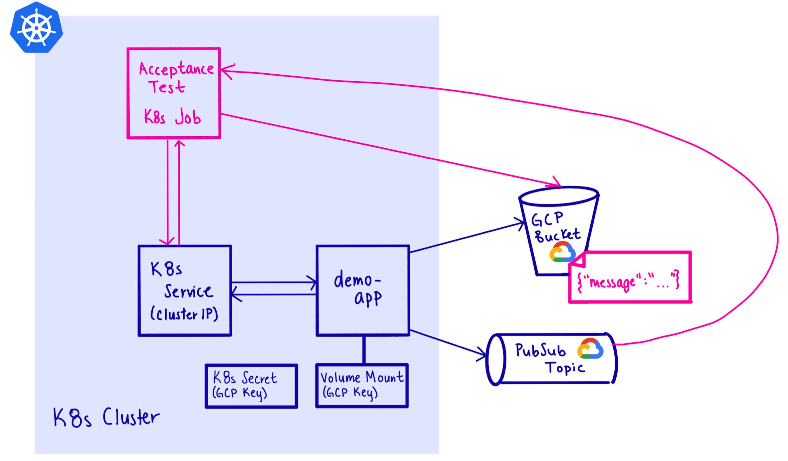
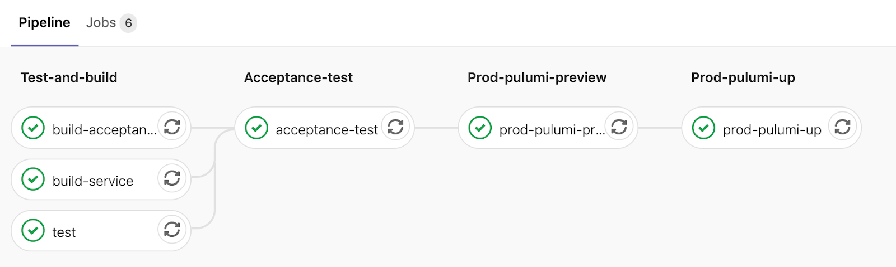

Last week, my colleague Sean and I had the opportunity to present "Are you about to break prod? Acceptance Testing with Ephemeral Environments" at KubeCon NA 2019. In this talk, we covered what is an ephemeral environment, what is required to create one, and then we walked the audience through a concrete example of how to create one. Given our limited time, we had to move quickly through a ton of information. Today, I will recap our presentation and add a few more details we weren't able to cover.

<!--more-->

As software engineers, our job is to deliver business value. To do this, we need to be delivering software both quickly and reliably.

The [DORA](https://cloud.google.com/devops/), DevOps Research and Assessment, organization puts out an annual report evaluating the effectiveness of IT organization’s development and deployment processes. Their annual report consistently shows that top performers are deploying more frequently and getting code into production quicker, yet have lower rates of failure and quicker recovery times. The [DORA report](https://cloud.google.com/devops/state-of-devops/) tell us that automated testing allows developers to confidently rely on their test suite for catching issues before they end up in production and confidentially know that a green test suite indicates the code is ready for deployment.

With this in mind, we will use Pulumi and GitLab to build a pipeline that validates both our application, infrastructure, and deployment process.

## Ephemeral Environments

What is an ephemeral environment? It is a short-lived environment that mimics our production environment. To maintain agility, we typically define the boundaries of this environment to only encompass the first-level dependencies of the particular microservice we are deploying. This means, we will not spin up every single microservice or piece of infrastructure thats running in production. Yet we may need to spin up some extra pieces infrastructure to be able to properly test our microservice. For example, we may need to create a subscription to pull from a PubSub topic your microservice writes to.

## Why this is important

Infrastructure is often a key part of our application's behavior. Our architecture and requirements are constantly evolving. How can we incorporate these into our testing suite to give us a high degree of confidence?

Ephemeral environments allow us to integrate our infrastructure and deployment process into our testing suite. They ensure our testing environment is always in-sync with production and therefore allows us to iterate quickly to meet new requirements.

Ephemeral environments also encourage us to lean on automated tests over manual tests. If we use ephemeral environments as a replacement for a testing environment, there is not enough time to go in and run a manual check. Shifting our mindsets to use automated tests can be challenging, yet its imperative that we do so. Automated tests guarantee our application behaves as expected today as well as months from now when we're out on vacation.

## Our Demo Application

To demonstrate the effectiveness of integrating acceptance testing with ephemeral environments into your deployment process, we created a simple demo application. The service is written in Go and accepts a message on the `/message` endpoint, then places it in a storage bucket and sends a notification about the new object on a PubSub topic. The code for this application lives in our [main.go](https://gitlab.com/rocore/demo-app/blob/master/main.go) file. While you can walk through this code yourself, the most important thing to call out is that our application is configurable. This means we take configuration in at the very beginning of our main function and shut down the application if the values are not present.

```go
func main() {
    ...
	// Get configuration from environment variables. These are
	// required configuration values, so we will use an helper
	// function get the values and exit if the value is not set.
	project := getConfigurationValue("PROJECT")
	topicName := getConfigurationValue("TOPIC")
	bucketName := getConfigurationValue("BUCKET")
    ...
}

func getConfigurationValue(envVar string) string {
	value := os.Getenv(envVar)
	if value == "" {
		log.Fatalf("%s not set", envVar)
	}
	log.Printf("%s: %s", envVar, value)
	return value
}
```

### Infrastructure

There a many pieces of infrastructure we will need to spin up and we will use Pulumi to easily wire it all together. Our architecture will look this this:



You can check out the Pulumi code that we use to reproducibly create both our ephemeral environments as well as production in the [infrastructure/index.ts](https://gitlab.com/rocore/demo-app/blob/master/infrastructure/index.ts) file. The neat thing about using Pulumi to spin up both our GCP and Kubernetes resources is that we can create the GCP resources we need and then directly reference them in our Kubernetes deployment. This ensures we're always configuring our application with the correct GCP resources for that environment.

For example, in our Kubernetes deployment we set the environment variables by using the topic and bucket variables created just above.

```typescript
// Create a K8s Deployment for our application.
const appLabels = { appClass: name };
const deployment = new k8s.apps.v1.Deployment(name, {
    metadata: { labels: appLabels },
    spec: {
        selector: { matchLabels: appLabels },
        template: {
            metadata: { labels: appLabels },
            spec: {
                containers: [{
                    ...
                    env: [
                        { name: "TOPIC", value: topic.name }, // referencing topic just created
                        { name: "BUCKET", value: bucket.name }, // referencing bucket just created
                        { name: "PROJECT", value: project },
                        {
                            name: "GOOGLE_APPLICATION_CREDENTIALS",
                            value: "/var/secrets/google/key.json"
                        },
                    ],
                    ...
                }]
            }
        }
    },
});
```

### Acceptance Tests

Our acceptance tests are what validate that our service when stood up function as expected. They are run against an ephemeral environment. The test live in the `acceptance/acceptance_test.go` [file](https://gitlab.com/rocore/demo-app/blob/master/acceptance/acceptance_test.go). You'll notice we're once again using that helper function `getConfigurationValue`. Our acceptance test must also be configured to ensure they're validating against the correct resources for that particular ephemeral environment.

Since our service is only accessible from within the Kubernetes cluster, we will use a Kubernetes Job to run our acceptance tests. This is a good technique to use when your CI is running externally, such as from GitLab, and you do not want to publicly expose your service. Our ephemeral environment plus acceptance test look like this:



We spin up our Kubernetes Job and additional resources by using an if statement at the bottom of our `infrastructure/index.ts` file. The conditional depends on the environment's name as follows:

```typescript
// If it's a test environment, set up acceptance tests.
let job: k8s.batch.v1.Job | undefined;
if (ENV.startsWith("test")) {
    job = acceptance.setupAcceptanceTests({
        ...
    });
}

// Export the acceptance job name, so we can get the logs from our
// acceptance tests.
export const acceptanceJobName = job ? job.metadata.name : "unapplicable";
```

That covers all the major aspects of our application and infrastructure, and if you'd like to view the code in detail it is all available for reference in our `demo-app` [GitLab repository](https://gitlab.com/rocore/demo-app).

## Our Pipeline

When developing a new service, it’s important that we establish a solid deployment strategy upfront. We want to make sure we're building in quality from day one. As we develop the service, we can add acceptance tests for each and every feature we add while the context and requirements are still fresh in our minds. This ensures we have thorough coverage of our app's functionality.

We used GitLab to set up our pipeline. We chose GitLab because its extremely easy to set up and allows us to run our pipeline on our Docker image of choice. We use a [base-image](https://gitlab.com/rocore/global-infra/blob/master/base-image/Dockerfile) that has all our dependencies installed and then reference that Docker image and tag in our `demo-app` pipeline. This allows us to bundle and version the dependencies for building our application and infrastructure.



1. **Test and Build** - This runs our unit tests and builds both our application and acceptance test images. The application image is an immutable image that is used for both running our acceptance tests and deploying to production.
1. **Acceptance Test** - This is what spins up our ephemeral environments and runs our acceptance tests. This acts a quality gate catching issues prior to production.

    Our ephemeral environment and Kubernetes job are all spun up in the `script`.

    ```bash
    ...
    $ pulumi stack init rocore/$ENV-app
    Logging in using access token from PULUMI_ACCESS_TOKEN
    Created stack 'rocore/test-96425413-app'
    $ pulumi config set DOCKER_TAG $DOCKER_TAG
    $ pulumi config set ENV $ENV
    $ pulumi config set gcp:project rocore-k8s
    $ pulumi config set gcp:zone us-west1-a
    $ pulumi up --skip-preview
    Updating (rocore/test-96425413-app):
    ...
    Resources:
        + 16 created

    Duration: 4m10s

    Permalink: https://app.pulumi.com/rocore/demo-app/test-96425413-app/updates/1
    ```

    The after script destroys our stack as well as prints the logs of both our Kubernetes Job and Deployment, which are helpful for debugging if our tests were to fail.

    ```bash
    ...
    $ pulumi stack select rocore/$ENV-app
    $ kubectl logs -n rocore --selector=appClass=$ENV-demo-app-acc-test --tail=200
    === RUN   TestSimpleHappyPath
    === RUN   TestSimpleHappyPath/message_is_sent_to_PubSub_topic
    === RUN   TestSimpleHappyPath/message_is_stored_in_bucket
    --- PASS: TestSimpleHappyPath (3.89s)
        acceptance_test.go:45: CONFIGURATION: {project:rocore-k8s serviceName:test-96425413-demo-app-t1st88qm   bucketName:test-96425413-demo-app-08f572c subscriptionName:test-96425413-demo-app-acc-test-9c0deed}
        --- PASS: TestSimpleHappyPath/message_is_sent_to_PubSub_topic (2.21s)
        --- PASS: TestSimpleHappyPath/message_is_stored_in_bucket (0.17s)
            acceptance_test.go:152: Stored message: map[message:Ruby is awesome!!!]
    === RUN   TestSimpleSadPath
    === RUN   TestSimpleSadPath/posting_a_incorrectly_formatted_message_returns_400
    --- PASS: TestSimpleSadPath (0.00s)
        --- PASS: TestSimpleSadPath/posting_a_incorrectly_formatted_message_returns_400 (0.00s)
    PASS
    ok  	gitlab.com/rocore/demo-app	4.174s
    $ kubectl logs -n rocore --selector=appClass=$ENV-demo-app --tail=200
    2019/11/16 21:55:22 PROJECT: rocore-k8s
    2019/11/16 21:55:22 TOPIC: test-96425413-demo-app-4f3f3c0
    2019/11/16 21:55:22 BUCKET: test-96425413-demo-app-08f572c
    2019/11/16 21:55:22 starting server
    2019/11/16 21:59:03 writing to bucket
    2019/11/16 21:59:03 writing to PubSub
    $ pulumi destroy --skip-preview -s rocore/$ENV-app
    Destroying (rocore/test-96425413-app):
    ...
    Resources:
        - 16 deleted

    Duration: 24s

    Permalink: https://app.pulumi.com/rocore/demo-app/test-96425413-app/updates/2
    ...
    ```

1. **Prod Pulumi Preview** - This is what preview changes to our production infrastructure. Some teams may choose to start with this stage as manual gate and then switch to an automatic stage once they've built up confidence.

    We can incorporate this into our Merge Request review process, allowing us to validate our infrastructure changes are as we expect. Here we can see only our Kubernetes Deployment is getting updated meaning only our application was changed. 

    ```bash
    $ pulumi stack select rocore/demo-app/prod
    Logging in using access token from PULUMI_ACCESS_TOKEN
    $ pulumi config set DOCKER_TAG $DOCKER_TAG
    $ pulumi preview
    Previewing update (rocore/prod):

        pulumi:pulumi:Stack demo-app-prod running
        pulumi:pulumi:Stack demo-app-prod running read pulumi:pulumi:StackReference rocore/global-infra/global-infra
        pulumi:pulumi:Stack demo-app-prod running read pulumi:pulumi:StackReference rocore/global-infra/global-infra
        pulumi:providers:kubernetes prod-demo-app  
        gcp:storage:Bucket prod-demo-app  
        gcp:pubsub:Topic prod-demo-app  
        gcp:serviceAccount:Key prod-demo-app  
        kubernetes:core:Service prod-demo-app  
        gcp:pubsub:TopicIAMMember prod-demo-app  
        kubernetes:core:Secret prod-demo-app  
        gcp:storage:BucketIAMMember prod-demo-app  
     ~  kubernetes:apps:Deployment prod-demo-app update [diff: ~spec]
        pulumi:pulumi:Stack demo-app-prod  
 
    Outputs:
    ...

    Resources:
        ~ 1 to update
        9 unchanged

    Permalink: https://app.pulumi.com/...
    ```

1. **Prod Pulumi Up** - This is what is actually performing our production deployment and only gets run on master.

For more details on how to set this up, you can view the GitLab configuration for setting up this pipeline in our [.gitlab-ci.yml](https://gitlab.com/rocore/demo-app/blob/master/.gitlab-ci.yml) file.

## Creating Ephemeral Environments

While we walked through a lot of code today, the diff between what we would need to run our application in production and the extra code that we need for our ephemeral environment is quite minimal. The following is what enables us to create ephemeral environments:

1. **Infrastructure as Code** - This allowed us to create a consistently reproducible environment. Using an IaC tool means we can use the same code to define our infrastructure in both our ephemeral environment and production, giving us a high degree of confidence that production is accurately being mimicked.

1. **Unique name for our ephemeral environment** -  We used GitLab's pipeline ID and set our environment name to be `test-$CI_PIPELINE_ID`. Having a unique name for our ephemeral environment, allows us to run multiple tests (and therefore multiple pipelines) at once.

1. **Configurable infrastructure** - We prepended our environment name to all the resources we create. This allowed us to easily distinguish our test resources and make sure resources don't conflict if we're running multiple tests at once. This also means if something goes wrong and we have lingering resources, we can use regex and a cron job to clean up these extra resources.

1. **Configurable application & tests** - We made both our application and tests configurable ensuring they are always using the correct resources for their environment. This allows us to deploy the exact same immutable image of our application to run our acceptance tests against as we deploy to production.

1. **Conditionally provision test infrastructure**- There some extra pieces of infrastructure needed to acceptance test our application. We needed to be able to conditionally provision these extra pieces as well as our test itself during an acceptance test.

1. **Clean up resources** - We needed to be able to cleanly tear down all the resources we created for our ephemeral environment. We used the `pulumi destroy` command to do this.

1. **Tradeoffs** - There are some resources that take longer to spin up than others. For example, a brand new Kubernetes cluster takes considerably longer to spin up than a new PubSub topic. You will need to balance the speed of your tests with how closely the environment mimics production. We chose to place these longer lived resources in a separate [GitLab repository](https://gitlab.com/rocore/global-infra) called `global-infra`.

    We reference these longer lived pieces of infrastructure in our `demo-app` by using a [stack reference](https://www.pulumi.com/docs/intro/concepts/organizing-stacks-projects/#inter-stack-dependencies).

    ```typescript
    const globalStackRef = new pulumi.StackReference("rocore/global-infra/global-infra");
    ```

## Recap

To maintain agility, we need a process that thorough tests our application and gives us the confidence to move quickly. Using ephemeral environments to run our acceptance tests allows us to test our application, infrastructure and deployment process all at once.

Pulumi and GitLab are both open source and you can get started today for free! Some resources to get you going:

* [Pulumi Get Started](https://www.pulumi.com/docs/get-started/)
* [GitLab Get Started](https://about.gitlab.com/get-started/)

Lastly, if you're interested in watching Sean and my KubeCon presentation here is the recording:


