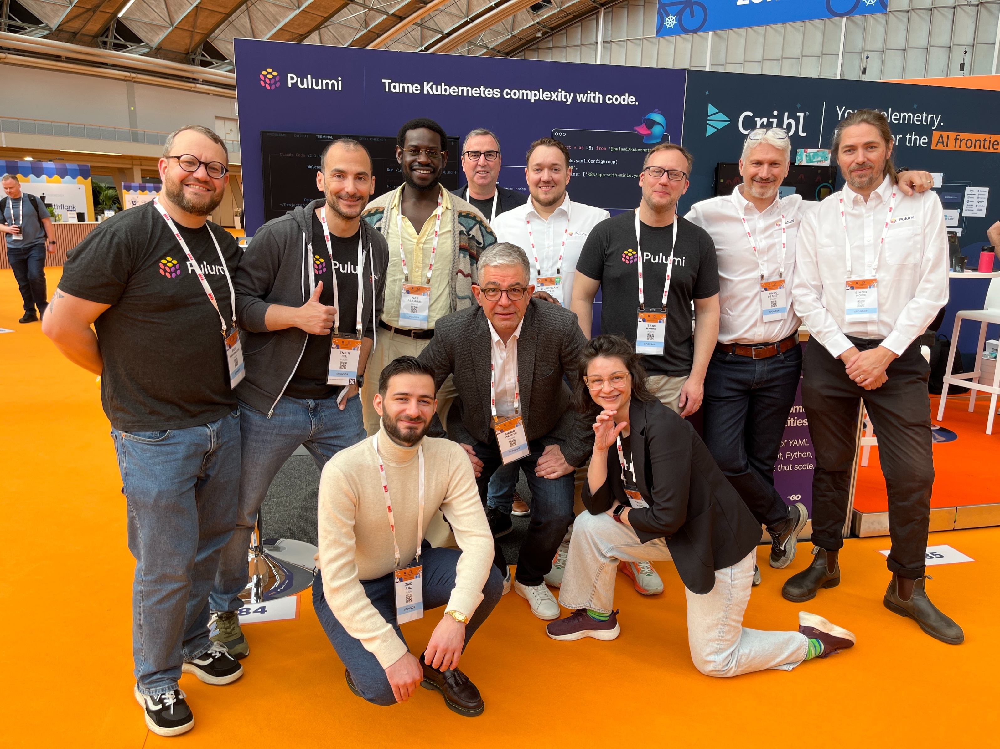
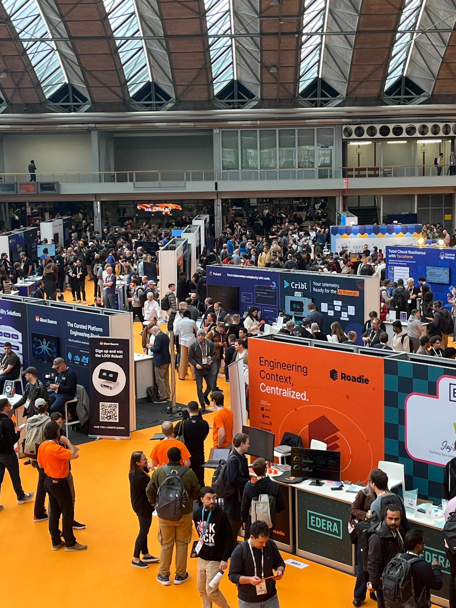

Amsterdam in late March still has that sharp North Sea wind, but inside the RAI Convention Centre, 13,350 people generated enough energy to heat the building twice over. [KubeCon + CloudNativeCon EU 2026](https://events.linuxfoundation.org/kubecon-cloudnativecon-europe-2026/) was the biggest European edition yet, and the shift from previous years was impossible to miss. AI dominated the conference.

<!--more-->

I spent most of the conference at the Pulumi booth, and that turned out to be the best vantage point. Hundreds of visitors stopped by over four days, and I kept asking the same question: what are you actually running in production with AI on Kubernetes? The answers shaped this post more than any keynote did. Almost everyone had a proof of concept. Almost nobody had a production story they were happy with.

Here is the stat that framed the entire conference for me: [66% of organizations use Kubernetes to host generative AI workloads, but only 7% deploy to production daily](https://www.cncf.io/reports/the-cncf-annual-cloud-native-survey/). That gap between experimentation and actual production use matched what I was hearing at the booth. The CNCF's own survey now counts [19.9 million cloud native developers worldwide, 7.3 million of them building AI workloads](https://www.cncf.io/reports/state-of-cloud-native-development-q1-2026/). The tooling and the infrastructure need to catch up.

My takeaway after four days on the ground: lots of working demos, very few production setups people trust. Teams are trying to scale inference, put guardrails around agents, and make GPU infrastructure behave like anything else they run.

Here is what I saw.

## From training to inference: the big pivot

About [67% of AI compute now goes to inference](https://www.deloitte.com/us/en/insights/industry/technology/technology-media-and-telecom-predictions/2026/compute-power-ai.html), not training. The inference market is projected to hit [$255 billion by 2030](https://www.marketsandmarkets.com/Market-Reports/ai-inference-market-189921964.html). It's also where most of the operational complexity lives.

NVIDIA leaned into this hard. Their open-source stack around [NeMo](https://github.com/NVIDIA-NeMo/NeMo) and [Dynamo](https://github.com/ai-dynamo/dynamo) got significant stage time, but the bigger move was donating three projects to the CNCF: the [DRA driver](https://github.com/NVIDIA/k8s-dra-driver-gpu) for fractional GPU allocation, the [KAI Scheduler](https://github.com/kai-scheduler/KAI-Scheduler) for GPU-aware scheduling, and [Grove](https://github.com/ai-dynamo/grove). Moving these to community governance signals that GPU infra is becoming part of the standard Kubernetes toolkit.

## The CNCF donations that will reshape AI on Kubernetes

Every KubeCon has its crop of new CNCF projects, but this year's batch felt different. We are starting to see the building blocks of an AI runtime for Kubernetes.

[**llm-d**](https://github.com/llm-d/llm-d) was the headline donation. Created by IBM Research, Red Hat, and Google Cloud, it splits inference workloads by separating prefill and decode phases across different pods. The collaborator list reads like an industry consortium: NVIDIA, CoreWeave, AMD, Cisco, Hugging Face, Intel, Lambda, Mistral AI, UC Berkeley, and UChicago. When that many organizations agree on a single approach to distributed inference, pay attention.

NVIDIA's [**DRA driver**](https://github.com/NVIDIA/k8s-dra-driver-gpu) enables fractional GPU allocation and multi-node NVLink support. GPU multi-tenancy is one of the hardest unsolved problems in Kubernetes right now. Scheduling, isolation, cost attribution — all of it breaks down when multiple workloads share a GPU. The DRA driver does not solve everything, but it gives the community a real starting point.

[**KAI Scheduler**](https://github.com/kai-scheduler/KAI-Scheduler) entered the CNCF Sandbox for GPU-aware scheduling. If llm-d handles the inference runtime and the DRA driver handles allocation, KAI Scheduler handles placement. Together, these three projects form the skeleton of a GPU-native Kubernetes stack.

[**Velero**](https://github.com/vmware-tanzu/velero), donated by Broadcom, moved into CNCF Sandbox for backup and restore. AI workloads are stateful now (model weights, checkpoints, fine-tuning data), and backup is no longer optional. Good timing.

[**Microsoft AI Runway**](https://github.com/kaito-project/airunway) is an open-source Kubernetes API for inference that plugs in Hugging Face model discovery, GPU memory fit calculations, and cost estimates. Think of it as a model-aware control plane. [**HolmesGPT**](https://github.com/HolmesGPT/holmesgpt) and [**Dalec**](https://github.com/project-dalec/dalec), also from Microsoft, entered CNCF Sandbox for AI-powered troubleshooting and dependency analysis.

The **Kubernetes AI Conformance Program** is growing fast, with certifications nearly doubled and three new requirements proposed for Kubernetes 1.36. Conformance programs are boring until they are not. This one will determine which distributions can credibly claim AI readiness.

## Agentic AI gets an identity layer

If inference was this year's production story, agentic AI was the architecture story. Agents are proliferating, and nobody has quite figured out how to manage and secure them inside Kubernetes yet.

[**kagent**](https://github.com/kagent-dev/kagent), donated to CNCF Sandbox by Solo.io, defines agents as Kubernetes CRDs. It ships with pre-built [MCP](https://github.com/modelcontextprotocol/modelcontextprotocol) (Model Context Protocol) servers for Kubernetes, Istio, Helm, Argo, Prometheus, Grafana, and Cilium. An agent becomes a first-class Kubernetes resource, schedulable and observable and subject to RBAC, instead of a rogue process running in someone's notebook.

[**kagenti**](https://github.com/kagenti/kagenti) from IBM goes after the identity problem directly. Using [SPIFFE/SPIRE](https://github.com/spiffe/spire), it gives agents cryptographic identities. When an agent calls an API, you can verify exactly which agent made the call, what trust domain it belongs to, and whether it is authorized. This kind of security work needs to happen before agents proliferate across production clusters. Retrofitting identity later is ugly.

[**Dapr Agents**](https://github.com/dapr/dapr-agents) took a different angle with the actor model and durable execution. Each agent gets reliable state management and exactly-once messaging semantics. If your workflows cannot tolerate lost messages or duplicate actions, this matters.

[**agentregistry**](https://github.com/agentregistry-dev/agentregistry) showed up as a centralized discovery service for MCP servers and agents. As agents and tool servers multiply, you need a registry to find and manage them, the same way container registries became necessary for images.

David Soria Parra from Anthropic gave a talk on [MCP evolving beyond simple tool-calling](https://blog.modelcontextprotocol.io/posts/2026-mcp-roadmap/) into richer interaction patterns ([sched](https://colocatedeventseu2026.sched.com/event/2E7Db/agentics-day-mcp-+-agents-mcp-in-2026-context-is-all-you-need-david-soria-parra-anthropic)). Google announced the [**Kubernetes Agent Sandbox**](https://github.com/kubernetes-sigs/agent-sandbox) for running agentic AI workloads in secure, isolated environments.

## AI gateways and inference routing

Gateway infrastructure had its own mini-conference within KubeCon. The [Gateway API Inference Extension](https://github.com/kubernetes-sigs/gateway-api-inference-extension) from the Kubernetes SIG introduces model-aware routing and load balancing at the gateway level. Instead of routing by URL path, your gateway routes by model name, version, and capacity. That changes how inference traffic flows through a cluster in a fundamental way.

[**Envoy AI Gateway**](https://github.com/envoyproxy/ai-gateway) builds on [Envoy](https://github.com/envoyproxy/envoy)'s existing proxy capabilities with token-aware rate limiting and provider failover. If your primary inference provider is saturated, traffic shifts to a secondary automatically. Rate limiting by token count rather than request count makes much more sense for LLM workloads, where a single request can consume vastly different amounts of compute.

I want to call out [**Agentgateway**](https://github.com/agentgateway/agentgateway) specifically. Written in Rust, it proxies LLM traffic, MCP connections, and agent-to-agent communication, with [Cedar](https://github.com/cedar-policy/cedar) and [CEL](https://github.com/google/cel-spec) policy engines for fine-grained access control. Rust's performance characteristics matter here because inference gateway latency adds directly to user-perceived response time.

[**Kuadrant**](https://github.com/Kuadrant/kuadrant-operator), now in CNCF Sandbox, layers policy on top of gateway infrastructure and includes MCP server aggregation. Gateways are evolving from dumb traffic proxies into intelligent control planes for AI workloads, and these four projects are driving that shift.

## Platform engineering absorbs LLMOps

The observability and platform engineering vendors showed up in force. The message was consistent: LLMOps is just platform engineering with new requirements.

**Chronosphere** demonstrated parallel AI investigation, with multiple agents analyzing different aspects of an incident simultaneously and combining their findings. **SUSE Liz** takes a domain-specialized approach, deploying different AI agents for different operational domains rather than one general-purpose assistant. **groundcover** combines eBPF with [OpenTelemetry](https://opentelemetry.io/) to give coding agents rich runtime context about the systems they are modifying. That last one is subtle but important: if an AI agent is writing code that touches a service, it should understand that service's actual runtime behavior, not just its source code.

**Dynatrace** and **DevCycle** partnered to make feature flags observable primitives via [OpenFeature](https://github.com/open-feature/spec). Rolling out AI features behind feature flags is table stakes, but having those flags show up in your observability pipeline as first-class signals closes a real gap.

Shadow AI governance emerged as its own theme. **CAST AI's Kimchi** can route requests across 50+ models while providing centralized visibility into what models are being used, by whom, and at what cost. Every large organization I talked to had some version of the same problem: teams spinning up model endpoints without central oversight, burning through GPU budgets, creating compliance blind spots they did not even know about.

GPU multi-tenancy remains genuinely unsolved. Scheduling, workload isolation, cost attribution across shared GPUs — all of it breaks down at scale. Multiple talks addressed pieces of this, but nobody had a complete answer.

## Sovereignty shapes infrastructure architecture

Regulation came up in almost every conversation. The EU Cyber Resilience Act is driving compliance requirements deep into software supply chains, and every European organization I spoke with is feeling the pressure. Teams are already changing how they build and deploy software.

Sovereign Kubernetes is a platform architecture requirement now, not something you can defer to next quarter. Organizations need Kubernetes distributions and cloud regions that guarantee data residency, and they need the tooling to enforce those guarantees programmatically. Self-hosted models are proliferating partly because of capability and cost, but data sovereignty is the accelerant. If your data cannot leave a jurisdiction, neither can your model.

Runtime isolation is expanding beyond containers. Several talks covered KVM-based isolation for AI workloads, which is heavier than containers but necessary when the threat model includes side-channel attacks on shared GPU memory. The sandboxing conversation has gotten more sophisticated since last year.

These constraints are not uniquely European. Any organization operating across jurisdictions faces similar pressures, and the regulatory direction globally is toward more data sovereignty requirements, not fewer.

## What this means for your team

Four days in Amsterdam distilled into five things I would act on now:

1. **Treat inference workloads like production services.** If you are still deploying models with scripts and hope, stop. Inference infrastructure needs the same IaC discipline as any other production system: version-controlled, tested, policy-enforced.

1. **Evaluate the [Gateway API Inference Extension](https://github.com/kubernetes-sigs/gateway-api-inference-extension) and [llm-d](https://github.com/llm-d/llm-d).** These are not speculative projects. They have broad industry backing and solve real problems around inference routing and distributed serving. Get them into your test environments.

1. **Plan agent identity before agents proliferate.** [SPIFFE/SPIRE](https://github.com/spiffe/spire) for agent identity is not optional if you are running agents in production. Retrofitting identity onto an existing agent fleet is painful. Start with [kagenti](https://github.com/kagenti/kagenti) now.

1. **Platform teams should own AI infrastructure.** Shadow AI is already happening in your organization. The platform engineering team needs to provide self-service AI infrastructure with guardrails before ungoverned model endpoints become a security and cost problem.

1. **Sovereignty and GPU multi-tenancy are universal.** Even if you are not subject to the EU Cyber Resilience Act today, data residency requirements are spreading globally. GPU multi-tenancy will affect every organization running inference at scale.

Kubernetes spent the past decade proving it could orchestrate containers. The next decade will test whether it can orchestrate intelligence. Based on what I saw in Amsterdam, the community is building the right pieces, but the gap between what exists and what production demands is still wide. That gap is where the interesting work happens.
