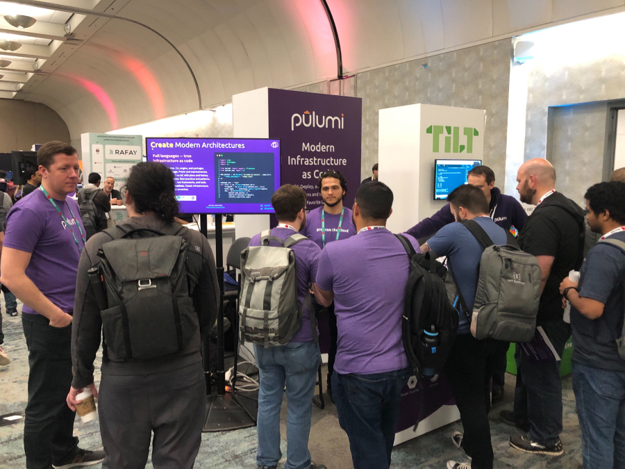

We had a fantastic time at KubeCon in San Diego. At the event, the Pulumi team released two technology previews: [Pulumi Crosswalk for Kubernetes]() and [Pulumi Query for Kubernetes](https://github.com/pulumi/pulumi-query-kubernetes).

Crosswalk for Kubernetes is a set of common patterns compiled in playbooks. These patterns reduce the complex Kubernetes API syntax by providing trusted defaults with idiomatic Kubernetes. Checkout a quick introduction to Crosswalk for Kubernetes in this [blog post]().

[Sara Novotny](https://twitter.com/sarahnovotny) defined observability as *“the ability to ask of your system and learn from it”* during her [keynote](https://www.youtube.com/watch?v=W_8MHdtrgZE) with [Liz Fong-Jones](https://twitter.com/lizthegrey). Query for Kubernetes enables observability programmatically by exposing resource processes through either batch or streaming queries. Learn more about Query for Kubernetes in our [blog post]().

To see both Crosswalk and Query for Kubernetes in action, watch the demo video!



Pulumi engineers, [Erin Krengel](https://twitter.com/eckrengel) and Sean Holung, presented `Are You About to Break Prod? Acceptance Testing with Ephemeral Environments`.

Addressing a packed room, they showed how to use ephemeral environments (short lived environments that mimic production) to automate testing. Kudos to the [CNCF](https://twitter.com/CloudNativeFdn) for making the presentation videos available quickly, you can watch Erin and Sean's presentation on YouTube.



[Joe Duffy](https://twitter.com/funcofjoe) sums up our experience below. We hope to see you next year at KubeCon 2020!


