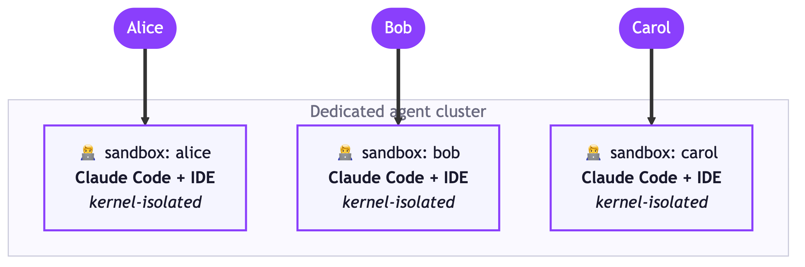
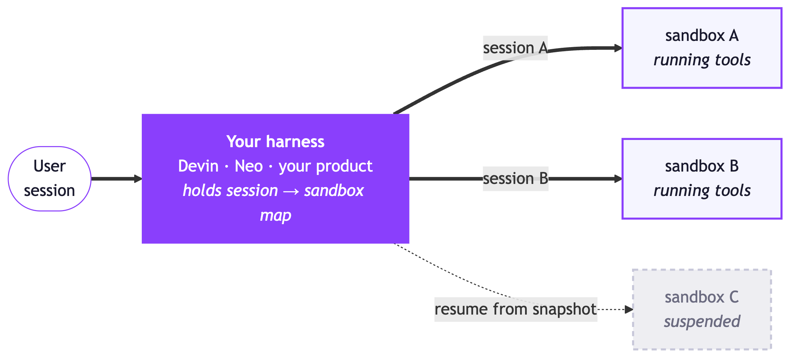

When you use a coding agent, it can seem like there's a trade-off between autonomy and permissions. If you approve every command, it's safe but slow. Let it do whatever it likes and it works more autonomously, but as the [nx supply-chain attack](https://www.stepsecurity.io/blog/supply-chain-security-alert-popular-nx-build-system-package-compromised-with-data-stealing-malware) showed, that can go badly.

The fix is to give the agent a sandbox: a box it's _allowed_ to wreck, with limited permissions and scoped network access. The only files are the checkout you handed it, the only credentials are the task's own, and trashing the machine just means a disposable pod gets garbage-collected early. [Pulumi Neo](/product/neo/) works this way, and if you want to scale that pattern up inside your own organization, the Kubernetes project [Agent Sandbox](https://agent-sandbox.sigs.k8s.io/) is a great path to building your own. This post is what it is and how to deploy it on GKE with Pulumi.

<!--more-->

## What is Agent Sandbox?


**[Agent Sandbox](https://github.com/kubernetes-sigs/agent-sandbox)** is a Kubernetes SIGs project that gives AI agents isolated, disposable environments as Kubernetes resources: a `Sandbox` custom resource, backed by gVisor or Kata Containers for kernel-level isolation.


You could build Agent Sandbox yourself. You'd need gVisor support, a userspace kernel that sits between the agent's code and your host. With that in place, you could approximate a sandbox for every agent by stringing together a StatefulSet of size one, a headless Service, and a PersistentVolumeClaim, plus some lifecycle machinery to keep warm pools of nodes around. Agent Sandbox wraps all of that up as a CRD, so you can run a Kubernetes cluster where each sandbox is a disposable, kernel-isolated environment a coding agent runs in.

```yaml
apiVersion: agents.x-k8s.io/v1beta1
kind: Sandbox
metadata:
  name: demo-sandbox
spec:
  podTemplate:
    spec:
      runtimeClassName: gvisor
      containers:
        - name: agent
          image: ubuntu:24.04   # swap in your coding-agent image
          command: ["sleep", "infinity"]
```

The <code>Sandbox</code> CRD, the whole idea in one manifest.

There are two common patterns for using it. In the first, every coding agent session in the organization maps to its own pod with a persistent volume, basically Claude Code running across a whole fleet of pods, each one an individual user's session.



In the second, you're building your own Neo or Devin: a productized agent harness that needs to spin up execution environments. The harness lives outside the sandboxes and hands each task a disposable box, and Agent Sandbox is what spins those boxes up and down, suspending and resuming them.

## Why not just run agents in Docker?

So why do we need gVisor or Kata Containers at all? The agent already runs inside a container. Isn't that the box?

Not really. A container isn't much of a security barrier. Every container on a host shares one kernel, and the Linux kernel exposes a huge surface area, 450+ syscalls, to every one of them. [CVE-2019-5736](https://unit42.paloaltonetworks.com/breaking-docker-via-runc-explaining-cve-2019-5736/) is the canonical example: a malicious container tricks runc into overwriting the _host's own runc binary_, and after that every `docker run` on the host runs attacker code as root. Put a prompt-injectable AI agent in that container, and the risk is obvious.

gVisor, the runtime underneath Agent Sandbox's default path, puts a userspace kernel written in Go between your agent and the host, which limits the possible security surface area. A kernel bug the agent can reach becomes, mostly, a crash in a userspace process rather than a root shell on your node. That is what makes an Agent Sandbox secure.


**What is GKE Sandbox?**

**GKE Sandbox** is GKE's gVisor feature: a `RuntimeClass` named `gvisor` that runs a pod under the userspace kernel described above. It predates Agent Sandbox by years and is a per-pod isolation primitive, not an agent tool. **Agent Sandbox** is the lifecycle layer that sits on top of it: the CRD's runtime selection points down at gVisor (or Kata) for the actual kernel isolation. They compose. On GKE, Agent Sandbox with `runtimeClassName: gvisor` is literally using GKE Sandbox underneath.


Google engineers in Kubernetes SIG Apps maintain Agent Sandbox, Janet Kuo and Justin Santa Barbara (of kOps) among them, and it launched at KubeCon NA in November 2025. It's also one layer of a broader cloud-native agent stack taking shape: agent-sandbox for isolation, kagenti (IBM) for identity, kagent (Solo.io, a CNCF Sandbox project) for agent logic, agent-substrate for density. As Solo.io's Lin Sun puts it, ["Sandboxing your agents is necessary, but not sufficient."](https://www.cncf.io/blog/2026/07/07/why-sandboxing-your-agent-is-not-enough/)


**The rung above gVisor: hardware microVMs**

gVisor filters syscalls in a userspace kernel. The heavier option gives the workload its own guest kernel behind hardware virtualization (KVM), so an escape has to cross a CPU-enforced boundary. **Firecracker**, the VMM AWS built for Lambda (and the isolation layer under [Bedrock AgentCore](/blog/from-works-on-my-machine-to-production-ready-ai-agents-with-amazon-bedrock-agentcore/)), keeps that boundary cheap: roughly 50,000 lines of Rust against QEMU's ~1.4 million lines of C. Google's [kvmCTF](https://google.github.io/security-research/kvmctf/rules.html) pays $250,000 for a KVM escape, which is how the market rates that boundary. Agent Sandbox reaches this rung through **Kata Containers** via the same `runtime` selection, and the tradeoff isn't linear: Kata can beat gVisor on I/O-heavy work, because its guest runs a real kernel servicing syscalls natively.


## The one-second problem

Isolation is the hard part, but it isn't the only one. If you're in scenario 2, using Agent Sandbox pods as the backing instances for your own agent harness, startup time is a challenge too. People abandon chat sessions, and when they come back they expect the agent to pick up quickly, not wait on a machine to boot.



Booting a fresh Kubernetes pod costs about a second of overhead. That's nothing for a rolling deployment, but enough that the maintainers say it ["breaks the continuity"](https://kubernetes.io/blog/2026/03/20/running-agents-on-kubernetes-with-agent-sandbox/) of an interaction. So Agent Sandbox avoids paying that cost twice: suspend a sandbox and its pod goes away while its workspace and identity persist, and warm pools keep pre-booted pods ready for new sandboxes to adopt. The managed GKE version goes further and restores from memory snapshots, the same snapshot-restore move E2B (~150ms) and Fly's Sprites (~300ms) use to pull the effective cold start well under a second[^15].

## Deploying it on GKE with Pulumi

If you already have a cluster and want to try Agent Sandbox, the `kubectl apply` from the project's quickstart will probably get you going. But productionized use takes a bit more. Let's walk through setting up a cluster with a sane access policy, named individuals, and a dedicated environment per user. The full program is at [pulumi/examples/gcp-ts-agent-sandbox](https://github.com/pulumi/examples/tree/master/gcp-ts-agent-sandbox).

**Move 1: the cluster.** First we stand up a GKE cluster with a gVisor node pool. The one line that matters is the `sandboxConfig`, with `sandboxType: "gvisor"`. As far as I'm aware, this can only be done on GKE:

```typescript
const gvisorPool = new gcp.container.NodePool("gvisor-pool", {
    cluster: cluster.name,
    nodeConfig: {
        machineType: "n2-standard-4",
        imageType: "COS_CONTAINERD",       // gVisor requires COS + containerd
        sandboxConfig: { sandboxType: "gvisor" },
    },
});
```

GKE installs the `gvisor` RuntimeClass, labels the nodes, and taints them so only pods that opt in land there.

That auto-install is the GKE convenience, not a requirement. Agent Sandbox itself is just CRDs and a controller, so on any other cluster you can [install gVisor yourself](https://gvisor.dev/docs/user_guide/install/) (or Kata), register a `RuntimeClass`, and everything below works the same.

**Move 2: the install, pinned.** Next we install the controller and the CRDs, using the all-in-one `sandbox-with-extensions.yaml` manifest that shipped in last week's v0.5.2[^052]:

```typescript
const base = `https://github.com/kubernetes-sigs/agent-sandbox/releases/download/v0.5.2`;

const agentSandbox = new k8s.yaml.v2.ConfigGroup("agent-sandbox", {
    files: [`${base}/sandbox-with-extensions.yaml`],
});
```

Pinning matters here: releases land every week or two, and the API group already graduated once (`v1alpha` to `v1beta1`).

**Move 3: sandboxes are a loop, not a manifest.** This is where Pulumi really shows its advantages. In practice you don't create sandboxes by hand, because they're per-user or per-task. So the demo reads a list and maps over it:

```typescript
const developers = config.requireObject<Developer[]>("developers");

// Who may open which box, derived from that same list.
const acl = sandboxAcl(developers);

export const sandboxes = developers.map(dev => new AgentSandbox(`sbx-${dev.name}`, {
    owner: dev.name,
    credentials,              // this owner's Claude Code creds, per box, not per cluster
    prompt: BOOT_PROMPT,
    // ...
}, { dependsOn: [agentSandbox, operator, acl] }));
```

That `developers` array is read at runtime, so it could just as easily be a GitHub team or whoever currently has a session open, none of which `kubectl apply -k` can loop over. (The `developers` list and the per-box credentials are stack config; the [example's README](/registry/packages/gcp/how-to-guides/gcp-ts-agent-sandbox/#running-the-example) has the exact `pulumi config set` commands.)

Nothing in the sandbox is Claude-specific, either. The agent is just what the image installs: swap in Codex CLI, or point one of the [Claude Code orchestration frameworks](/blog/claude-code-orchestration-frameworks/) at it, and the isolation story doesn't change.

**Move 4: the egress policy.** Create a `Sandbox` directly, as we do here, and **no NetworkPolicy applies**[^22]: kernel isolation, but wide-open egress. (The `SandboxTemplate` extension manages a default policy for template-created sandboxes; a raw `Sandbox` gets nothing.) We set a policy that lets the agent reach `api.anthropic.com` and npm but not any private IPs:

```typescript
egress: [{
    to: [{ ipBlock: {
        cidr: "0.0.0.0/0",
        except: ["10.0.0.0/8", "172.16.0.0/12", "192.168.0.0/16", "169.254.169.254/32"],
    }}],
}, /* + a DNS rule to kube-system:53 */]
```

We also exclude `169.254.169.254` to keep the agent off the node metadata server.

**Move 5: private access with Tailscale.** The sandbox runs an IDE (code-server) on port 13337. Instead of a public load balancer with a password, we put each sandbox on a tailnet with the Tailscale Kubernetes operator. Three annotations on the Service do it:

```typescript
"tailscale.com/expose": "true",
"tailscale.com/hostname": name,          // sbx-adam
"tailscale.com/tags": `tag:${name}`,     // tag:sbx-adam
```

**Move 6: lock down each sandbox.** Finally, we generate the tailnet access policy from the same developer list that creates the boxes, so each person can reach only their own box:

```typescript
acls: developers.map(d => ({
    action: "accept",
    src: [d.email],                    // this person
    dst: [`tag:sbx-${d.name}:13337`],  // this box, this port. Nothing else.
})),
```

Because the boxes and the grants come from one array, a developer's sandbox and their permission to open it can't drift apart.

**Move 7: run it.** With all of that declared, `pulumi up` builds the whole environment in one command: cluster, gVisor pool, controller, per-developer sandboxes, egress policy, and private access. Get the stack's URL and open it:

```bash
$ pulumi stack output sandboxUrls
["http://sbx-adam:13337"]
```

Open it on any device signed into your tailnet and you're in a full VS Code (code-server), running inside the sandbox pod, on the gVisor node pool, behind the egress policy set above.

Each box also boots with a task. The prompt in the demo asks the agent to figure out where it is: read `/proc/version`, decide whether it's in a container or a VM, and write up the evidence in a `REPORT.md`. An agent doing forensics on its own jail is a decent smoke test that the isolation is real.

Here's the finished result:

<blockquote class="twitter-tweet" data-dnt="true"><p lang="en" dir="ltr">Recorded a little demo: Here&#39;s how every developer gets their own kernel-isolated dev box on Kubernetes: VS Code + Claude Code in a pod behind Tailscale with gVisor underneath for security isolation. write up coming</p>&mdash; Adam Gordon Bell (@adamgordonbell) <a href="https://twitter.com/adamgordonbell/status/2079203736803549566">July 20, 2026</a></blockquote>
<script async src="https://platform.twitter.com/widgets.js" charset="utf-8"></script>

## Wrapping up

Agent Sandbox makes a kernel-isolated, disposable agent environment a first-class Kubernetes object, and Pulumi is how you stand one up as one program instead of a runbook.

The full program, everything in this post, deploy to teardown, is at [pulumi/examples/gcp-ts-agent-sandbox](https://github.com/pulumi/examples/tree/master/gcp-ts-agent-sandbox). Clone it, point it at a GCP project, and you have your own dedicated agent cluster in about twelve minutes. If you're new to Pulumi, [get started here](/docs/get-started/).



[^052]: The all-in-one manifest is new in [v0.5.2](https://github.com/kubernetes-sigs/agent-sandbox/releases/tag/v0.5.2) (July 17): earlier releases split the install into `manifest.yaml` plus `extensions.yaml`, and v0.5.2 renamed the core file — one more reason to pin the version you deploy.
[^15]: Warm pools plus snapshot restore are how the managed version keeps this fast at scale: Google's GKE Agent Sandbox launch cites 300 sandboxes per second at sub-second latency. See [Bringing you Agent Sandbox on GKE and Agent Substrate](https://cloud.google.com/blog/products/containers-kubernetes/bringing-you-agent-sandbox-on-gke-and-agent-substrate).
[^22]: Verified against the v0.5.2 release manifests: `sandbox-with-extensions.yaml` installs no `NetworkPolicy` objects, and `networkPolicyManagement` defaults to `Managed` only for `SandboxTemplate`-created sandboxes. A directly-created `Sandbox` gets neither, so restricting egress is left to you. See the [v0.5.2 release](https://github.com/kubernetes-sigs/agent-sandbox/releases/tag/v0.5.2).
