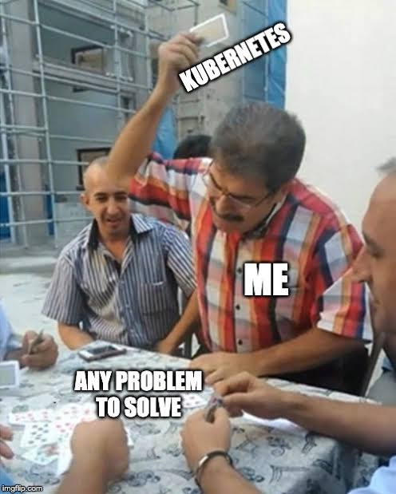

**Kubernetes best practices** are the production-tested rules that keep clusters reliable, secure, and affordable: set resource requests and limits on every container, isolate workloads with namespaces and NetworkPolicies, enforce least-privilege RBAC, automate health checks, ship via GitOps, validate every change with policy-as-code, generate an SBOM for every image, and manage Kubernetes itself with infrastructure as code instead of hand-rolled YAML. The 20 practices below cover what production teams actually do in 2026 — not what tutorials suggest.

<!--more-->

## TL;DR: 20 Kubernetes best practices for 2026

1. Set resource **requests and limits** on every container.
2. Use **namespaces** plus **ResourceQuota** and **LimitRange** for isolation.
3. Run **one container per Pod** unless you genuinely need a sidecar.
4. Manage manifests with **Helm, Kustomize, or Pulumi** — never raw copies.
5. Use the **Gateway API** (ingress-nginx is retired) for north-south traffic.
6. Configure **liveness, readiness, and startup probes** for every workload.
7. Enforce **RBAC** with the principle of least privilege from day one.
8. Apply **Pod Security Admission** at the `restricted` level by default.
9. Lock down east-west traffic with **NetworkPolicy** (default-deny).
10. Store secrets in an **external secret manager** (Pulumi ESC, Vault, AWS Secrets Manager) — not as plain Kubernetes Secrets.
11. Autoscale with **HPA, VPA, and Cluster Autoscaler / Karpenter**.
12. Monitor with **Prometheus, Grafana, and OpenTelemetry**; alert before users do.
13. Deploy with **GitOps** (Argo CD or Flux) — Git is the only source of truth.
14. Gate every change with **policy-as-code** (Pulumi CrossGuard, OPA/Gatekeeper, Kyverno).
15. Generate and verify an **SBOM** for every image; sign with **Sigstore/cosign**.
16. Manage cost with **FinOps** practices: right-size, schedule, and chargeback by namespace.
17. Keep clusters and add-ons **patched** on a documented cadence.
18. Use **labels and annotations** consistently for ownership, cost, and SLO tracking.
19. Separate **dev, staging, and prod** clusters — or virtualize with vCluster.
20. Treat clusters as **cattle, not pets**: rebuild from code, never edit live.

> **Last updated April 30, 2026** — added GitOps, policy-as-code, SBOM/supply-chain, autoscaling, NetworkPolicy, and FinOps sections; added an anti-pattern table; restructured headings around the questions teams actually ask.

{}
Going to [KubeCon Europe 2026](https://www.pulumi.com/kubecon/)? Tame Kubernetes complexity with code.

Pulumi demos, platform engineering talks, AI-powered Neo in action, and yes, free plushies. [Booth 784](https://www.pulumi.com/kubecon/).
{}



## What are Kubernetes best practices?

Kubernetes best practices are the operational patterns that keep workloads available, secure, observable, and cost-efficient on a Kubernetes cluster. They span four areas: **workload configuration** (resources, probes, images), **security** (RBAC, NetworkPolicy, Pod Security, secrets, supply chain), **delivery** (GitOps, policy-as-code, IaC), and **platform operations** (autoscaling, monitoring, upgrades, FinOps). The rest of this post explains each one with a copy-pasteable rule, a definition of the underlying Kubernetes object, and a common anti-pattern to avoid.

## Common Kubernetes anti-patterns vs. the correct approach

| Common mistake | What goes wrong | Correct approach |
| --- | --- | --- |
| No resource requests or limits | Noisy-neighbor evictions, OOMKills, unschedulable Pods | Set requests for **every** container; use VPA recommendations to tune |
| Everything in the `default` namespace | No isolation, no quota, no RBAC boundary | One namespace per team or environment + ResourceQuota + RBAC |
| `cluster-admin` for service accounts | Full-cluster blast radius on compromise | Per-namespace Role + RoleBinding (least privilege) |
| Plain Kubernetes `Secret` objects | Base64 ≠ encryption; secrets leak via etcd, kubectl, audit logs | External Secrets Operator + [Pulumi ESC](/docs/esc/), Vault, or AWS Secrets Manager |
| Open east-west traffic | One compromised Pod can reach every service | Default-deny NetworkPolicy; allow only required flows |
| `kubectl apply -f` from a laptop | No history, no review, no rollback | GitOps with Argo CD or Flux; Git is the source of truth |
| Manual `latest` image tags | Non-reproducible deploys, supply-chain risk | Pinned digests (`@sha256:...`) with cosign verification |
| Ingress-nginx in 2026 | Project retired March 2026 — no security fixes | Migrate to the Gateway API (Envoy Gateway, Istio, Kgateway) |
| Hand-rolled YAML in dozens of repos | Drift, copy-paste bugs, no testing | [Pulumi](/docs/iac/get-started/kubernetes/), Helm, or Kustomize with reviews |
| One shared `prod` cluster for everything | Blast radius spans every team | Separate clusters or [vCluster](https://www.vcluster.com/) virtual clusters |

## 1. How do you set Kubernetes resource requests and limits?

**What are resource requests and limits?** A resource *request* is the minimum CPU and memory the kube-scheduler guarantees a container; a resource *limit* is the maximum the kubelet allows it to consume before throttling CPU or OOMKilling memory. Pods without requests are scheduled blind, so a noisy neighbor can evict your workload at any time.

**The rule:** every container in production sets a request for both CPU and memory, and a memory limit. CPU limits are optional and frequently counter-productive — they cause throttling spikes that look like outages.

- Start at **100–200m CPU and 128–512Mi memory** for a typical web service.
- Tune from real data using **Vertical Pod Autoscaler** with `updateMode: Off` (recommendation-only) or Prometheus histograms.
- Use a per-namespace `LimitRange` so teams cannot ship a container with no requests at all.

## 2. How should you structure Kubernetes namespaces?

**What is a Kubernetes namespace?** A namespace is a logical partition of cluster resources. It scopes object names, RBAC bindings, NetworkPolicies, and quotas — but does not provide hard isolation by itself.

**The rule:** never deploy production workloads to `default`. Map namespaces to ownership boundaries — usually one per team, environment, or tenant — and pair every namespace with three things:

- A **`ResourceQuota`** to cap aggregate CPU, memory, and object counts.
- A **`LimitRange`** to enforce per-container defaults.
- A **`RoleBinding`** that grants only the permissions that team needs.

This is the smallest unit that gives you predictable cost, blast-radius containment, and an RBAC perimeter.

## 3. Should you run multiple containers in one Pod?

**What is a Pod?** A Pod is the smallest deployable unit in Kubernetes — one or more containers that share a network namespace, IPC, and storage volumes, and that are scheduled and scaled as a single unit.

**The rule:** one container per Pod by default. Add a second container only when it must share the Pod's network or volumes — for example, a service-mesh sidecar (Istio/Linkerd), a logging shipper, or an [init container](https://kubernetes.io/docs/concepts/workloads/pods/init-containers/) that prepares state before the main process starts. Multi-container Pods couple lifecycles and scaling, so reach for them deliberately, not by default.



## 4. Should you use Helm, Kustomize, or Pulumi for Kubernetes manifests?

**The rule:** never copy-paste raw YAML across services. Pick one of these:

- **[Helm](https://helm.sh/)** — Go-templated charts; the de-facto distribution format for off-the-shelf software (Prometheus, cert-manager, Argo CD).
- **[Kustomize](https://kustomize.io/)** — overlay-based, no templating; ships in `kubectl`. Best for "same app, different environment" diffs.
- **[Pulumi](/docs/iac/get-started/kubernetes/)** — real programming languages (TypeScript, Python, Go, Java, .NET) for Kubernetes plus the cloud resources around it (EKS, GKE, AKS, DNS, IAM). Type checking, tests, and the Pulumi [Kubernetes Operator](/docs/integrations/clouds/kubernetes/pulumi-kubernetes-operator/) for GitOps-style reconciliation.

If you are already managing cloud infrastructure with code, extending the same Pulumi program to Kubernetes is the smallest cognitive jump — the cluster, its IAM, its DNS, and its workloads live in one stack and one review.

## 5. How should you handle ingress and networking on Kubernetes in 2026?

**What is the Gateway API?** The [Gateway API](https://gateway-api.sigs.k8s.io/) is the successor to the legacy `Ingress` resource. It splits responsibility between infrastructure (`GatewayClass`, `Gateway`) and application (`HTTPRoute`, `GRPCRoute`, `TLSRoute`) teams, and it is the SIG-Network direction for north-south traffic.

**The rule:** new clusters should standardize on the Gateway API. The widely deployed `ingress-nginx` controller [retired in March 2026](https://www.pulumi.com/blog/ingress-nginx-to-gateway-api-kgateway/), and remaining deployments should migrate to Envoy Gateway, Istio, Linkerd Gateway, or Kgateway.

- Terminate TLS at the gateway and automate certificates with [cert-manager](https://cert-manager.io/).
- Use **path-based and host-based routing** instead of one gateway per service.
- Protect every gateway with a WAF (managed cloud WAF or [Coraza](https://coraza.io/) on Envoy).

    

{}
ingress-nginx is retiring in March 2026.

Here is a guide on [How to Move to the Gateway API: post ingress-nginx Retirement](https://www.pulumi.com/blog/ingress-nginx-to-gateway-api-kgateway/).
{}

## 6. What's the difference between liveness, readiness, and startup probes?

Probes tell the kubelet whether to restart a container, route traffic to it, or wait for it. Configure them per workload:

- **Liveness probe** — restarts a hung container. Use sparingly; a bad liveness probe is a self-inflicted DoS.
- **Readiness probe** — gates traffic from Services and Gateway routes. Use for *every* network-facing workload.
- **Startup probe** — gives slow-booting apps (JVM, ML models) time to come up before liveness checks begin. Use whenever cold-start exceeds 10 seconds.

See [the upstream guide](https://kubernetes.io/docs/tasks/configure-pod-container/configure-liveness-readiness-startup-probes/) for HTTP, TCP, and exec probe syntax. Tune `failureThreshold`, `periodSeconds`, and `timeoutSeconds` based on real latency, not defaults.

## 7. How do you secure a Kubernetes cluster?

Cluster security is layered: identity, workload posture, network, and secrets. Get all four right.

### What is RBAC in Kubernetes?

**RBAC (Role-Based Access Control)** is the Kubernetes authorization model that maps subjects (users, groups, ServiceAccounts) to verbs (`get`, `list`, `create`, `delete`) on resources, scoped to a namespace (`Role`) or the whole cluster (`ClusterRole`).

- Grant **least privilege** — never bind humans or workloads to `cluster-admin`.
- Prefer per-namespace `Role` + `RoleBinding` over `ClusterRoleBinding`.
- Audit with `kubectl auth can-i --as=...` and tools like [`rbac-lookup`](https://github.com/FairwindsOps/rbac-lookup).

### What is Pod Security Admission?

[Pod Security Admission](https://kubernetes.io/docs/concepts/security/pod-security-admission/) is the built-in admission controller that enforces the three Pod Security Standards (`privileged`, `baseline`, `restricted`) at the namespace level.

- Label every namespace `pod-security.kubernetes.io/enforce=restricted` by default.
- Drop `NET_RAW` and all capabilities; run as non-root with a read-only root filesystem.
- Use `seccompProfile: RuntimeDefault` and a tight `securityContext` for every container.

### What is a NetworkPolicy?

A **NetworkPolicy** is a Kubernetes object that defines allowed ingress and egress traffic for selected Pods at the IP/port level. Without one, every Pod can reach every other Pod by default.

- Apply a **default-deny** ingress and egress policy in every namespace.
- Allow only the flows your service actually needs (DNS, the database, the upstream API).
- For richer L7 controls (mTLS, JWT auth), layer a service mesh on top.

### How should you manage Kubernetes secrets?

**Built-in `Secret` objects are base64-encoded, not encrypted.** Treat them as a transport, not as storage.

- Store the source of truth in [Pulumi ESC](/docs/esc/), [HashiCorp Vault](https://www.vaultproject.io/), [AWS Secrets Manager](https://aws.amazon.com/secrets-manager/), GCP Secret Manager, or Azure Key Vault.
- Project secrets into Pods with the [External Secrets Operator](/docs/esc/integrations/kubernetes/external-secrets-operator/) or the [Secret Store CSI Driver](/docs/esc/integrations/kubernetes/secret-store-csi-driver/).
- Enable **etcd encryption-at-rest** with a KMS provider so leaked etcd snapshots stay opaque.
- Rotate automatically; never commit secrets to Git, even encrypted.

## 8. How do you set up Kubernetes observability?

Observability rests on the three pillars: metrics, logs, and traces. The 2026 default stack is OpenTelemetry-first.

- **Metrics** — [Prometheus](https://github.com/prometheus-operator/kube-prometheus) (or a Prometheus-compatible TSDB like Mimir, Thanos, VictoriaMetrics) plus Grafana dashboards.
- **Logs** — Fluent Bit or the OpenTelemetry Collector shipping structured JSON to Loki, Elastic/OpenSearch, or a managed service. Never depend on `kubectl logs` for incidents — Pods are ephemeral.
- **Traces** — OpenTelemetry SDKs in your apps emitting to Tempo, Jaeger, or a vendor backend. Correlate trace IDs with logs.
- **Alerts** — page on **SLO burn rate**, not on every crashed Pod. Burn-rate alerting catches real user impact without firing on every restart.

## 9. How do you automate Kubernetes deployments with GitOps?

**What is GitOps?** [GitOps](https://opengitops.dev/) is a deployment model where the desired cluster state lives in a Git repository and a controller continuously reconciles the live cluster to match. Changes happen through pull requests, not `kubectl apply`.

**The rule:** every cluster has a controller — [Argo CD](https://argoproj.github.io/cd/), [Flux](https://fluxcd.io/), or the [Pulumi Kubernetes Operator](/docs/integrations/clouds/kubernetes/pulumi-kubernetes-operator/) — that owns reconciliation. Humans never `kubectl apply` to production.

- Use **app-of-apps** (Argo) or **Kustomization trees** (Flux) to bootstrap whole clusters from a single root.
- Keep manifests, Helm values, and Pulumi stack references in Git, with environment promotion via PR.
- Combine GitOps with [Pulumi Deployments](/docs/deployments/deployments/) so cloud infrastructure (VPCs, EKS clusters, IAM, DNS) and the workloads on top promote through the same review pipeline. See [improving GitOps with the Pulumi Operator](/blog/improving-gitops-with-pulumi-operator/) for a worked example.
- Configure **automated rollback** on health-check failure, and **drift detection** alerts when someone edits live state.

## 10. How often should you upgrade Kubernetes?

Kubernetes ships a minor release roughly [every four months](https://kubernetes.io/releases/release/) and supports each one for about 14 months. Treat upgrades as routine maintenance, not a project.

- Stay within **two minor versions** of upstream — older versions miss CVE patches.
- Test upgrades in a non-prod cluster, run a [conformance test](https://github.com/cncf/k8s-conformance), then promote.
- Back up etcd before control-plane changes; managed services (EKS, GKE, AKS) handle most of this for you.
- Upgrade add-ons (CNI, CSI, Gateway controller, cert-manager, metrics-server) on the same cadence — pin versions in code so the upgrade is auditable.
- Watch the [Kubernetes deprecation guide](https://kubernetes.io/docs/reference/using-api/deprecation-guide/) and run [`pluto`](https://github.com/FairwindsOps/pluto) or `kubent` to find deprecated APIs before they break.

## 11. How should you label and annotate Kubernetes resources?

Labels and annotations are the metadata layer that everything — Services, NetworkPolicies, monitoring, cost tools, GitOps — keys off of. Consistency matters more than cleverness.

- Adopt the [recommended labels](https://kubernetes.io/docs/concepts/overview/working-with-objects/common-labels/): `app.kubernetes.io/name`, `app.kubernetes.io/instance`, `app.kubernetes.io/version`, `app.kubernetes.io/component`, `app.kubernetes.io/part-of`, `app.kubernetes.io/managed-by`.
- Add organization-specific labels for **owner**, **cost-center**, **environment**, and **SLO tier** — your FinOps and on-call processes will need them.
- Reserve [annotations](https://kubernetes.io/docs/concepts/overview/working-with-objects/annotations/) for non-identifying metadata: build SHA, change-ticket, last-deployed timestamp, ingress controller hints.

## 12. How should you separate Kubernetes environments?

**The rule:** production is its own cluster. Dev and staging can share — sometimes. Mixing prod with anything else couples blast radius, upgrade cadence, and quotas.

- **Separate clusters per environment** is the safe default. With managed control planes (EKS, GKE, AKS) the cost is small.
- **Virtual clusters** with [vCluster](https://www.vcluster.com/) give each team a Kubernetes API of their own without the operational cost of a real cluster.
- **Namespace-only segregation** can work for dev/staging if you enforce strict NetworkPolicy, RBAC, and ResourceQuota boundaries.
- Provision all of them from the same [Pulumi](/docs/iac/get-started/kubernetes/) program with different stacks — `dev`, `staging`, `prod` — so promotion is a config change, not a copy.

## 13. How do you optimize Kubernetes container images?

- Start from a **distroless** ([gcr.io/distroless](https://github.com/GoogleContainerTools/distroless)) or `chainguard/static` base. Alpine is fine if you accept musl.
- Build with **multi-stage Dockerfiles** so build tools never ship in the final image.
- Pin the base image **by digest** (`@sha256:...`), not by tag — `latest` and `1.21` move under you.
- Scan every image with **[Trivy](https://trivy.dev/latest/)**, [Grype](https://github.com/anchore/grype), or your registry's built-in scanner. Block builds on `Critical`/`High` CVEs.
- Smaller images mean faster pulls, faster autoscaling, and a smaller attack surface.

## 14. What's a reliable Kubernetes logging strategy?

- **Centralize** to Loki, Elastic/OpenSearch, or a managed service via Fluent Bit or the OpenTelemetry Collector running as a DaemonSet.
- **Structure** logs as JSON with consistent field names (`trace_id`, `span_id`, `service`, `level`).
- **Retain** by tier — 7 days hot, 30–90 days warm, archive to object storage for compliance.
- **Redact** secrets and PII at the collector, not after the fact.



## 15. How should you autoscale workloads on Kubernetes?

**What is the Horizontal Pod Autoscaler?** The **HPA** scales the replica count of a Deployment or StatefulSet up and down based on CPU, memory, or custom/external metrics.

**What is the Vertical Pod Autoscaler?** The **VPA** adjusts a Pod's CPU and memory *requests* over time based on observed usage. Run it with `updateMode: Off` (recommendation-only) in production and apply the recommendations through your IaC tool.

**What are Cluster Autoscaler and Karpenter?** **Cluster Autoscaler** adds and removes nodes to match Pod demand. **[Karpenter](https://karpenter.sh/)** is a faster, group-less node provisioner now widely used on EKS and gaining traction on other clouds.

**The rule:** every production workload has an HPA. Every cluster has a node-level autoscaler. Set sensible `min`/`max` replicas, define a `PodDisruptionBudget`, and gate scale-down behavior so traffic spikes don't pile up at restart time. Pair with **KEDA** for event-driven scaling (queues, Kafka lag, scheduled scale).

## 16. How do you enforce policy-as-code on Kubernetes?

**What is policy-as-code?** Policy-as-code expresses governance rules — security baselines, tagging, region restrictions, cost guardrails — as code that runs in CI and at admission time, blocking non-compliant changes before they reach the cluster.

**The rule:** every change goes through at least one policy engine.

- **Pre-deploy** — validate Pulumi or Helm output with [Pulumi CrossGuard](/docs/insights/policy/) or [Conftest](https://www.conftest.dev/) in CI.
- **Admission-time** — install [OPA Gatekeeper](https://open-policy-agent.github.io/gatekeeper/) or [Kyverno](https://kyverno.io/) and require, for example, signed images, a `team` label, and a non-root `securityContext` on every Pod.
- **Continuous** — scan running clusters with [Pulumi Insights](/docs/insights/policy/) or `kubescape` for drift from policy.

See [the benefits of policy-as-code](/blog/benefits-of-policy-as-code/) and [enforcing policy-as-code on discovered resources](/blog/enforcing-policy-as-code-on-discovered-resources-with-pulumi/) for end-to-end examples.

## 17. How do you secure the Kubernetes software supply chain?

**What is an SBOM?** A **Software Bill of Materials** is a machine-readable inventory of every component in a container image — packages, versions, licenses, hashes — typically in [SPDX](https://spdx.dev/) or [CycloneDX](https://cyclonedx.org/) format.

**The rule:** every image you run in production has a verified SBOM and a verified signature.

- Generate SBOMs at build time with [Syft](https://github.com/anchore/syft) or `docker sbom`.
- Sign images and SBOMs with [Sigstore/cosign](https://www.sigstore.dev/) keylessly via GitHub OIDC.
- Verify signatures at admission with [Kyverno](https://kyverno.io/policies/?policytypes=Cosign) or [Connaisseur](https://github.com/sse-secure-systems/connaisseur).
- Generate **provenance attestations** ([SLSA](https://slsa.dev/)) so you can prove which build pipeline produced a given image.
- Pin base images by digest and rebuild on a cadence so CVE patches actually land.

This is what regulators and customers ask for in 2026 — Executive Order 14028, the EU Cyber Resilience Act, and most enterprise procurement checklists all require it.

## 18. How do you manage Kubernetes cost (FinOps)?

**The rule:** Kubernetes cost is a labeling and right-sizing problem before it is a discount problem.

- **Right-size** with VPA recommendations, [Goldilocks](https://github.com/FairwindsOps/goldilocks), or your APM's recommendation engine. Most workloads request more CPU than they actually use; right-sizing is usually the largest single saving.
- **Schedule** non-prod clusters off overnight and on weekends.
- **Spot/preemptible nodes** for fault-tolerant workloads; use Karpenter's consolidation to compact bin-packing.
- **Show back / charge back** by namespace and label using [OpenCost](https://www.opencost.io/) or [Kubecost](https://www.kubecost.io/). Without per-team attribution, no team owns cost.
- **Provision the underlying cluster with IaC** — see [Pulumi for Kubernetes](/docs/iac/get-started/kubernetes/) — so node types, autoscaling limits, and reserved capacity are reviewable artifacts. Pulumi's [hidden-cost analysis](/blog/hidden-costs-of-infrastructure-management/) walks through where the money actually goes.

## 19. Why should you treat Kubernetes clusters as cattle, not pets?

The old "cattle, not pets" adage applies more strictly to Kubernetes than to VMs. Manual edits to a live cluster will be reconciled away, drift between environments, or vanish on the next Pod restart.

- Fix problems in code — YAML, Helm chart, or [Pulumi program](/docs/iac/get-started/kubernetes/) — and let the controller redeploy.
- If you can't redeploy a cluster from Git in under an hour, you have a pet.
- Use ephemeral preview environments for PRs; use blue/green or progressive delivery (Argo Rollouts, Flagger) for production cutovers.

## 20. Why use Pulumi to manage Kubernetes?

Native YAML scales until your team doesn't. Once you have more than a handful of services, dependencies between cloud resources and Kubernetes objects, or more than one cluster, **infrastructure as code in a real programming language** wins on every axis.

- **Real languages** — TypeScript, Python, Go, Java, .NET — for [type-safe, testable Kubernetes infrastructure](/docs/iac/languages-sdks/). Loops, conditionals, and unit tests instead of templating.
- **One stack, full topology** — manage the cloud (EKS/GKE/AKS, VPC, IAM, DNS) and the workloads in it together. See [easily create and manage AWS EKS clusters with Pulumi](/blog/easily-create-and-manage-aws-eks-kubernetes-clusters-with-pulumi/).
- **Reusable components** — abstract platform patterns into [Pulumi packages](/docs/iac/using-pulumi/pulumi-packages/) other teams `import` instead of copy-pasting.
- **GitOps reconciliation** — the [Pulumi Kubernetes Operator](/docs/integrations/clouds/kubernetes/pulumi-kubernetes-operator/) reconciles a cluster to a Pulumi stack on every Git push.
- **Policy-as-code** built in — [CrossGuard](/docs/insights/policy/) blocks non-compliant changes before `pulumi up`.
- **Secrets done right** — [Pulumi ESC](/docs/esc/) federates secrets and configuration across stacks, environments, and Kubernetes clusters.

For a deeper comparison of hand-written YAML, Terraform, and Pulumi for Kubernetes, see [YAML, Terraform, Pulumi: what's the smart choice for deployment automation with Kubernetes](/blog/yaml-terraform-pulumi-whats-the-smart-choice-for-deployment-automation-with-kubernetes/), and the [beyond YAML](/blog/beyond-yaml-kubernetes-2026-automation-era/) write-up on where Kubernetes automation is heading in 2026.



{}See how Pulumi helps you manage Kubernetes Services and Deployments with code instead of YAML—bringing structure, reuse, and type safety to your configs.{}

By adopting Pulumi, you can avoid the complexity of juggling endless YAML files and gain a more streamlined, maintainable workflow for your Kubernetes infrastructure.

## Final thoughts

    

Kubernetes rewards discipline. The 20 practices above — resource hygiene, namespaced isolation, RBAC, NetworkPolicy, Pod Security, external secrets, probes, the Gateway API, observability, GitOps, policy-as-code, signed images and SBOMs, autoscaling, FinOps, multi-cluster strategy, and IaC — are the dial settings that separate clusters that page their owners every week from clusters that don't.

Pick the three weakest spots in your environment and fix those first. Then promote the fixes through code, not through `kubectl`.

Want to learn how to put these practices into action? Meet us at [KubeCon Europe 2026 (Booth 784)](https://www.pulumi.com/kubecon/) or register for our upcoming [Zero to Production in Kubernetes](https://www.pulumi.com/events/from-zero-to-production-in-kubernetes/) workshop.


