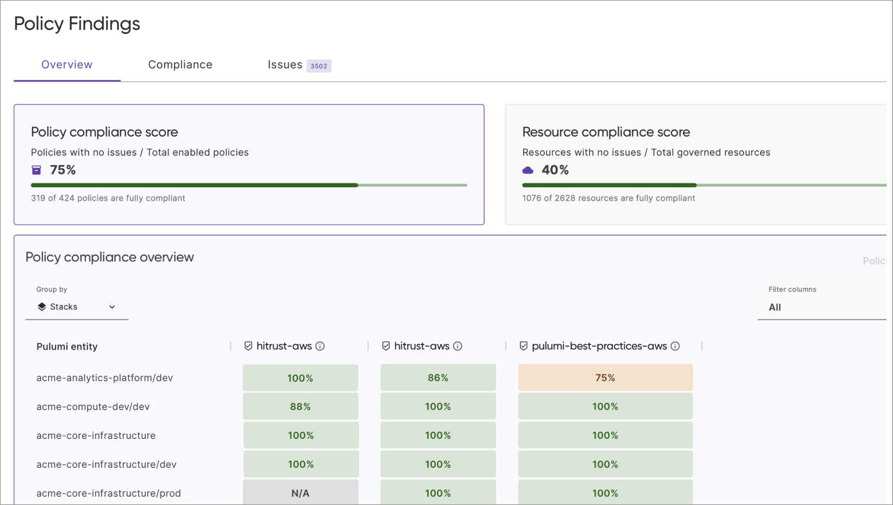

Pulumi's [OPA (Open Policy Agent)](https://www.openpolicyagent.org/) support is now stable. The [v1.1.0 release](https://github.com/pulumi/pulumi-policy-opa/releases/tag/v1.1.0) of `pulumi-policy-opa` makes OPA/Rego a first-class policy language for Pulumi with full feature parity alongside the native TypeScript and Python policy SDKs. Write Rego policies that validate any resource Pulumi manages, across AWS, Azure, GCP, Kubernetes, and the rest of the provider ecosystem. If you already have [Kubernetes Gatekeeper](https://open-policy-agent.github.io/gatekeeper/) constraint templates, a new compatibility mode lets you drop those `.rego` files directly into a Pulumi policy pack and enforce them against your Kubernetes resources without modification.

<!--more-->

## What's in the stable release

OPA/Rego is now fully supported as a policy language for [Pulumi Insights](/docs/insights/policy/), with the same capabilities as the TypeScript and Python SDKs:

- **Resource and stack-level policies**: Validate individual resources with `deny` and `warn` rules, or evaluate your entire stack at once with `stack_deny` and `stack_warn` for cross-resource checks like relationship validation and resource count limits.
- **Enforcement levels**: Control how violations are handled. `mandatory` blocks deployments, `advisory` surfaces warnings, and `disabled` turns rules off without removing them. Enforcement levels can be overridden per policy without modifying Rego source.
- **Policy configuration**: Pass custom parameters to policies via configuration files, with optional JSON schema validation. Configuration values are accessible in Rego as `data.config.<policy_name>.<key>`.
- **OPA metadata annotations**: Use standard OPA `# METADATA` comments to provide titles, descriptions, and messages for your policies. These populate the policy metadata displayed in Pulumi Cloud.
- **Preventative and audit evaluation**: OPA policies work with both [preventative enforcement](/docs/insights/policy/) during `pulumi up` and [audit policy scans](/blog/policy-audit-scans-for-stacks/) for continuous compliance monitoring.

You can choose whichever language best fits your team. Organizations already using OPA across their toolchain can standardize on Rego for Pulumi policies, while teams preferring TypeScript or Python can continue to use those. All three languages work side by side in the same [policy groups](/docs/insights/policy/policy-groups/).

## Kubernetes Gatekeeper compatibility

The headline feature of this release is native support for [Kubernetes Gatekeeper](https://open-policy-agent.github.io/gatekeeper/) constraint template rules. If you're running Gatekeeper as an admission controller in your clusters, you likely have a library of `.rego` policies that enforce security and operational standards at admission time. With v1.1.0, those same rules can now run as Pulumi policies, catching violations during `pulumi preview` before resources ever reach the cluster.

To enable Gatekeeper compatibility, set `inputFormat: kubernetes-admission` in your `PulumiPolicy.yaml`:

```yaml
description: Kubernetes Gatekeeper Policy Pack
runtime: opa
inputFormat: kubernetes-admission
```

With this setting, Pulumi automatically wraps Kubernetes resources in the Gatekeeper [AdmissionReview](https://open-policy-agent.github.io/gatekeeper/website/docs/howto) structure (`input.review.object`, `input.review.kind`, etc.), so your existing rules work without modification. Non-Kubernetes resources are silently skipped.

Here's an example that reuses standard Gatekeeper-style rules, requiring an `app` label and prohibiting the `latest` image tag:

```rego
package gatekeeper

import rego.v1

# METADATA
# title: Require App Label
# description: All Kubernetes resources must have an "app" label.
violation contains {"msg": msg} if {
    not input.review.object.metadata.labels["app"]
    msg := sprintf("%s '%s' is missing required label: app",
        [input.review.kind.kind, input.review.name])
}

# METADATA
# title: Disallow Latest Tag
# description: Container images must not use the "latest" tag.
deny contains msg if {
    container := input.review.object.spec.template.spec.containers[_]
    endswith(container.image, ":latest")
    msg := sprintf("container '%s' uses the 'latest' tag -- pin to a specific version",
        [container.name])
}
```

These rules are identical to what you'd write for Gatekeeper. Both rule head formats are supported and can coexist: the `violation[{"msg": msg}]` map format and the `deny[msg]` string format. Per-policy configuration via `input.parameters` also works as expected. You can take a `.rego` file from your Gatekeeper constraint templates, drop it into a Pulumi policy pack, and publish it to Pulumi Cloud to enforce automatically across your stacks.

This shifts policy enforcement left. Instead of waiting for the Kubernetes API server to reject a resource at admission time, you catch the violation during `pulumi preview`, before anything is deployed.

## Walkthrough: Reusing policies from the gatekeeper-library

The [OPA Gatekeeper Library](https://github.com/open-policy-agent/gatekeeper-library) is a community-maintained collection of constraint templates covering common Kubernetes guardrails like pod security, image provenance, and resource limits. You can use these policies directly with Pulumi. Here's an end-to-end example using the [`allowedrepos`](https://github.com/open-policy-agent/gatekeeper-library/tree/master/library/general/allowedrepos) policy to restrict which container image registries your deployments can use.

1. Create a new Kubernetes OPA policy pack:

    ```bash
    pulumi policy new kubernetes-opa
    ```

1. Copy the Rego source from [gatekeeper-library](https://github.com/open-policy-agent/gatekeeper-library/blob/master/library/general/allowedrepos/template.yaml) into your policy pack as `allowedrepos.rego`. No modifications are needed:

    ```rego
    package k8sallowedrepos

    violation[{"msg": msg}] {
        container := input.review.object.spec.containers[_]
        not strings.any_prefix_match(container.image, input.parameters.repos)
        msg := sprintf("container <%v> has an invalid image repo <%v>, allowed repos are %v",
            [container.name, container.image, input.parameters.repos])
    }

    violation[{"msg": msg}] {
        container := input.review.object.spec.initContainers[_]
        not strings.any_prefix_match(container.image, input.parameters.repos)
        msg := sprintf("initContainer <%v> has an invalid image repo <%v>, allowed repos are %v",
            [container.name, container.image, input.parameters.repos])
    }

    violation[{"msg": msg}] {
        container := input.review.object.spec.ephemeralContainers[_]
        not strings.any_prefix_match(container.image, input.parameters.repos)
        msg := sprintf("ephemeralContainer <%v> has an invalid image repo <%v>, allowed repos are %v",
            [container.name, container.image, input.parameters.repos])
    }
    ```

1. Verify that your `PulumiPolicy.yaml` has Gatekeeper compatibility enabled:

    ```yaml
    description: Kubernetes Gatekeeper Policy Pack
    runtime: opa
    inputFormat: kubernetes-admission
    ```

1. Configure the allowed registries. Create a `policy-config.json` file to pass the `repos` parameter:

    ```json
    {
        "k8sallowedrepos": {
            "repos": ["gcr.io/my-company/", "docker.io/library/"]
        }
    }
    ```

1. Test the policy locally against a stack:

    ```bash
    pulumi preview --policy-pack . --policy-pack-config policy-config.json
    ```

    Any Kubernetes deployment using an image outside the allowed registries will produce a violation at preview time, before it reaches the cluster.

1. Publish the pack and add it to a [policy group](/docs/insights/policy/policy-groups/) to enforce it across your organization:

    ```bash
    pulumi policy publish
    ```

The same approach works for any policy in the gatekeeper-library: [`containerlimits`](https://github.com/open-policy-agent/gatekeeper-library/tree/master/library/general/containerlimits), [`requiredlabels`](https://github.com/open-policy-agent/gatekeeper-library/tree/master/library/general/requiredlabels), [`disallowedtags`](https://github.com/open-policy-agent/gatekeeper-library/tree/master/library/general/disallowedtags), and others. Copy the Rego, configure parameters, and publish.

## Part of the Pulumi Insights governance story

OPA policy support is part of the broader [Pulumi Insights](/docs/insights/) governance platform. Insights gives you visibility and compliance across your entire cloud footprint, and OPA policies plug directly into that:

- **Audit policy scans** continuously evaluate OPA policies against your [Pulumi stacks](/blog/policy-audit-scans-for-stacks/) and discovered cloud resources, providing a compliance baseline without redeploying anything.
- **Self-hosted execution** lets you [run policy evaluations on your own infrastructure](/blog/self-hosted-insights/) using customer-managed workflow runners, keeping credentials and data within your network.
- **Pre-built compliance packs** for CIS, NIST, PCI DSS, and other frameworks are available alongside your custom OPA policies in the same [policy groups](/docs/insights/policy/policy-groups/).

Whether you're enforcing policy at deployment time, scanning existing infrastructure for drift, or running continuous compliance checks, OPA policies are a native participant.



## Frequently asked questions

### Do I need to modify my existing Gatekeeper `.rego` files?

No. Set `inputFormat: kubernetes-admission` in your `PulumiPolicy.yaml` and your existing Gatekeeper constraint template rules work as-is. Pulumi handles the AdmissionReview wrapping automatically.

### What happens with non-Kubernetes resources?

When using `inputFormat: kubernetes-admission`, non-Kubernetes resources are silently skipped during evaluation. Your Gatekeeper rules only run against Kubernetes resources.

### Do I need OPA installed locally?

No. The `pulumi-policy-opa` analyzer plugin embeds the OPA evaluation engine and is installed automatically by the Pulumi CLI (v3.227.0+). The standalone OPA CLI is only needed if you want to run `opa test` against your policies independently.

### When should I use OPA vs. TypeScript or Python for policies?

If your team already writes Rego for other tools like Gatekeeper, writing Pulumi policies in Rego keeps your policy language consistent. If your team is more comfortable with general-purpose languages or needs auto-remediation, use the TypeScript or Python SDKs.

Gatekeeper constraint templates can be reused directly via the `kubernetes-admission` input format, but other OPA integrations use different input structures, so those policies would need to be adapted to Pulumi's resource model. All three languages work together in the same policy groups.

## Get started

Templates are available for `kubernetes-opa`, `aws-opa`, `azure-opa`, and `gcp-opa` via `pulumi policy new`. For more details, see the [policy authoring guide](/docs/insights/policy/policy-packs/authoring/) and the [Policy as Code overview](/docs/insights/policy/).




