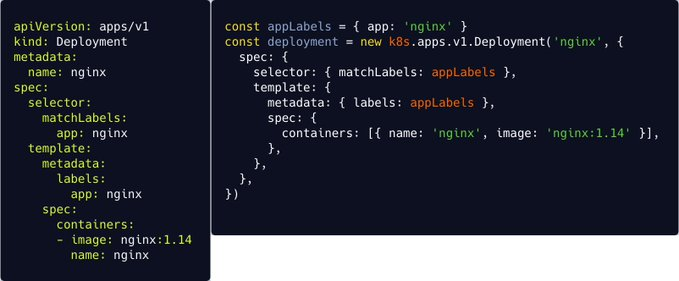
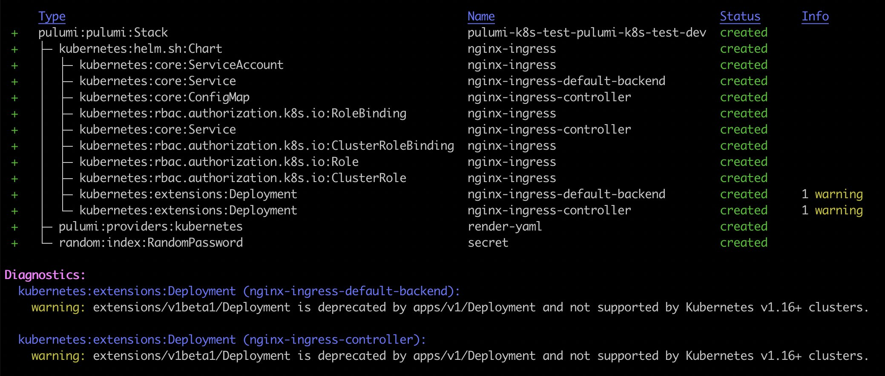
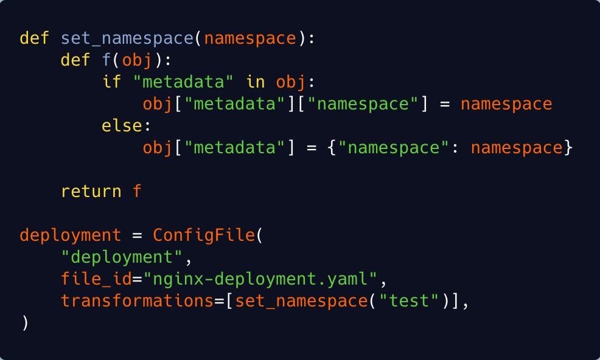

You’ve containerized your application, and it’s running great on your desktop using Docker Compose or even Swarm. But now it’s time to test it locally with minikube and then put it into production with Kubernetes. Manifests are a bit like Compose files - it’s just YAML, right?

<!--more-->

## It’s Dangerous to Go Alone. Take this

Recently, Pulumi engineer [Levi Blackstone](https://twitter.com/levi_blackstone) posted a Twitter thread on why he thinks Pulumi is the best way to build and deploy modern applications on Kubernetes. Levi might be a bit biased, but he makes solid points for using Pulumi with Kubernetes, whether you’re a developer or operator.


## For Devs

First, let’s take a look at Kubernetes from a dev’s point of view.

- **Use the full Kubernetes API surface** – Each of Pulumi’s Kubernetes SDKs (TypeScript, Python, .NET and Go) are generated from the OpenAPI spec. This is critical because it means that resource definitions in any language are a 1:1 match with the upstream API. In the example below, the deployment manifest on the left corresponds to the typescript on the right.



- **Conditional logic** – Another significant drawback of YAML is the lack of conditional logic. It’s common to change parameters depending on the environment, but this usually calls for separate tools to template your YAML. With Pulumi, this logic can go right into your resource definitions. It’s common to develop your application locally using minikube, which doesn't natively support LoadBalancer Services. On the other hand, many cloud deployments do use a LoadBalancer Service to route traffic. The example below shows how you can deploy to either environment without having to rewrite the manifest by using a configuration value.

```go
var frontendServiceType string
if isMinikube {
   frontendServiceType = “ClusterIP”
} else {
   frontendServiceType = “LoadBalancer”
}

frontendService, err := corev1.NewService(ctx, “frontent”, &corev1.ServiceArgs{
   Metadata: &metav1.ObjectMetaArgs{
      Labels: frontendLabels,
      Name: pulumi.String(“frontend”),
   },
   Spec: &corev1.ServiceSpecArgs{
      Type: pulumi.String(frontendServiceType),
      Ports: corev1.ServicePortArray{
         corev1.ServicePortArg{
            Port: pulumi.Int(80),
         },
      },
      Selector: frontendLabels,
   },
})
```

- **Strongly typed resources** – A tricky part about defining Kubernetes resources in YAML/JSON is the lack of typing. It's hard to track typos, and you have to apply the resource to a cluster to get any feedback. Pulumi helps here by showing type information right in the SDK.


- **Readiness logic** – Pulumi includes readiness logic to help you understand when your Kubernetes resources are ready. This makes it easy to integrate Kubernetes workflows into CI systems! Unlike `kubectl apply`, Pulumi doesn’t indicate success until all of the resources are ready to go. Let Pulumi worry about the bookkeeping so you can focus on more interesting matters.


- **Deprecation warnings** – Pulumi warns you if you’re using Kubernetes resources with deprecated apiVersions, and gives you info about which versions remove them entirely. Don’t be caught by surprise when you upgrade your clusters!



## For  Operators

Pulumi is not just for developers, operators have fine-grained control over Kubernetes that includes managing clusters, reuse of existing YAML manifests and Helm charts, and a convenience API for Kubernetes that abstracts boilerplate such as networking configurations. You can even export your Pulumi programs to YAML for portability.

- **Manage Kubernetes clusters** – With Pulumi, you can manage every layer of your stack, from specifying a custom VPC to deploying Kubernetes clusters! [Check out this example]() where we create clusters on AWS, AKS, and GKE, and then deploy an app to all of them.

- **Use existing YAML manifests** – Many of us already have a pile of YAML Kubernetes definitions to manage. Manage these manifests directly; no conversion needed! Pulumi shows detailed previews and allows you to run arbitrary transformations on the YAML before it is applied.



- **Helm support** – Pulumi lets you manage Helm charts similarly to our YAML support. It’s common for organizations to fork upstream charts to customize a few values, but this can often be avoided with the use of transformations in Pulumi.


- **Crosswalk for Kubernetes** – Our kubernetesx library makes it easier to manage Kubernetes resources by abstracting away a lot of the boilerplate. This dramatically cuts the amount of code you need to write, while still giving you access to the full API surface if you need it. Read about kubernetesx on our [blog] ().

- **YAML export** – Pulumi lets you [export YAML manifests]() from the resource definitions in your program. This can be useful for integrating with other systems that expect Kubernetes YAML.

## Conclusion

If you’re just starting out with Kubernetes, Pulumi provides a great experience by letting you take advantage of conditional logic, strong typing, error checking, and full access to the Kubernetes API. When deploying infrastructure, you can avoid deploying deprecated versions and know precisely when your resources are ready.

You can still use YAML manifests and Helm charts if you’re an experienced operator with existing resources. But if you want to fine-tune your infrastructure, Pulumi lets you manage your clusters on any cloud provider, including your own infrastructure. You can also simplify your deployments with Pulumi’s Crosswalk for Kubernetes, which features a convenience API that reduces boilerplate. Finally, you can export resource definitions as YAML, providing portability for your deployments.

Learn how Pulumi can make your Kubernetes experience smoother and more efficient by working through [tutorials](https://www.pulumi.com/docs/tutorials/kubernetes/) or trying out our [examples](https://github.com/pulumi/examples#kubernetes).
