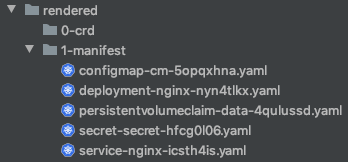

Stop writing Kubernetes YAML by hand, and start using the power of familiar programming languages! Pulumi can
generate Kubernetes manifests that easily integrate into existing CI/CD workflows.

<!--more-->

While Pulumi has [excellent support](https://www.pulumi.com/docs/get-started/kubernetes/) for deploying and updating
Kubernetes resources on a cluster, many users have asked for the option to render YAML that they can integrate into
existing workflows. The [v1.5.4](https://github.com/pulumi/pulumi-kubernetes/releases/tag/v1.5.4) release of
`pulumi-kubernetes` adds the [renderYamlToDirectory](https://www.pulumi.com/docs/reference/pkg/nodejs/pulumi/kubernetes/#ProviderArgs-renderYamlToDirectory)
option, which enables this feature. This option is available in every Pulumi-supported language, including
TypeScript/JavaScript, Python, and .NET ([Go support is coming soon!](https://github.com/pulumi/pulumi-kubernetes/issues/70)).

Aside from easily templating configuration across resources, using a familiar programming language allows you to write and
consume libraries, and easily mix in infrastructure configuration (e.g., managed database endpoints, object storage,
etc.), all in the same program.

## Rendering YAML from TypeScript

First, choose a directory for the rendered manifests, and specify that path on a `Provider`.

```typescript
import * as k8s from "@pulumi/kubernetes";
import * as kx from "@pulumi/kubernetesx";

// Instantiate a Kubernetes Provider and specify the render directory.
const provider = new k8s.Provider("render-yaml", {
    renderYamlToDirectory: "rendered",
});
```

Next, use that `Provider` for any Kubernetes resources you want to render as YAML.

```typescript
// Create a Kubernetes PersistentVolumeClaim.
const pvc = new kx.PersistentVolumeClaim("data", {
    spec: {
        accessModes: [ "ReadWriteOnce" ],
        resources: { requests: { storage: "1Gi" } },
    }
}, { provider });

// Create a Kubernetes ConfigMap.
const cm = new kx.ConfigMap("cm", {
    data: { "config": "very important data" },
}, { provider });

// Create a Kubernetes Secret.
const secret = new kx.Secret("secret", {
    stringData: {
        "password": new random.RandomPassword("pw", {
            length: 12}).result,
    }
}, { provider });

// Define a Pod.
const pb = new kx.PodBuilder({
    containers: [{
        env: {
            CONFIG: cm.asEnvValue("config"),
            PASSWORD: secret.asEnvValue("password"),
        },
        image: "nginx",
        ports: {http: 8080},
        volumeMounts: [ pvc.mount("/data") ],
    }]
});

// Create a Kubernetes Deployment.
const deployment = new kx.Deployment("nginx", {
    spec: pb.asDeploymentSpec( { replicas: 3 } ),
}, { provider });

// Create a Kubernetes Service.
const service = deployment.createService({
    type: kx.types.ServiceType.LoadBalancer,
});
```

Now, run `pulumi update`, and Pulumi renders these resources to YAML. The update process resolves [Outputs]()
as usual, so that the manifests can include other infrastructure configuration specified in your program. The rendered
manifests are kept in sync with changes to the program on each update.

Here's what the resulting directory looks like:



Note that `CustomResourceDefinition` resources need to be applied first, so they are rendered in a separate
subdirectory. (This example doesn't include any CRDs, so the directory is empty). You could deploy the rendered
manifests with `kubectl` like this:

```shell script
kubectl apply -f "${RENDER_DIRECTORY}/0-crd"
kubectl apply -f "${RENDER_DIRECTORY}/1-manifest"
```

Voilà! From 33 (44 with whitespace and comments) lines of TypeScript code to 102 lines of YAML!

Here's the rendered `Deployment` resource.



See [this gist](https://gist.github.com/lblackstone/686935edf7fdcd23d916f34d35bba64a) for the complete rendered output.

## Caveats

There are two important caveats to note about YAML rendering support:

1. The YAML-rendered resources are **not created** on a Kubernetes cluster, so information that is computed server-side
will not be available in your program. For example, a `Service` will not have IP assignments, so attempting to export
these values will not work as usual (i.e., the value will be `undefined`).
1. **Any Secret values will appear in plaintext in the rendered manifests.** This includes any values marked as
secret in Pulumi. A warning will be printed for any secret values being rendered to YAML, but it is your responsibility
to protect the rendered files.

## Learn More

If you'd like to learn about Pulumi and how to manage your
infrastructure and Kubernetes through code, [get started today](). Pulumi is open
source and free to use.

For further examples on how to use Pulumi to create Kubernetes
clusters, or deploy workloads to a cluster, check out the rest of the
[Kubernetes tutorials]().

As always, you can check out our code on
[GitHub](https://github.com/pulumi), follow us on
[Twitter](https://twitter.com/pulumicorp), subscribe to our [YouTube
channel](https://www.youtube.com/channel/UC2Dhyn4Ev52YSbcpfnfP0Mw), or
join our [Community Slack](https://slack.pulumi.com/) channel if you have
any questions, need support, or just want to say hello.
