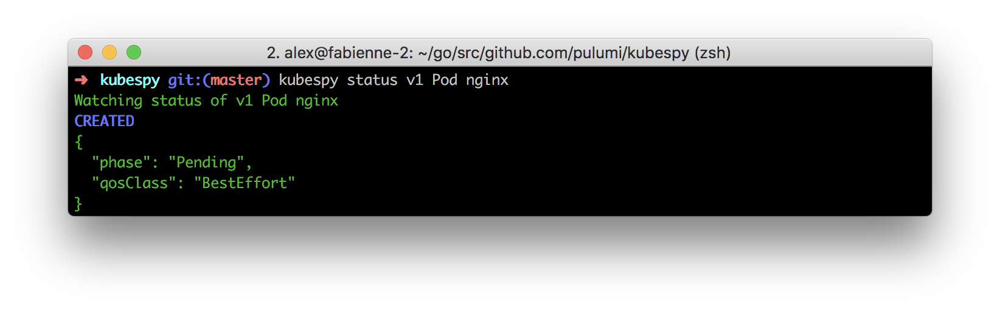
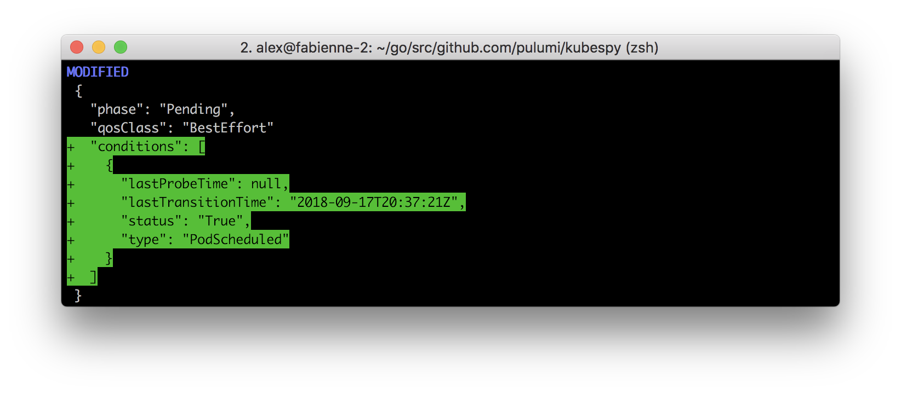
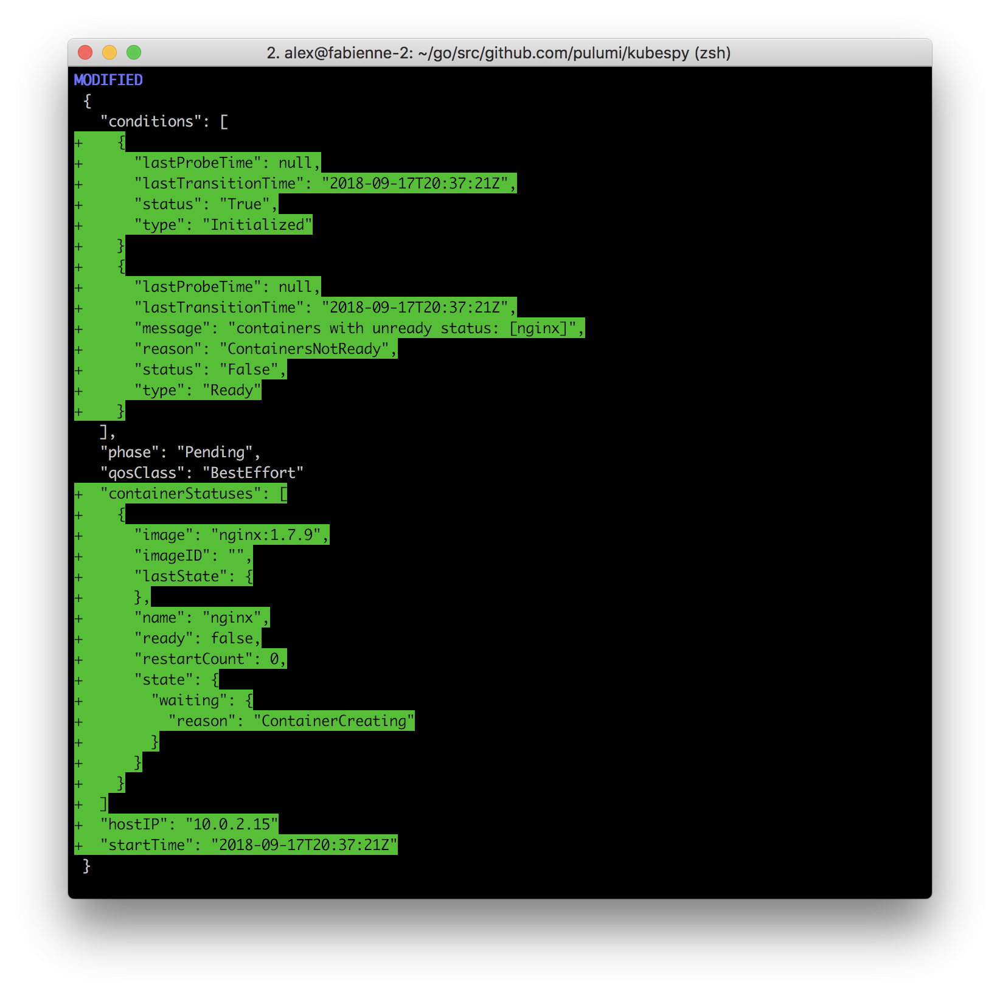
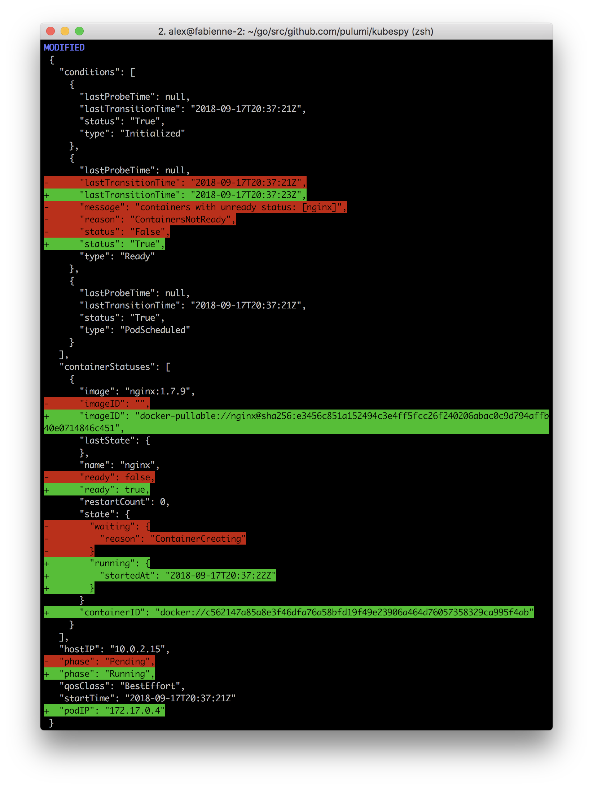

<!-- spacer -->

> This post is the first part in a series on the Kubernetes API. Future installments include
> [Part 2]()
> focused on the lifecycle of a `Service` and 
> [Part 3]()
> details how Kubernetes deployments work.

One of the most popular features of the recent
[v0.15.2 release]()
of Pulumi is fine-grained status updates for Kubernetes resources. On
the CLI they look like this:

But wait --- how does this work exactly? What is *actually happening*
when you deploy a `Pod` to a cluster? How does a `Service` go from
uninitialized, to being allocated a public IP address? How often is my
`Deployment`'s status changing?

To answer these questions and others like them, today we're releasing
**a small tool, [`kubespy`](https://github.com/pulumi/kubespy),**
purpose-built to help you answer questions like this, by displaying the
changes made to a Kubernetes object in real time. For example, in the
following gif, we're running `kubespy status v1 Pod nginx` to watch the
changes to a `Pod`'s status as it is booted up.
<!--more-->

We will spend the rest of this short post using `kubespy` to take a
closer look at what happens to a `Pod` when it's deployed to the
cluster.

## What happens when you boot up a Pod?

`kubespy` comes with a [simple example](https://github.com/pulumi/kubespy/tree/master/examples/trivial-pulumi-example)
that deploys nginx using a naked `Pod`. (The example works with both the
Pulumi CLI and `kubectl`, but we hope you'll give Pulumi a shot!)

The essential gist is that `kubespy` will sit and watch for the example
`Pod` to be created or changed; once you deploy the `Pod` (either
`pulumi up` or `kubectl apply`), you will see something like the gif
above.

If you do this yourself, you will see that there are 4 updates reported
by `kubespy`, each of which individually gives us a fairly clear picture
of what Kubernetes is doing internally to try to run the `Pod`:

**First: Acknowledging the `Pod` definition is written to etcd.**
The API server receives the `Pod` definition and begins trying to schedule it.

**Second: Scheduling the `Pod`.**
The scheduler successfully schedules the `Pod` to run on a node.

**Third: Creating the `Pod`.**
The kubelet running on the node receives the `Pod` definition and begins "creating"
the `Pod`. This involves pulling the
container image, adding volume mounts, *etc*. At the end of all of this,
it will attempt to run the container.

**Fourth: Marking the `Pod` as `Running`.**
The kubelet has now resolved the image
tag to a specific SHA, pulled it to the node, has successfully applied
the required configuration, and has successfully started the `nginx`
container. In this case, the `Pod` contains only one container to run,
and once it's initialized, the whole `Pod` gets marked running.

## Exercises:

1. Try inducing an error and see what `kubespy` outputs! Make the image
   tag nonsense, add a volume that doesn't exist, and so on.
2. Try booting up a service! See what `kubespy` displays under various
   configurations!  

## Conclusions, and the subtleties of the Pod API.

This post shows a fairly basic, happy-path use of `Pods`, and shows that
we can `kubespy status` to see exactly what our containers are up to.

But wait --- what does `Running` mean, precisely? If a `Pod` is
`Running`, does that mean it's healthy? If a `Pod` has multiple
containers, and one crashes, does it still get marked `Running`? Are
there any other settings that can change when a `Pod` is marked
`Running`?

Unfortunately, though the `Pod` is the atomic compute abstraction of
Kubernetes (or perhaps *because* of this), the answer to these questions
turns out to be fairly subtle. But, because `Pod`s are so important, we
should endeavor to answer them anyway!

In the next post, we will `kubespy` to observe some of the subtleties of
the `Pod` lifecycle, and especially the effect of `restartPolicy` on the
semantics of the `Pod` object. We will also talk about some of the best
practices we've accumulated, and describe how we solved the problem of
repeatable `Pod` deployments in Pulumi.

If you enjoyed this post, or are curious to see how this lifecycle is
baked into the Pulumi CLI, [give us a shot]()!
We'd love to have your feedback.
