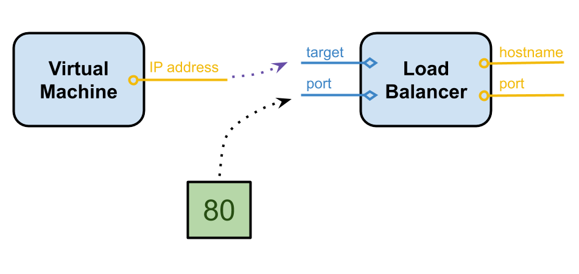

This article is about resource inputs and outputs, what they are, why we have them, and how to use them.

<!--more-->

When you create a resource, you pass arguments to its constructor. They are called the inputs and can be

- concrete values (like strings, numbers, and booleans), arrays, or other structures
- asynchronous values such as promises or
- outputs from other resources

After a resource is created, we can access any of its properties. These are called its outputs. Outputs are resolved to values once they're known. Pulumi lets you see how resources change with [preview](). A preview shows the difference from the current state to the desired state. The change hasn’t been made, so some outputs might not be known at runtime.

For example, we have a load balancer. It takes a target in a port as inputs, and its outputs include an IP address and a port.

```typescript
interface LoadBalancerArgs {
  target: Input<string>;
  Port: Input<number>;
}

class LoadBalancer {
  public readonly address: Output<string>;
  public readonly port: Output<string>;

  constructor(name: string; argos: LoadBalancerArgs, …);
}
```

The address can't be known in advance and will only be available once the load balancer is created. However, the input port argument is the same as the output port, making it available during previews.

The diagram shows how this works before we examine the code. Assume that we create a virtual machine that has an IP address as its output.  Next, we'll create a load balancer that has a target and a port as inputs. We'll pass the virtual machine's IP address as the target because we want the load balancer to point at it, and then we'll set 80 as the input port. The resulting load balancer's outputs will then be the generated hostname and the port 80.



The diagram shows the dependency. The load balancer knows that it depends on the virtual machine because the target points at the virtual machines IP address. Be aware that when you're running `pulumi up`, you may encounter outputs. In this case, we're creating
the virtual machine and load balancer, and if we click details, we'll see the target is listed as an output of string. That's because, during the preview, its value isn't known. In this case, the port is known as 80 because it’s a concrete value, but it’s possible that the port could come from another resource's output, or it was computed. In that case, it might be shown as an output of type number.

Let's look at some code. The first thing to notice is that the code is wrapped in an `async ()` function. The reason for this is that we create a Virtual Private Cloud (VPC) which defines a virtual network for our application.  Resources, such as the virtual machines' public subnets used to communicate to the load balancer, aren’t known in advance. We create a security group to control egress from the VPC.

```typescript
import * as aws from "@pulumi/aws";
import * as awsx from "@pulumi/awsx";
import * as pulumi from "@pulumi/pulumi";

export = async () => {
    const config = new pulumi.Config("aws");
    const providerOpts = { provider: new aws.Provider("prov", { region: <aws.Region>config.require("region") }) };

    // Create a vpc
    const vpc = awsx.ec2.Vpc.getDefault();

    // Create a security group to open ingress to our load balancer on port 80, and egress out of the VPC.
    const sg = new awsx.ec2.SecurityGroup("web-sg", {
        vpc,
        egress: [{ protocol: "-1", fromPort: 0, toPort: 0, cidrBlocks: [ "0.0.0.0/0" ] }],
    });
```

In this part of the code, the application load balancer is created, and port 80 is assigned to the load balancer's listener. Note that we create `publicIps` as an Output typed as a string array, which will hold the virtual machines' public IP addresses. We also call `await` to return the public subnets as an output, because we need that information before creating the virtual machines.

```typescript
    // Creates an ALB associated with the default VPC for this region and listen on port 80.
    const alb = new awsx.lb.ApplicationLoadBalancer("web-traffic", { securityGroups: [ sg ] });
    const listener = alb.createListener("web-listener", { port: 80 });
    const publicIps: pulumi.Output<string>[] = [];
    const subnets = await vpc.publicSubnets;
```

It's important to remember you can't access the values of outputs directly. They might not be known, so for example, printing the value to the console returns an error instead. The most common way of interacting with an output is to pass it to another resource as an input.

In this example,  we've instantiated a virtual machine per subnet, and we're passing the public IP address as its target.

```typescript
    // For each subnet, and each subnet/zone, create a VM and a listener.
    for (let i = 0; i < subnets.length; i++) {
        // Create the instance in the same VPC
        const vm = new aws.ec2.Instance(`web-${i}`, {
            ami: aws.getAmi({
                filters: [
                    { name: "name", values: [ "ubuntu/images/hvm-ssd/ubuntu-trusty-14.04-amd64-server-*" ] },
                    { name: "virtualization-type", values: [ "hvm" ] },
                ],
                mostRecent: true,
                owners: [ "099720109477" ], // Canonical
            }).then(ami => ami.id),
            instanceType: "m5.large",
            subnetId: subnets[i].subnet.id,
            availabilityZone: subnets[i].subnet.availabilityZone,
            vpcSecurityGroupIds: alb.securityGroups.map(sg => sg.securityGroup.id),
            userData: `#!/bin/bash
            echo "Hello World, from Server ${i+1}!" > index.html
            nohup python -m SimpleHTTPServer 80 &`,
        }, providerOpts);
        publicIps.push(vm.publicIp);
        alb.attachTarget("target-" + i, vm);
    }

    // Export the resulting URL so that it's easy to access.
    return { endpoint: listener.endpoint.hostname, publicIPs: publicIps  };
};
```

As the diagram earlier depicted, another thing we can easily do with outputs is export them. When we export an output, Pulumi captures that value and makes it easily available on the stack. This includes at the command line, in the pulumi console, and even if you want one stack to depend on another stack's output. You can see it in action with the following script:

```bash
for i in {1..25}; do curl http://$(pulumi stack output endpoint); done
```

Let's look at other ways of interacting with the concrete value of an output. In this example, we want to parse out the subdomain of the load balancer's hostname. Usually, you would expect a string, and we can call functions like substring and indexOf directly, but in this case, we can't because it's an Output. This is where we can use the apply function. Pulumi invokes a callback when it knows the concrete value and apply takes the callback and returns another output that we can export.

```typescript
export const subdomain = alb.hostname.apply(hostname => hostname.substring(0, indexOf(".")));
```

You can use apply to print to the console or allocate resources inside of an apply, but it can be dangerous because the resource may not be created during a preview and apply will never execute.

Those are the basics, but before wrapping up, let's look at some convenient helper methods Pulumi offers for dealing with outputs.

If all you want to do is call a method on the string or number or the underlying value, Pulumi offers a convenient way of accessing the members directly, even though it's an output. For example, we're calling the function to uppercase a string.

```typescript
export const upperHostname = alb.hostname.toUpperCase();
```

In another case, we may want to use concrete values from multiple outputs. We could do this by nesting multiple applys, but Pulumi provides `all` as a convenience function that can take multiple outputs and return a single output.

```typescript
export const url = pulumi.all([alb.hostname, alb.port]).apply( ( [hostname, port]) =>  `http://${hostname}:${port}` );
```

String concatenation is so commonplace that Pulumi offers a helper function for it. The `interpolate` function allows you to reference outputs without calling apply or all on any of
them.

``` typescript
export const url = pulumi.interpolate`http://${alb.hostname}:${alb.port}`;
```

This article is a brief introduction to Pulumi inputs and outputs. Learn more about the Pulumi [programming model]() by visiting Pulumi Docs.

You can also watch the *Pulumi Help: Resource Inputs and Outputs (Node.js* on [PulumiTV](https://www.youtube.com/c/PulumiTV/).



{}
Learn Pulumi is an irregular series about the Pulumi programming model.
{}
