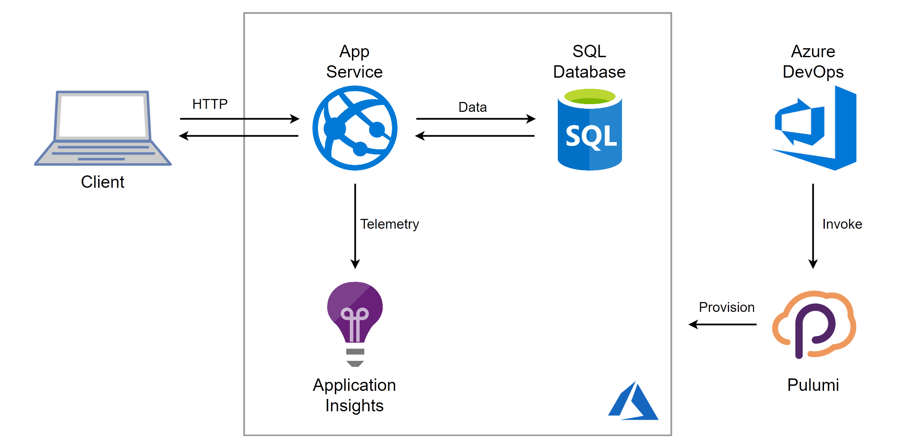

*Today's guest post is from [Mikhail Shilkov](https://mikhail.io/), a
Microsoft Azure MVP and early Pulumi user and contributor - enjoy!*

Today I want to guide you through the process of developing Pulumi
programs to leverage Azure
[Platform-as-a-Service](https://azure.microsoft.com/overview/what-is-paas/)
(PaaS) services. My language of choice is TypeScript---a powerful and
expressive typed language, which is very familiar to many Azure users.

## Azure Platform as a Service

Azure consists of dozens of cloud services, from VMs to Kubernetes to
Serverless. In my experience, a lot of customers choose Azure for its
strong portfolio of PaaS-level services.

[Azure App Service](https://azure.microsoft.com/services/app-service/)
is a well-established managed compute offering to run web applications,
RESTful APIs, or background workers. [Azure SQL
Database](https://azure.microsoft.com/services/sql-database/) is a fully
managed service to run relational databases with features like high
availability and backups available out-of-the-box. Enriched by services
like [Azure DevOps](https://azure.microsoft.com/services/devops/) for
CI/CD and [Application
Insights](https://docs.microsoft.com/azure/azure-monitor/app/app-insights-overview)
for APM, PaaS is a powerful way to get the benefits of the cloud without
the need to fully re-architect software solutions.

The power of relying on PaaS is evidenced by significant customer
adoption. App Service is among the most popular compute services in
Azure:

> If you use automation (ARM, scripts, TF, ...) to define and deploy
> Azure infrastructure, which services are your primary target? Vote &
> RT!
>
> -- Mikhail Shilkov (@MikhailShilkov) [April 23, 2019](https://twitter.com/MikhailShilkov/status/1120592994351099904)

Nonetheless, PaaS services pose different challenges to application
developers. In particular, the usage of multiple cloud services demands
an investment in infrastructure automation. That's where Pulumi comes to
the rescue.
<!--more-->

## A Sample Application

For this walkthrough, I took an existing application from Azure Samples
GitHub: [.NET Core MVC sample for Azure App Service](https://github.com/azure-samples/dotnetcore-sqldb-tutorial).
Predictably enough, it's a Todo List application, and this time it is a
web app built with [ASP.NET](http://ASP.NET) Core, Entity Framework Core
and a SQL database.
[Build an ASP.NET Core and SQL Database app in Azure App Service](https://docs.microsoft.com/en-us/azure/app-service/app-service-web-tutorial-dotnetcore-sqldb)
describes how to deploy such application to Azure App Service by means
of clicking buttons in the Azure portal.

*"Friends don't let friends right-click publish"*

Instead, I suggest relying on infrastructure as code. I built a Pulumi
program and integrated it into a fully automated build and deployment
pipeline in Azure DevOps.

Here is a sketch of the solution:



Let's get started building together!

## Solution Structure

The following snippet shows the essential elements of the solution:

    infra                    # Cloud infrastructure definition goes here
       index.ts             # Pulumi program in TypeScript
    src
       Controllers          # 
       Models               #  ASP.NET Core web app
       Views                # /
       Data                 # EF Core Data Context
       wwwroot              # Static assets (JavaScript/CSS/Images)
    zure-pipelines.yml      # Azure DevOps pipeline definition

As a first step, I cloned the [Todo List
app](https://github.com/azure-samples/dotnetcore-sqldb-tutorial) into
the `src` folder. There's nothing specific to Pulumi here: it's just an
[ASP.NET](http://ASP.NET) Core app. It could be your application
instead.

*Note: You can find the full code of the application, infrastructure
definition, and deployment pipeline in [Pulumi Examples repository](https://github.com/pulumi/examples/tree/master/azure-ts-appservice-devops/).*

## Bootstrapping a Pulumi Program

The Pulumi development experience is powered by the
[Pulumi CLI](). After
[installing the CLI](), I jump into an empty
`infra` folder and run `pulumi new azure-typescript` accepting all the
default answers. The CLI bootstraps a skeleton of a TypeScript NodeJS
application. The code looks like this:

```typescript
import * as pulumi from "@pulumi/pulumi";
import * as azure from "@pulumi/azure";
 
// Create an Azure Resource Group
const resourceGroup = new azure.core.ResourceGroup("resourceGroup", {
    location: "WestUS",
});
 
// Create an Azure resource (Storage Account)
const account = new azure.storage.Account("storage", {
    resourceGroupName: resourceGroup.name,
    location: resourceGroup.location,
    accountTier: "Standard",
    accountReplicationType: "LRS",
});
 
// Export the connection string for the storage account
export const connectionString = account.primaryConnectionString;
```

The infrastructure pieces are defined by instantiating objects of
appropriate types: `ResourceGroup` and `Account` in this example.

## Stacks

If an application is developed to run and evolve for months and years,
it's smart to invest in practices like Continuous Integration and
Deployment (CI/CD) and Infrastructure as Code (IaC). It's quite likely
that such an application will run in multiple environments: production,
staging, development, and so on.

Pulumi comes with a handy concept of
[stacks]()--- isolated,
independently configurable instances of a Pulumi program. A separate
stack can be designated for each deployment environment.

We can take the notion of the stack into the program and apply the stack
name to definitions of infrastructure resources:

    // Use first 10 characters of the stackname as prefix for resource names
    const prefix = pulumi.getStack().substring(0, 9);
     
    const resourceGroup = new azure.core.ResourceGroup(`${prefix}-rg`, {
        location: "WestUS",
    });
     
    const resourceGroupArgs = {
        resourceGroupName: resourceGroup.name,
        location: resourceGroup.location,
    };
     
    // Storage Account name must be lowercase and cannot have any dash characters
    const storageAccountName = `${prefix.toLowerCase().replace(/-/g, "")}sa`;
    const storageAccount = new azure.storage.Account(storageAccountName, {
        ...resourceGroupArgs,
     
        accountKind: "StorageV2",
        accountTier: "Standard",
        accountReplicationType: "LRS",
    });

Note how I use the power of the general purpose programming language to

- Interact with the environment by reading the stack name
- Encode custom rules for resource naming
- Work around the shortcomings of the cloud, namely, the restricted
  set of characters to use in Storage Accounts
- Extract the value `resourceGroupArgs` to reuse the same definition
  for upcoming resources.

As a result, the stacks `production` and `dev` will be deployed to
separate resource groups with clean and consistent naming throughout the
resources.

## Deploying the Application to App Service

Now, it's time to define the infrastructure to host my
[ASP.NET](http://ASP.NET) Core app. There are three pieces of the puzzle
to fit together.

### 1. App Service Plan

An App Service Plan defines the pricing tier, instance size and other
parameters related to performance, scalability, and cost of the hosted
application. My definition is relatively straightforward:

    const appServicePlan = new azure.appservice.Plan(`${prefix}-asp`, {
        ...resourceGroupArgs,
     
        kind: "App",
     
        sku: {
            tier: "Basic",
            size: "B1",
        },
    });

In a more advanced scenario, I could provision different performance
tiers based on the target environment identified by the stack name.

### 2. Deployment Artifact

App Service is a mature Azure service with a long history, so it has
numerous options for deployment methods. Arguably, the newest
[Run from Package](https://github.com/Azure/app-service-announcements/issues/110)
is the most friendly way to practice Infrastructure as Code automation.

Essentially, I prepare a zip file with the published .NET Core
assemblies and upload it to Azure Blob Storage:

    const storageContainer = new azure.storage.Container(`${prefix}-c`, {
        resourceGroupName: resourceGroup.name,
        storageAccountName: storageAccount.name,
        containerAccessType: "private",
    });
     
    const blob = new azure.storage.ZipBlob(`${prefix}-b`, {
        resourceGroupName: resourceGroup.name,
        storageAccountName: storageAccount.name,
        storageContainerName: storageContainer.name,
        type: "block",
     
        content: new pulumi.asset.FileArchive("../src/bin/Debug/netcoreapp2.1/publish.zip")
    });

### 3. App Service

Now, I can define an App Service and instruct it to use this package to
run the website. I do so by linking its application settings to the
shared access signature of the blob:

    const codeBlobUrl = signedBlobReadUrl(blob, storageAccount, storageContainer);
     
    const app = new azure.appservice.AppService(`${prefix}-as`, {
        ...resourceGroupArgs,
        appServicePlanId: appServicePlan.id,
     
        appSettings: {
            "WEBSITE_RUN_FROM_PACKAGE": codeBlobUrl,
        },
    });

At startup, App Service downloads the zip and mounts it as a local
read-only disk to store the application binaries.

## Adding a SQL Database

The application host is now defined, but I also need a relational
database to store and query Todo Items. Staying true to the PaaS path,
I'm using Azure SQL Database service.

### Reading Configuration Parameters

Setting up a SQL Server requires a couple of parameter values that might
change between execution environments, for instance, a username and a
password for the connection string. Pulumi provides
[a way to configure]() the program's
parameters per stack.

The configuration itself will happen in my CI/CD pipeline. For now, I
can query the values with `pulumi.Config` helper tool:

    // Get the username and the password to use for SQL from config.
    const config = new pulumi.Config();
    const username = config.require("sqlUsername");
    const pwd = config.require("sqlPassword");

### Azure SQL Server and Database

I'm all set to code the SQL infrastructure. Two resources need to be
defined:

    const sqlServer = new azure.sql.SqlServer(`${prefix}-sql`, {
        ...resourceGroupArgs,
     
        administratorLogin: username,
        administratorLoginPassword: pwd,
        version: "12.0",
    });
     
    const database = new azure.sql.Database(`${prefix}-db`, {
        ...resourceGroupArgs,
        serverName: sqlServer.name,
        requestedServiceObjectiveName: "S0"
    });

Note that `requestedServiceObjectiveName` defines the performance tier
and the price of the Azure SQL Database.

### Wiring App Service to the Database

By default, Azure SQL Database is configured to deny any incoming
connections for security reasons. One approach is to allow access to all
Azure services. However, a more secure method is to white-list the
Outbound IPs of the App Service:

    const firewallRules = app.outboundIpAddresses.apply(
        ips => ips.split(',').map(
            ip => new azure.sql.FirewallRule(`FR${ip}`, {
                endIpAddress: ip,
                resourceGroupName: resourceGroup.name,
                serverName: sqlServer.name,
                startIpAddress: ip,
            })
        ));

Note that the actual IPs of the service are unknown at the time of
writing the program. Nonetheless, the combination of `apply`, `split`,
and `map` functions enables me to wire the runtime value of IPs to the
proper set of firewall rules.

Additional firewall rules may be implemented to allow administrative
access from outside the App Service.

Finally, our [ASP.NET](http://ASP.NET) Core application expects a
connection string with `MyDbConnection`. To create one, I join the
database server and the database name to produce the connection string
and add it to the App Service configuration:

    const app = new azure.appservice.AppService(`${prefix}-as`, {
        // ... other parameters as defined above
     
        connectionStrings: [{
            name: "MyDbConnection",
            value:
                pulumi.all([sqlServer.name, database.name]).apply(([server, db]) =>
                    `Server=tcp:${server}.database.windows.net;initial catalog=${db};user ID=${username};password=${pwd};Min Pool Size=0;Max Pool Size=30;Persist Security Info=true;`),
            type: "SQLAzure"
        }]
    });

## Collecting Metrics with Application Insights

Application Insights is an Application Performance Management (APM)
service to be used for collecting metrics from cloud applications.

After adding Application Insights NuGet packages into my
[ASP.NET](http://ASP.NET) solution, I can go ahead and define the App
Insights resource and link it to the App Service with an instrumentation
key:

    const appInsights = new azure.appinsights.Insights(`${prefix}-ai`, {
        ...resourceGroupArgs,
     
        applicationType: "Web"
    });
     
    const app = new azure.appservice.AppService(`${prefix}-as`, {
        // ... other parameters as defined above
     
        appSettings: {
            "ApplicationInsights:InstrumentationKey": appInsights.instrumentationKey,
            // ... other settings as defined above
        },
    });

## Continuous Deployment with Azure DevOps

While Pulumi CLI works great during development; a production deployment
should rather be executed in a CI/CD pipeline. This time I'm using Azure
DevOps -- a managed CI/CD service to build, test, and deploy cloud
applications.

In particular, I defined an Azure Pipeline consisting of three steps:

- Build & Publish the .NET Core application;
- Restore NPM packages for the infrastructure program;
- Provision the cloud infrastructure with Pulumi.

### Build & Publish the .NET Application

The first step utilizes a built-in task which triggers the .NET Core CLI
to build the source code in the `src` folder and publish the assemblies
as a zip file.

    steps:
    - task: DotNetCoreCLI@2
     inputs:
       command: 'publish'
       projects: 'src'
     displayName: 'Build and publish the ASP.NET Core app'

### Restore NPM packages for the infrastructure program

The second step is a simple `npm install` step to restore the NodeJS
dependencies:

     - task: Npm@1
       inputs:
          command: 'install'
          workingDir: 'infra'
       displayName: 'NPM install packages'

### Install Pulumi and Run Infrastructure Code

There is a Pulumi task available in Azure Marketplace:
[Pulumi Azure Pipelines Task](https://marketplace.visualstudio.com/items?itemName=pulumi.build-and-release-task).
After installing it to your organization, you should be able to utilize
a simple task like this:

     - task: Pulumi@0
       inputs:
          azureSubscription: 'Your Azure Subscription(aaaaaaaa-bbbb-cccc-dddd-eeeeeeeeeeee)'
          command: 'up'
          args: '--yes'
          cwd: 'infra'
          stack: 'dev'
       displayName: 'Install pulumi and run infra code'
       name: pulumi

Alternatively, if you can't install third-party tasks from Azure
Marketplace, you can call the Pulumi CLI from a custom shell script, see
[this pipeline definition](https://github.com/pulumi/examples/tree/master/azure-ts-appservice-devops/alternative-pipeline/).

When everything is wired correctly, I see this screen in Azure DevOps:


The newly created resource group contains six resources:


The application is up and running:


The telemetry is flowing into Application Insights:


You can find the full code of the application, infrastructure
definition, and deployment pipeline in
[Pulumi Examples repository](https://github.com/pulumi/examples/tree/master/azure-ts-appservice-devops/).

## Pulumi ❤️ Azure PaaS

Azure App Service and friends are a great way to deploy web applications
and APIs without worrying about the nitty-gritty details of the
underlying hardware.

Writing a TypeScript program to compose an application out of the cloud
building blocks feels like a breeze to me. I can reuse all my skills and
stay productive by defining cloud resources as code in a familiar
language.

You can get going with these resources:

- [Getting Started with Pulumi]()
- [Setup Pulumi to work with Azure]()
- [Walkthroughs and Examples]()

Pulumi enables developers to define cloud infrastructure using general
purpose programming languages. Pulumi works with multiple cloud
providers and has first-class support for all services in Microsoft
Azure.
