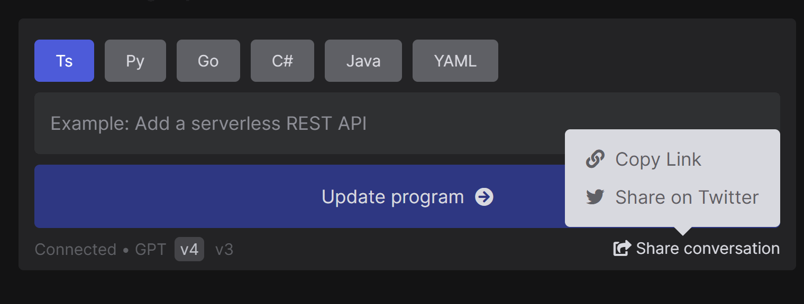

[Pulumi AI](/ai) harnesses a form of generative AI, known as large language models, to help you discover, learn, and use new cloud infrastructure APIs with ease. Think of Pulumi AI as a sophisticated compass, guiding you through the ever-changing landscape of cloud infrastructure and pointing you in the direction of the most suitable solutions for your unique requirements.

In this blog post, we'll explore our recent enhancements to Pulumi AI, focusing on how we've integrated Pulumi Package schema data to generate more accurate and relevant Pulumi programs. We'll also share examples showcasing the improvements and how they can benefit your infrastructure as code journey.

## Overcoming the Challenges in Pulumi AI

As powerful as Pulumi AI may seem, it was initially limited by the training cutoff of the model. Pulumi AI wasn't aware of new providers or changes to resources after late 2021. Additionally, the limitations in generative AI made it difficult for the model to reproduce all the input properties and relevant details of the resources it was trained on from "memory."

These factors led to a phenomenon researchers call "hallucination." Pulumi AI would sometimes generate an API for a non-existent provider when asked to produce a Pulumi program. To overcome these challenges, we turned to the rich [Pulumi Package schema](/docs/guides/pulumi-packages/schema/) data and [CrossCode](/crosscode/) technology that powers the [Pulumi Registry](/registry/) docs, our code conversion tools, and other Pulumi enhancements.

### Integrating Pulumi Package Schema Data

Think of the Pulumi Package schema as a treasure trove of information about our providers. It's a well-organized, comprehensive library that holds the keys to unlocking the full potential of Pulumi AI. However, we faced a challenge: these schemas were much larger than any current generative AI system could handle.

What puts the "large" in large language model is the volume of data required to train and the number of parameters in the model, typically in the trillions of tokens and billions of parameters, respectively. Unfortunately, these models aren't capable of handling that much information in their context window. The context window is the thread of conversation or the "short-term memory" of the system. It's how one can enhance a model trained a year ago with today's data.

To better understand the limitations, let's talk about tokens. Instead of operating on Unicode text, these models operate on token arrays, mapping many sequences of characters (words or parts of words) to 16-bit integers. For example, "Script" is one token, and "JavaScript" is typically two tokens. We found that despite this compression of words to tokens, the latest schemas for all of our providers would use on the order of one billion tokens.

The most powerful systems to date support at most 32,000 tokens in their prompt – enough to fit a novella! That should be enough, right?

We did the math: one billion minus 32,000... And we're still about a billion tokens over the limit.

### The right information, at the right time

To work around this limitation, we need to carefully select and inject the right schema information into the context window, ensuring that the model could understand, process, and generate the best possible solutions for users.

We cracked open our college textbooks on information storage & retrieval, evaluated the latest vector databases and embedding systems, and perused the literature. One internal demo we did used a technique similar to [Hypothetical Document Embeddings (HyDE)](https://arxiv.org/abs/2212.10496). While this did improve accuracy and reduce hallucinations, that approach also requires pre-processing the user's query. That additional step results in a much higher time-to-first-token (TTFT) latency, negatively impacting user experience.

After iterating on these approaches in the weeks after launch, we've implemented a method that yields comparable results to HyDE without slowing the system down. Our current approach allowed us to maintain an engaging and responsive interface while still enhancing Pulumi AI's accuracy.

We continue to follow the latest research in this space to improve Pulumi AI, and we hope we can contribute our learnings back in this exciting field of research!

## Improved User Experience and Examples

With the integration of Pulumi Package schema data, Pulumi AI now generates more accurate and relevant Pulumi programs, favoring our high-level components and the generally available providers we recommend, such as the `awsx`, `eks`, and `azure-native` packages.

### Powerful components

For EKS clusters, Pulumi AI now typically recommends our `eks` provider's high level component when asked for "an eks cluster":

> To achieve your goal of creating an EKS cluster, I recommend using the [`eks.Cluster`](/registry/packages/eks/api-docs/cluster/) Pulumi resource, which is a higher-level component encapsulating the necessary AWS and Kubernetes resources. This resource makes it easy to provision, scale, and manage EKS clusters in a Pulumi Python program.
>
> To proceed, you'll need to have the pulumi-eks package installed:
>
> ```
> pip install pulumi-eks
> ```
>
> Here's a simple Pulumi Python program that creates an EKS cluster:
>
> ```python
> import pulumi
> from pulumi_eks import Cluster
>
> # Create an EKS cluster.
> my_cluster = Cluster("my-cluster")
>
> # Export the cluster kubeconfig.
> pulumi.export("kubeconfig", my_cluster.kubeconfig)
> ```

### Simple building blocks

Pulumi AI now offers a more succinct solution for common queries such as "a static website on Azure":

> To accomplish your goal, I will generate a Pulumi TypeScript program using the [`azure-static-website.Website`](/registry/packages/azure-static-website/api-docs/website/) resource from the Pulumi Registry. This resource is designed specifically for hosting static websites on Azure.
>
> Here's a Pulumi TypeScript program to deploy a static website on Azure using the `azure-static-website.Website` resource.
>
> ```ts
> import * as pulumi from "@pulumi/pulumi";
> import * as azure from "@pulumi/azure";
> import * as staticWebsites from "@pulumi/azure-static-website";
>
> const website = new staticWebsites.Website("website", {
>   sitePath: websitePath,
>   resourceGroupName: resourceGroup.name,
>   withCDN: true,
> });
> ```

### New products

When asked for modern resources such as [Google AlloyDB](https://cloud.google.com/alloydb), launched six weeks ago, Pulumi AI now references Registry documentation to answer "google alloydb with an automatic backup policy":

> Based on the Pulumi Registry results and trying to accomplish your goal of creating an AlloyDB cluster with an automatic backup policy, we can create a Google Cloud Platform (GCP) AlloyDB cluster using the [`gcp.alloydb.Cluster`](/registry/packages/gcp/api-docs/alloydb/cluster/) resource. You can set the `automatedBackupPolicy` property with the necessary configuration to enable automatic backups.
>
> Here's a Pulumi program in TypeScript that creates an AlloyDB Cluster with an automatic backup policy:
>
> ```typescript
> import * as pulumi from "@pulumi/pulumi";
> import * as gcp from "@pulumi/gcp";
>
> const projectId = gcp.config.project;
> const location = "us-central1";
>
> const network = new gcp.compute.Network("alloydb-network", {
>   autoCreateSubnetworks: false,
> });
>
> const alloydbCluster = new gcp.alloydb.Cluster("alloydbCluster", {
>   clusterId: "my-alloydb-cluster",
>   location,
>   project: projectId,
>   network: network.selfLink,
>   automatedBackupPolicy: {
>     enabled: true,
>     labels: {
>       "backup-type": "automated",
>     },
>     location: "us-central1",
>     quantityBasedRetention: {
>       count: 7,
>     },
>     timeBasedRetention: {
>       retentionPeriod: "7d",
>     },
>     weeklySchedule: {
>       daysOfWeeks: ["MONDAY", "WEDNESDAY", "FRIDAY"],
>       startTimes: [
>         {startTime: "04:00:00"},
>       ],
>     },
>   },
> });
>
> export const alloyDBClusterName = alloydbCluster.name;
> ```

## Getting Started with the Enhanced Pulumi AI

Our enhancements to Pulumi AI have made it an even more useful tool for generating accurate and relevant cloud infrastructure solutions. We're excited about the future of Pulumi AI as we continue to integrate it into [Pulumi Cloud](https://app.pulumi.com) and empower everyone to become a cloud engineer.

We've also added new ways to reach Pulumi AI. In the Pulumi Registry, "Explore with Pulumi AI" links provide interactive documentation. And after you've had a conversation with Pulumi AI, you can share it via a "Share conversation" link in the bottom right corner of the message box:

[](/ai/)

Try out [Pulumi AI](/ai/) today, and happy coding!
