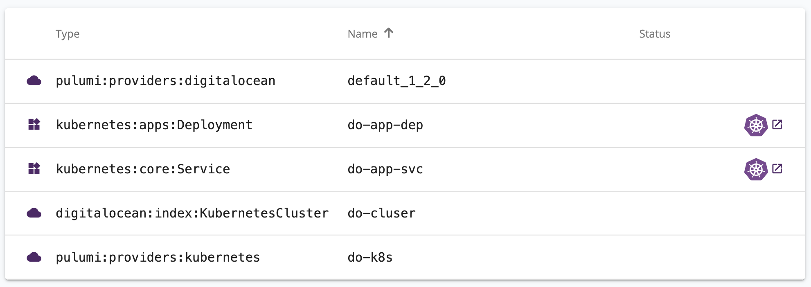

Last month, we announced [.NET support for Pulumi](https://devblogs.microsoft.com/dotnet/building-modern-cloud-applications-using-pulumi-and-net-core/), including support for AWS, Azure, GCP, and many other clouds.  One of the biggest questions we heard was about Kubernetes --- *"can I use Pulumi to manage Kubernetes infrastructure in C#, F#, and VB.NET as I can already in TypeScript and Python today?"*  With last week's release of [`Pulumi.Kubernetes`](https://www.nuget.org/packages/Pulumi.Kubernetes/) on NuGet, you can now also deploy Kubernetes infrastructure using your favorite .NET languages.

<!--more-->

Using .NET to build our Kubernetes infrastructure offers several benefits:

* **Strong Typing**:  Unlike YAML, C# and F# offer a rich type system with quick feedback on potential errors.  
* **Rich IDE Support**:  Use the rich features of IDEs like Visual Studio, Visual Studio Code, and Rider to develop your Kubernetes infrastructure---completion lists, refactoring, IntelliSense, and more.   
* **Familiar Languages and APIs**:  Apply all the features of C#, F#, and VB.NET to your Kubernetes infrastructure---loops, variables, and the entire ecosystem of .NET Core libraries from `System` to everything in NuGet.
* **Components and Classes**:  Instead of copy/pasting pages of YAML between projects, .NET code can abstract common functionality into classes and libraries for code re-use and clean infrastructure design.  

Together, these benefits provide a more familiar experience for working with Kubernetes than using YAML or Helm (a mix of YAML and Go templates) for .NET developers.

# Tour of Kubernetes with .NET

We can see a simple example in practice - deploying an Nginx pod into a Kubernetes cluster.

```csharp
var pod = new Pod("pod", new PodArgs
{
    Spec = new PodSpecArgs
    {
        Containers =
        {
            new ContainerArgs
            {
                Name = "nginx",
                Image = "nginx",
            },
        },
    },
});
```

We can deploy this with `pulumi up`.

```
$ pulumi up
Previewing update (luke-dev):

     Type                    Name                              Plan       
 +   pulumi:pulumi:Stack     basic_dotnet_kubernetes-luke-dev  create     
 +   └─ kubernetes:core:Pod  pod                               create     
 
Resources:
    + 2 to create

Do you want to perform this update? yes
Updating (luke-dev):

     Type                    Name                              Status      
 +   pulumi:pulumi:Stack     basic_dotnet_kubernetes-luke-dev  created     
 +   └─ kubernetes:core:Pod  pod                               created     
 
Resources:
    + 2 created

Duration: 11s
```

As always, Pulumi programs describe the desired state of our infrastructure, instead of an imperative process to construct that infrastructure.  If we change our program, Pulumi will compute the minimal delta to apply to our Kubernetes cluster to transition to this new desired state.  This almost feels like using Edit-and-Continue on our deployed Kubernetes resources---modifying our Kubernetes resources in place inside the cluster.

We can add a label to our Pod:

```patch
 var pod = new Pod("pod", new PodArgs
 {
+    Metadata = new ObjectMetaArgs
+    {
+        Labels = { { "app", "nginx" } },
+    },
     Spec = new PodSpecArgs
     {
         Containers =
         {
             new ContainerArgs
             {
                 Name = "nginx",
                 Image = "nginx",
             },
        },
    },
});
```

And then see that this updates the pod in place with this new label.

```
$ pulumi up
Previewing update (luke-dev):

     Type                    Name                              Plan       Info
     pulumi:pulumi:Stack     basic_dotnet_kubernetes-luke-dev             
 ~   └─ kubernetes:core:Pod  pod                               update     [diff: ~metadata]
 
Resources:
    ~ 1 to update
    1 unchanged

Do you want to perform this update? details
  pulumi:pulumi:Stack: (same)
    [urn=urn:pulumi:luke-dev::basic_dotnet_kubernetes::pulumi:pulumi:Stack::basic_dotnet_kubernetes-luke-dev]
    ~ kubernetes:core/v1:Pod: (update)
        [id=default/pod-wyjq31t3]
        [urn=urn:pulumi:luke-dev::basic_dotnet_kubernetes::kubernetes:core/v1:Pod::pod]
        [provider=urn:pulumi:luke-dev::basic_dotnet_kubernetes::pulumi:providers:kubernetes::default_1_4_0::127c0c24-8b12-4010-a544-5f5390f91e4e]
      ~ metadata: {
          ~ labels: {
              + app: "nginx"
            }
        }

Do you want to perform this update? yes
Updating (luke-dev):

     Type                    Name                              Status      Info
     pulumi:pulumi:Stack     basic_dotnet_kubernetes-luke-dev              
 ~   └─ kubernetes:core:Pod  pod                               updated     [diff: ~metadata]
 
Resources:
    ~ 1 updated
    1 unchanged

Duration: 3s
```

The real benefits of .NET come when we extract common code into a reusable component.  We can do that to create a new component like a `ServiceDeployment`, which includes both a Kubernetes `Service` and `Deployment` using opinionated defaults.  With this, we can describe entire Kubernetes applications (100s of lines of YAML), in a short and semantically meaningful snippet of C#:

```csharp
var config = new Config();
var isMiniKube = config.GetBoolean("isMiniKube") ?? false;

var redisMaster = new ServiceDeployment("redis-master", new ServiceDeploymentArgs
{
    Image = "k8s.gcr.io/redis:e2e",
    Ports = { 6379 },
});

var redisReplica = new ServiceDeployment("redis-slave", new ServiceDeploymentArgs
{
    Image = "gcr.io/google_samples/gb-redisslave:v1",
    Ports = { 6379 },
});

var frontend = new ServiceDeployment("frontend", new ServiceDeploymentArgs
{
    Replicas = 3,
    Image = "gcr.io/google-samples/gb-frontend:v4",
    Ports = { 80 },
    AllocateIPAddress = true,
    ServiceType = isMiniKube ? "ClusterIP" : "LoadBalancer",
});

return new Dictionary<string, object?>{
    { "frontendIp", frontend.IpAddress },
};
```

You can check out the implementation of this `ServiceDeployment` component in the [Guestbook example](https://github.com/pulumi/examples/tree/master/kubernetes-cs-guestbook/components) in the Pulumi Examples repo on GitHub.


## Building Docker Images for Kubernetes with .NET

In the examples so far, we have specified the Docker image to deploy as part of our Kubernetes `Deployment`s by referring to an image already in the DockerHub or Google Container Registry.  But what if we wanted to push our own custom Docker image built from our own application's source code, and use that in our Kubernetes `Pod` or `Deployment`?  This is easy to do as well with the [`Pulumi.Docker`](https://www.nuget.org/packages/Pulumi.Docker/) package.  For example, we can deploy a customized Docker image derived from Nginx with the following:

```csharp
var image = new Image("nginx", new ImageArgs
{
    ImageName = "my-username/my-nginx",
    Build = "./app",
});

var pod = new Pod("pod", new PodArgs
{
    Spec = new PodSpecArgs
    {
        Containers =
        {
            new ContainerArgs
            {
                Name = "nginx",
                Image = image.ImageName,
            },
        },
    },
});
```

Instead of using the default `nginx` image on DockerHub, we can use our own Dockerfile from the `app` folder in our Pulumi project, for instance, including the following in our `Dockerfile` to deploy some customized files in the `app/content` folder to our Nginx server:

```dockerfile
FROM nginx
COPY content /usr/share/nginx/html
```

When we deploy this with Pulumi, the Docker file will be build locally, pushed to DockerHub, then the image name in DockerHub referenced from the `Pod` in Kubernetes.  All of this happens automatically, allowing you to seamlessly deploy and version both your application code and infrastructure together with a simple `pulumi up`.

If we wanted to push to another Docker container registry (like ACR, GCR, ECR or others), we can easily do that too using additional parameters on the `Pulumi.Docker.ImageArgs` class.

## Cloud + Kubernetes with .NET

Because Pulumi lets you work with both Kubernetes and cloud ([AWS](https://www.nuget.org/packages/Pulumi.Aws/), [Azure](https://www.nuget.org/packages/Pulumi.Azure/), [GCP](https://www.nuget.org/packages/Pulumi.Gcp/), and more), you can also create and manage the infrastructure that builds both a managed Kubernetes cluster as well as deploying applications and services into the cluster. Using a single familiar programming model, we have access to all these various cloud technologies at our fingertips.

For example, we can deploy a [managed Kubernetes cluster on DigitalOcean](https://www.digitalocean.com/products/kubernetes/), and then deploy a Pod into it:

```csharp
var cluster = new KubernetesCluster("do-cluster", new KubernetesClusterArgs
{
    Region = "sfo2",
    Version = "latest",
    NodePool = new KubernetesClusterNodePoolArgs
    {
        Name = "default",
        Size = "s-2vcpu-2gb",
        NodeCount = nodeCount,
    },
});

var k8sProvider = new Pulumi.Kubernetes.Provider("do-k8s", new Pulumi.Kubernetes.ProviderArgs
{
    KubeConfig = cluster.KubeConfigs.Apply(array => array[0].RawConfig)
});

var app = new Pulumi.Kubernetes.Apps.V1.Deployment("do-app-dep", new DeploymentArgs
{
    Spec = new DeploymentSpecArgs
    {
        Selector = new LabelSelectorArgs
        {
            MatchLabels = new InputMap<string>
            {
                {"app", "app-nginx"},
            },
        },
        Replicas = appReplicaCount,
        Template = new PodTemplateSpecArgs
        {
            Metadata = new ObjectMetaArgs
            {
                Labels = new InputMap<string>
                {
                    {"app", "app-nginx"},
                },
            },
            Spec = new PodSpecArgs
            {
                Containers = new ContainerArgs()
                {
                    Name = "nginx",
                    Image = "nginx",
                },
            },
        },
    },
}, 
new CustomResourceOptions { Provider = k8sProvider });

var appService = new Pulumi.Kubernetes.Core.V1.Service("do-app-svc", new ServiceArgs {
    Spec = new ServiceSpecArgs() {
        Type = "LoadBalancer",
        Selector = app.Spec.Apply(spec => spec.Template.Metadata.Labels),
        Ports = new ServicePortArgs {
            Port = 80,
        }
    }
}, new CustomResourceOptions {
    Provider = k8sProvider
});

var ingressIp = appService.Status.Apply(status => status.LoadBalancer.Ingress[0].Ip);

if (!string.IsNullOrWhiteSpace(domainName)) {
    var domain = new Domain("do-domain", new DomainArgs() {
        Name = domainName,
        IpAddress = ingressIp,
    });

    var cnameRecord = new DnsRecord("do-domain-cname", new DnsRecordArgs {
        Domain = domain.Name,
        Type = "CNAME",
        Name = "www",
        Value = "@",
    });
}
```

Note that this example deploys resources first into DigitalOcean (a Kubernetes `Cluster`), then into Kubernetes itself (`Deployment` and `Service` via a `Pulumi.Kubernetes.Provider` configured to connect to the Kubernetes cluster in Digital Ocean), then optionally also more resources in DigitalOcean dependent on the Kubernetes `Service` (`Domain` and `DnsRecord`).  This example is a complex infrastructure deployment, all in a few dozen lines of declarative and strongly typed C# code. 

Check out the full [DigitalOcean Kubernetes Cluster in C#](https://github.com/pulumi/examples/blob/master/digitalocean-cs-k8s/Program.cs) example for more details.



# Conclusion

Kubernetes support is one of several significant new additions to the Pulumi .NET support, and [many more improvements](https://github.com/pulumi/pulumi/issues/3470) are in progress over the coming weeks. [Get started]() with Kubernetes and .NET today, and let us know what you think! 
